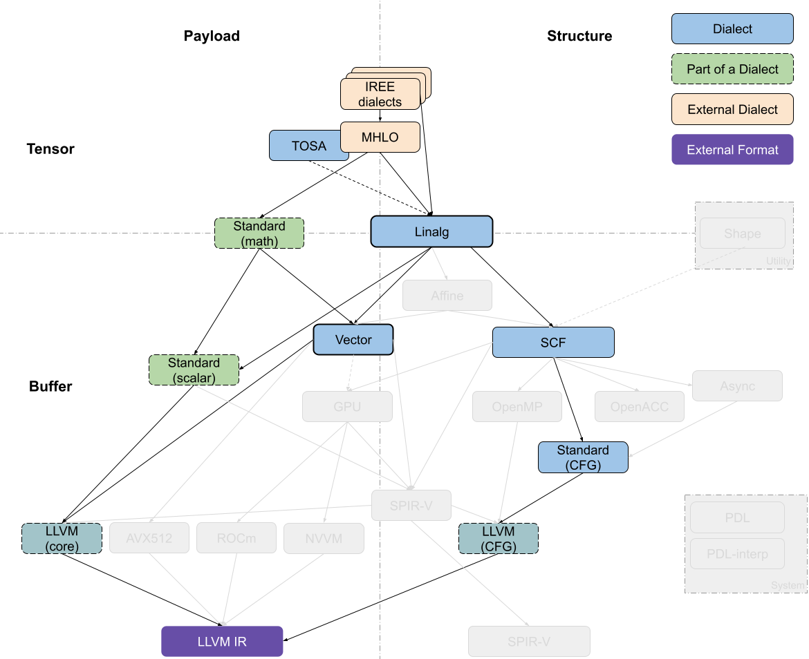

# [IREE] linalg-vector-gpu-llvm流程

以生成tensorcore相关代码为重点
本文叙述的流程未经过优化，包含了主要下降过程中的dialect变化，和IREE中封装好的Pass Pipeline还有一定区别（缺少过程中的优化）。后续的文章中会分析IREE中 TensorCore 相关的 Pass Pipeline 的源码流程。

`iree-opt -h`

Available Dialects: affine, arith, arm_neon, bufferization, builtin, cf, check, chlo, complex, emitc, flow, func, gpu, hal, hal_inline, hal_loader, iree_codegen, iree_input, iree_linalg_ext, iree_linalg_transform, linalg, llvm, math, memref, mhlo, ml_program, nvgpu, pdl, pdl_interp, quant, scf, shape, spirv, stablehlo, stream, tensor, tm_tensor, tosa, transform, util, vector, vk, vm, vmvx

## 1、相关参数

<div style="text-align: center;"></div>

所使用的命令行参数如下：

下降的流程：mhlo dialect —> linalg-on-tensor —> linalg-on-buffer —> vector dialect —> gpu dialect

| dialect表示 | 命令行参数 | 解释 |
| --- | --- | --- |
| mhlo—>linalg-on-tensor | --iree-mhlo-to-linalg-on-tensors | Convert from XLA-HLO ops to Linalg ops on tensors |
| linalg-on-tensor—>linalg-on-buffer | --iree-codegen-iree-comprehensive-bufferize
或
--linalg-bufferize  | Convert from to Linalg ops on tensors to buffers |
| linalg-on-buffer—>vector | --iree-llvmgpu-tensorcore-vectorization  | Pass to convert linalg into Vector and transform it to a form that can be lowered to GPU MMA ops |
| vector—>gpu | --iree-llvmgpu-vector-to-gpu
或
--iree-spirv-vector-to-gpu-subgroup-mma-ops | Pass to convert vector to gpu |
| gpu—>llvm | --iree-convert-to-nvvm  | Perform final conversion from builtin/GPU/HAL/standard dialect to LLVM and NVVM dialects |

## 2、linalg-to-gpu

### 官方示例：**tensorcore_vectorization**

测试代码来自：[https://github.com/openxla/iree/blob/97779d7f494660f88864b035475ec77a1e54c6c8/compiler/src/iree/compiler/Codegen/LLVMGPU/test/tensorcore_vectorization.mlir](https://github.com/openxla/iree/blob/97779d7f494660f88864b035475ec77a1e54c6c8/compiler/src/iree/compiler/Codegen/LLVMGPU/test/tensorcore_vectorization.mlir)

（1）linalg-on-tensor  —> linalg-on-buffer

$IREE_OPT/iree-opt --linalg-bufferize

```mlir
#map = affine_map<()[s0] -> (s0 * 64)>
#map1 = affine_map<(d0, d1)[s0] -> (d0 * 1024 + s0 + d1)>
#map2 = affine_map<(d0, d1)[s0] -> (d0 * 512 + s0 + d1)>
#map3 = affine_map<()[s0] -> (s0 * 32)>
#map4 = affine_map<(d0) -> ((d0 floordiv 32) * 32)>
module {
  func.func @dot() {
    %c16 = arith.constant 16 : index
    %c1024 = arith.constant 1024 : index
    %cst = arith.constant 0.000000e+00 : f32
    %c0 = arith.constant 0 : index
    %0 = hal.interface.binding.subspan set(0) binding(0) type(storage_buffer) : memref<2048x1024xf32>
    %1 = hal.interface.binding.subspan set(0) binding(1) type(storage_buffer) : memref<1024x512xf32>
    %2 = hal.interface.binding.subspan set(0) binding(2) type(storage_buffer) : memref<2048x512xf32>
    %workgroup_id_x = hal.interface.workgroup.id[0] : index
    %workgroup_id_y = hal.interface.workgroup.id[1] : index
    %3 = affine.apply #map()[%workgroup_id_y]
    %4 = affine.apply #map()[%workgroup_id_x]
    %subview = memref.subview %0[%3, 0] [64, 1024] [1, 1] : memref<2048x1024xf32> to memref<64x1024xf32, #map1>
    %subview_0 = memref.subview %1[0, %4] [1024, 64] [1, 1] : memref<1024x512xf32> to memref<1024x64xf32, #map2>
    %subview_1 = memref.subview %2[%3, %4] [64, 64] [1, 1] : memref<2048x512xf32> to memref<64x64xf32, #map2>
    %5 = gpu.thread_id  x
    %6 = gpu.thread_id  y
    %7 = affine.apply #map3()[%6]
    %8 = affine.apply #map4(%5)
    %subview_2 = memref.subview %subview_1[%7, %8] [32, 32] [1, 1] : memref<64x64xf32, #map2> to memref<32x32xf32, #map2>
    linalg.fill {__internal_linalg_transform__ = "vectorize"} ins(%cst : f32) outs(%subview_2 : memref<32x32xf32, #map2>)
    scf.for %arg0 = %c0 to %c1024 step %c16 {
      %subview_3 = memref.subview %subview[0, %arg0] [64, 16] [1, 1] : memref<64x1024xf32, #map1> to memref<64x16xf32, #map1>
      %subview_4 = memref.subview %subview_0[%arg0, 0] [16, 64] [1, 1] : memref<1024x64xf32, #map2> to memref<16x64xf32, #map2>
      %9 = affine.apply #map4(%5)
      %subview_5 = memref.subview %subview_3[%7, 0] [32, 16] [1, 1] : memref<64x16xf32, #map1> to memref<32x16xf32, #map1>
      %subview_6 = memref.subview %subview_4[0, %9] [16, 32] [1, 1] : memref<16x64xf32, #map2> to memref<16x32xf32, #map2>
      %subview_7 = memref.subview %subview_1[%7, %9] [32, 32] [1, 1] : memref<64x64xf32, #map2> to memref<32x32xf32, #map2>
      linalg.matmul {__internal_linalg_transform__ = "vectorize"} ins(%subview_5, %subview_6 : memref<32x16xf32, #map1>, memref<16x32xf32, #map2>) outs(%subview_7 : memref<32x32xf32, #map2>)
    }
    return
  }
}
```

（2）linalg-on-buffer —> vector

$IREE_OPT/iree-opt --iree-llvmgpu-tensorcore-vectorization

```mlir
#map = affine_map<()[s0] -> (s0 * 64)>
#map1 = affine_map<(d0, d1)[s0] -> (d0 * 1024 + s0 + d1)>
#map2 = affine_map<(d0, d1)[s0] -> (d0 * 512 + s0 + d1)>
#map3 = affine_map<()[s0] -> (s0 * 32)>
#map4 = affine_map<(d0) -> ((d0 floordiv 32) * 32)>
#map5 = affine_map<(d0, d1, d2) -> (d0, d2)>
#map6 = affine_map<(d0, d1, d2) -> (d2, d1)>
#map7 = affine_map<(d0, d1, d2) -> (d0, d1)>
module {
  func.func @dot() {
    %c16 = arith.constant 16 : index
    %c8 = arith.constant 8 : index
    %c0 = arith.constant 0 : index
    %cst = arith.constant dense<0.000000e+00> : vector<32x32xf32>
    %c1024 = arith.constant 1024 : index
    %cst_0 = arith.constant 0.000000e+00 : f32
    %0 = hal.interface.binding.subspan set(0) binding(0) type(storage_buffer) : memref<2048x1024xf32>
    %1 = hal.interface.binding.subspan set(0) binding(1) type(storage_buffer) : memref<1024x512xf32>
    %2 = hal.interface.binding.subspan set(0) binding(2) type(storage_buffer) : memref<2048x512xf32>
    %workgroup_id_x = hal.interface.workgroup.id[0] : index
    %workgroup_id_y = hal.interface.workgroup.id[1] : index
    %3 = affine.apply #map()[%workgroup_id_y]
    %4 = affine.apply #map()[%workgroup_id_x]
    %subview = memref.subview %0[%3, 0] [64, 1024] [1, 1] : memref<2048x1024xf32> to memref<64x1024xf32, #map1>
    %subview_1 = memref.subview %1[0, %4] [1024, 64] [1, 1] : memref<1024x512xf32> to memref<1024x64xf32, #map2>
    %subview_2 = memref.subview %2[%3, %4] [64, 64] [1, 1] : memref<2048x512xf32> to memref<64x64xf32, #map2>
    %5 = gpu.thread_id  x
    %6 = gpu.thread_id  y
    %7 = affine.apply #map3()[%6]
    %8 = affine.apply #map4(%5)
    %subview_3 = memref.subview %subview_2[%7, %8] [32, 32] [1, 1] : memref<64x64xf32, #map2> to memref<32x32xf32, #map2>
    %9 = vector.extract_strided_slice %cst {offsets = [0, 0], sizes = [16, 16], strides = [1, 1]} : vector<32x32xf32> to vector<16x16xf32>
    vector.transfer_write %9, %subview_3[%c0, %c0] {in_bounds = [true, true]} : vector<16x16xf32>, memref<32x32xf32, #map2>
    %10 = vector.extract_strided_slice %cst {offsets = [0, 16], sizes = [16, 16], strides = [1, 1]} : vector<32x32xf32> to vector<16x16xf32>
    vector.transfer_write %10, %subview_3[%c0, %c16] {in_bounds = [true, true]} : vector<16x16xf32>, memref<32x32xf32, #map2>
    %11 = vector.extract_strided_slice %cst {offsets = [16, 0], sizes = [16, 16], strides = [1, 1]} : vector<32x32xf32> to vector<16x16xf32>
    vector.transfer_write %11, %subview_3[%c16, %c0] {in_bounds = [true, true]} : vector<16x16xf32>, memref<32x32xf32, #map2>
    %12 = vector.extract_strided_slice %cst {offsets = [16, 16], sizes = [16, 16], strides = [1, 1]} : vector<32x32xf32> to vector<16x16xf32>
    vector.transfer_write %12, %subview_3[%c16, %c16] {in_bounds = [true, true]} : vector<16x16xf32>, memref<32x32xf32, #map2>
    scf.for %arg0 = %c0 to %c1024 step %c16 {
      %subview_4 = memref.subview %subview[0, %arg0] [64, 16] [1, 1] : memref<64x1024xf32, #map1> to memref<64x16xf32, #map1>
      %subview_5 = memref.subview %subview_1[%arg0, 0] [16, 64] [1, 1] : memref<1024x64xf32, #map2> to memref<16x64xf32, #map2>
      %13 = affine.apply #map4(%5)
      %subview_6 = memref.subview %subview_4[%7, 0] [32, 16] [1, 1] : memref<64x16xf32, #map1> to memref<32x16xf32, #map1>
      %subview_7 = memref.subview %subview_5[0, %13] [16, 32] [1, 1] : memref<16x64xf32, #map2> to memref<16x32xf32, #map2>
      %subview_8 = memref.subview %subview_2[%7, %13] [32, 32] [1, 1] : memref<64x64xf32, #map2> to memref<32x32xf32, #map2>
      %14 = vector.transfer_read %subview_6[%c0, %c0], %cst_0 {in_bounds = [true, true]} : memref<32x16xf32, #map1>, vector<16x8xf32>
      %15 = vector.transfer_read %subview_6[%c0, %c8], %cst_0 {in_bounds = [true, true]} : memref<32x16xf32, #map1>, vector<16x8xf32>
      %16 = vector.transfer_read %subview_6[%c16, %c0], %cst_0 {in_bounds = [true, true]} : memref<32x16xf32, #map1>, vector<16x8xf32>
      %17 = vector.transfer_read %subview_6[%c16, %c8], %cst_0 {in_bounds = [true, true]} : memref<32x16xf32, #map1>, vector<16x8xf32>
      %18 = vector.transfer_read %subview_7[%c0, %c0], %cst_0 {in_bounds = [true, true]} : memref<16x32xf32, #map2>, vector<8x16xf32>
      %19 = vector.transfer_read %subview_7[%c0, %c16], %cst_0 {in_bounds = [true, true]} : memref<16x32xf32, #map2>, vector<8x16xf32>
      %20 = vector.transfer_read %subview_7[%c8, %c0], %cst_0 {in_bounds = [true, true]} : memref<16x32xf32, #map2>, vector<8x16xf32>
      %21 = vector.transfer_read %subview_7[%c8, %c16], %cst_0 {in_bounds = [true, true]} : memref<16x32xf32, #map2>, vector<8x16xf32>
      %22 = vector.transfer_read %subview_8[%c0, %c0], %cst_0 {in_bounds = [true, true]} : memref<32x32xf32, #map2>, vector<16x16xf32>
      %23 = vector.transfer_read %subview_8[%c0, %c16], %cst_0 {in_bounds = [true, true]} : memref<32x32xf32, #map2>, vector<16x16xf32>
      %24 = vector.transfer_read %subview_8[%c16, %c0], %cst_0 {in_bounds = [true, true]} : memref<32x32xf32, #map2>, vector<16x16xf32>
      %25 = vector.transfer_read %subview_8[%c16, %c16], %cst_0 {in_bounds = [true, true]} : memref<32x32xf32, #map2>, vector<16x16xf32>
      %26 = vector.contract {indexing_maps = [#map5, #map6, #map7], iterator_types = ["parallel", "parallel", "reduction"], kind = #vector.kind<add>} %14, %18, %22 : vector<16x8xf32>, vector<8x16xf32> into vector<16x16xf32>
      %27 = vector.contract {indexing_maps = [#map5, #map6, #map7], iterator_types = ["parallel", "parallel", "reduction"], kind = #vector.kind<add>} %14, %19, %23 : vector<16x8xf32>, vector<8x16xf32> into vector<16x16xf32>
      %28 = vector.contract {indexing_maps = [#map5, #map6, #map7], iterator_types = ["parallel", "parallel", "reduction"], kind = #vector.kind<add>} %16, %18, %24 : vector<16x8xf32>, vector<8x16xf32> into vector<16x16xf32>
      %29 = vector.contract {indexing_maps = [#map5, #map6, #map7], iterator_types = ["parallel", "parallel", "reduction"], kind = #vector.kind<add>} %16, %19, %25 : vector<16x8xf32>, vector<8x16xf32> into vector<16x16xf32>
      %30 = vector.contract {indexing_maps = [#map5, #map6, #map7], iterator_types = ["parallel", "parallel", "reduction"], kind = #vector.kind<add>} %15, %20, %26 : vector<16x8xf32>, vector<8x16xf32> into vector<16x16xf32>
      %31 = vector.contract {indexing_maps = [#map5, #map6, #map7], iterator_types = ["parallel", "parallel", "reduction"], kind = #vector.kind<add>} %15, %21, %27 : vector<16x8xf32>, vector<8x16xf32> into vector<16x16xf32>
      %32 = vector.contract {indexing_maps = [#map5, #map6, #map7], iterator_types = ["parallel", "parallel", "reduction"], kind = #vector.kind<add>} %17, %20, %28 : vector<16x8xf32>, vector<8x16xf32> into vector<16x16xf32>
      %33 = vector.contract {indexing_maps = [#map5, #map6, #map7], iterator_types = ["parallel", "parallel", "reduction"], kind = #vector.kind<add>} %17, %21, %29 : vector<16x8xf32>, vector<8x16xf32> into vector<16x16xf32>
      vector.transfer_write %30, %subview_8[%c0, %c0] {in_bounds = [true, true]} : vector<16x16xf32>, memref<32x32xf32, #map2>
      vector.transfer_write %31, %subview_8[%c0, %c16] {in_bounds = [true, true]} : vector<16x16xf32>, memref<32x32xf32, #map2>
      vector.transfer_write %32, %subview_8[%c16, %c0] {in_bounds = [true, true]} : vector<16x16xf32>, memref<32x32xf32, #map2>
      vector.transfer_write %33, %subview_8[%c16, %c16] {in_bounds = [true, true]} : vector<16x16xf32>, memref<32x32xf32, #map2>
    }
    return
  }
}
```

Vectorization 会生成 `[vector.transfer_read` op](https://mlir.llvm.org/docs/Dialects/Vector/#vectortransfer_read-mlirvectortransferreadop)来读取 tensor/buffer 中的内容到虚拟 vector，然后生成 `vector` (例如 `[vector.contract` op](https://mlir.llvm.org/docs/Dialects/Vector/#vectorextract-mlirvectorextractop)) 或者 `arith`op 来对虚拟 vector 进行计算， 最后会生成 `[vector.transfer_write` op](https://mlir.llvm.org/docs/Dialects/Vector/#vectortransfer_write-mlirvectortransferwriteop) 来将结果写回 tensor/buffer。 Vector transfer op 可以表示各种模式的内存读取与写入，也包括对 stride 和 padding 的支持。

（3）vector —> gpu

$IREE_OPT/iree-opt --iree-llvmgpu-vector-to-gpu

或$IREE_OPT/iree-opt --iree-spirv-vector-to-gpu-subgroup-mma-ops，生成的结果相同

```mlir
#map = affine_map<()[s0] -> (s0 * 64)>
#map1 = affine_map<(d0, d1)[s0] -> (d0 * 1024 + s0 + d1)>
#map2 = affine_map<(d0, d1)[s0] -> (d0 * 512 + s0 + d1)>
#map3 = affine_map<()[s0] -> (s0 * 32)>
#map4 = affine_map<(d0) -> ((d0 floordiv 32) * 32)>
#map5 = affine_map<(d0, d1, d2) -> (d0, d2)>
#map6 = affine_map<(d0, d1, d2) -> (d2, d1)>
#map7 = affine_map<(d0, d1, d2) -> (d0, d1)>
module {
  func.func @dot() {
    %c16 = arith.constant 16 : index
    %c8 = arith.constant 8 : index
    %c0 = arith.constant 0 : index
    %cst = arith.constant dense<0.000000e+00> : vector<32x32xf32>
    %c1024 = arith.constant 1024 : index
    %cst_0 = arith.constant 0.000000e+00 : f32
    %0 = hal.interface.binding.subspan set(0) binding(0) type(storage_buffer) : memref<2048x1024xf32>
    %1 = hal.interface.binding.subspan set(0) binding(1) type(storage_buffer) : memref<1024x512xf32>
    %2 = hal.interface.binding.subspan set(0) binding(2) type(storage_buffer) : memref<2048x512xf32>
    %workgroup_id_x = hal.interface.workgroup.id[0] : index
    %workgroup_id_y = hal.interface.workgroup.id[1] : index
    %3 = affine.apply #map()[%workgroup_id_y]
    %4 = affine.apply #map()[%workgroup_id_x]
    %subview = memref.subview %0[%3, 0] [64, 1024] [1, 1] : memref<2048x1024xf32> to memref<64x1024xf32, #map1>
    %subview_1 = memref.subview %1[0, %4] [1024, 64] [1, 1] : memref<1024x512xf32> to memref<1024x64xf32, #map2>
    %subview_2 = memref.subview %2[%3, %4] [64, 64] [1, 1] : memref<2048x512xf32> to memref<64x64xf32, #map2>
    %5 = gpu.thread_id  x
    %6 = gpu.thread_id  y
    %7 = affine.apply #map3()[%6]
    %8 = affine.apply #map4(%5)
    %subview_3 = memref.subview %subview_2[%7, %8] [32, 32] [1, 1] : memref<64x64xf32, #map2> to memref<32x32xf32, #map2>
    %9 = vector.extract_strided_slice %cst {offsets = [0, 0], sizes = [16, 16], strides = [1, 1]} : vector<32x32xf32> to vector<16x16xf32>
    vector.transfer_write %9, %subview_3[%c0, %c0] {in_bounds = [true, true]} : vector<16x16xf32>, memref<32x32xf32, #map2>
    %10 = vector.extract_strided_slice %cst {offsets = [0, 16], sizes = [16, 16], strides = [1, 1]} : vector<32x32xf32> to vector<16x16xf32>
    vector.transfer_write %10, %subview_3[%c0, %c16] {in_bounds = [true, true]} : vector<16x16xf32>, memref<32x32xf32, #map2>
    %11 = vector.extract_strided_slice %cst {offsets = [16, 0], sizes = [16, 16], strides = [1, 1]} : vector<32x32xf32> to vector<16x16xf32>
    vector.transfer_write %11, %subview_3[%c16, %c0] {in_bounds = [true, true]} : vector<16x16xf32>, memref<32x32xf32, #map2>
    %12 = vector.extract_strided_slice %cst {offsets = [16, 16], sizes = [16, 16], strides = [1, 1]} : vector<32x32xf32> to vector<16x16xf32>
    vector.transfer_write %12, %subview_3[%c16, %c16] {in_bounds = [true, true]} : vector<16x16xf32>, memref<32x32xf32, #map2>
    scf.for %arg0 = %c0 to %c1024 step %c16 {
      %subview_4 = memref.subview %subview[0, %arg0] [64, 16] [1, 1] : memref<64x1024xf32, #map1> to memref<64x16xf32, #map1>
      %subview_5 = memref.subview %subview_1[%arg0, 0] [16, 64] [1, 1] : memref<1024x64xf32, #map2> to memref<16x64xf32, #map2>
      %13 = affine.apply #map4(%5)
      %subview_6 = memref.subview %subview_4[%7, 0] [32, 16] [1, 1] : memref<64x16xf32, #map1> to memref<32x16xf32, #map1>
      %subview_7 = memref.subview %subview_5[0, %13] [16, 32] [1, 1] : memref<16x64xf32, #map2> to memref<16x32xf32, #map2>
      %subview_8 = memref.subview %subview_2[%7, %13] [32, 32] [1, 1] : memref<64x64xf32, #map2> to memref<32x32xf32, #map2>
      %14 = gpu.subgroup_mma_load_matrix %subview_6[%c0, %c0] {leadDimension = 1024 : index} : memref<32x16xf32, #map1> -> !gpu.mma_matrix<16x8xf32, "AOp">
      %15 = vector.transfer_read %subview_6[%c0, %c0], %cst_0 {in_bounds = [true, true]} : memref<32x16xf32, #map1>, vector<16x8xf32>
      %16 = gpu.subgroup_mma_load_matrix %subview_6[%c0, %c8] {leadDimension = 1024 : index} : memref<32x16xf32, #map1> -> !gpu.mma_matrix<16x8xf32, "AOp">
      %17 = vector.transfer_read %subview_6[%c0, %c8], %cst_0 {in_bounds = [true, true]} : memref<32x16xf32, #map1>, vector<16x8xf32>
      %18 = gpu.subgroup_mma_load_matrix %subview_6[%c16, %c0] {leadDimension = 1024 : index} : memref<32x16xf32, #map1> -> !gpu.mma_matrix<16x8xf32, "AOp">
      %19 = vector.transfer_read %subview_6[%c16, %c0], %cst_0 {in_bounds = [true, true]} : memref<32x16xf32, #map1>, vector<16x8xf32>
      %20 = gpu.subgroup_mma_load_matrix %subview_6[%c16, %c8] {leadDimension = 1024 : index} : memref<32x16xf32, #map1> -> !gpu.mma_matrix<16x8xf32, "AOp">
      %21 = vector.transfer_read %subview_6[%c16, %c8], %cst_0 {in_bounds = [true, true]} : memref<32x16xf32, #map1>, vector<16x8xf32>
      %22 = gpu.subgroup_mma_load_matrix %subview_7[%c0, %c0] {leadDimension = 512 : index} : memref<16x32xf32, #map2> -> !gpu.mma_matrix<8x16xf32, "BOp">
      %23 = vector.transfer_read %subview_7[%c0, %c0], %cst_0 {in_bounds = [true, true]} : memref<16x32xf32, #map2>, vector<8x16xf32>
      %24 = gpu.subgroup_mma_load_matrix %subview_7[%c0, %c16] {leadDimension = 512 : index} : memref<16x32xf32, #map2> -> !gpu.mma_matrix<8x16xf32, "BOp">
      %25 = vector.transfer_read %subview_7[%c0, %c16], %cst_0 {in_bounds = [true, true]} : memref<16x32xf32, #map2>, vector<8x16xf32>
      %26 = gpu.subgroup_mma_load_matrix %subview_7[%c8, %c0] {leadDimension = 512 : index} : memref<16x32xf32, #map2> -> !gpu.mma_matrix<8x16xf32, "BOp">
      %27 = vector.transfer_read %subview_7[%c8, %c0], %cst_0 {in_bounds = [true, true]} : memref<16x32xf32, #map2>, vector<8x16xf32>
      %28 = gpu.subgroup_mma_load_matrix %subview_7[%c8, %c16] {leadDimension = 512 : index} : memref<16x32xf32, #map2> -> !gpu.mma_matrix<8x16xf32, "BOp">
      %29 = vector.transfer_read %subview_7[%c8, %c16], %cst_0 {in_bounds = [true, true]} : memref<16x32xf32, #map2>, vector<8x16xf32>
      %30 = gpu.subgroup_mma_load_matrix %subview_8[%c0, %c0] {leadDimension = 512 : index} : memref<32x32xf32, #map2> -> !gpu.mma_matrix<16x16xf32, "COp">
      %31 = vector.transfer_read %subview_8[%c0, %c0], %cst_0 {in_bounds = [true, true]} : memref<32x32xf32, #map2>, vector<16x16xf32>
      %32 = gpu.subgroup_mma_load_matrix %subview_8[%c0, %c16] {leadDimension = 512 : index} : memref<32x32xf32, #map2> -> !gpu.mma_matrix<16x16xf32, "COp">
      %33 = vector.transfer_read %subview_8[%c0, %c16], %cst_0 {in_bounds = [true, true]} : memref<32x32xf32, #map2>, vector<16x16xf32>
      %34 = gpu.subgroup_mma_load_matrix %subview_8[%c16, %c0] {leadDimension = 512 : index} : memref<32x32xf32, #map2> -> !gpu.mma_matrix<16x16xf32, "COp">
      %35 = vector.transfer_read %subview_8[%c16, %c0], %cst_0 {in_bounds = [true, true]} : memref<32x32xf32, #map2>, vector<16x16xf32>
      %36 = gpu.subgroup_mma_load_matrix %subview_8[%c16, %c16] {leadDimension = 512 : index} : memref<32x32xf32, #map2> -> !gpu.mma_matrix<16x16xf32, "COp">
      %37 = vector.transfer_read %subview_8[%c16, %c16], %cst_0 {in_bounds = [true, true]} : memref<32x32xf32, #map2>, vector<16x16xf32>
      %38 = gpu.subgroup_mma_compute %14, %22, %30 : !gpu.mma_matrix<16x8xf32, "AOp">, !gpu.mma_matrix<8x16xf32, "BOp"> -> !gpu.mma_matrix<16x16xf32, "COp">
      %39 = vector.contract {indexing_maps = [#map5, #map6, #map7], iterator_types = ["parallel", "parallel", "reduction"], kind = #vector.kind<add>} %15, %23, %31 : vector<16x8xf32>, vector<8x16xf32> into vector<16x16xf32>
      %40 = gpu.subgroup_mma_compute %14, %24, %32 : !gpu.mma_matrix<16x8xf32, "AOp">, !gpu.mma_matrix<8x16xf32, "BOp"> -> !gpu.mma_matrix<16x16xf32, "COp">
      %41 = vector.contract {indexing_maps = [#map5, #map6, #map7], iterator_types = ["parallel", "parallel", "reduction"], kind = #vector.kind<add>} %15, %25, %33 : vector<16x8xf32>, vector<8x16xf32> into vector<16x16xf32>
      %42 = gpu.subgroup_mma_compute %18, %22, %34 : !gpu.mma_matrix<16x8xf32, "AOp">, !gpu.mma_matrix<8x16xf32, "BOp"> -> !gpu.mma_matrix<16x16xf32, "COp">
      %43 = vector.contract {indexing_maps = [#map5, #map6, #map7], iterator_types = ["parallel", "parallel", "reduction"], kind = #vector.kind<add>} %19, %23, %35 : vector<16x8xf32>, vector<8x16xf32> into vector<16x16xf32>
      %44 = gpu.subgroup_mma_compute %18, %24, %36 : !gpu.mma_matrix<16x8xf32, "AOp">, !gpu.mma_matrix<8x16xf32, "BOp"> -> !gpu.mma_matrix<16x16xf32, "COp">
      %45 = vector.contract {indexing_maps = [#map5, #map6, #map7], iterator_types = ["parallel", "parallel", "reduction"], kind = #vector.kind<add>} %19, %25, %37 : vector<16x8xf32>, vector<8x16xf32> into vector<16x16xf32>
      %46 = gpu.subgroup_mma_compute %16, %26, %38 : !gpu.mma_matrix<16x8xf32, "AOp">, !gpu.mma_matrix<8x16xf32, "BOp"> -> !gpu.mma_matrix<16x16xf32, "COp">
      %47 = vector.contract {indexing_maps = [#map5, #map6, #map7], iterator_types = ["parallel", "parallel", "reduction"], kind = #vector.kind<add>} %17, %27, %39 : vector<16x8xf32>, vector<8x16xf32> into vector<16x16xf32>
      %48 = gpu.subgroup_mma_compute %16, %28, %40 : !gpu.mma_matrix<16x8xf32, "AOp">, !gpu.mma_matrix<8x16xf32, "BOp"> -> !gpu.mma_matrix<16x16xf32, "COp">
      %49 = vector.contract {indexing_maps = [#map5, #map6, #map7], iterator_types = ["parallel", "parallel", "reduction"], kind = #vector.kind<add>} %17, %29, %41 : vector<16x8xf32>, vector<8x16xf32> into vector<16x16xf32>
      %50 = gpu.subgroup_mma_compute %20, %26, %42 : !gpu.mma_matrix<16x8xf32, "AOp">, !gpu.mma_matrix<8x16xf32, "BOp"> -> !gpu.mma_matrix<16x16xf32, "COp">
      %51 = vector.contract {indexing_maps = [#map5, #map6, #map7], iterator_types = ["parallel", "parallel", "reduction"], kind = #vector.kind<add>} %21, %27, %43 : vector<16x8xf32>, vector<8x16xf32> into vector<16x16xf32>
      %52 = gpu.subgroup_mma_compute %20, %28, %44 : !gpu.mma_matrix<16x8xf32, "AOp">, !gpu.mma_matrix<8x16xf32, "BOp"> -> !gpu.mma_matrix<16x16xf32, "COp">
      %53 = vector.contract {indexing_maps = [#map5, #map6, #map7], iterator_types = ["parallel", "parallel", "reduction"], kind = #vector.kind<add>} %21, %29, %45 : vector<16x8xf32>, vector<8x16xf32> into vector<16x16xf32>
      gpu.subgroup_mma_store_matrix %46, %subview_8[%c0, %c0] {leadDimension = 512 : index} : !gpu.mma_matrix<16x16xf32, "COp">, memref<32x32xf32, #map2>
      gpu.subgroup_mma_store_matrix %48, %subview_8[%c0, %c16] {leadDimension = 512 : index} : !gpu.mma_matrix<16x16xf32, "COp">, memref<32x32xf32, #map2>
      gpu.subgroup_mma_store_matrix %50, %subview_8[%c16, %c0] {leadDimension = 512 : index} : !gpu.mma_matrix<16x16xf32, "COp">, memref<32x32xf32, #map2>
      gpu.subgroup_mma_store_matrix %52, %subview_8[%c16, %c16] {leadDimension = 512 : index} : !gpu.mma_matrix<16x16xf32, "COp">, memref<32x32xf32, #map2>
    }
    return
  }
}
```

（4）gpu —> llvm和nvvm

$IREE_OPT/iree-opt --iree-convert-to-nvvm

[tensorcore-tensorcore-llvm.mlir](./img_linalg-vector-gpu-llvm/Untitled.txt)

### 自己的用例：matmul

下降的流程：mhlo dialect —> linalg-on-tensor —> linalg-on-buffer —> vector dialect —> gpu dialect

```mlir
module attributes {tf.versions = {producer = 179 : i32}} {
  func.func @matmul(%arg0: tensor<16x16xf32>, %arg1 : tensor<16x16xf32>) -> tensor<16x16xf32> {
  %0 = "mhlo.dot"(%arg0, %arg1) : (tensor<16x16xf32>, tensor<16x16xf32>) -> tensor<16x16xf32>
  return %0 : tensor<16x16xf32>
  }
}
```

（1）mhlo —> linalg-on-tensor

$IREE_OPT/iree-opt --iree-mhlo-to-linalg-on-tensors

```mlir
module attributes {tf.versions = {producer = 179 : i32}} {
  func.func @matmul(%arg0: tensor<16x16xf32>, %arg1: tensor<16x16xf32>) -> tensor<16x16xf32> {
    %cst = arith.constant 0.000000e+00 : f32
    %0 = tensor.empty() : tensor<16x16xf32>
    %1 = linalg.fill ins(%cst : f32) outs(%0 : tensor<16x16xf32>) -> tensor<16x16xf32>
    %2 = linalg.matmul ins(%arg0, %arg1 : tensor<16x16xf32>, tensor<16x16xf32>) outs(%1 : tensor<16x16xf32>) -> tensor<16x16xf32>
    return %2 : tensor<16x16xf32>
  }
}
```

（2）linalg-on-tensor  —> linalg-on-buffer

$IREE_OPT/iree-opt --linalg-bufferize  (bufferize 是把逻辑的存储实例化)

```mlir
module attributes {tf.versions = {producer = 179 : i32}} {
  func.func @matmul(%arg0: tensor<16x16xf32>, %arg1: tensor<16x16xf32>) -> tensor<16x16xf32> {
    %0 = bufferization.to_memref %arg1 : memref<16x16xf32>
    %1 = bufferization.to_memref %arg0 : memref<16x16xf32>
    %cst = arith.constant 0.000000e+00 : f32
    %2 = tensor.empty() : tensor<16x16xf32>
    %alloc = memref.alloc() {alignment = 64 : i64} : memref<16x16xf32>
    linalg.fill ins(%cst : f32) outs(%alloc : memref<16x16xf32>)
    %alloc_0 = memref.alloc() {alignment = 64 : i64} : memref<16x16xf32>
    memref.copy %alloc, %alloc_0 : memref<16x16xf32> to memref<16x16xf32>
    linalg.matmul ins(%1, %0 : memref<16x16xf32>, memref<16x16xf32>) outs(%alloc_0 : memref<16x16xf32>)
    %3 = bufferization.to_tensor %alloc_0 : memref<16x16xf32>
    return %3 : tensor<16x16xf32>
  }
}
```

（3）linalg-on-buffer —> vector —> gpu

- $IREE_OPT/iree-opt --iree-codegen-gpu-vectorization

输入的 matmul-linalg-buffer.mlir 和 生成的 matmul-tensorcore-vector.mlir 相比，tensor.empty() 被删除去

- $IREE_OPT/iree-opt --iree-spirv-vector-to-gpu-subgroup-mma-ops

无效

（4）另一种：linalg-on-buffer —> vector —> gpu

- $IREE_OPT/iree-opt --iree-codegen-gpu-vectorization
- $IREE_OPT/iree-opt --iree-llvmgpu-vector-to-gpu

这种可以得到gpu dialect表示，但是得到的gpu dialect表示不能进一步lower到llvm dialect表示上。

```mlir
#map = affine_map<(d0, d1, d2) -> (d0, d2)>
#map1 = affine_map<(d0, d1, d2) -> (d2, d1)>
#map2 = affine_map<(d0, d1, d2) -> (d0, d1)>
module attributes {tf.versions = {producer = 179 : i32}} {
  func.func @matmul(%arg0: tensor<16x16xf32>, %arg1: tensor<16x16xf32>) -> tensor<16x16xf32> {
    %c0 = arith.constant 0 : index
    %cst = arith.constant dense<0.000000e+00> : vector<16x16xf32>
    %cst_0 = arith.constant 0.000000e+00 : f32
    %0 = bufferization.to_memref %arg1 : memref<16x16xf32>
    %1 = bufferization.to_memref %arg0 : memref<16x16xf32>
    %alloc = memref.alloc() {alignment = 64 : i64} : memref<16x16xf32>
    vector.transfer_write %cst, %alloc[%c0, %c0] {in_bounds = [true, true]} : vector<16x16xf32>, memref<16x16xf32>
    %alloc_1 = memref.alloc() {alignment = 64 : i64} : memref<16x16xf32>
    %2 = vector.transfer_read %alloc[%c0, %c0], %cst_0 {in_bounds = [true, true]} : memref<16x16xf32>, vector<16x16xf32>
    vector.transfer_write %2, %alloc_1[%c0, %c0] {in_bounds = [true, true]} : vector<16x16xf32>, memref<16x16xf32>
    %3 = vector.transfer_read %1[%c0, %c0], %cst_0 {in_bounds = [true, true]} : memref<16x16xf32>, vector<16x16xf32>
    %4 = vector.transfer_read %0[%c0, %c0], %cst_0 {in_bounds = [true, true]} : memref<16x16xf32>, vector<16x16xf32>
    %5 = vector.transfer_read %alloc_1[%c0, %c0], %cst_0 {in_bounds = [true, true]} : memref<16x16xf32>, vector<16x16xf32>
    %6 = vector.contract {indexing_maps = [#map, #map1, #map2], iterator_types = ["parallel", "parallel", "reduction"], kind = #vector.kind<add>} %3, %4, %5 : vector<16x16xf32>, vector<16x16xf32> into vector<16x16xf32>
    vector.transfer_write %6, %alloc_1[%c0, %c0] {in_bounds = [true, true]} : vector<16x16xf32>, memref<16x16xf32>
    %7 = bufferization.to_tensor %alloc_1 : memref<16x16xf32>
    return %7 : tensor<16x16xf32>
  }
}
```

- $IREE_OPT/iree-opt --iree-llvmgpu-vector-to-gpu

    ```mlir
    #map = affine_map<(d0, d1, d2) -> (d0, d2)>
    #map1 = affine_map<(d0, d1, d2) -> (d2, d1)>
    #map2 = affine_map<(d0, d1, d2) -> (d0, d1)>
    module attributes {tf.versions = {producer = 179 : i32}} {
      func.func @matmul(%arg0: tensor<16x16xf32>, %arg1: tensor<16x16xf32>) -> tensor<16x16xf32> {
        %c0 = arith.constant 0 : index
        %cst = arith.constant dense<0.000000e+00> : vector<16x16xf32>
        %cst_0 = arith.constant 0.000000e+00 : f32
        %0 = bufferization.to_memref %arg1 : memref<16x16xf32>
        %1 = bufferization.to_memref %arg0 : memref<16x16xf32>
        %alloc = memref.alloc() {alignment = 64 : i64} : memref<16x16xf32>
        vector.transfer_write %cst, %alloc[%c0, %c0] {in_bounds = [true, true]} : vector<16x16xf32>, memref<16x16xf32>
        %alloc_1 = memref.alloc() {alignment = 64 : i64} : memref<16x16xf32>
        %2 = vector.transfer_read %alloc[%c0, %c0], %cst_0 {in_bounds = [true, true]} : memref<16x16xf32>, vector<16x16xf32>
        vector.transfer_write %2, %alloc_1[%c0, %c0] {in_bounds = [true, true]} : vector<16x16xf32>, memref<16x16xf32>
        %3 = gpu.subgroup_mma_load_matrix %1[%c0, %c0] {leadDimension = 16 : index} : memref<16x16xf32> -> !gpu.mma_matrix<16x16xf32, "AOp">
        %4 = vector.transfer_read %1[%c0, %c0], %cst_0 {in_bounds = [true, true]} : memref<16x16xf32>, vector<16x16xf32>
        %5 = gpu.subgroup_mma_load_matrix %0[%c0, %c0] {leadDimension = 16 : index} : memref<16x16xf32> -> !gpu.mma_matrix<16x16xf32, "BOp">
        %6 = vector.transfer_read %0[%c0, %c0], %cst_0 {in_bounds = [true, true]} : memref<16x16xf32>, vector<16x16xf32>
        %7 = gpu.subgroup_mma_load_matrix %alloc_1[%c0, %c0] {leadDimension = 16 : index} : memref<16x16xf32> -> !gpu.mma_matrix<16x16xf32, "COp">
        %8 = vector.transfer_read %alloc_1[%c0, %c0], %cst_0 {in_bounds = [true, true]} : memref<16x16xf32>, vector<16x16xf32>
        %9 = gpu.subgroup_mma_compute %3, %5, %7 : !gpu.mma_matrix<16x16xf32, "AOp">, !gpu.mma_matrix<16x16xf32, "BOp"> -> !gpu.mma_matrix<16x16xf32, "COp">
        %10 = vector.contract {indexing_maps = [#map, #map1, #map2], iterator_types = ["parallel", "parallel", "reduction"], kind = #vector.kind<add>} %4, %6, %8 : vector<16x16xf32>, vector<16x16xf32> into vector<16x16xf32>
        gpu.subgroup_mma_store_matrix %9, %alloc_1[%c0, %c0] {leadDimension = 16 : index} : !gpu.mma_matrix<16x16xf32, "COp">, memref<16x16xf32>
        %11 = bufferization.to_tensor %alloc_1 : memref<16x16xf32>
        return %11 : tensor<16x16xf32>
      }
    }
    ```


## 3、llvmgpu完整流程测试

（1）gpu_mma

代码来自：[https://github.com/openxla/iree/blob/ab0f86a11f142d0cd4a0923d5783038f70170dfc/compiler/src/iree/compiler/Codegen/LLVMGPU/test/nvvm_mma_sync_pipeline_test.mlir](https://github.com/openxla/iree/blob/ab0f86a11f142d0cd4a0923d5783038f70170dfc/compiler/src/iree/compiler/Codegen/LLVMGPU/test/nvvm_mma_sync_pipeline_test.mlir)

```bash
$IREE_OPT/iree-opt --split-input-file --pass-pipeline="builtin.module(hal.executable(hal.executable.variant(iree-codegen-linalg-to-nvvm-pipeline)))" -iree-codegen-llvmgpu-use-mma-sync nvvm_mma_sync_pipeline_test.mlir -o nvvm_mma_sync_pipeline.mlir
```

[nvvm_mma_sync_pipeline.mlir](./img_linalg-vector-gpu-llvm/Untitled%201.txt)

> -iree-codegen-linalg-to-llvm-pipeline
>

（2）gpu_wmma

代码来自：[https://github.com/openxla/iree/blob/e6addfaca5ec7daa14737f6c73dfc6529179b3ad/compiler/src/iree/compiler/Codegen/LLVMGPU/test/nvvm_pipeline_test.mlir](https://github.com/openxla/iree/blob/e6addfaca5ec7daa14737f6c73dfc6529179b3ad/compiler/src/iree/compiler/Codegen/LLVMGPU/test/nvvm_pipeline_test.mlir)

```bash
$IREE_OPT/iree-opt --split-input-file --pass-pipeline="builtin.module(hal.executable(hal.executable.variant(iree-codegen-linalg-to-nvvm-pipeline)))" -iree-codegen-llvmgpu-use-wmma nvvm_pipeline_test.mlir -o nvvm_pipeline.mlir
```

[nvvm_pipeline.mlir](./img_linalg-vector-gpu-llvm/Untitled%202.txt)

（3）另一个从vector到gpu_mma的例子

代码来自：[https://github.com/openxla/iree/blob/e6addfaca5ec7daa14737f6c73dfc6529179b3ad/compiler/src/iree/compiler/Codegen/LLVMGPU/test/transform_vector_to_mma.mlir](https://github.com/openxla/iree/blob/e6addfaca5ec7daa14737f6c73dfc6529179b3ad/compiler/src/iree/compiler/Codegen/LLVMGPU/test/transform_vector_to_mma.mlir)

```bash
$IREE_OPT/iree-opt --iree-transform-dialect-interpreter -transform-dialect-drop-schedule transform_vector_to_mma_test.mlir -o transform_vector_to_mma.mlir
```

获得 gpu dialect 表示：

```mlir
#map = affine_map<()[s0] -> (s0 * 16)>
#map1 = affine_map<()[s0] -> (s0 + 8)>
#map2 = affine_map<()[s0] -> ((s0 floordiv 32) * 16)>
module {
  hal.executable private @matmul {
    builtin.module {
      func.func @matmul() {
        %c0 = arith.constant 0 : index
        %cst = arith.constant 0.000000e+00 : f32
        %c16 = arith.constant 16 : index
        %c32 = arith.constant 32 : index
        %0 = gpu.subgroup_mma_constant_matrix %cst : !gpu.mma_matrix<16x16xf32, "COp">
        %1 = hal.interface.binding.subspan set(0) binding(0) type(storage_buffer) alignment(64) offset(%c0) : memref<32x32xf32>
        memref.assume_alignment %1, 64 : memref<32x32xf32>
        %2 = hal.interface.binding.subspan set(0) binding(1) type(storage_buffer) alignment(64) offset(%c0) : memref<32x32xf32>
        memref.assume_alignment %2, 64 : memref<32x32xf32>
        %3 = hal.interface.binding.subspan set(0) binding(2) type(storage_buffer) alignment(64) offset(%c0) : memref<32x32xf32>
        memref.assume_alignment %3, 64 : memref<32x32xf32>
        %4 = gpu.thread_id  x
        %5 = gpu.thread_id  y
        %6 = scf.for %arg0 = %c0 to %c32 step %c16 iter_args(%arg1 = %0) -> (!gpu.mma_matrix<16x16xf32, "COp">) {
          %9 = affine.apply #map()[%5]
          %10 = gpu.subgroup_mma_load_matrix %1[%9, %arg0] {leadDimension = 32 : index} : memref<32x32xf32> -> !gpu.mma_matrix<16x8xf32, "AOp">
          %11 = affine.apply #map1()[%arg0]
          %12 = gpu.subgroup_mma_load_matrix %1[%9, %11] {leadDimension = 32 : index} : memref<32x32xf32> -> !gpu.mma_matrix<16x8xf32, "AOp">
          %13 = affine.apply #map2()[%4]
          %14 = gpu.subgroup_mma_load_matrix %2[%arg0, %13] {leadDimension = 32 : index} : memref<32x32xf32> -> !gpu.mma_matrix<8x16xf32, "BOp">
          %15 = affine.apply #map1()[%arg0]
          %16 = gpu.subgroup_mma_load_matrix %2[%15, %13] {leadDimension = 32 : index} : memref<32x32xf32> -> !gpu.mma_matrix<8x16xf32, "BOp">
          %17 = gpu.subgroup_mma_compute %10, %14, %arg1 : !gpu.mma_matrix<16x8xf32, "AOp">, !gpu.mma_matrix<8x16xf32, "BOp"> -> !gpu.mma_matrix<16x16xf32, "COp">
          %18 = gpu.subgroup_mma_compute %12, %16, %17 : !gpu.mma_matrix<16x8xf32, "AOp">, !gpu.mma_matrix<8x16xf32, "BOp"> -> !gpu.mma_matrix<16x16xf32, "COp">
          scf.yield %18 : !gpu.mma_matrix<16x16xf32, "COp">
        }
        %7 = affine.apply #map()[%5]
        %8 = affine.apply #map2()[%4]
        gpu.subgroup_mma_store_matrix %6, %3[%7, %8] {leadDimension = 32 : index} : !gpu.mma_matrix<16x16xf32, "COp">, memref<32x32xf32>
        return
      }
    }
  }
}
```

$IREE_OPT/iree-opt --iree-convert-to-nvvm （从 gpu dialect 到 llvm dialect）

[transform_vector_to_llvm.mlir](./img_linalg-vector-gpu-llvm/Untitled%203.txt)

## 4、总结

测试完这些例子，下降流程可以总结为：

mhlo dialect —> linalg-on-tensor —> linalg-on-buffer —> vector dialect —> gpu dialect(默认mma ops表示，应该可以转为wmma ops表示) —> llvm dialect

所使用的命令行参数如下：

| dialect表示                        | 命令行参数                                                   | 解释                                                         |
| ---------------------------------- | ------------------------------------------------------------ | ------------------------------------------------------------ |
| mhlo—>linalg-on-tensor             | --iree-mhlo-to-linalg-on-tensors                             | Convert from XLA-HLO ops to Linalg ops on tensors            |
| linalg-on-tensor—>linalg-on-buffer | --iree-codegen-iree-comprehensive-bufferize 或 --linalg-bufferize | Convert from to Linalg ops on tensors to buffers             |
| linalg-on-buffer—>vector           | --iree-llvmgpu-tensorcore-vectorization                      | Pass to convert linalg into Vector and transform it to a form that can be lowered to GPU MMA ops |
| vector—>gpu                        | --iree-llvmgpu-vector-to-gpu  或 --iree-spirv-vector-to-gpu-subgroup-mma-ops | Pass to convert vector to gpu                                |
| gpu—>llvm                          | --iree-convert-to-nvvm                                       | Perform final conversion from builtin/GPU/HAL/standard dialect to LLVM and NVVM dialects |

<div style="text-align: center;"></div>

- tensor是不可变的 (immutable)、不可分割的 (integral) 个体，并且不具有 side effect。 张量的 SSA def-use chain 可以用于数据流的分析。针对张量的转换因此比较简单。
- Buffer 是可变的 (mutable)、可 alias 的；buffer 上的转换通常需要比较复杂的依赖分析 (dependency analysis) 和别名分析 (alias analysis)。

vector dialect很重要：[https://www.lei.chat/zh/posts/mlir-vector-dialect-and-patterns/](https://www.lei.chat/zh/posts/mlir-vector-dialect-and-patterns/)

vector dialect 内的操作由上而下可以分为三级：

- 接受高维向量的目标硬件无关的操作——使得从上层往下递降 (lower) 变得简单
- 接受低维向量的目标硬件相关的操作——这些操作可能有直接对应的硬件指令， 在编译的过程中可能会被直接映射到对应指令
- 接受一维向量的基础操作——直接映射到对应的 `llvm`或者 `spirv`指令，通常充当向量拆分 (decomposition) 中最细粒度的指令

相应的常见 `vector` 操作:

| 级别 \ 种类 | Load/Store | Insert/Extract |
| --- | --- | --- |
| 目标硬件无关操作 | `vector.transfer_{read|write}` | `vector.{insert|extract}_strided_slice` |
| 目标硬件相关操作 | `vector.{load|store}`          | `vector.{insert|extract}`               |
| 基础操作         | `vector.masked{load|store}`    | `vector.{insert|extract}element`        |

| 级别 \ 种类 | Transpose | Reduce/Contract | Elementwise |
| --- | --- | --- | --- |
| 目标硬件无关操作 |  | vector.contract |  |
| 目标硬件相关操作 | vector.transpose | vector.multi_reduction |  |
| 基础操作 | vector.shuffle | vetor.reduction | vector.fma 以及 arith/math 操作 |

| dialect表示                        | 命令行参数                                                   | 解释                                                         |
| --- | --- | --- |
| mhlo—>linalg-on-tensor             | --iree-mhlo-to-linalg-on-tensors                             | Convert from XLA-HLO ops to Linalg ops on tensors            |
| linalg-on-tensor—>linalg-on-buffer | --iree-codegen-iree-comprehensive-bufferize 或 --linalg-bufferize | Convert from to Linalg ops on tensors to buffers             |
| linalg-on-buffer—>vector           | --iree-llvmgpu-tensorcore-vectorization                      | Pass to convert linalg into Vector and transform it to a form that can be lowered to GPU MMA ops |
| vector—>gpu                        | --iree-llvmgpu-vector-to-gpu  或 --iree-spirv-vector-to-gpu-subgroup-mma-ops | Pass to convert vector to gpu                                |
| gpu—>llvm                          | --iree-convert-to-nvvm                                       | Perform final conversion from builtin/GPU/HAL/standard dialect to LLVM and NVVM dialects |
