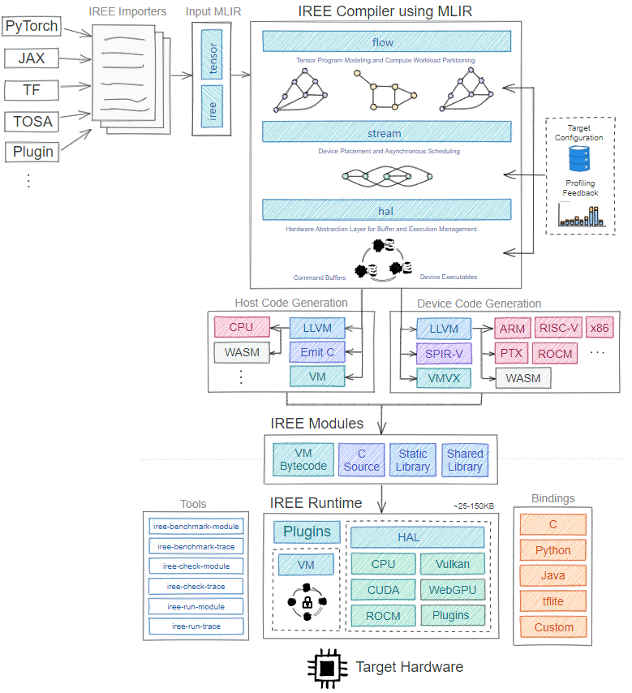

# [IREE] 编译流程

# 前言

背景知识介绍：The main tasks of a runtime are to manage resources and schedule execution

[MLIR dialects - IREE](https://openxla.github.io/iree/reference/mlir-dialects/)

- Flow dialect 是IREE的高阶表示，提供了抽象的构造来描述异步数据流和调度。包含概念如Executable(可执行文件)、Dispatch(调度)、Buffer(缓冲区)等。
- Stream dialect 是IREE的中阶表示,用于描述异步调度和执行流程。它描述了在异步硬件(如GPU)上执行的复杂异步计算流程。其在Flow dialect的基础上添加了描述异步流和调度的额外语义,但仍然独立于硬件。
- HAL(硬件抽象层)dialect 是IREE的低阶表示,直接对应硬件的概念和机制。它描述算子、缓冲区、执行器等的硬件细节。HAL方言目的是作为IREE backend实现的统一接口,backend可以根据不同的硬件语义自己定义HAL方言。定义了hal.executable、hal.dispatch、hal.buffer等概念。它们与特定硬件(如Vulkan)的语义和机制紧密相关。

关系图

```cpp
前端(TensorFlow,PyTorch,MXNet等)
⬇               
Flow dialect:高阶的异步数据流表示
⬇
Stream dialect:描述异步调度和执行流程
⬇
HAL dialect:硬件相关的低阶接口
⬇
backend
```



# 编译流程

> 下文内容参考了：[[Dou Jiang] IREE编译流程](https://hjchen2.github.io/2023/01/04/IREE%E7%BC%96%E8%AF%91%E6%B5%81%E7%A8%8B/)
> 

IREE目前支持将MHLO或XLA、Torch Tensor和TOSA作为输入，经过一系列passes编译生成IREE定义的VM bytecode中间产物，其中硬件相关代码会编译成相应的Executable，保存在VM bytecode中供host进行调用，比如CUDA相关的计算代码会被lower成PTX代码，在IREE的runtime中再被CUDA的运行时以JIT的方式编译成可执行的cubin kernel。

IREE编译的入口是IREEVMTransformPassPipeline，IREEVMTransformPassPipeline又被分成InputConversionPassPipeline、CommonInputConversionPassPipeline、ABI::TransformPassPipeline、Flow::FlowTransformPassPipeline、Stream::StreamTransformPassPipeline（仅CUDA后端）、HAL::HALTransformPassPipeline等几个阶段。

下图来源于：[https://www.khronos.org/assets/uploads/developers/presentations/IREE_targeting_Vulkan_Zhang_May22.pdf](https://www.khronos.org/assets/uploads/developers/presentations/IREE_targeting_Vulkan_Zhang_May22.pdf)


## 1、InputConversionPassPipeline

主要作用是将不同的输入（MHLO或XLA、Torch Tensor和TOSA）统一lower成linalg dialect和builtin的arith dialect、scf dialect和tensor dialect。

可参考的bolg： [IREE编译流程解析(一)](https://hjchen2.github.io/2023/01/04/IREE%E7%BC%96%E8%AF%91%E6%B5%81%E7%A8%8B1/)

---

## 2、CommonInputConversionPassPipeline

主要作用是将IREE::Input dialect lower成IREE::Util、IREE::Flow和IREE::HAL dialect

> --iree-common-input-transformation-pipeline
Runs the common input transformation pipeline
用来将输入代码转换为更规范化的形式
> 

 可参考的bolg：[IREE编译流程解析(二)](https://hjchen2.github.io/2023/01/04/IREE%E7%BC%96%E8%AF%91%E6%B5%81%E7%A8%8B2/)

```cpp
void buildCommonInputConversionPassPipeline(OpPassManager &passManager) {
	// 下面两个pass都是 加入依赖dialect
  passManager.addPass(createIREEImportPublicPass()); // IREE::Input::IREEInputDialect, IREE::Flow::FlowDialect, IREE::HAL::HALDialect, IREE::Util::UtilDialect, mlir::func::FuncDialect, mlir::arith::ArithDialect
  passManager.addPass(createImportMLProgramPass()); // IREE::Util::UtilDialect, func::FuncDialect
	// 下面这个pass是用来清理清理代码或数据
  passManager.addPass(createSanitizeModuleNamesPass());
}
void registerCommonInputConversionPasses() {
  // Generated passes.
  registerPasses();
  PassPipelineRegistration<> common(
      "iree-common-input-transformation-pipeline",
      "Runs the common input transformation pipeline",
      [](OpPassManager &passManager) {
        buildCommonInputConversionPassPipeline(passManager);
      });
}
```

---

## 3、ABI::TransformPassPipeline

主要作用是将外部导入的接口和本module导出到外部的接口参数统一成标准标量类型或`hal.buffer_view`类型（`hal.buffer_view`对应tensor）。

> --iree-abi-transformation-pipeline
Runs the IREE native ABI bindings support pipeline
> 

源码位于 [compiler\src\iree\compiler\Bindings\Native\Transforms\Passes.cpp](https://github.com/openxla/iree/blob/main/compiler/src/iree/compiler/Bindings/Native/Transforms/Passes.cpp#L38-L46)，最主要的函数是 `buildTransformPassPipeline` 

可参考的bolg：[IREE编译流程解析(三)](https://hjchen2.github.io/2023/01/04/IREE%E7%BC%96%E8%AF%91%E6%B5%81%E7%A8%8B3/)

```cpp
void buildTransformPassPipeline(OpPassManager &passManager,const InvocationOptions &invocationOptions) {
  // 在进行wrapping之前先转化为streamable ops，这样的话我们在warpping前就可以在函数边界上使用传统的优化
  passManager.addPass(createConvertStreamableOpsPass());
  // 将入口点warp在export function，将外部导入的接口和本module导出到外部的接口参数统一成标准标量类型或hal.buffer_view（对应tensor类型）。
  passManager.addPass(createWrapEntryPointsPass(invocationOptions.invocationModel));
  // 操作后清理IR：inline、canonicalizer、cse、Eliminate dead symbols
  passManager.addPass(createInlinerPass());
  passManager.addNestedPass<func::FuncOp>(createCanonicalizerPass());
  passManager.addNestedPass<func::FuncOp>(createCSEPass());
  passManager.addPass(createSymbolDCEPass());
}
```

---

## 4、Flow::FlowTransformPassPipeline

主要作用是执行一系列窥孔优化，比如1x1的conv2d转换成matmul、tiling、op fusion等，最终将workload拆分成`flow.executable`。

> --iree-flow-transformation-pipeline
Runs the full IREE flow dialect transformation pipeline
用来将将输入的ML前端(如TensorFlow或MXNet)转换为IREE的Flow方言。
Flow dialect 是IREE的高阶方言,提供了抽象的构造来描述异步数据流和调度。包含概念如Executable(可执行文件)、Dispatch(调度)、Buffer(缓冲区)等。
> 

位于 compiler\src\iree\compiler\Dialect\Flow\Transforms\Passes.cpp ，最主要的函数是 `[buildFlowTransformPassPipeline](https://github.com/openxla/iree/blob/main/compiler/src/iree/compiler/Dialect/Flow/Transforms/Passes.cpp#L182-L388)`

下面的内容主要来源于代码中的注释：

可参考的bolg：[IREE编译流程解析(四)](https://hjchen2.github.io/2023/01/04/IREE%E7%BC%96%E8%AF%91%E6%B5%81%E7%A8%8B4/)

```cpp
这段代码定义了一个OpPassManager,用于将输入的ML前端(如TensorFlow或MXNet)转换为IREE的Flow方言。主要的转换步骤如下:
1. 类型转换,如f64 -> f32,f32 -> f16等。用于调整精度。
2. 预处理,将程序转换为标准形式,如将张量填充转换为tensor_insert_slice以及将1x1的linalg.conv_2d_nhwc_hwcf转换成linalg.matmul等。
3. 检查输入的合法性。
4. 展开tensor的shape为SSA变量,并进行全局优化。这可以最大化融合的效果。
5. 元素运算融合。将点状的元素运算融合在一起。
6. 将reduction运算拆分为parallel和reduction部分。
7. 形成dispatch区域。将计算划分到可以并行执行的区域。
8. dispatch区域内的其他优化,如collapse dimensions,复制生产者等。
9. dispatch区域组成dispatch workgroups。
10. 捕获dispatch的动态维度。
11. 初始化空tensor为0.
12. outline dispatch区域为自己的函数并包装在executables中。
13. 移除executable中的断言,因为我们生成的executable是为了能够在非法值的情况下也能安全运行,断言对调试没有太大帮助。
14. 重复删除executables。删除等价的executables。
15. 根据命令行选项在指定的dispatch上添加调试目标或追踪点。
16. 追踪可导出的benchmark函数的输入输出,以便使用iree-benchmark-module测试每个函数。
17. 其他清理,如删除无用的变量和函数等。
18. 可选的,生成dispatch图的dot文件。
```

---

## 5、Stream::StreamTransformPassPipeline

主要作用是将program转换到stream dialect，优化变量编码方式，划分调度子图，生成异步调度策略，并实现内存规划策略。

> --iree-stream-transformation-pipeline
Runs the full IREE stream dialect transformation pipeline
用来将输入程序转换为Stream方言。
Stream dialect 是IREE的中阶方言,用于描述异步调度和执行流程。它描述了在异步硬件(如GPU)上执行的复杂异步计算流程。在Flow dialect的基础上添加了描述异步流和调度的额外语义,但仍然独立于硬件
> 

位于 compiler\src\iree\compiler\Dialect\Stream\Transforms\Passes.cpp，最主要的函数是 `[buildStreamTransformPassPipeline](https://github.com/openxla/iree/blob/main/compiler/src/iree/compiler/Dialect/Stream/Transforms/Passes.cpp#L297-L335)` 

下面的内容主要来源于代码中的注释：

可参考的bolg： [IREE编译流程解析(五)](https://hjchen2.github.io/2023/02/13/IREE%E7%BC%96%E8%AF%91%E6%B5%81%E7%A8%8B5/)

```cpp
这段代码定义了一个OpPassManager,用于将输入程序转换为Stream方言。Stream方言是一个中间表示,用于描述异步调度流程，它描述了在异步硬件(如GPU)上执行的复杂异步计算流程。主要的转换步骤如下:
1. buildStreamOptimizationPassPipeline函数用于构建流优化的编译流水线。流优化可能包括:
 - 调度优化:重新排列运算的执行顺序以改善吞吐量或减少内存需求。
 - 临时缓冲区重用:重用内存缓冲区以减少内存分配次数。
 - 算子融合:将多个连续的算子融合在一起,减少内部临时缓冲区的分配。
2. addCleanupPatterns用于一些最后的清理,如:
 - 删除无用的变量和函数
 - 规范化生产者消费者的关系
 - 等等
3. createSymbolDCEPass用于删除现在不再需要的变量和函数。
4. 这部分主要关注流优化和最后的清理,为稍后的Lowering to LLVM IR做准备。
```

---

## 6、HAL::HALTransformPassPipeline

主要作用是进行tiling、vectorization和bufferization等操作，分配计算负载，最终生成target device的代码。比如cuda target的dispatch source code会被递降为NVVM IR。


> --iree-hal-transformation-pipeline
Runs the full IREE HAL dialect transformation pipeline
用来进一步转换到HAL方言
HAL(硬件抽象层)dialect 是IREE的低阶表示,直接对应硬件的概念和机制。它描述算子、缓冲区、执行器等的硬件细节。HAL方言目的是作为IREE backend实现的统一接口,backend可以根据不同的硬件语义自己定义HAL方言。
定义了hal.executable、hal.dispatch、hal.buffer等概念。它们与特定硬件(如Vulkan)的语义和机制紧密相关。
> 

位于 [compiler\src\iree\compiler\Dialect\HAL\Transforms\Passes.cpp](https://github.com/openxla/iree/blob/main/compiler/src/iree/compiler/Dialect/HAL/Transforms/Passes.cpp#L396-L405) ，最主要的函数是 `[buildHALTransformPassPipeline](https://github.com/openxla/iree/blob/main/compiler/src/iree/compiler/Dialect/HAL/Transforms/Passes.cpp#L209-L376)` [](https://github.com/openxla/iree/blob/main/compiler/src/iree/compiler/Dialect/HAL/Transforms/Passes.cpp#L139-L349) 

下面的内容主要来源于代码中的注释：

可参考的bolg： [IREE编译流程解析(六)](https://hjchen2.github.io/2023/02/24/IREE%E7%BC%96%E8%AF%91%E6%B5%81%E7%A8%8B6/)

```cpp
这个代码片段构造了一个OpPassManager,用于HAL(Hardware Abstraction Layer)方面的编译pipeline的构建。大致的流程如下:
1. 设备分配和接口物化。分配设备并将接口物化。
2. 可执行文件的变换。使用外部工具预处理可执行文件,然后将每个可执行文件变种翻译为其目标IR形式。翻译后,可执行文件成为不透明的blob,无法再改变其接口。
3. 主机程序的转换。将支持的输入方言(std,stream等)转换为HAL方言。
4. 可执行文件打包和运行时加载。链接可执行文件,解析导出序数,收集可缓存资源等。
5. 设备管理和专门化。内联hal.device.switch操作,记忆化设备查询等。
6. 可执行文件序列化。在IR的最后,将可执行文件内容序列化为base64字符串。
7. 全程序优化。运行IPO和其他清理。IPO可以折叠重复的参数/结果并内联常量,以使本地优化更加有效。
```

> --iree-hal-target-backends=<string>
Target backends for executable compilation
> 

（1）iree-hal-target-backends=cuda默认目标是 sm_35
可后接命令行来指定目标  `--iree-hal-cuda-llvm-target-arch=sm_80`

（2）iree-hal-target-backends=llvm-cpu

---

# 测试

本节会对pipeline的每一步进行输出，看看变化效果

输入 matmul.mlir

```llvm
func.func @matmul_static(
  %arg0: tensor<128x128xf32>, %arg1: tensor<128x128xf32>,
  %arg2: tensor<128x128xf32>)
    -> tensor<128x128xf32> {
  %0 = linalg.matmul { test.attrA, test.attrC }
                      ins(%arg0, %arg1: tensor<128x128xf32>, tensor<128x128xf32>)
                     outs(%arg2: tensor<128x128xf32>)
    -> tensor<128x128xf32>
  func.return %0 : tensor<128x128xf32>
}
```

命令行输入：

```jsx
cat matmul.mlir |\
$IREE_OPT/iree-opt \
  --iree-common-input-transformation-pipeline \
  --iree-abi-transformation-pipeline \
  --iree-flow-transformation-pipeline  \
  --iree-stream-transformation-pipeline \
  --iree-hal-target-backends=cuda --iree-hal-cuda-llvm-target-arch=sm_80 \
  --iree-hal-transformation-pipeline
```

下面的内容是分步进行测试的：

- --iree-common-input-transformation-pipeline

```llvm
module {
  func.func @matmul_static(%arg0: tensor<128x128xf32>, %arg1: tensor<128x128xf32>, %arg2: tensor<128x128xf32>) -> tensor<128x128xf32> {
    %0 = linalg.matmul {test.attrA, test.attrC} ins(%arg0, %arg1 : tensor<128x128xf32>, tensor<128x128xf32>) outs(%arg2 : tensor<128x128xf32>) -> tensor<128x128xf32>
    return %0 : tensor<128x128xf32>
  }
}
```

- --iree-abi-transformation-pipeline

```llvm
module {
  func.func @matmul_static(%arg0: !hal.buffer_view, %arg1: !hal.buffer_view, %arg2: !hal.buffer_view) -> !hal.buffer_view attributes {iree.abi.stub} {
    %0 = hal.tensor.import %arg0 "input 0" : !hal.buffer_view -> tensor<128x128xf32>
    %1 = hal.tensor.import %arg1 "input 1" : !hal.buffer_view -> tensor<128x128xf32>
    %2 = hal.tensor.import %arg2 "input 2" : !hal.buffer_view -> tensor<128x128xf32>
    %3 = linalg.matmul {test.attrA, test.attrC} ins(%0, %1 : tensor<128x128xf32>, tensor<128x128xf32>) outs(%2 : tensor<128x128xf32>) -> tensor<128x128xf32>
    %4 = hal.tensor.export %3 "output 0" : tensor<128x128xf32> -> !hal.buffer_view
    return %4 : !hal.buffer_view
  }
}
```

- --iree-flow-transformation-pipeline

```llvm
module {
  flow.executable private @matmul_static_dispatch_0 {
    flow.executable.export public @matmul_static_dispatch_0_matmul_128x128x128 workgroups(%arg0: index, %arg1: index, %arg2: index) -> (index, index, index) {
      %x, %y, %z = flow.dispatch.workgroup_count_from_dag_root %arg0, %arg1, %arg2
      flow.return %x, %y, %z : index, index, index
    }
    builtin.module {
      func.func @matmul_static_dispatch_0_matmul_128x128x128(%arg0: !flow.dispatch.tensor<readonly:tensor<128x128xf32>>, %arg1: !flow.dispatch.tensor<readonly:tensor<128x128xf32>>, %arg2: !flow.dispatch.tensor<readwrite:tensor<128x128xf32>>) {
        %0 = flow.dispatch.tensor.load %arg0, offsets = [0, 0], sizes = [128, 128], strides = [1, 1] : !flow.dispatch.tensor<readonly:tensor<128x128xf32>> -> tensor<128x128xf32>
        %1 = flow.dispatch.tensor.load %arg1, offsets = [0, 0], sizes = [128, 128], strides = [1, 1] : !flow.dispatch.tensor<readonly:tensor<128x128xf32>> -> tensor<128x128xf32>
        %2 = flow.dispatch.tensor.load %arg2, offsets = [0, 0], sizes = [128, 128], strides = [1, 1] : !flow.dispatch.tensor<readwrite:tensor<128x128xf32>> -> tensor<128x128xf32>
        %3 = linalg.matmul {test.attrA, test.attrC} ins(%0, %1 : tensor<128x128xf32>, tensor<128x128xf32>) outs(%2 : tensor<128x128xf32>) -> tensor<128x128xf32>
        flow.dispatch.tensor.store %3, %arg2, offsets = [0, 0], sizes = [128, 128], strides = [1, 1] : tensor<128x128xf32> -> !flow.dispatch.tensor<readwrite:tensor<128x128xf32>>
        return
      }
    }
  }
  func.func @matmul_static(%arg0: !hal.buffer_view, %arg1: !hal.buffer_view, %arg2: !hal.buffer_view) -> !hal.buffer_view attributes {iree.abi.stub} {
    %c128 = arith.constant 128 : index
    %c1 = arith.constant 1 : index
    %0 = hal.tensor.import %arg0 "input 0" : !hal.buffer_view -> tensor<128x128xf32>
    %1 = hal.tensor.import %arg1 "input 1" : !hal.buffer_view -> tensor<128x128xf32>
    %2 = hal.tensor.import %arg2 "input 2" : !hal.buffer_view -> tensor<128x128xf32>
    %3 = flow.dispatch @matmul_static_dispatch_0::@matmul_static_dispatch_0_matmul_128x128x128[%c128, %c128, %c1](%0, %1, %2) : (tensor<128x128xf32>, tensor<128x128xf32>, tensor<128x128xf32>) -> %2
    %4 = hal.tensor.export %3 "output 0" : tensor<128x128xf32> -> !hal.buffer_view
    return %4 : !hal.buffer_view
  }
}
```

- --iree-stream-transformation-pipeline

```llvm
module {
  stream.executable private @matmul_static_dispatch_0 {
    stream.executable.export public @matmul_static_dispatch_0_matmul_128x128x128 workgroups(%arg0: index, %arg1: index, %arg2: index) -> (index, index, index) {
      %x, %y, %z = flow.dispatch.workgroup_count_from_dag_root %arg0, %arg1, %arg2
      stream.return %x, %y, %z : index, index, index
    }
    builtin.module {
      func.func @matmul_static_dispatch_0_matmul_128x128x128(%arg0: !stream.binding {stream.alignment = 64 : index}, %arg1: !stream.binding {stream.alignment = 64 : index}, %arg2: !stream.binding {stream.alignment = 64 : index}) {
        %c0 = arith.constant 0 : index
        %0 = stream.binding.subspan %arg0[%c0] : !stream.binding -> !flow.dispatch.tensor<readonly:tensor<128x128xf32>>
        %1 = stream.binding.subspan %arg1[%c0] : !stream.binding -> !flow.dispatch.tensor<readonly:tensor<128x128xf32>>
        %2 = stream.binding.subspan %arg2[%c0] : !stream.binding -> !flow.dispatch.tensor<readwrite:tensor<128x128xf32>>
        %3 = flow.dispatch.tensor.load %0, offsets = [0, 0], sizes = [128, 128], strides = [1, 1] : !flow.dispatch.tensor<readonly:tensor<128x128xf32>> -> tensor<128x128xf32>
        %4 = flow.dispatch.tensor.load %1, offsets = [0, 0], sizes = [128, 128], strides = [1, 1] : !flow.dispatch.tensor<readonly:tensor<128x128xf32>> -> tensor<128x128xf32>
        %5 = flow.dispatch.tensor.load %2, offsets = [0, 0], sizes = [128, 128], strides = [1, 1] : !flow.dispatch.tensor<readwrite:tensor<128x128xf32>> -> tensor<128x128xf32>
        %6 = linalg.matmul {test.attrA, test.attrC} ins(%3, %4 : tensor<128x128xf32>, tensor<128x128xf32>) outs(%5 : tensor<128x128xf32>) -> tensor<128x128xf32>
        flow.dispatch.tensor.store %6, %2, offsets = [0, 0], sizes = [128, 128], strides = [1, 1] : tensor<128x128xf32> -> !flow.dispatch.tensor<readwrite:tensor<128x128xf32>>
        return
      }
    }
  }
  func.func @matmul_static(%arg0: !hal.buffer_view, %arg1: !hal.buffer_view, %arg2: !hal.buffer_view) -> !hal.buffer_view attributes {iree.abi.stub} {
    %c0 = arith.constant 0 : index
    %c65536 = arith.constant 65536 : index
    %c128 = arith.constant 128 : index
    %c1 = arith.constant 1 : index
    %c553648160_i32 = arith.constant 553648160 : i32
    %c1_i32 = arith.constant 1 : i32
    hal.buffer_view.assert<%arg0 : !hal.buffer_view> message("input 0") shape([%c128, %c128]) type(%c553648160_i32) encoding(%c1_i32)
    %0 = stream.tensor.import %arg0 : !hal.buffer_view -> tensor<128x128xf32> in !stream.resource<external>{%c65536}
    hal.buffer_view.assert<%arg1 : !hal.buffer_view> message("input 1") shape([%c128, %c128]) type(%c553648160_i32) encoding(%c1_i32)
    %1 = stream.tensor.import %arg1 : !hal.buffer_view -> tensor<128x128xf32> in !stream.resource<external>{%c65536}
    hal.buffer_view.assert<%arg2 : !hal.buffer_view> message("input 2") shape([%c128, %c128]) type(%c553648160_i32) encoding(%c1_i32)
    %2 = stream.tensor.import %arg2 : !hal.buffer_view -> tensor<128x128xf32> in !stream.resource<external>{%c65536}
    %3 = stream.cmd.execute with(%0 as %arg3: !stream.resource<external>{%c65536}, %1 as %arg4: !stream.resource<external>{%c65536}, %2 as %arg5: !stream.resource<external>{%c65536}) {
      stream.cmd.dispatch @matmul_static_dispatch_0::@matmul_static_dispatch_0_matmul_128x128x128[%c128, %c128, %c1] {
        ro %arg3[%c0 for %c65536] : !stream.resource<external>{%c65536},
        ro %arg4[%c0 for %c65536] : !stream.resource<external>{%c65536},
        rw %arg5[%c0 for %c65536] : !stream.resource<external>{%c65536}
      }
    } => !stream.timepoint
    %4 = stream.timepoint.await %3 => %2 : !stream.resource<external>{%c65536}
    %5 = stream.tensor.export %4 : tensor<128x128xf32> in !stream.resource<external>{%c65536} -> !hal.buffer_view
    return %5 : !hal.buffer_view
  }
}
```

- --iree-hal-transformation-pipeline (指定--iree-hal-target-backends=cuda --iree-hal-cuda-llvm-target-arch=sm_80)

```llvm
#executable_target_cuda_nvptx_fb = #hal.executable.target<"cuda", "cuda-nvptx-fb", {target_arch = "sm_80"}>
#device_target_cuda = #hal.device.target<"cuda", {executable_targets = [#executable_target_cuda_nvptx_fb], legacy_sync}>
module attributes {hal.device.targets = [#device_target_cuda]} {
  util.global private @_device_query_0 : i1
  util.global private @_pipeline_layout_0 : !hal.pipeline_layout
  util.global private @_executable_matmul_static_dispatch_0 : !hal.executable
  util.initializer {
    %device = hal.ex.shared_device : !hal.device
    %ok, %value = hal.device.query<%device : !hal.device> key("hal.executable.format" :: "cuda-nvptx-fb") : i1, i1 = false
    %descriptor_set_layout = hal.descriptor_set_layout.create device(%device : !hal.device) flags("None") bindings([#hal.descriptor_set.binding<0, storage_buffer, ReadOnly>, #hal.descriptor_set.binding<1, storage_buffer, ReadOnly>, #hal.descriptor_set.binding<2, storage_buffer>]) : !hal.descriptor_set_layout
    %pipeline_layout = hal.pipeline_layout.create device(%device : !hal.device) push_constants(0) layouts([%descriptor_set_layout]) : !hal.pipeline_layout
    util.global.store %value, @_device_query_0 : i1
    util.global.store %pipeline_layout, @_pipeline_layout_0 : !hal.pipeline_layout
    cf.cond_br %value, ^bb1, ^bb2
  ^bb1:  // pred: ^bb0
    %_pipeline_layout_0 = util.global.load @_pipeline_layout_0 : !hal.pipeline_layout
    %exe = hal.executable.create device(%device : !hal.device) target(@matmul_static_dispatch_0::@cuda_nvptx_fb) layouts([%_pipeline_layout_0]) : !hal.executable
    cf.br ^bb3(%exe : !hal.executable)
  ^bb2:  // pred: ^bb0
    %0 = util.null : !hal.executable
    cf.br ^bb3(%0 : !hal.executable)
  ^bb3(%1: !hal.executable):  // 2 preds: ^bb1, ^bb2
    util.global.store %1, @_executable_matmul_static_dispatch_0 : !hal.executable
    util.initializer.return
  }
  hal.executable private @matmul_static_dispatch_0 {
    hal.executable.binary public @cuda_nvptx_fb attributes {data = dense<"0x080000004355444184E5FFFF100000004C000000400000005400000001000000040000002B0000006D61746D756C5F7374617469635F64697370617463685F305F6D61746D756C5F31323878313238783132380001000000005E000001000000400000000200000001000000131A00002F2F0A2F2F2047656E657261746564206279204C4C564D204E56505458204261636B2D456E640A2F2F0A0A2E76657273696F6E20372E300A2E74617267657420736D5F38300A2E616464726573735F73697A652036340A0A092F2F202E676C6F626C096D61746D756C5F7374617469635F64697370617463685F305F6D61746D756C5F31323878313238783132380A2E65787465726E202E736861726564202E616C69676E203136202E6238205F5F64796E616D69635F7368617265645F6D656D6F72795F5F5B5D3B0A0A2E76697369626C65202E656E747279206D61746D756C5F7374617469635F64697370617463685F305F6D61746D756C5F3132387831323878313238280A092E706172616D202E753634206D61746D756C5F7374617469635F64697370617463685F305F6D61746D756C5F31323878313238783132385F706172616D5F302C0A092E706172616D202E753634206D61746D756C5F7374617469635F64697370617463685F305F6D61746D756C5F31323878313238783132385F706172616D5F312C0A092E706172616D202E753634206D61746D756C5F7374617469635F64697370617463685F305F6D61746D756C5F31323878313238783132385F706172616D5F320A290A2E6D61786E7469642036342C20322C20310A7B0A092E726567202E70726564200925703C333E3B0A092E726567202E623332200925723C33323E3B0A092E726567202E663332200925663C34393E3B0A092E726567202E62363420092572643C3132353E3B0A0A096C642E706172616D2E753634200925726432382C205B6D61746D756C5F7374617469635F64697370617463685F305F6D61746D756C5F31323878313238783132385F706172616D5F305D3B0A096C642E706172616D2E753634200925726432392C205B6D61746D756C5F7374617469635F64697370617463685F305F6D61746D756C5F31323878313238783132385F706172616D5F325D3B0A09637674612E746F2E676C6F62616C2E753634200925726433302C2025726432393B0A096C642E706172616D2E753634200925726433312C205B6D61746D756C5F7374617469635F64697370617463685F305F6D61746D756C5F31323878313238783132385F706172616D5F315D3B0A09637674612E746F2E676C6F62616C2E753634200925726433322C2025726433313B0A09637674612E746F2E676C6F62616C2E753634200925726433332C2025726432383B0A096D6F762E75333220092572312C20257469642E783B0A096376742E7536342E753332200925726433342C202572313B0A096D6F762E75333220092572322C20257469642E793B0A096D6F762E75333220092572332C20257469642E7A3B0A096D6F762E75333220092572342C202563746169642E783B0A096D6F762E75333220092572352C202563746169642E793B0A096261722E73796E632009303B0A096D756C2E776964652E753332200925726433352C202572322C20383B0A096D756C2E776964652E753332200925726433362C202572332C2031363B0A096164642E733634200925726433372C2025726433352C2025726433363B0A0973686C2E62333220092572362C202572352C20353B0A096376742E7536342E753332200925726433382C202572363B0A097368722E753634200925726433392C2025726433342C20333B0A096164642E733634200925726434302C2025726433372C2025726433393B0A096164642E733634200925726434312C2025726434302C2025726433383B0A096D756C2E776964652E753332200925726434322C202572312C20343B0A0973686C2E62333220092572372C202572342C20353B0A096376742E7536342E753332200925726434332C202572373B0A0973686C2E623634200925726434342C2025726433392C20353B0A097375622E733634200925726434352C2025726434322C2025726434343B0A096164642E733634200925726434362C2025726434352C2025726434333B0A096D756C2E6C6F2E733634200925726434372C2025726434302C2033363B0A096164642E733634200925726434382C2025726434372C2025726434353B0A0973686C2E623634200925726434392C2025726434382C20323B0A096D6F762E753634200925726435302C205F5F64796E616D69635F7368617265645F6D656D6F72795F5F3B0A096164642E7336342009257264312C2025726435302C2025726434393B0A0973686C2E623634200925726435312C2025726434312C20373B0A096164642E733634200925726435322C2025726435312C2025726434363B0A0973686C2E623634200925726435332C2025726435322C20323B0A096164642E7336342009257264322C2025726433302C2025726435333B0A0963702E6173796E632E63612E7368617265642E676C6F62616C205B257264315D2C205B257264325D2C2031363B0A096164642E733634200925726435342C20257264312C20323330343B0A096164642E733634200925726435352C20257264322C20383139323B0A0963702E6173796E632E63612E7368617265642E676C6F62616C205B25726435345D2C205B25726435355D2C2031363B0A0963702E6173796E632E636F6D6D69745F67726F75703B0A0963702E6173796E632E776169745F67726F757020303B0A096261722E73796E632009303B0A096D756C2E776964652E753332200925726435362C202572322C2031363B0A097368722E753634200925726435372C2025726433342C20313B0A09616E642E623634202009257264332C2025726435372C203439363B0A096D756C2E776964652E753332200925726435382C202572322C203537363B0A096164642E733634200925726435392C20257264332C2025726435383B0A0973686C2E623634200925726436302C2025726435392C20323B0A096164642E7336342009257264342C2025726435302C2025726436303B0A096D6F762E75333220092572382C2033363B0A09776D6D612E6C6F61642E632E73796E632E616C69676E65642E726F772E6D31366E31366B31362E7368617265642E66333220097B256634312C20256634322C20256634332C20256634342C20256634352C20256634362C20256634372C20256634387D2C205B257264345D2C202572383B0A096D756C2E776964652E753332200925726436312C202572332C2033323B0A096164642E733634200925726436322C2025726435362C2025726436313B0A097368722E753634200925726436332C2025726433342C20323B0A096164642E733634200925726436342C2025726436322C2025726436333B0A096164642E733634200925726436352C2025726436342C2025726433383B0A0973686C2E623634200925726436362C2025726436332C20343B0A097375622E733634200925726436372C2025726434322C2025726436363B0A096261722E73796E632009303B0A096D756C2E6C6F2E733634200925726436382C2025726436342C2032303B0A096164642E733634200925726436392C2025726436382C2025726436373B0A0973686C2E623634200925726437302C2025726436392C20323B0A096164642E733634200925726437312C2025726435302C2025726437303B0A096164642E7336342009257264352C2025726437312C20343630383B0A0973686C2E623634200925726437322C2025726436352C20373B0A096164642E733634200925726437332C2025726437322C2025726436373B0A0973686C2E623634200925726437342C2025726437332C20323B0A096164642E733634200925726437352C2025726437342C2025726433333B0A0963702E6173796E632E63612E7368617265642E676C6F62616C205B257264355D2C205B25726437355D2C2031363B0A096164642E7336342009257264362C20257264312C2031343834383B0A0973686C2E623634200925726437362C2025726434302C20373B0A096164642E733634200925726437372C2025726437362C2025726434363B0A0973686C2E623634200925726437382C2025726437372C20323B0A096164642E733634200925726437392C2025726433322C2025726437383B0A0963702E6173796E632E63612E7368617265642E676C6F62616C205B257264365D2C205B25726437395D2C2031363B0A0963702E6173796E632E636F6D6D69745F67726F75703B0A096261722E73796E632009303B0A096164642E733634200925726438302C2025726437312C20373136383B0A096164642E733634200925726438312C2025726437352C2036343B0A0963702E6173796E632E63612E7368617265642E676C6F62616C205B25726438305D2C205B25726438315D2C2031363B0A096164642E733634200925726438322C20257264312C2031373135323B0A096164642E733634200925726438332C2025726437392C20383139323B0A0963702E6173796E632E63612E7368617265642E676C6F62616C205B25726438325D2C205B25726438335D2C2031363B0A0963702E6173796E632E636F6D6D69745F67726F75703B0A096261722E73796E632009303B0A096164642E733634200925726438342C2025726437312C20393732383B0A096164642E733634200925726438352C2025726437352C203132383B0A0963702E6173796E632E63612E7368617265642E676C6F62616C205B25726438345D2C205B25726438355D2C2031363B0A096164642E733634200925726438362C20257264312C2031393435363B0A096164642E733634200925726438372C2025726437392C2031363338343B0A0963702E6173796E632E63612E7368617265642E676C6F62616C205B25726438365D2C205B25726438375D2C2031363B0A0963702E6173796E632E636F6D6D69745F67726F75703B0A096261722E73796E632009303B0A096164642E733634200925726438382C2025726437312C2031323238383B0A096164642E733634200925726438392C2025726437352C203139323B0A0963702E6173796E632E63612E7368617265642E676C6F62616C205B25726438385D2C205B25726438395D2C2031363B0A096164642E733634200925726439302C20257264312C2032313736303B0A096164642E733634200925726439312C2025726437392C2032343537363B0A0963702E6173796E632E63612E7368617265642E676C6F62616C205B25726439305D2C205B25726439315D2C2031363B0A0963702E6173796E632E636F6D6D69745F67726F75703B0A096D756C2E776964652E7533322009257264372C202572322C203332303B0A096164642E73363420092572643132302C2025726437352C203235363B0A096D756C2E776964652E753332200925726439322C202572332C20383139323B0A096D756C2E776964652E753332200925726439332C202572322C20343039363B0A096164642E733634200925726439342C2025726439322C2025726439333B0A096D756C2E6C6F2E733634200925726439352C2025726433392C203338343B0A096164642E733634200925726439362C2025726439342C2025726439353B0A096D756C2E776964652E753332200925726439372C202572342C203132383B0A096164642E733634200925726439382C2025726439362C2025726439373B0A096D756C2E776964652E753332200925726439392C202572312C2031363B0A096164642E73363420092572643130302C2025726439382C2025726439393B0A096164642E73363420092572643130312C202572643130302C2025726433323B0A096164642E73363420092572643131382C202572643130312C2033323736383B0A096D6F762E75363420092572643132332C20313B0A096D6F762E75363420092572643132322C20323B0A096D6F762E75363420092572643132312C20333B0A096D6F762E75363420092572643131392C202D31363B0A096D6F762E75363420092572643131372C20303B0A096D6F762E7533322009257231332C2032303B0A096D6F762E75363420092572643132342C202572643131373B0A244C5F5F4242305F313A0A096D6F762E753634200925726431362C202572643132333B0A096D6F762E75363420092572643132332C202572643132323B0A096D6F762E75363420092572643132322C202572643132313B0A096164642E73363420092572643131392C202572643131392C2031363B0A09736574702E6C742E75363420092570312C202572643131392C2036343B0A0963702E6173796E632E776169745F67726F757020333B0A096261722E73796E632009303B0A096D756C2E6C6F2E73363420092572643130342C202572643132342C203634303B0A096164642E73363420092572643130352C202572643130342C20257264373B0A0973686C2E62363420092572643130362C202572643130352C20323B0A096164642E73363420092572643130382C2025726435302C202572643130363B0A09776D6D612E6C6F61642E612E73796E632E616C69676E65642E726F772E6D31366E31366B382E7368617265642E7466333220097B257231342C20257231352C20257231362C20257231377D2C205B2572643130382B343630385D2C20257231333B0A09776D6D612E6C6F61642E612E73796E632E616C69676E65642E726F772E6D31366E31366B382E7368617265642E7466333220097B257231382C20257231392C20257232302C20257232317D2C205B2572643130382B343634305D2C20257231333B0A096D756C2E6C6F2E73363420092572643130392C202572643132342C203537363B0A096164642E73363420092572643131302C202572643130392C20257264333B0A0973686C2E62363420092572643131312C202572643131302C20323B0A096164642E73363420092572643131322C2025726435302C202572643131313B0A09776D6D612E6C6F61642E622E73796E632E616C69676E65642E726F772E6D31366E31366B382E7368617265642E7466333220097B257232332C20257232342C20257232352C20257232367D2C205B2572643131322B31343834385D2C202572383B0A09776D6D612E6C6F61642E622E73796E632E616C69676E65642E726F772E6D31366E31366B382E7368617265642E7466333220097B257232372C20257232382C20257232392C20257233307D2C205B2572643131322B31363030305D2C202572383B0A09776D6D612E6D6D612E73796E632E616C69676E65642E726F772E726F772E6D31366E31366B382E6633322E746633322E746633322E6633320A09097B256632352C20256632362C20256632372C20256632382C20256632392C20256633302C20256633312C20256633327D2C0A09097B257231342C20257231352C20257231362C20257231377D2C0A09097B257232332C20257232342C20257232352C20257232367D2C0A09097B256634312C20256634322C20256634332C20256634342C20256634352C20256634362C20256634372C20256634387D3B0A09776D6D612E6D6D612E73796E632E616C69676E65642E726F772E726F772E6D31366E31366B382E6633322E746633322E746633322E6633320A09097B256634312C20256634322C20256634332C20256634342C20256634352C20256634362C20256634372C20256634387D2C0A09097B257231382C20257231392C20257232302C20257232317D2C0A09097B257232372C20257232382C20257232392C20257233307D2C0A09097B256632352C20256632362C20256632372C20256632382C20256632392C20256633302C20256633312C20256633327D3B0A096261722E73796E632009303B0A09616E642E6236342020092572643132312C202572643131372C20333B0A096D756C2E6C6F2E73363420092572643131332C202572643132312C20323536303B0A096164642E73363420092572643131342C20257264352C202572643131333B0A0973656C702E6233322009257231302C2031362C20302C202570313B0A096376742E7533322E75363420092572392C202572643131343B0A092F2F20626567696E20696E6C696E652061736D0A0963702E6173796E632E63672E7368617265642E676C6F62616C205B2572395D2C205B2572643132305D2C2031362C20257231303B0A0A092F2F20656E6420696E6C696E652061736D0A096D756C2E6C6F2E73363420092572643131352C202572643132312C20323330343B0A096164642E73363420092572643131362C20257264362C202572643131353B0A096376742E7533322E7536342009257231312C202572643131363B0A092F2F20626567696E20696E6C696E652061736D0A0963702E6173796E632E63672E7368617265642E676C6F62616C205B257231315D2C205B2572643131385D2C2031362C20257231303B0A0A092F2F20656E6420696E6C696E652061736D0A0963702E6173796E632E636F6D6D69745F67726F75703B0A096164642E73363420092572643132302C202572643132302C2036343B0A096164642E73363420092572643131382C202572643131382C20383139323B0A096164642E73363420092572643131372C202572643131372C20313B0A09736574702E6C742E75363420092570322C202572643131392C203131323B0A096D6F762E75363420092572643132342C2025726431363B0A0940257032206272612009244C5F5F4242305F313B0A09776D6D612E73746F72652E642E73796E632E616C69676E65642E726F772E6D31366E31366B31362E7368617265642E66333220095B257264345D2C7B256634312C20256634322C20256634332C20256634342C20256634352C20256634362C20256634372C20256634387D2C202572383B0A096261722E73796E632009303B0A096C642E7368617265642E76342E66333220097B256633332C20256633342C20256633352C20256633367D2C205B257264315D3B0A0973742E676C6F62616C2E76342E66333220095B257264325D2C207B256633332C20256633342C20256633352C20256633367D3B0A096C642E7368617265642E76342E66333220097B256633372C20256633382C20256633392C20256634307D2C205B257264312B323330345D3B0A0973742E676C6F62616C2E76342E66333220095B257264322B383139325D2C207B256633372C20256633382C20256633392C20256634307D3B0A096261722E73796E632009303B0A097265743B0A0A7D0A000C001400040008000C001000"> : vector<6800xi8>, format = "cuda-nvptx-fb", mime_type = "application/x-flatbuffers"}
  }
  func.func @matmul_static(%arg0: !hal.buffer_view, %arg1: !hal.buffer_view, %arg2: !hal.buffer_view) -> !hal.buffer_view attributes {iree.abi.stub} {
    %c-1_i32 = arith.constant -1 : i32
    %c4 = arith.constant 4 : index
    %c2 = arith.constant 2 : index
    %c-1_i64 = arith.constant -1 : i64
    %c0 = arith.constant 0 : index
    %c65536 = arith.constant 65536 : index
    %c128 = arith.constant 128 : index
    %c1 = arith.constant 1 : index
    %c553648160_i32 = arith.constant 553648160 : i32
    %c1_i32 = arith.constant 1 : i32
    %_device_query_0 = util.global.load @_device_query_0 : i1
    %_pipeline_layout_0 = util.global.load @_pipeline_layout_0 : !hal.pipeline_layout
    %_executable_matmul_static_dispatch_0 = util.global.load @_executable_matmul_static_dispatch_0 : !hal.executable
    hal.buffer_view.assert<%arg0 : !hal.buffer_view> message("input 0") shape([%c128, %c128]) type(%c553648160_i32) encoding(%c1_i32)
    %buffer = hal.buffer_view.buffer<%arg0 : !hal.buffer_view> : !hal.buffer
    %device = hal.ex.shared_device : !hal.device
    %allocator = hal.device.allocator<%device : !hal.device> : !hal.allocator
    hal.buffer.assert<%buffer : !hal.buffer> message("tensor") allocator(%allocator : !hal.allocator) minimum_length(%c65536) type(DeviceVisible) usage("TransferSource|TransferTarget|Transfer|DispatchStorageRead|DispatchStorageWrite|DispatchStorage")
    hal.buffer_view.assert<%arg1 : !hal.buffer_view> message("input 1") shape([%c128, %c128]) type(%c553648160_i32) encoding(%c1_i32)
    %buffer_0 = hal.buffer_view.buffer<%arg1 : !hal.buffer_view> : !hal.buffer
    hal.buffer.assert<%buffer_0 : !hal.buffer> message("tensor") allocator(%allocator : !hal.allocator) minimum_length(%c65536) type(DeviceVisible) usage("TransferSource|TransferTarget|Transfer|DispatchStorageRead|DispatchStorageWrite|DispatchStorage")
    hal.buffer_view.assert<%arg2 : !hal.buffer_view> message("input 2") shape([%c128, %c128]) type(%c553648160_i32) encoding(%c1_i32)
    %buffer_1 = hal.buffer_view.buffer<%arg2 : !hal.buffer_view> : !hal.buffer
    hal.buffer.assert<%buffer_1 : !hal.buffer> message("tensor") allocator(%allocator : !hal.allocator) minimum_length(%c65536) type(DeviceVisible) usage("TransferSource|TransferTarget|Transfer|DispatchStorageRead|DispatchStorageWrite|DispatchStorage")
    %cmd = hal.command_buffer.create device(%device : !hal.device) mode("OneShot|AllowInlineExecution") categories("Transfer|Dispatch") : !hal.command_buffer
    cf.cond_br %_device_query_0, ^bb1, ^bb2
  ^bb1:  // pred: ^bb0
    hal.command_buffer.push_descriptor_set<%cmd : !hal.command_buffer> layout(%_pipeline_layout_0 : !hal.pipeline_layout)[%c0] bindings([
      %c0 = (%buffer : !hal.buffer)[%c0, %c65536], 
      %c1 = (%buffer_0 : !hal.buffer)[%c0, %c65536], 
      %c2 = (%buffer_1 : !hal.buffer)[%c0, %c65536]
    ])
    hal.command_buffer.dispatch<%cmd : !hal.command_buffer> target(%_executable_matmul_static_dispatch_0 : !hal.executable)[0] workgroups([%c4, %c4, %c1])
    hal.command_buffer.execution_barrier<%cmd : !hal.command_buffer> source("Dispatch|Transfer|CommandRetire") target("CommandIssue|Dispatch|Transfer") flags("None")
    hal.command_buffer.finalize<%cmd : !hal.command_buffer>
    %0 = util.null : !hal.fence
    %fence = hal.fence.create device(%device : !hal.device) flags("None") : !hal.fence
    hal.device.queue.execute<%device : !hal.device> affinity(%c-1_i64) wait(%0) signal(%fence) commands([%cmd])
    %status = hal.fence.await until([%fence]) timeout_millis(%c-1_i32) : i32
    util.status.check_ok %status, "failed to wait on timepoint"
    %view = hal.buffer_view.create buffer(%buffer_1 : !hal.buffer)[%c0, %c65536] shape([%c128, %c128]) type(%c553648160_i32) encoding(%c1_i32) : !hal.buffer_view
    return %view : !hal.buffer_view
  ^bb2:  // pred: ^bb0
    util.unreachable "device not supported in the compiled configuration"
  }
}
```