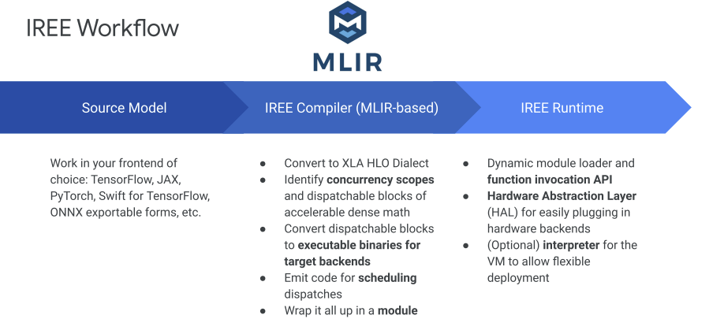

# [IREE] 会议文件

### IREE MLIR-base End-to-End ML Tooling

[20200130-IREE Jan 2020 MLIR ODM- External.pdf](%5BIREE%5D%20%E4%BC%9A%E8%AE%AE%E6%96%87%E4%BB%B6%20ec385beb11a14b319bf0edcdccca6497/20200130-IREE_Jan_2020_MLIR_ODM-_External.pdf)



Scheduling: the ordering, dependency configuration, and timing of execution

Execution: the actual operations being executed on some units

scheduling和execution的联合优化，使得有更大的concurrency和更好的utilization

**Compilation inside IREE**


**IREE FLow Dialect**


### IREE CodeGen

[20200820-IREE CodeGen - Public.pdf](%5BIREE%5D%20%E4%BC%9A%E8%AE%AE%E6%96%87%E4%BB%B6%20ec385beb11a14b319bf0edcdccca6497/20200820-IREE_CodeGen_-_Public.pdf)

1、从MHLO进入IREE的流程


先要得到mhlo dialect

```bash
# pbtxt to tf-executor
$TF_OPT/tf-mlir-translate -graphdef-to-mlir -tf-enable-shape-inference-on-import=false add.pbtxt -tf-input-arrays=input0,input1 -tf-input-data-types=DT_INT32,DT_INT32 -tf-input-shapes=10:10 -tf-output-arrays=Add -o add.mlir
# tf-executor to tf
$TF_OPT/tf-opt -tf-executor-to-functional-conversion add.mlir -o add-func.mlir
# tf to mhlo (hlo)
$TF_OPT/tf-opt --tf-to-hlo-pipeline add-func.mlir -o add-mhlo.mlir
```

```cpp
module attributes {tf.versions = {bad_consumers = [], min_consumer = 0 : i32, producer = 27 : i32}} {
  func.func @main(%arg0: tensor<10xi32>, %arg1: tensor<10xi32>) -> tensor<10xi32> attributes {tf.entry_function = {control_outputs = "", inputs = "input0,input1", outputs = "Add"}} {
    %0 = mhlo.add %arg0, %arg1 : tensor<10xi32>
    return %0 : tensor<10xi32>
  }
}
```

（1）**mhlo dialect to linalg dialect**

将表示element-wise operations的mhlo ops转换为linalg operations on tensor

下面两个指令效果一样

`$TF_OPT/tf-opt add-mhlo.mlir -hlo-legalize-to-linalg -o add-linalg-tensor.mlir`

`$IREE_OPT/iree-opt  --iree-mhlo-to-linalg-on-tensors add-mhlo.mlir -o add-linalg-tensor.mlir`

hlo-legalize-to-linalg pass in TF

- linalg.generic
- linalg.indexed_generic
- linalg.tensor_reshape


```cpp
#map = affine_map<(d0) -> (d0)>
module attributes {tf.versions = {bad_consumers = [], min_consumer = 0 : i32, producer = 27 : i32}} {
  func.func @main(%arg0: tensor<10xi32>, %arg1: tensor<10xi32>) -> tensor<10xi32> attributes {tf.entry_function = {control_outputs = "", inputs = "input0,input1", outputs = "Add"}} {
    %0 = tensor.empty() : tensor<10xi32>
    %1 = linalg.generic {indexing_maps = [#map, #map, #map], iterator_types = ["parallel"]} ins(%arg0, %arg1 : tensor<10xi32>, tensor<10xi32>) outs(%0 : tensor<10xi32>) {
    ^bb0(%in: i32, %in_0: i32, %out: i32):
      %2 = arith.addi %in, %in_0 : i32
      linalg.yield %2 : i32
    } -> tensor<10xi32>
    return %1 : tensor<10xi32>
  }
}
```

（2）**Linalg fusion on tensor**

`$MLIR_OPT/mlir-opt --linalg-fuse-elementwise-ops add-linalg-tensor.mlir  add-linalg-tensor-fusion.mlir`

- Producer/Consumer fusion RewritePattern
    - GreedyPatternRewriter
    - • fuse all producers/consumers (elementwise ops)
- Smaller op surface area + LinalgOp OpInterface
    - achieve elementwise ops + broadcast fusion


```cpp
#map = affine_map<(d0) -> (d0)>
module attributes {tf.versions = {bad_consumers = [], min_consumer = 0 : i32, producer = 27 : i32}} {
  func.func @main(%arg0: tensor<10xi32>, %arg1: tensor<10xi32>) -> tensor<10xi32> attributes {tf.entry_function = {control_outputs = "", inputs = "input0,input1", outputs = "Add"}} {
    %0 = tensor.empty() : tensor<10xi32>
    %1 = linalg.generic {indexing_maps = [#map, #map, #map], iterator_types = ["parallel"]} ins(%arg0, %arg1 : tensor<10xi32>, tensor<10xi32>) outs(%0 : tensor<10xi32>) {
    ^bb0(%in: i32, %in_0: i32, %out: i32):
      %2 = arith.addi %in, %in_0 : i32
      linalg.yield %2 : i32
    } -> tensor<10xi32>
    return %1 : tensor<10xi32>
  }
}
```

（3）**Tensor to Buffer Conversion**

- Tensor ops to linalg buffer ops
    - MHLO ops with reduction/window iterator type.
    - Linalg op on tensors to Linalg op on buffers.
- Requires buffer allocation in general
    - In IREE happens at dispatch region boundary.
    - Avoid additional temporary buffer allocations within dispatch regions.


原本给出的`--iree-codegen-hlo-to-linalg-on-buffers` 已经被弃用，现在还可以直接从 `linalg-on-tensor` 转换为 `linalg-on-buffer` 如下

`$IREE_OPT/iree-opt --linalg-bufferize add-linalg-tensor.mlir -o add-linalg-buffer.mlir`

```cpp
#map = affine_map<(d0) -> (d0)>
module attributes {tf.versions = {bad_consumers = [], min_consumer = 0 : i32, producer = 27 : i32}} {
  func.func @main(%arg0: tensor<10xi32>, %arg1: tensor<10xi32>) -> tensor<10xi32> attributes {tf.entry_function = {control_outputs = "", inputs = "input0,input1", outputs = "Add"}} {
    %0 = bufferization.to_memref %arg1 : memref<10xi32>
    %1 = bufferization.to_memref %arg0 : memref<10xi32>
    %2 = tensor.empty() : tensor<10xi32>
    %alloc = memref.alloc() {alignment = 64 : i64} : memref<10xi32>
    linalg.generic {indexing_maps = [#map, #map, #map], iterator_types = ["parallel"]} ins(%1, %0 : memref<10xi32>, memref<10xi32>) outs(%alloc : memref<10xi32>) {
    ^bb0(%in: i32, %in_0: i32, %out: i32):
      %4 = arith.addi %in, %in_0 : i32
      linalg.yield %4 : i32
    }
    %3 = bufferization.to_tensor %alloc : memref<10xi32>
    return %3 : tensor<10xi32>
  }
}
```

（4）**Linalg Tiling and Fusion**

- Use tiling to map to different levels of processor hierarchy
    - One level of tiling : scf.parallel to workgroups
    - Second level of tiling : scf.parallel to subgroups
    - Map tiled operation to workitems
- Subviews of the tiled operation can be promoted to Workgroup memory
- Fusion
    - At tile granularity using linalg on buffers
    - Convert to vector dialect and fusion using SSA use-def chains.


（5）**Distributing to workgroup/workitems**

- Inter-tile loops distributed to workgroups
    - Second level inter-tile loops distributed to subgroups
- Tiled Linalg operation lowered to loops and distributed to workitems

```python
--iree-codegen-gpu-tile-reduction                                 -   Pass to tile linalg reduction dimensions.
--iree-codegen-gpu-vectorization                                  -   Pass to convert linalg into Vector.
--iree-codegen-reduction-to-gpu                                   -   Convert vector reduction to gpu ops.
--iree-gpu-distribute-shared-memory-copy                          -   Pass to distribute shared memory copies to threads.
--iree-gpu-multi-buffering                                        -   Pass to do multi buffering.
--iree-gpu-pipelining                                             -   Pass to do software pipelining.
--iree-gpu-reduce-bank-conflicts                                  -   Pass to try to reduce the number of bank conflicts
```


（6）**Conversion to SPIR-V dialect**

- Aggregate all the patterns that lower to SPIR-V.
    - Standard to SPIR-V
    - SCF to SPIR-V
    - GPU To SPIR-V (for block_id, thread_id, etc.)
- -convert-gpu-to-spirv 
- Convert GPU dialect to SPIR-V dialect


2、**Linalg to SPIR-V in MLIR**

- Lowering from Linalg to SPIR-V goes through GPU dialect.
- Models both the host side and device side.
- Can allow for optimizations across host and device
    - Propagating to the device side the number of blocks/block size, etc.


[https://discourse.llvm.org/t/use-mlir-iree-for-gpu-codegen/1468](https://discourse.llvm.org/t/use-mlir-iree-for-gpu-codegen/1468)

3、**Linalg to LLVMIR in IREE**

（1）**Progressive lowering Of Linalg to LLVMIR**

- Goal : Efficient single core CPU code (Executables).
- LinalgOps are lowered into a loop nest over scalar arithmetic.
- We use MatMulVectorizationStrategy to control generating SIMD code for matrix-matrix multiplication, the strategy does:
    - Multi-Level hierarchical tiling of linalg.matmul
    - Efficient use of vector ops.
- For the rest of the ops as of now we relies on LLVM auto-vectorization.


（2）**IREE CPU Codegen Compilation / Runtime**

- Translate LLVMIR dialect to LLVM Bitcode.
- Apply LLVM optimization passes.
- Generate executable for the specific
    - LLVM bitcode for jitting runtime
    - A Shared library for AOT dylib runtime.


### IREE Runtime Design

[20210609 - IREE Runtime Design Slides.pdf](%5BIREE%5D%20%E4%BC%9A%E8%AE%AE%E6%96%87%E4%BB%B6%20ec385beb11a14b319bf0edcdccca6497/20210609_-_IREE_Runtime_Design_Slides.pdf)


client/server, asynchronous and modular with careful consideration to use-case-driven optionality


Vulkan是Khronos在2016年的GDC上提出的新一代的图形和计算 API，用于**优化CPU上图形驱动相关的性能**


### IREE: standard-/compilation-based ML stack via Vulkan/SPIR-V

[20220505-IREE_targeting_Vulkan_Zhang_May22.pdf](%5BIREE%5D%20%E4%BC%9A%E8%AE%AE%E6%96%87%E4%BB%B6%20ec385beb11a14b319bf0edcdccca6497/20220505-IREE_targeting_Vulkan_Zhang_May22.pdf)

> IREE: A MLIR-based end-to-end compiler and runtime that lowers ML models to a unified IR that scales up to datacenter and down to mobile and edge deployments
> 


IREE Runtime


