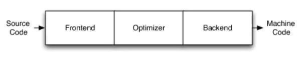
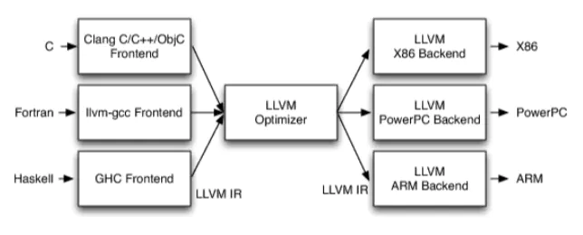
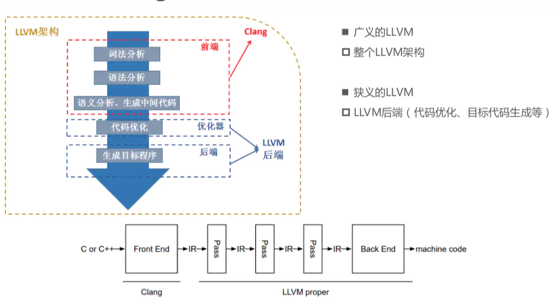
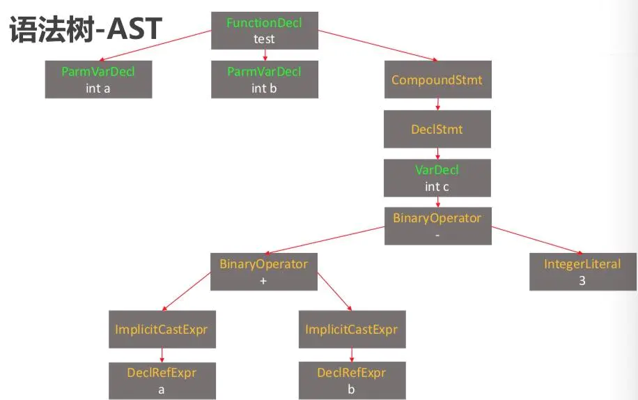

# LLVM

> 定义：LVM项目是模块化、可重用的编译器以及工具链技术的集合.

## 1. 传统的编译器架构



- Frontend:前端

​	==词法==分析、==语法==分析、==语义==分析、==生成中间代码==

- Optimizer:优化器

​	中间代码优化

- Backend:后端

​	生成机器码

## 2. LLVM架构



- 不同的前端后端使用统一的中间代码LLVM ==Intermediate Representation==(LLVM IR)

- 如果需要支持一种新的==编程语言==，那么只需要实现一个新的==前端==
- 如果需要支持一种新的==硬件设备==，那么只需要实现一个新的==后端==
- 优化阶段是一个通用的阶段，它正对的是统一的 ==LLVM IR==，不论是哪种编程语言或那种硬件设备，都不需要对优化阶段进行修改
- 相比之下，GCC的前端和后端没有分得太开，前端和后端耦合在了一起，所以GCC为了支持一门新的语言或者新的目标平台，就变得特别困难

> 相比之下，GCC的前端和后端没有分得太开，前端和后端耦合在了一起，所以GCC为了支持一门新的语言或者新的目标平台，就变得特别困难

- LLVM现在被作为实现各种静态和运行时编译语言的通用基础结构

### Clang

Clang是LLVM项目的一个子项目，是基于LLVM框架的**C/C++/Objective-C编译器的前端**。

**相较于GCC，Clang具有以下优点：**

- 编译速度快
- 占用内存小：Clang生成的AST占有内存只为GCC的五分之一左右
- 模块化设计：Clang采用基于库的模块化设计
- 诊断信息可读性强：在编译过程中，Clang创建并保留了大量详细的元数据，有利于调试和错误报告
- 易于扩展

### Clang和LLVM的关系



clang是llvm整体框架的前端

源代码（c/c++） $\rightarrow$  经过clang $\rightarrow$ 中间代码  $\rightarrow$ 经过一系列的优化（pass） $\rightarrow$ 机器码

## 3. OC源文件的编译过程

Xcode创建一个Test项目，然后cd到main.m的上一路径。
命令行查看编译的过程：$ clang -ccc-print-phases main.m

```cpp
$ clang -ccc-print-phases main.m 

0: input, "main.m", objective-c
1: preprocessor, {0}, objective-c-cpp-output
2: compiler, {1}, ir
3: backend, {2}, assembler
4: assembler, {3}, object
5: linker, {4}, image
6: bind-arch, "x86_64", {5}, image
```

找到main.m文件 $\rightarrow$ 预处理器，处理include、import、宏定义  $\rightarrow$  编译器编译，生成ir中间代码  $\rightarrow$  后端，生成目标代码  $\rightarrow$  汇编  $\rightarrow$  链接其他动态库静态库  $\rightarrow$  编译成适合某个架构的代码

查看preprocessor（预处理器）的处理结果：$ clang -R main.m 

会打印出大量信息

```cpp
# 1 "main.m"
# 1 "<built-in>" 1
# 1 "<built-in>" 3
# 353 "<built-in>" 3
# 1 "<command line>" 1
# 1 "<built-in>" 2
# 1 "main.m" 2
.
.
.
  int main(int argc, const char * argv[]) {
@autoreleasepool {
    NSLog(@"Hello, World!");
}
return 0;
}
```

### 词法分析（生成多个token）

词法分析，生成Token： `$ clang -fmodules -E -Xclang -dump-tokens main.m`

将代码分成一个个小单元（token）

```cpp
void test(int a, int b){
       int c = a + b - 3;
  }
```

生成

```cpp
void 'void'  [StartOfLine]  Loc=<main.m:18:1>
identifier 'test'    [LeadingSpace] Loc=<main.m:18:6>
l_paren '('     Loc=<main.m:18:10>
int 'int'       Loc=<main.m:18:11>
identifier 'a'   [LeadingSpace] Loc=<main.m:18:15>
comma ','       Loc=<main.m:18:16>
int 'int'    [LeadingSpace] Loc=<main.m:18:18>
identifier 'b'   [LeadingSpace] Loc=<main.m:18:22>
r_paren ')'     Loc=<main.m:18:23>
l_brace '{'     Loc=<main.m:18:24>
int 'int'    [StartOfLine] [LeadingSpace]   Loc=<main.m:19:5>
identifier 'c'   [LeadingSpace] Loc=<main.m:19:9>
equal '='    [LeadingSpace] Loc=<main.m:19:11>
identifier 'a'   [LeadingSpace] Loc=<main.m:19:13>
plus '+'     [LeadingSpace] Loc=<main.m:19:15>
identifier 'b'   [LeadingSpace] Loc=<main.m:19:17>
minus '-'    [LeadingSpace] Loc=<main.m:19:19>
numeric_constant '3'     [LeadingSpace] Loc=<main.m:19:21>
semi ';'        Loc=<main.m:19:22>
r_brace '}'  [StartOfLine]  Loc=<main.m:20:1>
eof ''      Loc=<main.m:20:2>
```

可以看出，词法分析时，上面的代码被拆分成一个个token，后面数字表示某一行的第几个字符，例如第一个void，表示18行第一个字符。

### 语法分析（生成AST）

语法分析后生成语法树（Abstract Syntax Tree）：`$ clang -fmodules -fsyntax-only -Xclang -ast-dump main.m`

```cpp
|-FunctionDecl 0x7fa1439f5630 <line:18:1, line:20:1> line:18:6 test 'void (int, int)'
| |-ParmVarDecl 0x7fa1439f54b0 <col:11, col:15> col:15 used a 'int'
| |-ParmVarDecl 0x7fa1439f5528 <col:18, col:22> col:22 used b 'int'
| `-CompoundStmt 0x7fa142167c88 <col:24, line:20:1>
|   `-DeclStmt 0x7fa142167c70 <line:19:5, col:22>
|     `-VarDecl 0x7fa1439f5708 <col:5, col:21> col:9 c 'int' cinit
|       `-BinaryOperator 0x7fa142167c48 <col:13, col:21> 'int' '-'
|         |-BinaryOperator 0x7fa142167c00 <col:13, col:17> 'int' '+'
|         | |-ImplicitCastExpr 0x7fa1439f57b8 <col:13> 'int' <LValueToRValue>
|         | | `-DeclRefExpr 0x7fa1439f5768 <col:13> 'int' lvalue ParmVar 0x7fa1439f54b0 'a' 'int'
|         | `-ImplicitCastExpr 0x7fa1439f57d0 <col:17> 'int' <LValueToRValue>
|         |   `-DeclRefExpr 0x7fa1439f5790 <col:17> 'int' lvalue ParmVar 0x7fa1439f5528 'b' 'int'
|         `-IntegerLiteral 0x7fa142167c28 <col:21> 'int' 3

`-<undeserialized declarations>
```

AST图形化如下显示



### 语义分析（生成中间代码 LLVM IR）

LLVM IR有三种表示形式（本质是等价的）

- text：便于阅读的文本格式，类似于汇编，扩展名 .II， $ clang -S -emit-llvm main.m
- memery：内存格式
- bitcode：二进制格式，扩展名 .bc， $ clang -c -emit-llvm main.m

以text形式编译查看

```cpp
; Function Attrs: noinline nounwind optnone ssp uwtable
define void @test(i32, i32) #2 {
  %3 = alloca i32, align 4
  %4 = alloca i32, align 4
  %5 = alloca i32, align 4
  store i32 %0, i32* %3, align 4
  store i32 %1, i32* %4, align 4
  %6 = load i32, i32* %3, align 4
  %7 = load i32, i32* %4, align 4
  %8 = add nsw i32 %6, %7
  %9 = sub nsw i32 %8, 3
  store i32 %9, i32* %5, align 4
  ret void
}
```

## 4. IR基本语法

注释以分号 ; 开头
 全局标识符以@开头，局部标识符以%开头
 alloca，在当前函数栈帧中分配内存
 i32，32bit，4个字节的意思
 align，内存对齐
 store，写入数据
 load，读取数据
 官方语法参考[LLVM Language Reference Manual — LLVM 16.0.0git documentation](https://llvm.org/docs/LangRef.html)


