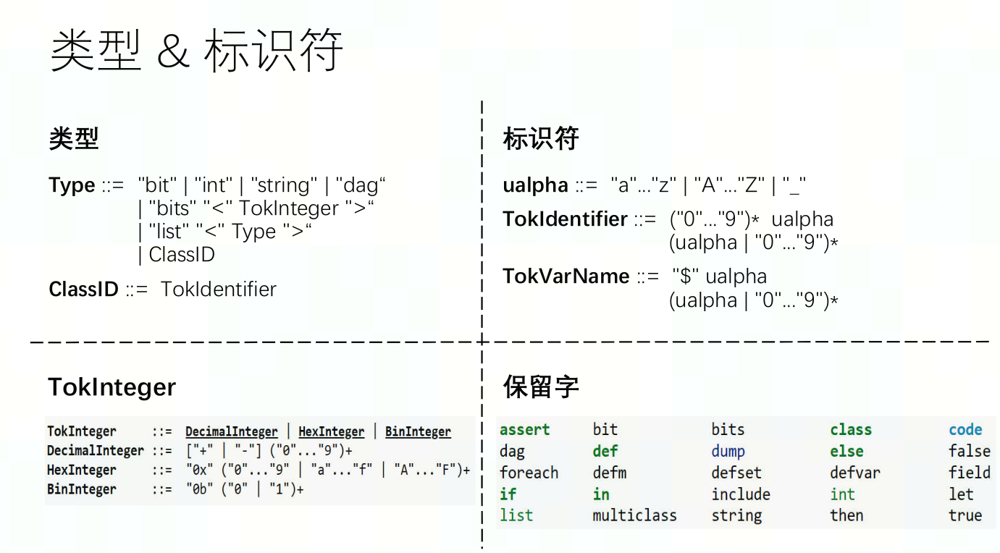

# TableGen

`TableGen` 是一种描述性的语言，用来自动生成 `huge include files with tables`， `.td` 也可以理解成 `target description`。

目前在 `MLIR` 中使用 `TableGen` 的场景主要有注册 `Dialect`、`Operation`、`Pass`，并生成对应的 `.inc` 文件。 见[MLIR_Note中的tablegen使用](../MLIR/MLIR_Note.md#tablegen)

现在有个工作需要为 `RISCV` 扩展新的 `Intrinsic`，所以深入学习下 `TableGen` 的使用。

> 相关文件
> `llvm/include/llvm/IR/IntrinsicsRISCV.td`
> `llvm/lib/Target/RISCV/RISCVInstrInfo.td`
> ...

在LLVM后端中，TableGen用于描述后端相关的信息，如指令编码，寄存器配置，指令调度，指令选择等。

后端相关的TableGen基类定义在 `include/LLVM/Target` 下的 `td` 文件里，其中Target.td定义了机器目标的基本信息基类(Instruction, Register等)，和指令选择相关的基类定义在 `TargetSelectionDAG.td` 中。

而 `llvm/include/llvm/IR/` 下的 `IntrinsicsXXX.td` 一般是定义对应后端的 `Intrinsics`，例如 `IntrinsicsRISCV.td` 定义了 `RISCV` 相关的 `Intrinsics`。

## 环境准备

先按照网上各种教程中编译的方法编译一下，主要注意以下 `cmake` 参数

- `-DLLVM_TARGETS_TO_BUILD` : 这里记得加上 `RISCV`
- `DLLVM_ENABLE_PROJECTS` : 我多加了点 "clang;mlir;compiler-rt"
- `DLLVM_CCACHE_BUILD` : ON
- `DCMAKE_EXPORT_COMPILE_COMMANDS` : ON

编译完成后可以在 `build` 目录下找到 `.td` 文件生成的东西，例如
`llvm/include/llvm/IR/IntrinsicsRISCV.td` 生成了 `build/include/llvm/IR/IntrinsicsRISCV.h` （在对应的 `llvm/include/llvm/IR/CMakeLists.txt` 中有描述关系）。

设置 `DCMAKE_EXPORT_COMPILE_COMMANDS=ON` 后会在 `build` 目录下生成的`compile_commands.json` ，复制到 `llvm-project` 目录下(`mv build/compile_commands.json ./`)，然后配置vscode的clangd插件，方便索引文件：

ctrl + p 输入 clangd，先点击 下载language server；然后 加 settings.json , ctrl + p → '> 打开工作区设置json’

```json
{
    "clangd.arguments": [
        "--header-insertion=never",
        "--compile-commands-dir=${workspaceFolder}/",
        "--query-driver=**",
    ]
}
```

## TableGen基本语法

以 `llvm/include/llvm/IR/IntrinsicsRISCV.td` 文件为例

### let

`let` 是赋值操作符

```c++
let VLOperand = 1;
let TargetPrefix = "riscv";
```

如果很多对象都有同一个赋值行为，可以加一个 `in` 来表示作用域

```cpp
let TargetPrefix = "riscv" in {

  class BitManipGPRIntrinsics
      : DefaultAttrsIntrinsic<[llvm_any_ty],
                              [LLVMMatchType<0>],
                              [IntrNoMem, IntrSpeculatable]>;

  // Zbb
  def int_xxx_orc_b : BitManipGPRIntrinsics;

  // Zbc or Zbkc
  def int_xxx_clmul  : BitManipGPRGPRIntrinsics;
  def int_xxx_clmulh : BitManipGPRGPRIntrinsics;

  // Zbc
  def int_xxx_clmulr : BitManipGPRGPRIntrinsics;

  // Zbkx
  def int_xxx_xperm4  : BitManipGPRGPRIntrinsics;
  def int_xxx_xperm8  : BitManipGPRGPRIntrinsics;
} // TargetPrefix = "riscv"
```

### 类型

<div style="text-align: center;"></div>


```cpp
// llvm/lib/Target/RISCV/RISCVInstrInfo.td
class ImmAsmOperand<string prefix, int width, string suffix> : AsmOperandClass {
  let Name = prefix # "Imm" # width # suffix;
  let RenderMethod = "addImmOperands";
  let DiagnosticType = !strconcat("Invalid", Name);
}

class SImmAsmOperand<int width, string suffix = "">
    : ImmAsmOperand<"S", width, suffix> {
}
// 传入整数 13 和 字符串 "Lsb0"
let ParserMatchClass = SImmAsmOperand<13, "Lsb0">;
```

- string

字符串，两侧加双引号

`let RenderMethod = "addImmOperands";`

- int

整数

- bits

bits是带位宽限制的整数，用于表示指令编码，立即数编码等限长整数。

`bits<13> imm=12312;`

如果 `imm` 超过了 `13` 位，会截断超出位宽的部分。

- code

嵌入一些 `c++` 代码

```cpp
def uimm6gt32 : ImmLeaf<XLenVT, [{
  return isUInt<6>(Imm) && Imm > 32;
}]>;
```

- list

`list<T>` 表示一个 `T` 类型的列表，例如 `list<Register>`

### class

和 `c++` 类似， `.td` 中的 `class` 也可以被实例化和继承。

```cpp
// BitManipGPRIntrinsics 继承自 DefaultAttrsIntrinsic
class BitManipGPRIntrinsics
    : DefaultAttrsIntrinsic<[llvm_any_ty],
                            [LLVMMatchType<0>],
                            [IntrNoMem, IntrSpeculatable]>;
// int_xxx_orc_b 是 BitManipGPRIntrinsics 的实例
def int_xxx_orc_b : BitManipGPRIntrinsics;
```

```cpp
class persionInBJ<string name_, int age_> : Location<"BJ"> {
  string name = name_;
  int age = age_;
  int height = 180;
  bit gender;
}
```

### def

`def` 用于定义一个**记录**。一个记录可以被看做是有名字，有类型，具有特定属性的结构体。每个记录的名字是唯一的。

```cpp
def rec{
	int a=1;
	string b="tbl is fun";
}
```

一个 `class` 可以看为是一个抽象的记录，`def` 可以看为是一个具体的记录。所以 `def` 实例化 `class`。

```cpp
class MyInstr{
	string asmname;
	bits<32> encoding;
}
def ADD: MyInstr{
	let asmname="add";
	let encoding{31-26}=1;
}
```

注意 `Intrinsics` 相关的名称需要以 `int_` 开头。

```cpp
// 定义
// llvm/include/llvm/IR/IntrinsicsRISCV.td
class BitManipGPRIntrinsics;
def int_xxx_orc_b : BitManipGPRIntrinsics;

// 编译后生成的代码
// build/include/llvm/IR/IntrinsicsRISCV.h
namespace Intrinsic {
enum RISCVIntrinsics : unsigned {
  ...
  xxx_orc_b, // llvm.riscv.orc.b
```

### multiclass 和 defm

如果指令根据操作数类型不同，下降时有不同的处理行为，例如一般i32和i64的指令处理可能不同，就需要定义很多相似的指令。

TableGen提供了`multiclass`和`defm`让我们可以一次性定义多条相似指令。
> multiclass只是TableGen提供的一种创建多个记录的快捷方式，它本身并不是类。

```cpp
// llvm/include/llvm/IR/IntrinsicsRISCV.td
class MaskedAtomicRMWFourArg<LLVMType itype>
    : Intrinsic<[itype], [llvm_anyptr_ty, itype, itype, itype],
                [IntrArgMemOnly, NoCapture<ArgIndex<0>>, ImmArg<ArgIndex<3>>]>;

// We define 32-bit and 64-bit variants of the above, where T stands for i32
// or i64 respectively:
multiclass MaskedAtomicRMWFourArgIntrinsics {
  // i32 @llvm.<name>.i32.<p>(any*, i32, i32, i32 imm);
  def _i32 : MaskedAtomicRMWFourArg<llvm_i32_ty>;
  // i64 @llvm.<name>.i32.<p>(any*, i64, i64, i64 imm);
  def _i64 : MaskedAtomicRMWFourArg<llvm_i64_ty>;
}

// @llvm.riscv.masked.atomicrmw.*.{i32,i64}.<p>(
//   ptr addr, ixlen oparg, ixlen mask, ixlenimm ordering)
defm int_xxx_masked_atomicrmw_add : MaskedAtomicRMWFourArgIntrinsics;
defm int_xxx_masked_atomicrmw_sub : MaskedAtomicRMWFourArgIntrinsics;
```

其中:
- `multiclass` : 定义具有两种数据类型的atomic指令
- `defm` : 实例化 `multiclass` 中所有的记录，每个记录名称为 `defm` 的名字和 `multiclass` 中的 `def` 的名字相拼接，如

  ```cpp
  // build/include/llvm/IR/IntrinsicsRISCV.h
  namespace Intrinsic {
  enum RISCVIntrinsics : unsigned {
    ...
    xxx_masked_atomicrmw_add_i32, // llvm.riscv.masked.atomicrmw.add.i32
    xxx_masked_atomicrmw_add_i64, // llvm.riscv.masked.atomicrmw.add.i64
    ...

  // 下降代码中直接使用 `Intrinsic::xxx_masked_atomicrmw_add_i32` 对象
  ```

### defvar

`defvar` 用于定义一个变量。

- 不直接定义域
- 同一作用域内不能重复定义
- 必须有初值，自动推导类型

### foreach

`foreach` 用于遍历一个列表，作用在 `in` 后的语句块内，生成多个记录。

```cpp
// llvm/include/llvm/IR/IntrinsicsRISCVXsf.td
multiclass RISCVSFCustomVC_XV<list<string> type> {
  foreach t = type in {
    defvar ImmScalar = !eq(t, "i");
    def "int_xxx_sf_vc_" # t # "v_se"   : RISCVSFCustomVC_XV<HasDst=0, HasSE=1, ImmScalar=ImmScalar>;
    def "int_xxx_sf_vc_v_" # t # "v_se" : RISCVSFCustomVC_XV<HasDst=1, HasSE=1, ImmScalar=ImmScalar>;
    def "int_xxx_sf_vc_v_" # t # "v"    : RISCVSFCustomVC_XV<HasDst=1, HasSE=0, ImmScalar=ImmScalar>;
  }
}
```

```cpp
multiclass GradeRecords<string name, list<int> grades> {
  def NAME#_C: Person<name>, Grade<grades[0]>;
  def NAME#_M: Person<name>, Grade<grades[1]>;
  def NAME#_E: Person<name>, Grade<grades[2]>;
}

-> 等价于

multiclass GradeRecords<string name, list<int> grades> {
  defvar clses = ["C", "M", "E"];
  foreach i = 0..2 in {
    def _#clses[i]: Person<name>, Grade<grades[i]>;
  }
}
```

### if

根据 value 判断选择执行的语句块

```cpp
if !lt(grades[i], 60) then {
  def _#clses[i]: Person<name>, Grade<grades[i]> {string level = "fail"; };
} else {
  def _#clses[i]: Person<name>, Grade<grades[i]>;
}
```
## 实例

### 参数类型

常见的参数类型有：

- 整数
  - llvm_i8_ty, llvm_i16_ty, llvm_i32_ty, llvm_i64_ty
  - llvm_anyint_ty : 任意整数
  - `llvm_i32_ty` 一般可以用来表示 `imm` 或 `Int32Regs`

- 浮点
  - llvm_half_ty, llvm_float_ty, llvm_bfloat_ty

- 地址
  - llvm_ptr_ty : 任意指针

例如：一个BinaryOp的Intrinsic，可以定义为

```cpp
  class XXXIntrinsic<string name>
    : Intrinsic<[], [llvm_ptr_ty, llvm_ptr_ty, llvm_ptr_ty, llvm_i32_ty],
                []>,
      ClangBuiltin<"__XXX_" # name>;
```

其中 `[llvm_ptr_ty, llvm_ptr_ty, llvm_ptr_ty, llvm_i32_ty]` 分别表示 `addr $dst,addr $lsh, addr $rsh, Int32Regs $size`。

- 读写属性
  - `IntrReadMem`, `IntrWriteMem`, `IntrNoMem`

### multiclass + foreach + defm

```cpp
multiclass XXXBinaryOp {
  defvar DataTypes = ["u8", "s8", "u16", "s16", "u32", "s32", "f16", "f32", "bf16"];
  defvar LLVMTypes = [llvm_i8_ty, llvm_i8_ty, llvm_i16_ty, llvm_i16_ty, llvm_i32_ty, llvm_i32_ty, llvm_half_ty, llvm_float_ty, llvm_bfloat_ty];
  foreach i = 0...8 in {
    // Scalar operations
    def "int_xxx_scalar_binary_" # NAME # _#DataTypes[i] : ScalarBinary<NAME # _#DataTypes[i], LLVMTypes[i]>;
    // Vector operations
    def "int_xxx_vector_binary_" # NAME # _#DataTypes[i] : VectorBinary<NAME # _#DataTypes[i]>;
  }
}

defm add : XXXBinaryOp;
```

## 参考
[TableGen Overview](https://llvm.org/docs/TableGen/index.html)
[LLVM后端：TableGen简易入门](https://zhuanlan.zhihu.com/p/625227861)
[快速入门TableGen](https://csstormq.github.io/blog/LLVM%20%E4%B9%8B%E5%90%8E%E7%AB%AF%E7%AF%87%EF%BC%881%EF%BC%89%EF%BC%9A%E9%9B%B6%E5%9F%BA%E7%A1%80%E5%BF%AB%E9%80%9F%E5%85%A5%E9%97%A8%20TableGen)