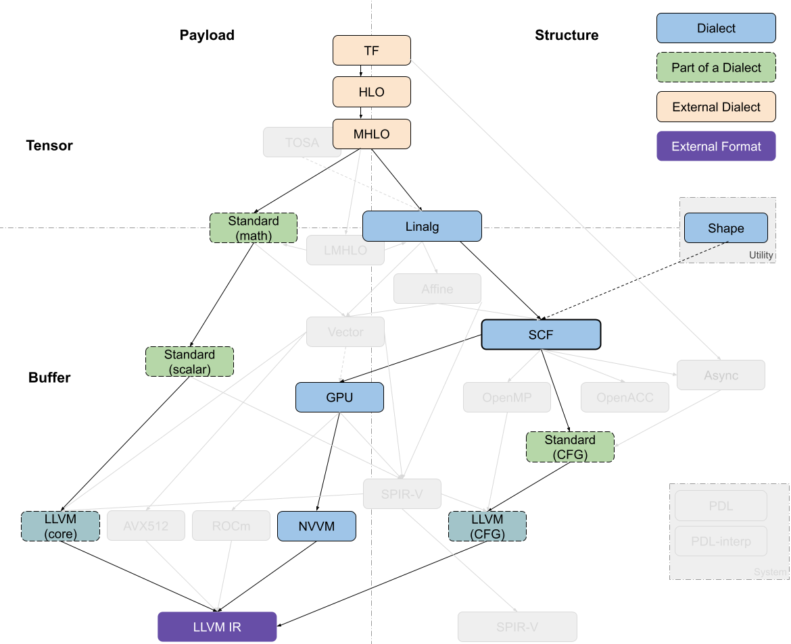

# MLIR再深入 —— CodeGen 总结

## 前言

最近学习了 MLIR 的  [Toy Tutorial ](https://mlir.llvm.org/docs/Tutorials/Toy/#:~:text=Toy Tutorial Docs 1 Chapter 1%3A Toy Language,Chapter 7%3A Adding a Composite Type to Toy)，并且整理了两篇相关博客。

[MLIR初识 —— Dialect及Operation详解 - 知乎 (zhihu.com)](https://zhuanlan.zhihu.com/p/582517107)

[MLIR深入 —— 转换流程详解(以Toy接入为例) - 知乎 (zhihu.com)](https://zhuanlan.zhihu.com/p/582635481)

在我的第二篇博客较为详细地介绍了 Toy语言 接入 MLIR，经过多次 pass，最后 lower 成 LLVM IR的流程。但 Toy 接入 MLIR 流程本质上还是高级语言的转换流程，对于深度学习框架接入 MLIR 后的 CodeGen 描述较少。

本文主要以 tensorflow 为例，介绍了其接入 MLIR 后的 CodeGen 过程，以及简要分析了一些现在常用的 CodeGen pipeline。本文是本人在结合博客([Codegen Dialect Overview - MLIR - LLVM Discussion Forums](https://discourse.llvm.org/t/codegen-dialect-overview/2723))以及相关资料而写成，主体内容来源于翻译。

## 现状

### Classification

MLIR 中与代码生成相关的 dialects 大致可以沿着两个轴进行分解：`tensor/buffer` 和 `payload/structure`。

dialect 在 tensor/buffer 轴上的分解可以体现出它主要的数据抽象形式，要么是 ML 框架中的 tensor，要么是传统低级编译器预期的 memory buffer。tensors 被视为不一定与内存相关联的不可变值 (immutable values)，也就是说，**对 tensor 的操作通常不会产生副作用 (side effect)**。此类操作之间的数据流可以使用基于 [SSA(static single assignment)](https://dl.acm.org/doi/abs/10.1145/115372.115320) 格式的用户自定义链(use-definition chains )进行表达。这使得张量操作的重写变得更加简易可行，也是为什么 MLIR 能称为 ML 程序的强大转换工具。另一方面，buffer 是可变的，可能会受到混叠的影响（多个对象可能指向同样的底层存储位置）。这种情况下，数据流只能依据额外的依赖关系和别名分析(aliasing analyses)来提取。tensor 抽象和 buffer 抽象之间的转换由 `bufferization` 过程来实现，该过程会逐步将两类抽象关联起来，并最终完成替换。一些 dialects（如Linalg和Standard）既有对 tensor 的操作，也有对 buffer 的操作，甚至 Linalg Dialect 中的一些操作可以同时对 tensor 和 buffer 进行处理。

dialect 在 payload/structure 轴上的分解可以体现出，它是描述应该执行怎样的操作(payload)，还是描述应该如何执行(structure)。举例来说，在 Standard Dialect 中许多数学操作指定了要执行的计算（e.g., the arctangent, without further detail）。而 SCF Dialct 中定义了如何执行包含的计算（e.g.， repeated until some runtime condition is met）。类似的，Async Dialect 表示适用于不同负载粒度(payload granularity)级别的通用执行模型。

dialect 在上述轴上的分解并不是二进制表示的，尤其对于那些更高的抽象级别。许多操作会多多少少都指定了结构(structure)。例如， vector dialect 的操作意味着 SIMD 执行模型。在编译过程中，“如何执行”的描述会越来越详细并且用用低级表述。同时，抽象堆栈的较低层级倾向于将structure操作和payload操作分开，以便在仅仅转换structure操作的同时，又保留对payload操作的抽象理解。

### Dialects of Interest

MLIR 代码生成管道(code generation pipeline)需要经过一系列中间步骤，这个步骤的特点就是使用最近引入的 dialect，例如从高级别的 tensor 表示，到低级别（贴近硬件层面）的 buffer 表示。

dialects 可以根据其 feature 的抽象级别 粗略地组织到一个堆栈中。将较高级别的抽象表示 lower 到较低级别的抽象表示通常较为简单，但反过来就不是这样了。

>   在编译器一系列转换程序的过程中，越来越多的高层次的简明信息被打散，转换为低层次的细碎指令，这个过程被称为代码表示递降`lowerinng` ，与之相反的过程被称为代码表示递升`raising` 。raising远比lowering困难，因为需要在庞杂的细节中找出宏观脉络。

大多数 pipeline 通过 [Linalg Dialect](https://mlir.llvm.org/docs/Dialects/Linalg/) 进入 in-tree dialect  的基础设施， linalg dialect 中，基于结构化数据对结构化计算使用了通用的表示形式(a versatile representation of structured computation on structured data)。这种 dialect 是为了转换(transformations)而专门设计出来的，只需要很少量的分析就可以完成转换；并且它同时支持 tensor 和 buffer 作为操作数，bufferization 过程（实现tensor到buffer的转换）也可以在不改变操作本身完成。此外， Linalg Dialect 提供了具有特定负载的 [“named” operations ](https://mlir.llvm.org/docs/Dialects/Linalg/#named-payload-carrying-opsa-namenamed_opsa)（如：矩阵乘法和卷积），也提供了用于定义 structure 的 [“generic” operations](https://mlir.llvm.org/docs/Dialects/Linalg/#payload-carrying-opsa-namepayload_opsa)。这两种形式之间可以互相转换。Linalg Dialect 的迭代结构允许它们转换为向量(vector)操作，以及基于向量或标量操作的(仿射，Affine Dialect)循环。

[Async Dialect](https://mlir.llvm.org/docs/Dialects/AsyncDialect/) 实现了一个通用的异步编程模型，在不同的级别都有相关的表示。在较高的（抽象）级别上，它被用于在跨设备和设备内部 组织大型计算块(chunks of computation)；在较低的（抽象）级别上，它被用于包装原语(primitive)指令序列。

[Vector Dialect](https://mlir.llvm.org/docs/Dialects/Vector/#positioning-in-the-codegen-infrastructure) （注：vector类型属于内置dialect，可以在其他dialect中使用）是 SIMD 或 SIMT 执行模型的中级抽象。它利用了 MLIR 的多维向量类型，通过专用的 lower-level dialects 来实现兼容不同的后端。当前有一项工作研究了 通过线程的显式表示将向量抽象用于目标GPU设备(SIMT)。

[Affine Dialect](https://mlir.llvm.org/docs/Dialects/Affine/) 是 MLIR 对多面体编译([polyhedral compilation](https://en.wikipedia.org/wiki/Polytope_model))的一种尝试。它封装了相关编程模型的限制(restrictions)，并定义了相应的操作，即控制流结构，例如仿射循环和条件以及内存操作的仿射对应项。主要是为了实现多面体编译，如自动并行化、用于局部改进的循环融合和平铺，以及 MLIR 中的循环向量化。

 [SCF Dialect](https://mlir.llvm.org/docs/Dialects/SCFDialect/)（Structured Control Flow Dialect）包含了通用控制流概念，这些概念是比控制流图（CFG）中的分支 更高级别的表达，例如，(并行)“for”和“while”循环以及条件语句。SCF Dialect 用于表示（有时转换）计算的结构，且不会影响有效载荷。它也是 Affine Dialect 和 Linalg Dialect 的常见 lowering 目标，也可以用作从较低级别表示（如 C语言）**接入 MLIR CodeGen 基础设施的入口点**。

从 SCF Dialect 中可以获得各种编程模型，例如GPU/SIMT、Async、OpenMP和OpenACC。每个模型都由相应的 dialect 表示，dialect中的操作一般不会受到 进一步优化转换(further optimizing transformations)的影响 。然而，这些表示是实现特定于编程模型的转换的机会，目前正在探索对 Async Dialect 的转换。

SCF 也可以通过用 blocks之间的分支 替换 结构化控制流 来转换为 Standard CFG 表示。Standard Dialect 包含了分支操作(branch operations)以及各种抽象级别上的许多其他操作，例如，对 tensors 和 vectors 的点操作、buffers 和 tensors 之间的转换操作、标量的三角运算 等。因此 [Standard Dialect 正在被分为多个明确定义的dialect](https://discourse.llvm.org/t/rfc-splitting-the-standard-dialect/2312)。

最终，Standard Dialect 的部分(标量和向量的操作，以及分支)被转换为 target-specific dialect，这些 dialect 主要作为**接入 MLIR CodeGen 基础设施的出口点**。这些出口点包括[LLVM](https://mlir.llvm.org/docs/Dialects/LLVM/)、[NVVM](https://mlir.llvm.org/docs/Dialects/NVVMDialect/)、 [ROCDL](https://mlir.llvm.org/docs/Dialects/ROCDLDialect/)、[AVX](https://mlir.llvm.org/docs/Dialects/LLVMAVX512/)、[Neon](https://mlir.llvm.org/docs/Dialects/LLVMArmNeon/)、[SVE](https://mlir.llvm.org/docs/Dialects/LLVMArmSve/) 和 [SPIR-V](https://mlir.llvm.org/docs/Dialects/SPIR-V/) dialects，所有这些方言都对应于外部格式、IR（例如LLVM Dialect转换为LLVM IR）或指令集，除了规范化(canonicalization)之外，这些方言不需要进行转换。

最后， [Shape Dialect](https://mlir.llvm.org/docs/Dialects/ShapeDialect/)被用于描述独立于有效载荷或（大部分）结构的数据形状，它出现在CodeGen pipeline 的入口处，通常被 lowering 到地址算术或规范化。

[PDL Dialect](https://mlir.llvm.org/docs/Dialects/PDLOps/) (Pattern Description Language) 和 [PDLInterp Dialect](https://mlir.llvm.org/docs/Dialects/PDLInterpOps/) 被用作下一代 MLIR 的特定转换pattern-rewriting 的基础设施，因此，它们从不出现在 CodeGen pipeline 中，但在描述其操作时可能是必要的。

## 一些现存的 pipelines

### TensorFlow Kernel Generator

Tensorflow Kernel Generator项目，从TensorFlow（TF）Dialect开始，最近已经转向从 [MHLO ](https://github.com/tensorflow/mlir-hlo#meta-hlo-dialect-mhlo)去生成 `Linalg-on-tensors`，并在 Linalg 上调用 bufferization 之前，在该级别上执行融合。进一步的循环转换(loop transformations)(如tiling)发生在 SCF Dialect 级别，然后转换为 target-specific GPU dialect；而有效负载操作(payload operations)则先转换为 Standard Dialect 再转换为 LLVM Dialect。在现在已经不用的 prototypes 中尝试过 使用 LMHLO Dialect 去生成 `Linalg-on-buffers`，并在 SCF 上执行所有转换，但 SCF 中的转换比张量抽象更复杂。

在生成多个内核时，与 tensorflow 相关的流将使用 Async Dialect 来编排计算。

>   MHLO 是 Meta HLO，由于像隐式广播移除等特性，更适合编译，并支持动态形状，其中 HLO 是高级优化器表示，源自XLA
>
>    [LMHLO](https://github.com/tensorflow/mlir-hlo#lmhlo) 是 Late MHLO，与 MHLO 相同，但在 buffers 而不是 tensors 上

### IREE Compiler (LLVM Target)

[IREE](https://github.com/google/iree#iree-intermediate-representation-execution-environment)(Intermediate Representation Execution Environment)具有它自己的高级表示以及一组 dialects，从代码生成的目的来说，这些 dialects 正在向 Linalg-on-tensors 的方向发展。IREE-specific dialects 主要用于组织计算有效载荷，目前可以表示为MHLO、TOSA(Tensor Operator Set Architecture)、Linalg-on-tensors等。大多数转换都发生在 Linalg Dialect 中，在 tensor 或者 buffer 级别，以及 bufferization 过程(tensor向buffer转换)。执行文件的首选路径是lower到 Vector Dialect，在这里可以进行额外的转换。当从 Linalg Dialect 往下 lowering 时，SCF 可用于围绕向量操作的控制流(control flow around vector operations)，但对这些操作不执行任何转换。去生成 SCF Dialect 本质上意味着不再进行进一步的结构优化。Vector Dialect 可以逐步 lower 到复杂度较低的抽象，直到最终生成 LLVM Dialect。

### IREE Compiler (SPIR-V Target)

[SPIR-V](https://mlir.llvm.org/docs/Dialects/SPIR-V/)(Standard Portable Intermediate Representation, [Khronos group](https://www.khronos.org/spir/) standard.)是IREE编译器的主要目标。顶层流程类似于上一节中生成 LLVM IR 的流程，大多数转换都发生在 Linalg-on-tensor 和 Vector 级别上。从这里开始，lowering 倾向于直接转到 SPIR-V ，SPIR-V 具有一组跨越多个抽象级别的丰富操作集，操作集中包含：高级操作、结构化控制流和类指令的原语(high-level operations, structured control flow and instruction-like primitives)。该流程通过 GPU Dialect 进行 device-only operations，如工作项标识符提取，并依赖 IREE 的 runtime 来管理 GPU 内核。

支持Interl GPU可以使用SPIR-V，然后使用SYCL Runtime

> SPIR-V 最初发布于 2015 年。SPIR-V 是多个 Khronos API 共用的中间语言，包括 Vulkan, OpenGL, 以及 OpenCL。
>
> Khronos Group 的标语是“连接软件与硬件”，简明扼要地总结了它的任务。这种连接是通过标准规范 (standard) 和编程接口。Khronos Group 定义标准规范以及编程接口；硬件厂商提供它们的硬件实现，软件厂商则可以让软件在所有支持的平台与设备上运行。Khronos Group 定义维护了很多标准规范，比较著名的有 Vulkan, OpenGL, 以及 OpenCL。
>
> SPIR-V 支持通过多种机制来扩展其功能，包括添加新的枚举值, 引入新的扩展 (extension)，或者通过某个命名空间引入一整套指令 (extended instruction set)。其扩展也分为不同等级——厂商自有扩展 (vendor specific)、多厂商联合支持的扩展 (EXT)、 以及 Khronos 级别的扩展 (KHR)。

最近的一些工作实现了 允许 IREE 从 Vector Dialect 转换到 GPU Dialect，将 GPU 线程暴露为向量通道(在warp或block级别)。类似地，有些工作中实现了 绕过中间阶段，直接从 Linalg 和 Vector 转换到 SPIR-V，但可能会被渐近式的 lowering 方法取代。

### Polyhedral Compiler

多面体编译流是从 HLO 开始，通过转换来自 LMHLO 的 Affine Dialect 或者其他 bufferized 形式的操作来实现，并不会 lower 到 Linalg。Affine Dialect 是多面体变换目前支持的主要抽象，大多数转换都发生在这种 dialect 上。之后代码被 lower 到  SCF control flow 和 Standard memory operations，再进一步转换为 platform-specific 抽象，如 OpenMP 或 GPU。

多面体模型还支持早期的 vectorization，主动从 Affine control flow 构造到 Vector Dialect，与后面发展的 loop vectorization 区分开。

对于多面体编译器来说，能够接受以较低级抽象(如C编程语言)表示的代码一直是非常重要的。目前可以通过逐步raising来实现。

## 分析

### Crossing Dialects

事后看来，上文中一直提及的跨越(`tensor/buffer` 和 `payload/structure`)轴边界的 dialects （GPU、Linalg和Vector）还需要更多的讨论和迭代，以确定其是否适合被接受为转换操作的核心部分。即便以当下来说，使用 MLIR 的用户也反馈过“某些 dialects 的定位不够明确”。例如，IREE Complier 使用 GPU Dialect 中与 on-device execution 相关联的部分，并不使用 管理数据以及来自主机的内核相关(managing data and kernels from the host)的部分。IREE Complier 所使用的 GPU Dialect 部分与 structure 关系更加密切，与 payload 的关联度较差。类似的，将 tensor 和 memref 两种抽象与相应的操作连接起来的研究还远远没有完成（上文中提及的tensor和buffer可以使用bufferization过程实现）。

这就表明，如果将新的 dialects 或者是较小的 IR 概念能够明确 它们在其他 dialects 和设计空间的定位，那么这些 dialects 就能更轻易地完成转换。当有必要跨越抽象之间（如tensor和buffer）的鸿沟时，最好单独处理它们，并以在不同 dialects 之间泛化为目标(如bufferization)。

### Linalg at the Center

Linalg  Dialect 是 MLIR CodeGen pipeline 的主要入口点之一。它可以同时作用于 tensor 和 buffer 抽象，并且可以使用 bufferization 在 dialect 内部完成这两种抽象的转换。在 Linalg Dialect 内部有足够的高层级操作信息帮助转换，而不需要过多的分析，尤其是将 tensor 作为值进行操作时。一些转换，如 fusion 和 tiling ，以及将它们结合起来生成不完全嵌套的计算(imperfectly nested computations)，可以获得足够数量的转换方式，以此来应对广泛后端架构。

当用户开始依赖于 Linalg Dialect 进行转换时，几乎所有的 compilation pipeline 通过 Linalg Dialect，这无疑增加 Linalg 的维护压力和稳定性要求。事实上，理解 Linalg 在某种程度上是理解任何 MLIR CodeGen pipeline 的必要条件，因为它跨越 tensor 和 buffer 两种抽象进行工作，并且可以同时获得有效负载和计算结构(the payload and the structure of the computation)的信息。但是，不可以过度地为 Linalg 设计转换算法，将 Linalg Dialect 和其他 dialects 结合起来使用才是正确之道。

### Pipeline Differences to Complementary Transformations

上文中的 pipeline 生态中有一些并行编译 pipeline，尤其适用于以 GPU 为目标的生成过程。在这种生成过程中，优化转换(optimizing transformations)、并行检测(parallelism detection)和设备映射决策(device mapping decisions)可以在不同的 dialects（Linalg、Affine、SCF）中发生，但在这些 dialects 中都会重写彼此实现过的一些功能。以设备映射决策为例，在 SCF Dialect 中，使用从 explicit loops 映射到 SIMT threads；在 Vector Dialect 中，使用从 verctors 映射到 SIMT threads。最后，GPU 库还支持一些更高级的操作，如收缩和卷积，这些操作可以从 CodeGen pipeline 的入口点直接生成它们。

综上，我们需要利用 pipeline 的差异，将它们结合起来实现转换，避免重复实现相同的功能，而不是构建独立的 parallel flows。domain-specific compilers 和 target-specific compilers 效用是不可否认的，但是我们需要更多的 cross-cutting 表示，以此来充分使用属性和接口的通用机制。以将 GPU 作为生成目标为例，设备映射策略表示为 (attributes that can be attached to different operations)附加到不同操作（如Linalg generics 或 parallel SCF loops）的属性，这些操作可以通过接口进行转换，而无需知道特定操作的详细信息。

### Build Small Reusable Abstractions

我们发现，在 GodeGen pipeline 内 较高层次抽象的转换过程中，并不需要复杂的分析就可以获得必要的有效性信息。然而，更高层次抽象通常对可表示的内容有严格的限制。在利用这种优点的同时，要明白它们的表达性有限（意味着可优化的程度有限），需要多结合在较低层次的转换。如此，在不重新实现顶层抽象的情况下，可以快速提升表达性，例如 DHLO 中的动态形状。

>   **DHLO IR**，是在XLA的HLO IR基础上，扩展了一套具有完备动态shape表达能力的IR。静态场景下，HLO IR中的shape表达会被静态化，所有的shape计算会被固化为编译时常量保留在编译结果中；而在动态shape场景下，IR本身需要有足够的能力表达shape计算和动态shape信息的传递。

### Need for More Structure

我们还发现，许多 dialect 和 逐步 lowering 执行不会离开 dialect 的边界。例如 Linalg Dialect 中基于 tensor 的操作 转换为 buffer，GPU Dialect 中 block reductions 操作 分解为 shuffle，以及 Standard Dialect 中的数学运算 扩展为更小的运算或使用其他标准运算近似，都是在其 dialect 内部完成。从上面表述可以看出，现在一种 dialect 可以包含多个松散连接的操作子集，也便有人提出将 Standard Dialect 拆分为多个部分的构想。然而，这种拆分并不是在所有 dialect 中都适用的，Linalg Dialect 中的一些操作既可以接受 tensor 也可以接受 buffer 作为其输入，所以拆分 TLinalg(Linalg-on-tensors) 和 BLinalg(Linalg-on-buffers)是没有必要的。

### Host/Device Or Program/Kernel As Additional Axis

最后，在较大的范围内（主要与 ML 相关）使用 MLIR 来实现相关流程，得到的反馈能够帮助 MLIR 提升，例如：实现 在 与计算的整体组织 和 单个计算的组织 有关的方面之间 进行更清晰的分离 。

>举例：
>
>计算的整体组织(the overall organization of computations)：在分布式系统上反映模型映射的操作，以及与嵌入 MLIR 的框架的交互，通常在"host"上
>
>单个计算的组织(organization of individual computations)：与"kernel"或另一个大型计算单元的内部对应的操作，可能卸载到一个"device"
>
>对于"host"部分，代码生成可能也是必要的，并且通常需要不同于"kernel"部分的转换

这种分离在 GPU Dialect 体现在，dialect 中包含从"host"控制执行的操作和在 GPU 上执行的操作，或许将其分解为独立的 dialect 会提升性能。这种分离在 Async Dialect 体现在，dialect 既组织独立的"kernel"的执行，也通过生成 LLVM coroutines 在"kernel"内并行执行。

## END

最后附上一张较新的流程图([来源](https://discourse.llvm.org/t/rfc-updated-mlir-dialect-overview-diagram/64266))

**上一篇：**[MLIR深入 —— 转换流程详解(以Toy接入为例) - 知乎 (zhihu.com)](https://zhuanlan.zhihu.com/p/582635481)

