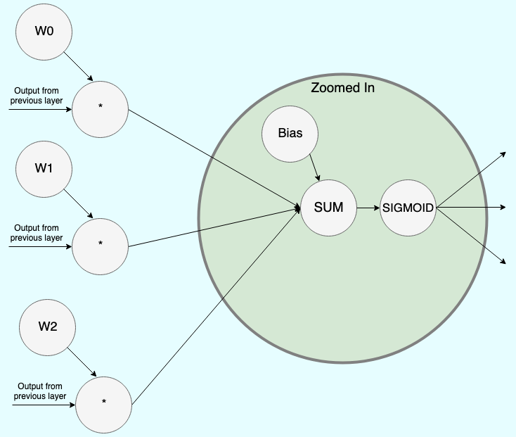
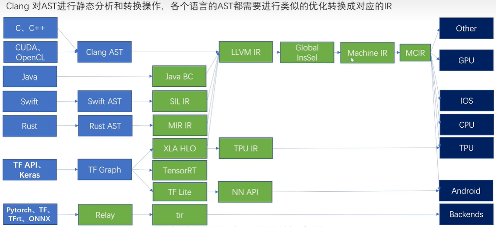
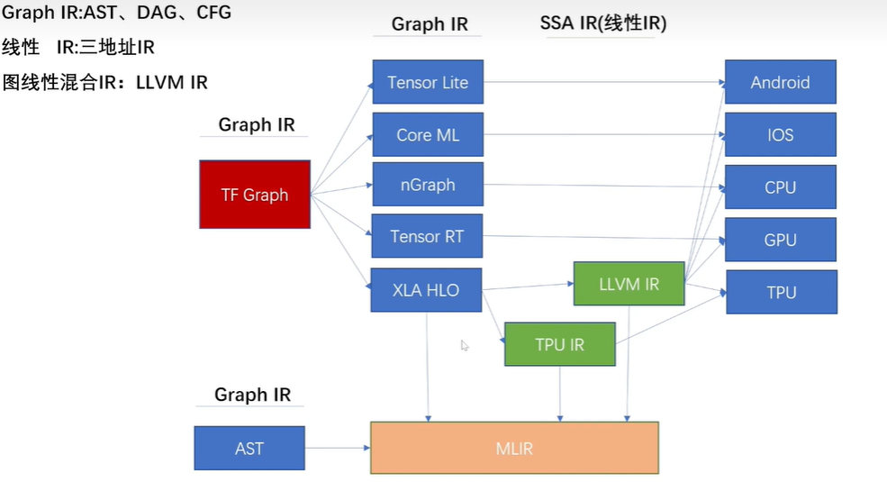
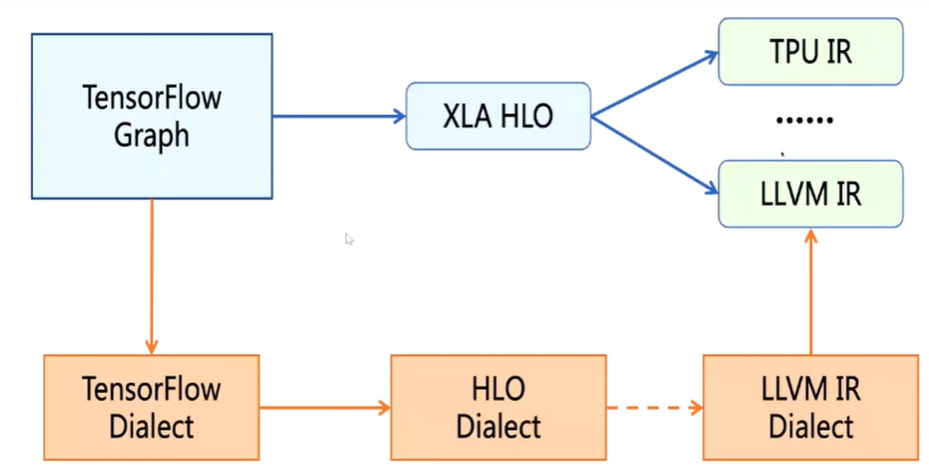
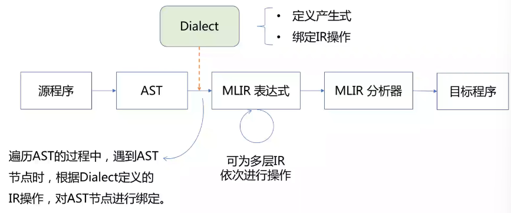
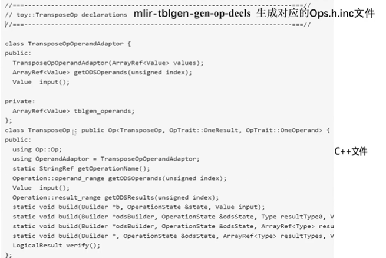
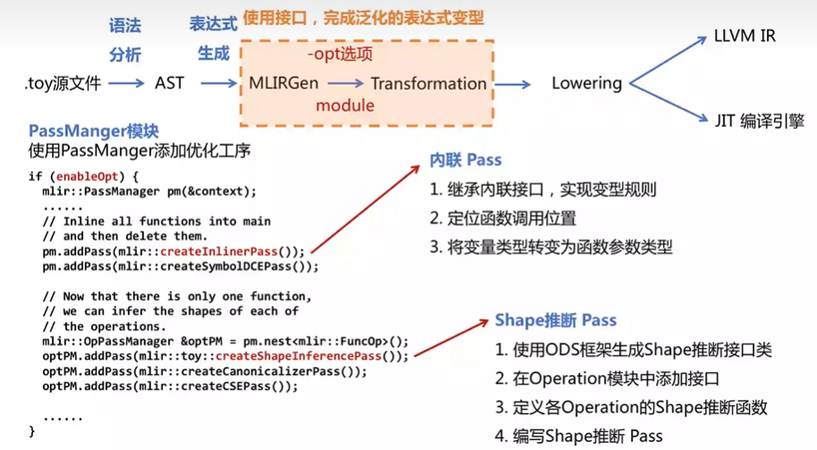
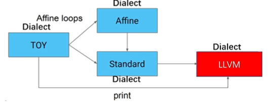
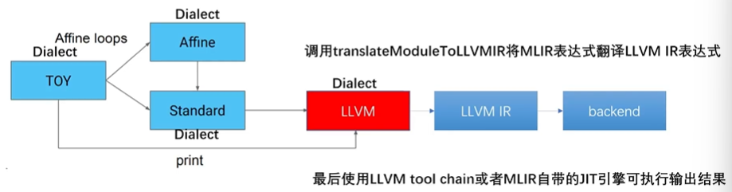
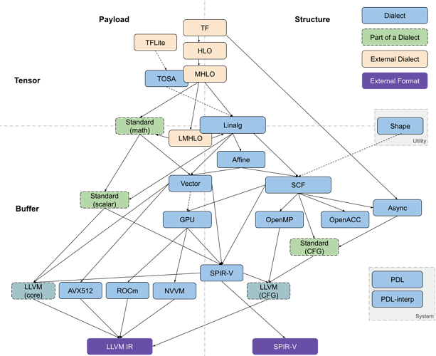

# MLIR 一文足以

论文链接： [MLIR: A Compiler Infrastructure for the End of Moore's Law ](https://arxiv.org/abs/2002.11054)

## 1. MLIR简介

MLIR 全称是 Multi-Level Intermediate Representation (多级中间表示)，是一种全新的编译器框架。

### 1.1 IR是什么

IR即 Intermediate Representation，可以看作是一种数据格式，作为从端到端转换中的中间表示。例如深度学习模型一般表示为**计算图**，能够表示计算图的数据结果就可以称为一种IR，例如`ONNX`、`TorchScript`、`TVM Relay`等等。



-   ONNX(Open Neural Network Exchange) : ONNX 协议首先由微软和Meta提出，它定义了一组和环境、平台均无关的标准格式（如算子功能）。在训练完成后可以将支持框架(Pytorch、Tensorflow等)的模型转化为 ONNX 文件进行存储，ONNX 文件不仅存储了神经网络模型的权重，也存储了模型的结构信息以及网络中每一层的输入输出等信息。
-   TorchScrpit : PyTorch 最大的卖点是它对动态网络的支持，比其他需要构建静态网络的框架拥有更低的学习成本。但动态图模式在每次执行计算时都要重新构造计算图，非固定的网络结构给网络结构分析并进行优化带来了困难。TorchScript 就是为了解决这个问题而诞生的工具，包括代码的追踪及解析、中间表示的生成、模型优化、序列化等各种功能。
-   Relay IR : 与 TVM 框架绑定，是一个函数式、可微的、静态的、针对机器学习的领域定制编程语言，解决了普通DL框架不支持 control flow 以及 dynamic shape 的特点，使用 lambda calculus 作为基准IR。

### 1.2 常见的IR表示系统

<div style="text-align: center;"></div>

在上图表示中：

(1) 由于 C、C++ **源码直接转成 AST 时，并不会进行语言特定的优化**，程序的优化主要集中于 `LLVM IR` 阶段。但 LLVM IR 表示层级较低，**会丢失源码中的部分信息(如报错信息)，会导致优化不充分**。

(2) 类似于Tensorflow、Keras等框架，会先转化为计算图`Computation Graph`形式，然后会基于图做一定的优化。但**图阶段缺少硬件部署的相关信息**，所以后续会转化为某个后端的内部表示，根据不同的硬件(TPU、Phone)，进行算子融合等等优化。

...

可见，当前IR表示系统主要的问题

- **可复用性差**：针对不同种类IR开发的`Pass(优化)`可能重复，但不同IR的同类Pass可能并不兼容。
- **不透明**：前层IR所作的Pass优化在后层中不可见，可能导致优化重复。
- **变换开销大**：转换过程中存在多种IR，这些不同类型的IR转换时开销很大。

### 1.3 MLIR的提出

Tensorflow 团队较早时采用了多种IR的部署，这样导致**软件碎片化**较为严重。

因此 Tensorflow 团队就提出了 MLIR，主要是为了**统一各类IR格式，协调各类IR的转换，带来更高的优化效率**。

<div style="text-align: center;"></div>


## 2. Dialect及Operation详解

参考：

[Chapter 2: Emitting Basic MLIR - MLIR (llvm.org)](https://mlir.llvm.org/docs/Tutorials/Toy/Ch-2/)

[MLIR Toy Tutorials 第二章 生成初步的 MLIR 代码 - 知乎 (zhihu.com)](https://zhuanlan.zhihu.com/p/361448250)

[MLIR & python binding简介_哔哩哔哩](https://www.bilibili.com/video/BV1s7411K7fp/?vd_source=29858f685ca867d754c4c0b13af98cb4)

### 2.1 Dialect

1.   **Dialect 是什么？**

从源程序到目标程序，要经过一系列的抽象以及分析，通过 Lowering Pass 来实现从一个IR到另一个IR的转换。但**IR之间的转换需要统一格式**，统一IR的第一步就是要统一“语言”，各个IR原来配合不默契，谁也理解不了谁，就是因为“语言”不通。

因此 MLIR 提出了`Dialect`，各种IR可以转换为对应的 `mlir Dialect`，不仅方便了转换，而且还能随意扩展。不妨将dialect看成各种具有IR表达能力的黑盒子，之后的编译流程就是在各种dialect之间转化。

<div style="text-align: center;"></div>

2.   **dialect 是怎么工作的？** 

dialect 将所有的IR放在了同一个命名空间中，分别对每个IR定义对应的产生式并绑定相应的操作，从而生成一个MLIR的模型。

每种语言的 dialect(如tensorflow dialect、HLO dialect、LLVM IR dialect)都是**继承自 mlir::Dialect，并注册了属性、操作和数据类型，也可以使用虚函数来改变一些通用性行为。**

整个的编译过程：从源语言生成 AST（Abstract Syntax Tree，抽象语法树），借助 dialect 遍历 AST，产生 MLIR 表达式（此处可为多层IR通过 Lowering Pass 依次进行分析），最后经过 MLIR 分析器，生成目标硬件程序。

<div style="text-align: center;"></div>

3.   **dialect 内部构成**

dialect主要是由自定义的 `Type`、`Attribute`、`Interface` 以及 `operation` 构成。operation 细分为Attribute、Type、Constraint、Interface、Trait（属性、类型、限制、接口、特征）。同时存在 ODS 和 DRR 两个重要的模块，这两个模块都是基于 tableGen 模块，**ODS 模块用于定义 operation ，DRR 模块用于实现两个 dialect 之间的 conversion**。

<div style="text-align: center;"></div>

### 2.2 Operation

**Operation 是  Dialect 的重要组成部分，是抽象和计算的核心单元，可以看成是方言语义的基本元素。**

下面的例子可理解为：**生成的结果是 %t_tensor，toy dialect，执行的是 transpose 操作，输入数据是 %tensor，能够将 tensor<2x3xf64> 的数据转换成tensor<3x2xf64> 的数据，该 transpose 的位置在 "example/file/path"，第12行，第1个字符**：

```python
%t_tensor = "toy.transpose"(%tensor) {inplace = true} : (tensor<2x3xf64>) -> tensor<3x2xf64> loc("example/file/path":12:1)
```

结构拆分解析：

（1）`%t_tensor`：定义结果名称，SSA值，由`%`和`<t_tensor>`构成，一般`<t_tensor>`是一个整数型数字。

>   IR 是 LLVM 的设计核心，它采用 SSA（Single-Static Assignments，静态单赋值）的形式，并具备两个重要特性：
>
>   -   代码被组织成三地址指令
>   -   有无限的寄存器

（2）`"toy.transpose"`：操作的名称，应该是唯一的字符串，方言空间以`.`开头；指明为 Toy Dialect 的transpose 操作；`.`之前的内容是 Dialect 命名空间的名字，`.`后面是操作的名称。

（3）`(%tensor)`：输入的操作数的列表，多个操作数之间用逗号隔开。

（4）`{inplace = true}`：属性字典，定义一个名为`inplace`的布尔类型，其常量值为`true`。

（5）`(tensor<2x3xf64>) -> tensor<3x2xf64>`：函数形式表示的操作类型，前者是输入，后者是输出。`<2x3xf64>`号中间的内容描述了张量的尺寸`2x3`和张量中存储的数据类型`f64`，中间使用`x`连接。

（6）`loc("example/file/path":12:1)`：此操作的源代码中的位置。每个操作都有与之关联的强制性源位置，在 MLIR 中是核心要求，并且 API 依赖并操纵他。例如：如果一个转换将操作替换成另一个操作，必须在新的操作中附加一个位置，可以追踪该操作的来源。所以，在使用工具链 **mlir-opt** 中默认没有这个位置信息，添加 **-mlir-print-debuginfo** 标志指定要包含位置。

更一般的格式可见下图：

<div style="text-align: center;"></div>

### 2.3 创建新的dialect(添加新的operation)

>   本节创建新的dialect包括 手动编写C++创建 以及 **利用[ODS](https://mlir.llvm.org/docs/Interfaces/#attributeoperationtype-interfaces)框架生成**
>
>   ODS 全称 Operation Definition Specification，操作者只需要根据 operation 框架定义的规范，在一个`.td`文件中填写相应的内容，使用 mlir 的 tableGen 工具就可以自动生成上面的 C++ 代码。
>
>   本节完全参考官方文档 ：[Chapter 2: Emitting Basic MLIR - MLIR (llvm.org)](https://mlir.llvm.org/docs/Tutorials/Toy/Ch-2/)

1.   以Toy语言为例，使用 C++ 定义 Toy Dialect，该 Dialect 将对 Toy 语言的结构进行建模，并为高级分析和转换提供方便的途径。

>   Toy语言是为了验证及演示MLIR系统的整个流程而开发的一种基于Tensor的语言。
>   Toy 语言具有以下特性：
>
>   - Mix of scalar and array computations, as well as I/O
>   - Array shape Inference
>   - Generic functions
>   - Very limiter set of operators and features
(1) 使用 C++ 语言手动编写

```cpp
// 下面是官方给出的Toy Dialect定义，默认位置为 ../mlir/examples/toy/Ch2/include/toy/Dialect.h
class ToyDialect : public mlir::Dialect {
public:
  explicit ToyDialect(mlir::MLIRContext *ctx);

  /// Provide a utility accessor to the dialect namespace.
  static llvm::StringRef getDialectNamespace() { return "toy"; }

  /// An initializer called from the constructor of ToyDialect that is used to
  /// register attributes, operations, types, and more within the Toy dialect.
  void initialize();
};
```

(2) 使用 ODS 框架自动生成

>   在使用 ODS 定义操作的这些代码，都在`Ops.td`中，默认位置为 ../mlir/examples/toy/Ch2/include/toy/Ops.td

下面的代码块定义一个名字为 Toy 的 Dialect 在 ODS 框架中，使用`let <...> = "..."/[{...}];`方式依次明确 name、summary、description 和 cppNamespace（对应 Dialect 类所在的 C++ 命名空间）各个字段的定义。

```cpp
def Toy_Dialect : Dialect {
  // The namespace of our dialect, this corresponds 1-1 with the string we
  // provided in `ToyDialect::getDialectNamespace`.
  let name = "toy";

  // A short one-line summary of our dialect.
  let summary = "A high-level dialect for analyzing and optimizing the "
                "Toy language";

  // A much longer description of our dialect.
  let description = [{
    The Toy language is a tensor-based language that allows you to define
    functions, perform some math computation, and print results. This dialect
    provides a representation of the language that is amenable to analysis and
    optimization.
  }];

  // The C++ namespace that the dialect class definition resides in.
  let cppNamespace = "toy";
}
```

然后在编译阶段，由框架自动生成相应的 C++ 代码。当然也可以运行下面的命令 直接得到生成的 C++ 代码。

```cmake
${build_root}/bin/mlir-tblgen -gen-dialect-decls ${mlir_src_root}/examples/toy/Ch2/include/toy/Ops.td -I ${mlir_src_root}/include/
```

下图中右侧是 ODS 中的定义，左侧是自动生成的 C++ 代码。

<div style="text-align: center;"></div>

2.   定义好 Dialect 之后，需要将其加载到 `MLIRContext` 中。默认情况下，MLIRContext 只加载内置的 Dialect，若要添加自定义的 Dialect，需要加载到 MLIRContext。

```cpp
// 此处的代码与官方文档中的稍有不同，但实际意义相同。在代码文件 toyc.cpp 中，默认位置为 ../mlir/examples/toy/Ch2/toyc.cpp。
int dumpMLIR() {
...
  // Load our Dialect in this MLIR Context.
  context.getOrLoadDialect<mlir::toy::ToyDialect>();
...
}
```

3.   有了上述的 Toy Dialect，便可以定义操作(operation)。官方文档围绕 `Toy toy.ConstantOp` 的定义介绍如何使用 C++ 的方式直接定义 operation。

```python
# 此操作没有输入，返回一个常量。
%4 = "toy.constant"() {value = dense<1.0> : tensor<2x3xf64>} : () -> tensor<2x3xf64>
```

(1) 使用 C++ 语言手动编写

operation 类是继承于 [CRTP]([Curiously recurring template pattern - Wikipedia](https://en.wikipedia.org/wiki/Curiously_recurring_template_pattern)) 类，有一些可选的 traits 来定义行为。下面是 ConstantOp 的官方定义：

```cpp
// `mlir::Op` is a CRTP class
class ConstantOp : public mlir::Op<
                     ConstantOp, // The ConstantOp 
                     mlir::OpTrait::ZeroOperands, // takes zero input operands
                     mlir::OpTrait::OneResult, // returns a single result.
                     mlir::OpTraits::OneTypedResult<TensorType>::Impl> {
 public:
  // Op inherit the constructors from the base Op class.
  using Op::Op; 
  // Return a unique name of the operation
  static llvm::StringRef getOperationName() { return "toy.constant"; }
  // Return a value by fetching it from the attribute
  mlir::DenseElementsAttr getValue(); 
  // Operations may provide additional verification beyond what the attached traits provide.
  LogicalResult verifyInvariants(); 

  // Provide an interface to build this operation from a set of input values.
  // mlir::OpBuilder::create<ConstantOp>(...)
  // Build a constant with the given return type and `value` attribute.
  static void build(mlir::OpBuilder &builder, mlir::OperationState &state,
                    mlir::Type result, mlir::DenseElementsAttr value);
  // Build a constant and reuse the type from the given 'value'.
  static void build(mlir::OpBuilder &builder, mlir::OperationState &state,
                    mlir::DenseElementsAttr value);
  // Build a constant by broadcasting the given 'value'.
  static void build(mlir::OpBuilder &builder, mlir::OperationState &state,
                    double value);
};
```

定义好 operation 的行为后，我们可以在 Toy Dialect 的 initialize 函数中注册(register)，之后才可以正常在 Toy Dialect 中使用 ConstantOp。
```cpp
// ../mlir/examples/toy/Ch2/include/toy/Dialect.cpp
void ToyDialect::initialize() {
  addOperations<ConstantOp>();
}
```

(2) 使用 ODS 框架自动生成

首先在 ODS 中定义一个继承自 Op 类的基类 `Toy_Op`。

>    Operation 和 Op的区别
>
>   `Operation`：用于对所有操作的建模，并提供通用接口给操作的实例。
>
>   `Op`：每种特定的操作都是由 Op 类继承来的。同时它还是 Operation * 的 wrapper，这就意味着，当我们定义一个 Dialect 的 Operation 的时候，我们实际上是在提供一个 Operation 类的接口。
>
>   
>
>   Op 类的定义在 OpBased.td 文件中，默认位置为 ../mlir/include/mlir/IR/OpBased.td。
>
>   下面的代码都在`Ops.td`中，默认位置为 ../mlir/examples/toy/Ch2/include/toy/Ops.td

```cpp
class Toy_Op<string mnemonic, list<OpTrait> traits = []> :
    Op<Toy_Dialect, mnemonic, traits>;
// Toy_Dialect : 父类 Dialect 操作
// mnemonic : 注记符号，一般是一个字符串型的单词，代表了该操作的含义
// traits : 该操作的一些特征，放在一个列表中
```

其次以声明的方式定义相应操作：

```cpp
def ConstantOp : Toy_Op<"constant", [NoSideEffect]> {
  // "constant"就是注记符号，[NoSideEffect]说明了该操作的一个特点
  // Provide a summary and description for this operation. 
  let summary = "constant";
  let description = [{
    Constant operation turns a literal into an SSA value. The data is attached
    to the operation as an attribute. For example:
    ```mlir
      %0 = toy.constant dense<[[1.0, 2.0, 3.0], [4.0, 5.0, 6.0]]>
                        : tensor<2x3xf64>
  }];

  /*
  arguments和results：定义参数和结果,参数可以是SSA操作数的属性或类型。
  通过为参数或结果提供名称，ODS将自动的生成匹配的访问器。
  arguments一般模板(results同理): 
  let arguments = (ins <data_type><data_attribute>:$<variable_name>);
  - ins: 输入 (results中该参数为 outs)
  - <data_type>: 数据类型
  - <data_structure>: 数据属性
  - ElementsAttr: 稠元(dense element)
  - <variable_name>: 变量名
    */
    // The constant operation takes an attribute as the only input.
    // `F64ElementsAttr` corresponds to a 64-bit floating-point ElementsAttr.
    let arguments = (ins F64ElementsAttr:$value);
    // The constant operation returns a single value of TensorType.
    let results = (outs F64Tensor);

  // Divert the printer and parser to `parse` and `print` methods on our operation.
  let hasCustomAssemblyFormat = 1;
  /*
  // 自定义程序的组装格式，使最终输出的 IR 格式更精简、易读
  let parser = [{ return ::parseConstantOp(parser, result); }];
  let printer = [{ return ::print(p, *this); }];
  */
    
  // ODS 可以自动生成一些简单的构建方法，用户也可自定义添加一些构造方法
  let builders = [
    // Build a constant with a given constant tensor value.
    OpBuilderDAG<(ins "DenseElementsAttr":$value), [{
      build($_builder, $_state, value.getType(), value);
    }]>,
    // Build a constant with a given constant floating-point value.
    OpBuilderDAG<(ins "double":$value)>
  ];

  // Add additional verification logic to the constant operation.
  // will generate a `::mlir::LogicalResult verify()`
  let hasVerifier = 1;
}
```

然后在编译阶段，由框架自动生成相应的 C++ 代码。当然也可以运行下面的命令 直接得到生成的 C++ 代码。

```cmake
${build_root}/bin/mlir-tblgen -gen-op-defs ${mlir_src_root}/examples/toy/Ch2/include/toy/Ops.td -I ${mlir_src_root}/include/
```

下图中右侧是 ODS 中的定义，左侧是自动生成的 C++ 代码。

<div style="text-align: center;"></div>


>    官方的文档在这时候没提及需要在 Toy Dialect 的 initialize 函数中注册生成的Op

4.   创建新的dialect总结(使用ODS)

整个 tableGen 模块是基于 ODS (Operation Definition Specification)框架进行编写以及发挥作用。tableGen 模块促进了自动化生成，减少了 operation 的手动开发，并且避免了冗余开发。

我们以添加 Toy Dialect为例，总结添加流程如下：

>   `Ops.td`文件默认位置为 ../mlir/examples/toy/Ch2/include/toy/Ops.td

①  (在Ops.td中) 定义一个和 Toy Dialect 的链接

```cpp
def Toy_Dialect : Dialect {
    let name = "toy";
    ...
    let cppNamespace = "toy";
}
```

②  (在Ops.td中) 创建 Toy Dialect Operation 基类 

```cpp
class Toy_Op<string mnemonic, list<OpTrait> traits = []> :
    Op<Toy_Dialect, mnemonic, traits>;
```

③  (在Ops.td中) 创建 Toy Dialect 中各种 Operation 

```cpp
def ConstantOp : Toy_Op<"constant", [NoSideEffect]> {
  let summary = "constant";
  let arguments = (ins F64ElementsAttr:$value);
  let results = (outs F64Tensor);
  let builders = [
    OpBulider<"Builder *b, OperationState &state, Value input">
  ];
  let verifier = [{ return ::verify(*this); }];
}
```

④ 通过 mlir-tblgen 工具生成 C++ 文件

使用 `mlir-tblgen -gen-dialect-decls ` 命令生成对应的 `Dialect.h.inc` 文件。

使用 `mlir-tblgen -gen-op-defs` 命令生成对应的 `Ops.h.inc` 文件。

<div style="text-align: center;"></div>

使用 #include 直接引用生成文件

```cpp
#include "toy/Dialect.h.inc"
#include "toy/Ops.h.inc"
```

## 3. Toy接入MLIR

参考：

[Toy Tutorial - MLIR (llvm.org)](https://mlir.llvm.org/docs/Tutorials/Toy/)

[MLIR-官方入门教程讲解](https://www.bilibili.com/video/BV1Hd4y1U7mb/?vd_source=29858f685ca867d754c4c0b13af98cb4)

[MLIR Toy Tutorials 第三章 高级语义分析和转换](https://zhuanlan.zhihu.com/p/361704427)

>   在本章中我们使用 toy 语言接入 MLIR，最终转化为 LLVM IR，具体的流程如下：
>
>   .toy 源文件 $\rightarrow$ AST $\rightarrow$ MLIRGen(遍历AST生成MLIR表达式) $\rightarrow$ Transformation(变形消除冗余)  $\rightarrow$ Lowering  $\rightarrow$  LLVM IR / JIT 编译引擎

### 3.1 Toy源码和AST

```cpp
def multiply_transpose(a, b){
    return transpose(a) * transpose(b);
}
def main() {
  var a<2, 3> = [[1, 2, 3], [4, 5, 6]];
  var b<2, 3> = [1, 2, 3, 4, 5, 6];
  var c = multiply_transpose(a, b);
  print(c);
}
```

编译得到的AST如下

```assembly
Module:
  Function 
    Proto 'multiply_transpose' @test/Examples/Toy/Ch1/ast.toy:4:1'
    Params: [a, b]
    Block {
      Return
        BinOp: * @test/Examples/Toy/Ch1/ast.toy:5:25
          Call 'transpose' [ @test/Examples/Toy/Ch1/ast.toy:5:10
            var: a @test/Examples/Toy/Ch1/ast.toy:5:20
          ]
          Call 'transpose' [ @test/Examples/Toy/Ch1/ast.toy:5:25
            var: b @test/Examples/Toy/Ch1/ast.toy:5:35
          ]
    } // Block
    ... // main函数的ast未写出
```

### 3.2 生成(未优化)MLIR表达式

<div style="text-align: center;"></div>

1.   MLIRGen 模块会遍历 AST ，递归调用子函数，构建 `operation`。operation 是 dialect 中重要的组成元素，用来表示 dialect 中的某个操作，一个 dialect 中可以有很多的 operation。

```cpp
mlir::Value mlirGen(CallExperAST &call)
{
    llvm::StringRef callee = call.getCallee();
    auto location = loc(call.loc()); 
    
    SmallVector<mlir::Value, 4> operands;
    for(auto &expr:call.getArgs()){
        auto arg = mlirGen(*expr); // 递归调用
        if(!arg)
            return nullptr;
        operands.push_back(arg);
    }
    
    if(callee == "transpose"){
        if(call.getArgs().size() != 1){
            emitError(location, "MLIR codegen encountered an error: toy.transpose does not accept multiple arguments");
            return nullptr;
        }
        return bulider.creater<TransposeOp>(location, operands[0]);
    }
    ...
}
```

2.   创建好的节点 operation 还没有输入参数等定义，Toy Dialect 模块负责定义各种操作和分析。（Toy Dialect 继承自 mlir::Dialect，并注册了属性、操作和数据类型等）

>   Toy Dialect 模块的创建 见 "2.3 创建新的dialect"

```cpp
// TransposeOp
void TransposeOp::build(mlir::OpBuilder &builder, mlir::OperationState &state, mlir::Value value){
    state.addTypes(UnrankedTensorType::get(bulider.getF64Type()));
    state.addOperands(value);
}
```

根据 ast 中的节点，生成的一系列 operations 最终组成 MLIR 表达式。(不显示loc的信息)

```python
# 由toy ast 生成 MLIR 表达式
module{
  func @multiply_transpose(%arg0: tensor<*xf64>, %arg1: tensor<*xf64>) -> tensor<*xf64> {
    %0 = "toy.transpose"(%arg0): (tensor<*xf64>) -> tensor<*xf64>
    %1 = "toy.transpose"(%arg1): (tensor<*xf64>) -> tensor<*xf64>
    %2 = "toy.mul"(%0, %1): (tensor<*xf64>, tensor<*xf64>) -> tensor<*xf64>
    "toy.return"(%2): (tensor<*xf64>) -> ()
  }
  func @main(){
    %0 = "toy.constant"() {value = dense<[[1.000000e+00, 2.000000e+00, 3.000000e+00], [4.000000e+00, 5.000000e+00, 6.000000e+00]]> : tensor<2x3xf64>} : () -> tensor<2x3xf64> 
    %1 = "toy.reshape"(%0) : (tensor<2x3xf64>) -> tensor<2x3xf64> 
    %2 = "toy.constant"() {value = dense<[1.000000e+00, 2.000000e+00, 3.000000e+00, 4.000000e+00, 5.000000e+00, 6.000000e+00]> : tensor<6xf64>} : () -> tensor<6xf64> 
    %3 = "toy.reshape"(%2) : (tensor<6xf64>) -> tensor<2x3xf64> 
    %4 = "toy.generic_call"(%1, %3) {callee = @multiply_transpose} : (tensor<2x3xf64>, tensor<2x3xf64>) -> tensor<*xf64> 
    "toy.print"(%4) : (tensor<*x64>) -> ()
    "toy.return"() : () -> ()
  }
}
```

## 4. MLIR 表达式变形

我们发现生成的 MLIR 表达式往往**存在冗余的操作**，为了提升程序性能就需要对表达式进行转换变形。MLIR 提供以下两种方式进行模式匹配转换：

其一，使用 C++ **手动编写代码进行表达式的匹配与重写**；

其二，使用基于规则的模式匹配和重写的**声明式重写规则（DRR）**进行，但该方法要求使用 [ODS](https://mlir.llvm.org/docs/Interfaces/#attributeoperationtype-interfaces)定义操作。

<div style="text-align: center;"></div>

### 4.1 手动编写代码进行表达式的匹配与重写

对于同一个变量，连续进行多次转置操作，必然存在冗余操作。本节以 "消除两个具有相互抵消效果的转置序列" 为例，说明第一种模式匹配转换方法。(Optimize Transpose using C++ style pattern-match and rewrite)

```cpp
// toy 代码
def transpose_transpose(x) {
  return transpose(transpose(x));
}
// 未引入优化生成的MLIR表达式
func @transpose_transpose(%arg0: tensor<*xf64>) -> tensor<*xf64> {
  %0 = toy.transpose(%arg0 : tensor<*xf64>) to tensor<*xf64>
  %1 = toy.transpose(%0 : tensor<*xf64>) to tensor<*xf64>
  toy.return %1 : tensor<*xf64>
}
```

1.   第一步：直接使用 C++ 写出匹配和重写的代码

>   下面这段代码位于在 ToyCombine.cpp 中，默认位置在 ../mlir/examples/toy/Ch3/mlir/ToyCombine.cpp

```cpp
// Fold transpose(transpose(x)) -> x
struct SimplifyRedundantTranspose : public mlir::OpRewritePattern<TransposeOp> {
  // using OpRewritePattern::OpRewritePattern<TransposeOp>
  // 匹配该IR中的所有 toy.transpose
  /// mlir使用"benefit"对patterns进行排序，并按profitability顺序处理
  SimplifyRedundantTranspose(mlir::MLIRContext *context)
      : OpRewritePattern<TransposeOp>(context, /*benefit=*/1) {}
  
  // 尝试匹配并重写
  mlir::LogicalResult
  matchAndRewrite(TransposeOp op,
                  mlir::PatternRewriter &rewriter) const override {
    // 获取当前Op(一个TransposeOp)的操作数
    mlir::Value transposeInput = op.getOperand();
    // 获取当前Op的操作数对应的Op
    TransposeOp transposeInputOp = transposeInput.getDefiningOp<TransposeOp>();
    // 如果当前Op的操作数对应的Op不是Transpose，重写失败
    if (!transposeInputOp)
      return failure();

    // 反之，当前Op就是TransposeOp
    // transposeInputOp.getOperand()就是x
    rewriter.replaceOp(op, {transposeInputOp.getOperand()});
    return success();
  }
};
```

2.   第二步：将自定义的匹配和重写模式登记为 [canonicalization](https://mlir.llvm.org/docs/Canonicalization/) 模式，使得后续可以使用它

>   下面这段代码位于 toyc.cpp 中，默认位置为 ../mlir/examples/toy/Ch3/mlir/ToyCombine.cpp

```cpp
void TransposeOp::getCanonicalizationPatterns(OwningRewritePatternList &results,
                                              MLIRContext *context) {
  // SimplifyRedundantTranspose 就是第一步中定义的结构体(类)
  results.add<SimplifyRedundantTranspose>(context);
}
```

3.   第三步：在`Ops.td`中设置相应选项

>   下面这段代码位于 Ops.td 中，默认位置为../mlir/examples/toy/Ch3/include/toy/Ops.td

```cpp
def TransposeOp : Toy_Op<"transpose", [Pure]> {
  // MLIR 在优化代码时较为保守，可能会保留一些无效操作
  // 设置[Pure] 可解决这一问题
...
  // 确保启用规范化框架，应用 canonicalization pass
  let hasCanonicalizer = 1;
...
}
```

4.   第四步：更新主文件以添加 `optimization pipeline`

>   下面这段代码位于 toyc.cpp 中，默认位置在 ../mlir/examples/toy/Ch3/toyc.cpp

```cpp
if (enableOpt) {// enableOpt 是从命令行输入的编译选项，例如O1, O2
  // 使用 PassManger 模块添加优化一道优化工序
  mlir::PassManager pm(module->getName());
  applyPassManagerCLOptions(pm);
  // createCanonicalizerPass 创建并使用规范化框架
  pm.addNestedPass<mlir::toy::FuncOp>(mlir::createCanonicalizerPass());
  // 运行定义好的 canonicalizer 来优化 MLIR 表达式
  if (mlir::failed(pm.run(*module)))
      return 4;
}
```

5.   最后执行 `toyc-ch3 ../../test/Examples/Toy/Ch3/transpose_transpose.toy -emit=mlir -opt`，得到优化后的 Toy Dialect IR (MLIR表达式)如下

```cpp
toy.func @transpose_transpose(%arg0: tensor<*xf64>) -> tensor<*xf64> {
  %0 = toy.transpose(%arg0 : tensor<*xf64>) to tensor<*xf64>
  toy.return %arg0 : tensor<*xf64>
}
```

### 4.2 采用 DDR 自动生成匹配和重写函数

DRR(Declarative, rule-based pattern-match and rewrite)是一种基于 DAG(Directed acyclic graph) 的声明性重写器，提供 table-base 的模式匹配和规则重写的句法。类似于 ODS 框架，我们只需要使用一定的声明性描述，就可以自动生成匹配和规则重写程序。

```cpp
class Pattern<
    dag sourcePattern, list<dag> resultPatterns,
    list<dag> additionalConstraints = [],
    dag benefitsAdded = (addBenefit 0)>;
```

生成的 MLIR 表达式存在许多冗余的 reshape 操作，本节以消除冗余的 reshape 操作为例，说明第二种模式匹配转换方法。(Optimize Reshapes using DRR)

```cpp
// toy 代码
def main() {
  var a<2,1> = [1, 2];
  var b<2,1> = a;
  var c<2,1> = b;
  print(c);
}
// 未引入优化生成的MLIR表达式
module {
  func @main() {
    %0 = toy.constant dense<[1.000000e+00, 2.000000e+00]> : tensor<2xf64>
    %1 = toy.reshape(%0 : tensor<2xf64>) to tensor<2x1xf64>
    %2 = toy.reshape(%1 : tensor<2x1xf64>) to tensor<2x1xf64>
    %3 = toy.reshape(%2 : tensor<2x1xf64>) to tensor<2x1xf64>
    toy.print %3 : tensor<2x1xf64>
    toy.return
  }
}
```

>   下面步骤中的代码均位于在 ToyCombine.td 中，默认位置在 ../mlir/examples/toy/Ch3/mlir/ToyCombine.td
>
>   使用：`${build_root}/bin/mlir-tblgen --gen-rewriters ${mlir_src_root}/examples/toy/Ch3/mlir/ToyCombine.td -I ${mlir_src_root}/include/` 自动生成 C++ 代码
>
>   自动生成的 C++ 代码在 ../mlir/examples/toy/Ch3/mlir/ToyCombine.inc

1.   基础方法

```cpp
// Reshape(Reshape(x)) = Reshape(x)
def ReshapeReshapeOptPattern : Pat<(ReshapeOp(ReshapeOp $arg)),
                                   (ReshapeOp $arg)>;
```

2.   添加参数约束的方法

DDR 提供了一种添加参数约束的方法，以应对**当改写只发生在某些特定条件下**的情况。(when the transformation is conditional on some properties of the arguments and results)

```cpp
// 当输入形状和输出形状相同时，才消除该 reshape 操作
def TypesAreIdentical : Constraint<CPred<"$0.getType() == $1.getType()">>;
def RedundantReshapeOptPattern : Pat<
  (ReshapeOp:$res $arg), (replaceWithValue $arg),
  [(TypesAreIdentical $res, $arg)]>;
```

3.   使用 [NativeCodeCall](https://mlir.llvm.org/docs/DeclarativeRewrites/#nativecodecall-transforming-the-generated-op)

Some optimizations may require additional transformations on instruction arguments. NativeCodeCall 通过调用 `C++ helper function` 或使用 `inline C++` 进行更复杂的转换。

```cpp
// 通过 reshape 常量的形状并消除 reshape 操作来优化对于常量的操作
def ReshapeConstant : NativeCodeCall<"$0.reshape(($1.getType()).cast<ShapedType>())">;
def FoldConstantReshapeOptPattern : Pat<
  (ReshapeOp:$res (ConstantOp $arg)),
  (ConstantOp (ReshapeConstant $arg, $res))>;
```

4.   最后执行 `toyc-ch3 ../../test/Examples/Toy/Ch3/trivial_reshape.toy -emit=mlir - opt`，得到优化后的 Toy Dialect IR (MLIR表达式)如下

```cpp
module {
  toy.func @main() {
    %0 = toy.constant dense<[[1.000000e+00], [2.000000e+00]]> : tensor<2x1xf64>
    toy.print %0 : tensor<2x1xf64>
    toy.return
  }
}
```

### 4.3 通用的转换接口

通过使用 Dialect，MLIR 可以表示多种不同等级的抽象。尽管这些不同的 Dialect 表示不同的抽象，但某些操作的算法机制十分相似，为了减少代码重复，MLIR 提供了一组通用的转换和分析。

-   为了代码执行速度更快，将函数进行**内联(inline)操作**

-   为了代码生成阶段更方便，需要进行**形状推断**，确定所有 tensor 的 shape

<div style="text-align: center;"></div>

下面以消除冗余 reshape 操作后的 MLIR 表达式为例

```cpp
// toy 源码
def multiply_transpose(a, b){
    return transpose(a) * transpose(b);
}
def main() {
  var a<2, 3> = [[1, 2, 3], [4, 5, 6]];
  var b<2, 3> = [1, 2, 3, 4, 5, 6];
  var c = multiply_transpose(a, b);
  print(c);
}
// 消除冗余 reshape 操作后的 MLIR 表达式
module{
  func @multiply_transpose(%arg0: tensor<*xf64>, %arg1: tensor<*xf64>) -> tensor<*xf64> {
    %0 = "toy.transpose"(%arg0): (tensor<*xf64>) -> tensor<*xf64>
    %1 = "toy.transpose"(%arg1): (tensor<*xf64>) -> tensor<*xf64>
    %2 = "toy.mul"(%0, %1): (tensor<*xf64>, tensor<*xf64>) -> tensor<*xf64>
    "toy.return"(%2): (tensor<*xf64>) -> ()
  }
  func @main(){
    %0 = "toy.constant"() {value = dense<[[1.000000e+00, 2.000000e+00, 3.000000e+00], [4.000000e+00, 5.000000e+00, 6.000000e+00]]> : tensor<2x3xf64>} : () -> tensor<2x3xf64> 
    %1 = "toy.constant"() {value = dense<[[1.000000e+00, 2.000000e+00, 3.000000e+00], [4.000000e+00, 5.000000e+00, 6.000000e+00]]> : tensor<2x3xf64>} : () -> tensor<2x3xf64> 
    %2 = "toy.generic_call"(%0, %1) {callee = @multiply_transpose} : (tensor<2x3xf64>, tensor<2x3xf64>) -> tensor<*xf64> 
    "toy.print"(%2) : (tensor<*x64>) -> ()
    "toy.return"() : () -> ()
  }
}
```

1.   **内联(inline)**

内联会**将函数展开，把函数的代码复制到每一个调用处**，以解决一些频繁调用的小函数大量消耗栈空间（栈内存）的问题。使用该优化方法后，编译器会将**简单函数**内嵌到调用处，以储存空间为代价换取运行速度。

（1）首先，我们需要一个专属于 Toy 的内联函数接口，MLIR 中已经提供了相应的内联函数接口模板 `DialectInlinerInterface`，我们只需要在 Toy Dialect 中继承这一类来编写 Toy 中的内联函数接口即可。

```cpp
// 该程序位于../mlir/examples/toy/Ch4/mlir/Dialect.cpp
// 定义 Toy 内联函数接口
struct ToyInlinerInterface : public DialectInlinerInterface {
  using DialectInlinerInterface::DialectInlinerInterface;
  // if the given operation is legal to inline into the given region
  bool isLegalToInline(Operation *call, Operation *callable,
                       bool wouldBeCloned) const final {
    return true;
  }
  // if the given 'src' region can be inlined into the 'dest' region
  bool isLegalToInline(Operation *, Region *, bool,
                       BlockAndValueMapping &) const final {
    return true;
  }
  void handleTerminator(Operation *op,
                        ArrayRef<Value> valuesToRepl) const final {
    // Only "toy.return" needs to be handled here.
    auto returnOp = cast<ReturnOp>(op);
    // Replace the values directly with the return operands.
    assert(returnOp.getNumOperands() == valuesToRepl.size());
    for (const auto &it : llvm::enumerate(returnOp.getOperands()))
      valuesToRepl[it.index()].replaceAllUsesWith(it.value());
  }
};
```

（2）其次，我们需要在 Toy Dialect 中注册内联接口

```cpp
// 位于 ../mlir/examples/toy/Ch4/mlir/Dialect.cpp
void ToyDialect::initialize() {
  addInterfaces<ToyInlinerInterface>();
}
```

（3）然后，需要定位函数调用的位置。由于内联操作都是对调用函数进行操作，所以需要让内联器（inliner）知道 Toy Dialect IR 中`toy.generic_call`代表调用。这里我们需要实现**将 CallOpInterface 添加到 GenericCallOp**。

```cpp
// 位于 ../mlir/examples/toy/Ch4/include/toy/Ops.td
// 使用 CallOpInterface 可以将操作标记为调用
include "mlir/Interfaces/CallInterfaces.td"
...
// 将其加入到 GenericCallOp 的 traits 列表中
def FuncOp : Toy_Op<"func",
    [DeclareOpInterfaceMethods<CallableOpInterface>]> {
  ...
}

def GenericCallOp : Toy_Op<"generic_call",
    [DeclareOpInterfaceMethods<CallOpInterface>]> {
  ...
}
```

上面的程序中，我们使用 `DeclareOpInterfaceMethods` 指令在`GenericCallOp` 类中声明接口的使用方法。我们还需要提供 GenericCallOp 的定义。

```cpp
// 位于 ../mlir/examples/toy/Ch4/mlir/Dialect.cpp
// 返回function operation中可调用区域
Region *FuncOp::getCallableRegion() { return &getBody(); }
// 返回结果类型
ArrayRef<Type> FuncOp::getCallableResults() { return getType().getResults(); }

// 返回所有参数的属性，如果没有则返回 null。
ArrayAttr FuncOp::getCallableArgAttrs() {
  return getArgAttrs().value_or(nullptr);
}

// 返回所有结果的属性，如果没有则返回 null。
ArrayAttr FuncOp::getCallableResAttrs() {
  return getResAttrs().value_or(nullptr);
}

// ...
// 返回被调用者
CallInterfaceCallable GenericCallOp::getCallableForCallee() {
  return getAttrOfType<SymbolRefAttr>("callee");
}
// 获得被调用函数的操作数
Operation::operand_range GenericCallOp::getArgOperands() { return inputs(); }
```

（4）在调用时实参和形参的类型可能不同，所以需要添加一个显式的类型转换(explicit cast)，因此需要在 Toy Dialect 中添加 cast 操作并设置调用接口。

```cpp
// 位于 ../mlir/examples/toy/Ch4/include/toy/Ops.td
def CastOp : Toy_Op<"cast", [
    DeclareOpInterfaceMethods<CastOpInterface>,
    NoMemoryEffect,
    SameOperandsAndResultShape]
  > {
  let summary = "shape cast operation";
  let description = [{
    The "cast" operation converts a tensor from one type to an equivalent type
    without changing any data elements. The source and destination types
    must both be tensor types with the same element type. If both are ranked,
    then shape is required to match. The operation is invalid if converting
    to a mismatching constant dimension.
  }];

  let arguments = (ins F64Tensor:$input);
  let results = (outs F64Tensor:$output);
  let assemblyFormat = "$input attr-dict `:` type($input) `to` type($output)";
}
```

上述代码将 `CastOpInterface` 加入了 traits 列表中，还需要使用 `areCastCompatible `来定义进入此接口的方法(hook into this interface)。

```cpp
// 位于 ../mlir/examples/toy/Ch4/mlir/Dialect.cpp
// 该程序限定了能够进行 explicit cast 的条件
bool CastOp::areCastCompatible(TypeRange inputs, TypeRange outputs) {
  if (inputs.size() != 1 || outputs.size() != 1)
    return false;
  TensorType input = inputs.front().dyn_cast<TensorType>();
  TensorType output = outputs.front().dyn_cast<TensorType>();
  if (!input || !output || input.getElementType() != output.getElementType())
    return false;
  return !input.hasRank() || !output.hasRank() || input == output;
}

```

然后在 (1) 中定义好的 `ToyInlinerInterface` 中增加 explicit cast 的内容，以保证内联操作顺利执行。

```cpp
// 位于../mlir/examples/toy/Ch4/mlir/Dialect.cpp
// 定义 Toy 内联函数接口
struct ToyInlinerInterface : public DialectInlinerInterface {
  ...
  // 是否在调用中启用 explicit cast 
  Operation *materializeCallConversion(OpBuilder &builder, Value input,
                                       Type resultType,
                                       Location conversionLoc) const final {
    return builder.create<CastOp>(conversionLoc, resultType, input);
  }
};
```

（5）最后将内联优化添加到 optimization pipeline 中（类似于4.1节的第四步）

```cpp
// 位于 ../mlir/examples/toy/Ch4/toyc.cpp
if (enableOpt) {
    mlir::PassManager pm(module->getName());
    applyPassManagerCLOptions(pm);
	...
    // 将内联优化应用于所有function，然后会删去其他的function，只剩下一个main
    pm.addPass(mlir::createInlinerPass());
    ...
}
```

运行后可得到经过**内联(inline) Pass** 后的 Toy Dialect，只剩下了一个function(main函数)

```cpp
toy.func @main() {
  %0 = toy.constant dense<[[1.000000e+00, 2.000000e+00, 3.000000e+00], [4.000000e+00, 5.000000e+00, 6.000000e+00]]> : tensor<2x3xf64>
  %1 = toy.constant dense<[[1.000000e+00, 2.000000e+00, 3.000000e+00], [4.000000e+00, 5.000000e+00, 6.000000e+00]]> : tensor<2x3xf64>
  %2 = toy.cast %1 : tensor<2x3xf64> to tensor<*xf64>
  %3 = toy.cast %0 : tensor<2x3xf64> to tensor<*xf64>
  %4 = toy.transpose(%2 : tensor<*xf64>) to tensor<*xf64>
  %5 = toy.transpose(%3 : tensor<*xf64>) to tensor<*xf64>
  %6 = toy.mul %4, %5 : tensor<*xf64>
  toy.print %6 : tensor<*xf64>
  toy.return
}
```

2.   **形状推断**

目前主函数中存在动态和静态形状的混合，提前确定所有 tensor 的形状能够使最终生成的代码更加简洁。

（1）首先，使用 ODS 来定义 ShapeInference 操作的接口

```cpp
// 位于 ../mlir/examples/toy/Ch4/include/toy/ShapeInferenceInterface.td
def ShapeInferenceOpInterface : OpInterface<"ShapeInference"> {
  ...

  let methods = [
    InterfaceMethod<"Infer and set the output shape for the current operation.",
                    "void", "inferShapes">
  ];
}
```

（2）其次，在 Toy Dialect 中 ShapeInferenceOp 添加到需要它的 operation（就像实现内联 Pass中的第三步：把CallOpInterface添加到GenericCallOp）

```cpp
// 位于 ../mlir/examples/toy/Ch4/include/toy/Ops.td
// 下面是将形状推断操作(ShapeInferenceOp)添加到乘法操作(MulOp)中
// 也可以添加到其他操作中
def MulOp : Toy_Op<"mul",
    [..., DeclareOpInterfaceMethods<ShapeInferenceOpInterface>]> {
  ...
}
```

（3）然后，一些 operation 就获得了形状推断操作(ShapeInferenceOp)的接口，就需要在这些 operation 中**定义对应的形状推断函数**，独立定义可以保证 ShapeInferencePass 会独立地作用于该 operation。

```cpp
// 位于 ../mlir/examples/toy/Ch4/mlir/Dialect.cpp
void MulOp::inferShapes() { getResult().setType(getOperand(0).getType()); }
```

（4）最后，将形状推断优化添加到 optimization pipeline 中

```cpp
// 位于 ../mlir/examples/toy/Ch4/toyc.cpp
if (enableOpt) {
    mlir::PassManager pm(module->getName());
    applyPassManagerCLOptions(pm);
	// 将内联优化应用于所有function，然后会删去其他的function，只剩下一个main
    pm.addPass(mlir::createInlinerPass());
	// 现在只剩下一个function(main)，我们可以推断出operations的shape
    mlir::OpPassManager &optPM = pm.nest<mlir::FuncOp>();
    // 形状推断优化
    optPM.addPass(mlir::toy::createShapeInferencePass());
    // 规范化框架优化(4.1节中手动添加的优化)
    optPM.addPass(mlir::createCanonicalizerPass());
    // 公共子表达式消除(直接调用就行)
    optPM.addPass(mlir::createCSEPass());
    if (mlir::failed(pm.run(*module)))
      return 4;
  }
```

经过**内联(inline) Pass** 和 **形状(shape)推断 Pass**，得到优化后的main函数 MLIR 表达式如下

```cpp
// 内联优化 和 形状推断优化 后的 main 函数 MLIR 表达式
// 将 callee = @multiply_transpose 内联为 toy.mul 
// 将 <*xf64> 推断确定为 <3x2xf64>
toy.func @main() {
  %0 = toy.constant dense<[[1.000000e+00, 2.000000e+00, 3.000000e+00], [4.000000e+00, 5.000000e+00, 6.000000e+00]]> : tensor<2x3xf64>
  %1 = toy.transpose(%0 : tensor<2x3xf64>) to tensor<3x2xf64>
  %2 = toy.mul %1, %1 : tensor<3x2xf64>
  toy.print %2 : tensor<3x2xf64>
  toy.return
}
```

可选：（5）将优化运用在所有操作operation中

上面编写好的 ShapeInferencePass 会针对每一个 function 进行操作，独立地优化每一个 function （run on each function in isolation）。如果想将优化操作泛化到全局（run on any isolated operation），则可以使用 MLIR 的 [OperationPass](https://mlir.llvm.org/docs/PassManagement/)接口。

>   " But here our module only contains functions, so there is no need to generalize to all operations."
>
>   但在这里，我们的模块只包含函数的处理，因此不需要将 ShapeInferencePass 泛化到所有操作。

```cpp
// 位于 ../mlir/examples/toy/Ch4/mlir/ShapeInferencePass.cpp
// 需要实现全局的pass都要继承并重写mlir::OperationPass<FuncOp>runOnOperation()
class ShapeInferencePass
    : public mlir::PassWrapper<ShapeInferencePass, OperationPass<FuncOp>> {
  void runOnOperation() override {
    FuncOp function = getOperation();
    ...
    // 算法流程:
    // 1.将所有需要进行形状推断的operation加入一个worklist
    // 2.遍历这个worklist，对于每个operation，从参数类型推断其输出的形状
    // 3.直到worklist为空
  }
};
// 通过函数实例化 ShapeInferencePass
std::unique_ptr<mlir::Pass> mlir::toy::createShapeInferencePass() {
  return std::make_unique<ShapeInferencePass>();
}
```

## 5. Lowering 过程

在编译器一系列转换程序的过程中，越来越多的高层次的简明信息被打散，转换为低层次的细碎指令，这个过程被称为代码表示递降`lowerinng` ，与之相反的过程被称为代码表示递升`raising` 。raising远比lowering困难，因为需要在庞杂的细节中找出宏观脉络。

lowering 过程中越晚执行的转换越有结构劣势，因为缺乏高层次信息。

lowering 主要是为了更贴近硬件做代码生成和做硬件相关的优化。

>   每次`转换遍历(pass)` 都需要保持原子性，在其内部可能会临时违反源程序语义，但在每个转换遍历之后，中间表示应该是正确的。编译器依赖**每个遍历之后的中间表示验证 (validation)** 来保证正确性。
>
>   在保证转换的正确性之后，才可进行优化。

### 5.1 从 MLIR 表达式进行部分 Lowering

<div style="text-align: center;"></div>

MLIR 中有许多不同的 Dialect，lowering 过程其实就是**在各种 Dialect 之间转化**，而 MLIR 提供了一套统一的 `DialectConversion` 框架来实现不同 Dialect 之间的转化。

<div style="text-align: center;"></div>

> 1.   要使用 DialectConversion 框架需要 Three Components
>
> （1）Conversion Target（转换目标）
>
> 对转换目标 Dialect 进行合法化(legal)，对当前的 Dialect 进行非法化(illegal)。主要完成以下三件事：
>
> -   Legal Dialects (target dialects)
>
> `target.addLegalDialect<mlir::AffineOpsDialect, mlir::StandardOpsDialect>();`
>
> 将 AffineOpsDialect 和 StandardOpsDialect 添加为合法的目标
>
> -   Illegal Dialects (fail if not converted)
>
> `target.addIllegalDIalect<ToyDialect>();`
>
> 由于 Toy Dialect 已经转换走了，就将其添加为非法的目标
>
> -   Legal and Illegal Ops
>
> `target.addLegalOp<PrintOp>(); ` // 将保留操作添加为合法操作
>
> `target.addIllegalOp<BranchOp>Op;` // 将废弃操作添加为非法操作
>
> （2）Conversion Pattern（或者称为Rewrite Pattern）
>
> 上一步相当于转换了 namespaces，但并没有对其中的 operation 进行转换，需要对 operation 进行匹配和重写，将 illegal operation 转换为 legal operation。（实现operation从源dialect到目标dialect的映射）
>
> （3） Type Conversion（类型转换器）
>
> 当前 dialect 中若存在某些特定的数据类型，则需要转换到目标 dialect 中相应的数据类型。
>
> 2.   DialectConversion 框架的转换有 Tow Modes
>
> （1）Partial: Not all input operations have to be legalized to the target
>
> 当前 Dialect 中某些 operation 在 lowering 中先进行保留（保留部分之前的信息）
>
> （2）Full: All input operations have to be legalized to the target
>
> 当前 Dialect 中全部 operation 在 lowering 中全部去除（类似转换到 LLVM IR）
>

本节标题的部分lowering 意味着：从一个高抽象级别的 Dialect 到一个低抽象级别的 Dialect 过程中，可以**只 lowering 其中一部分 operation**，剩下的 operation 只需要升级与其他 operation 共存。现在以对 transformation 后的 MLIR 表达式进行 lowering为例：

<div style="text-align: center;"></div>

```cpp
// toy 源码
def multiply_transpose(a, b) {
  return transpose(a) * transpose(b);
}

def main() {
  var a<2, 3> = [[1, 2, 3], [4, 5, 6]];
  var b<2, 3> = [1, 2, 3, 4, 5, 6];
  var c = multiply_transpose(a, b);
  var d = multiply_transpose(b, a);
  print(d);
}

// transformation 后的 MLIR 表达式
toy.func @main() {
  %0 = toy.constant dense<[[1.000000e+00, 2.000000e+00, 3.000000e+00], [4.000000e+00, 5.000000e+00, 6.000000e+00]]> : tensor<2x3xf64>
  %1 = toy.transpose(%0 : tensor<2x3xf64>) to tensor<3x2xf64>
  %2 = toy.mul %1, %1 : tensor<3x2xf64>
  toy.print %2 : tensor<3x2xf64>
  toy.return
}
```

1.   第一步：定义转换目标（Conversion Target）

为了实现进一步优化，将 Toy Dialect 中计算密集操作转换为 Affine Dialect 和 Standard Dialect（这两个都是 mlir 内置的 Dialect）的组合，但由于 Affine Dialect 中没有 print operation，就需要将 Toy Dialect 中的 print operation 保留并重写。

<div style="text-align: center;"></div>

```cpp
// 位于 ../mlir/examples/toy/Ch5/mlir/LowerToAffineLoops.cpp
void ToyToAffineLoweringPass::runOnFunction() {
  mlir::ConversionTarget target(getContext());
  // 将AffineOpsDialect和StandardOpsDialect添加为合法的目标
  target.addLegalDialect<mlir::AffineDialect, mlir::memref::MemRefDialect,
                         mlir::StandardOpsDialect>();
  // 将源dialect(ToyDialect)添加为非法的目标
  target.addIllegalDialect<ToyDialect>();
  // 保留ToyDialect中的print operation，后续重写
  target.addLegalOp<PrintOp>();
  ...
}
```

2.   第二步：明确转换模式（Conversion Patterns）

这一步将使用 `ConversionPattern`实现对 operation 的匹配和重写，把 illegal operation 转换为 legal operation。官方文档以转换 ToyDialect 中 transpose 操作为例。

>    ConversionPattern 类似于 RewritePatterns 的转换逻辑，但要多接受一个的操作数（operands）参数，用来在处理类型转换的时候，对旧类型匹配。

```cpp
// 位于 ../mlir/examples/toy/Ch5/mlir/LowerToAffineLoops.cpp
// 该程序将toy.transpose转换(lower)为AffineLoops
struct TransposeOpLowering : public mlir::ConversionPattern {
  TransposeOpLowering(mlir::MLIRContext *ctx)
      : mlir::ConversionPattern(TransposeOp::getOperationName(), 1, ctx) {}
  // 匹配和重写函数
  mlir::LogicalResult
  matchAndRewrite(mlir::Operation *op, ArrayRef<mlir::Value> operands,
                  mlir::ConversionPatternRewriter &rewriter) const final {
    auto loc = op->getLoc();
    // 实现将当前的操作lower到一组仿射循环
    // memRef是AffineDialect的操作数类型，类似于缓冲区
    lowerOpToLoops(
        op, operands, rewriter,
        [loc](mlir::PatternRewriter &rewriter,
              ArrayRef<mlir::Value> memRefOperands,
              ArrayRef<mlir::Value> loopIvs) {
          // TransposeOpAdaptor 是在ODS框架执行后自动生成的
          TransposeOpAdaptor transposeAdaptor(memRefOperands);
          mlir::Value input = transposeAdaptor.input();
          SmallVector<mlir::Value, 2> reverseIvs(llvm::reverse(loopIvs));
          return rewriter.create<mlir::AffineLoadOp>(loc, input, reverseIvs);
        });
    return success();
  }
};
```

3.   第三步：将第二步定义的转换模式(TransposeOpLowering)添加到lower过程中用到的 patterns list

```cpp
// 位于 ../mlir/examples/toy/Ch5/mlir/LowerToAffineLoops.cpp
void ToyToAffineLoweringPass::runOnOperation() {
  ...
  // the set of patterns that will lower the Toy operations.
  mlir::RewritePatternSet patterns(&getContext());
  patterns.add<..., TransposeOpLowering>(&getContext());
  ...
}
```

4.   第四步：确定 lower 模式 —— Partial

DialectConversion 框架提供了两种模式的 lowering，Partial Method 和 Full Method，由于需要将 Toy Dialect 中的 print operation 保留并重写，所以这里使用 Partial Method 执行。

```cpp
// 位于 ../mlir/examples/toy/Ch5/mlir/LowerToAffineLoops.cpp
void ToyToAffineLoweringPass::runOnOperation() {
  ...
  if (mlir::failed(mlir::applyPartialConversion(getOperation(), target, patterns)))
    signalPassFailure();
}
```

5.   第五步：将保留的 toy.print 进行重写，以匹配数据格式

在这一步需要将保留的 toy.print 的输出格式 "transform from a value-type, TensorType, to an allocated (buffer-like) type, MemRefType"。

>官方文档中提及到有三种实现方法：
>
>-   Generate operations from the buffer`load`
>
>remains the definition of the operation unchanged, but involves a full copy
>
>-   Generate a new version of that operates on the lowered type`toy.print`
>
>no hidden, unnecessary copy to the optimizer, but needs another operation definition
>
>-   Update to allow for operating on the lowered type`toy.print`
>
>requires mixing abstraction levels in the dialect

```cpp
// 为了简单使用的是第三种实现方法
// 位于 ../mlir/examples/toy/Ch5/include/toy/Ops.td
def PrintOp : Toy_Op<"print"> {
  ...
  // 之前 let arguments = (ins F64Tensor:$input);
  // 添加对 F64MemRef 类型的输出支持
  let arguments = (ins AnyTypeOf<[F64Tensor, F64MemRef]>:$input);
}
```

6.   第六步：将定义好的 lowering 添加到 optimization pipeline 中

```cpp
// 位于 ../mlir/examples/toy/Ch5/toyc.cpp
// 使用 PassManger 模块添加优化工序
if (isLoweringToAffine) {
    // 若命令行中指令是 -emit=mlir-affine，则为真
	mlir::OpPassManager &optPM = pm.nestmlir::FuncOp();
    // LowerToAffine优化，规范化框架优化，公共子表达式消除优化
	optPM.addPass(mlir::toy::createLowerToAffinePass());
	optPM.addPass(mlir::createCanonicalizerPass());
	optPM.addPass(mlir::createCSEPass());
	...
}
```

执行`toyc-ch5 ../../test/Examples/Toy/Ch5/affine-lowering.mlir -emit=mlir-affine -opt`，得到 lowering 后的结果

```cpp
func.func @main() {
  %cst = arith.constant 1.000000e+00 : f64
  %cst_0 = arith.constant 2.000000e+00 : f64
  %cst_1 = arith.constant 3.000000e+00 : f64
  %cst_2 = arith.constant 4.000000e+00 : f64
  %cst_3 = arith.constant 5.000000e+00 : f64
  %cst_4 = arith.constant 6.000000e+00 : f64

  // Allocating buffers for the inputs and outputs.
  %0 = memref.alloc() : memref<3x2xf64>
  %1 = memref.alloc() : memref<3x2xf64>
  %2 = memref.alloc() : memref<2x3xf64>

  // Initialize the input buffer with the constant values.
  affine.store %cst, %2[0, 0] : memref<2x3xf64>
  affine.store %cst_0, %2[0, 1] : memref<2x3xf64>
  affine.store %cst_1, %2[0, 2] : memref<2x3xf64>
  affine.store %cst_2, %2[1, 0] : memref<2x3xf64>
  affine.store %cst_3, %2[1, 1] : memref<2x3xf64>
  affine.store %cst_4, %2[1, 2] : memref<2x3xf64>

  // Load the transpose value from the input buffer and store it into the
  // next input buffer.
  affine.for %arg0 = 0 to 3 {
    affine.for %arg1 = 0 to 2 {
      %3 = affine.load %2[%arg1, %arg0] : memref<2x3xf64>
      affine.store %3, %1[%arg0, %arg1] : memref<3x2xf64>
    }
  }

  // Multiply and store into the output buffer.
  affine.for %arg0 = 0 to 3 {
    affine.for %arg1 = 0 to 2 {
      %3 = affine.load %1[%arg0, %arg1] : memref<3x2xf64>
      %4 = affine.load %1[%arg0, %arg1] : memref<3x2xf64>
      %5 = arith.mulf %3, %4 : f64
      affine.store %5, %0[%arg0, %arg1] : memref<3x2xf64>
    }
  }

  // Print the value held by the buffer.
  toy.print %0 : memref<3x2xf64>
  memref.dealloc %2 : memref<2x3xf64>
  memref.dealloc %1 : memref<3x2xf64>
  memref.dealloc %0 : memref<3x2xf64>
  return
}
```

7.   第七步：在 Affine Dialect 中进行优化

上一步中的初级优化是正确的，但产生了一些冗余负载(reluctant loads)，可以将 LoopFunsionPass 和 MemRefDataFlowOptPass 添加到 optimization pipeline中进一步优化。

```cpp
// 位于 ../mlir/examples/toy/Ch5/toyc.cpp
if (isLoweringToAffine) {
  mlir::OpPassManager &optPM = pm.nestmlir::FuncOp();
  optPM.addPass(mlir::toy::createLowerToAffinePass());
  optPM.addPass(mlir::createCanonicalizerPass());
  optPM.addPass(mlir::createCSEPass());
  if (enableOpt) {
    // 消除冗余load操作
    optPM.addPass(mlir::createLoopFusionPass());
    // 使转置和矩阵相乘在一个循环中完成
    optPM.addPass(mlir::createMemRefDataFlowOptPass());
  }
}
```

执行`toyc-ch5 test/Examples/Toy/Ch5/affine-lowering.mlir -emit=mlir-affine -opt`，得到 lowering 后的结果

```cpp
func.func @main() {
  %cst = arith.constant 1.000000e+00 : f64
  %cst_0 = arith.constant 2.000000e+00 : f64
  %cst_1 = arith.constant 3.000000e+00 : f64
  %cst_2 = arith.constant 4.000000e+00 : f64
  %cst_3 = arith.constant 5.000000e+00 : f64
  %cst_4 = arith.constant 6.000000e+00 : f64

  // Allocating buffers for the inputs and outputs.
  %0 = memref.alloc() : memref<3x2xf64>
  %1 = memref.alloc() : memref<2x3xf64>

  // Initialize the input buffer with the constant values.
  affine.store %cst, %1[0, 0] : memref<2x3xf64>
  affine.store %cst_0, %1[0, 1] : memref<2x3xf64>
  affine.store %cst_1, %1[0, 2] : memref<2x3xf64>
  affine.store %cst_2, %1[1, 0] : memref<2x3xf64>
  affine.store %cst_3, %1[1, 1] : memref<2x3xf64>
  affine.store %cst_4, %1[1, 2] : memref<2x3xf64>

  affine.for %arg0 = 0 to 3 {
    affine.for %arg1 = 0 to 2 {
      // Load the transpose value from the input buffer.
      %2 = affine.load %1[%arg1, %arg0] : memref<2x3xf64>

      // Multiply and store into the output buffer.
      %3 = arith.mulf %2, %2 : f64
      affine.store %3, %0[%arg0, %arg1] : memref<3x2xf64>
    }
  }

  // Print the value held by the buffer.
  toy.print %0 : memref<3x2xf64>
  memref.dealloc %1 : memref<2x3xf64>
  memref.dealloc %0 : memref<3x2xf64>
  return
}
```

### 5.2 混合 Dialect 表达式 Lowering 到 LLVM IR

<div style="text-align: center;"></div>

5.1节中已经将 Toy Dialect 转换为 **Affine Dialect、Standard Dialect以及包含 Toy Dialect 中的 print operation 的混合操作**，需要全部 lowering 到 [LLVM Dialect](https://mlir.llvm.org/docs/Dialects/LLVM/)，再 lowering 到 LLVM IR 接入到 LLVM 后端进行 CodeGen。（LLVM Dialcet属于MLIR的Dialect，LLVM IR是LLVM自己的IR）

<div style="text-align: center;"></div>

1. 第一步：lower `toy.print` 

"We have already lowered all but the `toy.print` operations, we will lower this operation to a non-affine loop nest that invokes `printf` for each element."

Dialect 转换框架支持传递降低([transitive lowering](https://mlir.llvm.org/getting_started/Glossary/#transitive-lowering))，不需要直接生成在 LLVM Dialect。通过传递降低，可以应用多种模式来使操作完全合法化。

```cpp
// 位于 ../mlir/examples/toy/Ch6/mlir/LowerToLLVM.cpp
static FlatSymbolRefAttr getOrInsertPrintf(PatternRewriter &rewriter,
                                           ModuleOp module,
                                           LLVM::LLVMDialect *llvmDialect) {
  auto *context = module.getContext();
  if (module.lookupSymbol<LLVM::LLVMFuncOp>("printf"))
    return SymbolRefAttr::get("printf", context);
  // 为printf创建函数声明 signature * `i32 (i8*, ...)`
  auto llvmI32Ty = IntegerType::get(context, 32);
  auto llvmI8PtrTy = LLVM::LLVMPointerType::get(IntegerType::get(context, 8));
  auto llvmFnType = LLVM::LLVMFunctionType::get(llvmI32Ty, llvmI8PtrTy, /*isVarArg=*/true);
  // 将printf函数插入父模块的主体中
  PatternRewriter::InsertionGuard insertGuard(rewriter);
  rewriter.setInsertionPointToStart(module.getBody());
  rewriter.create<LLVM::LLVMFuncOp>(module.getLoc(), "printf", llvmFnType);
  return SymbolRefAttr::get("printf", context);
}
```

2.   第二步：Conversion Target

"For this conversion, aside from the top-level module, we will be lowering everything to the LLVM dialect."

```cpp
// 位于 ../mlir/examples/toy/Ch6/mlir/LowerToLLVM.cpp
mlir::ConversionTarget target(getContext());
target.addLegalDialect<LLVM::LLVMDialect>();
target.addLegalOp<ModuleOp, ModuleTerminatorOp>();
```

3.   第三步：Type Conversion

接下里的 lower 过程还需将当前所使用的 MemRef 类型转换为 LLVM 中的表示形式，MLIR 中已经定义好很多 typeConverter 用于复用。

<div style="text-align: center;"></div>

```cpp
// 位于 ../mlir/examples/toy/Ch6/mlir/LowerToLLVM.cpp
LLVMTypeConverter typeConverter(&getContext());
```

4.   第四步：Conversion Patterns

```cpp
// 位于 ../mlir/examples/toy/Ch6/mlir/LowerToLLVM.cpp
mlir::RewritePatternSet patterns(&getContext());
// 将 AffineDialect lower到 StandardDialect
mlir::populateAffineToStdConversionPatterns(patterns, &getContext());
// 将 Loop lower到non-affine loop nest (Standard Dialect)
mlir::populateLoopToStdConversionPatterns(patterns, &getContext());
// 将 StandardDialect lower到 LLVMDialect
mlir::populateStdToLLVMConversionPatterns(typeConverter, patterns);

// Toy Dialect中仅存的toy.print需要独立编写PrintOpLowering
// 类似于上一节第二步中的TransposeOpLowering
patterns.add<PrintOpLowering>(&getContext());
```

5.   第五步：确定 lower 模式 —— Full

```cpp
// 位于../mlir/examples/toy/Ch6/mlir/LowerToLLVM.cpp
void ToyToLLVMLoweringPass::runOnFunction() {
  ...
  auto module = getOperation();
  if (failed(applyFullConversion(module, target, std::move(patterns))))
    signalPassFailure();
}
```

6.   第六步：将定义好的 lowering 添加到 optimization pipeline 中

```cpp
// 位于 ../mlir/examples/toy/Ch6/toyc.cpp
if(isLoweringToLLVM){
    pm.addPass(mlir::toy::createLowerToLLVMPass());
}
```

执行`toyc-ch6 ../../test/Examples/Toy/Ch6/llvm-lowering.mlir -emit=mlir-llvm`，最终会获得的 LLVM Dialect 格式的 MLIR表达式如下

```cpp
// LLVM IR Dialect 形式的 MLIR表达式 
module{
llvm.func @free(!11vm<"i8*">)
llvm.mlir.global internal constant @nl("\0A\00")
llvm.mlir.global internal constant @frmt_spec("%f\00") 
llvm.func @printf(!llvm<"i8*">, ...) -> !llvm.i32 
llvm.func @malloc(!llvm.i64) -> !llvm<"i8*"> llvm.func @main(){
	%0=llvm.mlir.constant(1.000000e+00 : f64) : !llvm.double 
    %1=llvm.mlir.constant(2.000000e+00 : f64) : !llvm.double 
    %2=llvm.mlir.constant(3.000000e+00 : f64) : !llvm.double 
	...
}
```

7.   第七步：从LLVM Dialect到LLVM IR，再到CodeGen

现在已经转换到 LLVM Dialect，最终需要lower到 LLVM IR，使用 MLIR 内置的转换函数`translateModuleToLLVMIR`即可。然后利用 LLVM tool chain 即可完成多后端 CodeGen。

<div style="text-align: center;"></div>

```cpp
// 生成的LLVM IR表达式
define void @main() local_unnamed_addr #1{ 
.preheader3:
	%θ = tail call 132 (i8*, ...) @printf(i8* nonnull dereferenceable(1) getelementptr inbounds ([4 x i8], [4xi8]*@frmt_spec,i64 0,i64 0),double 1.000000e+00)
	%1 = tail call i32 (i8*, ...) @printf(i8* nonnull dereferenceable(1) getelementptr inbounds([4 x i8],[4 x i8]*@frmt_spec,i64 0,i64 0),double 1.600000e+01)
%putchar=tail call i32 @putchar(132 10) 
	...
}
```

## 6. 总结

至此，本文就结束了，本文介绍的 Toy 接入 MLIR 流程本质上还是高级语言的转换流程，但目前 MLIR 在人工智能领域应用较热，二者的转换前端区别较大，一个是抽象语法树(AST)，一个是计算图IR(Computation Graph IR)。下图是以 Tensorflow 为例的转换流程。具体的流程为可参考 [Codegen Dialect Overview - MLIR - LLVM Discussion Forums](https://discourse.llvm.org/t/codegen-dialect-overview/2723)

<div style="text-align: center;"></div>


再附上`--emit=<value>`的使用方法，使用`./toyc-ch6 -h`来查询。

```bash
--emit=<value>            - Select the kind of output desired
      =ast                - output the AST dump
      =mlir               - output the MLIR dump
      =mlir-affine        - output the MLIR dump after affine lowering
      =mlir-llvm          - output the MLIR dump after llvm lowering
      =llvm               - output the LLVM IR dump
      =jit                - JIT the code and run it by invoking the main
```

