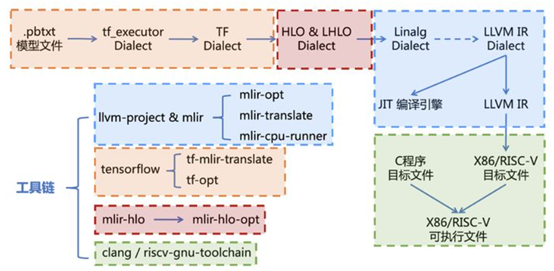
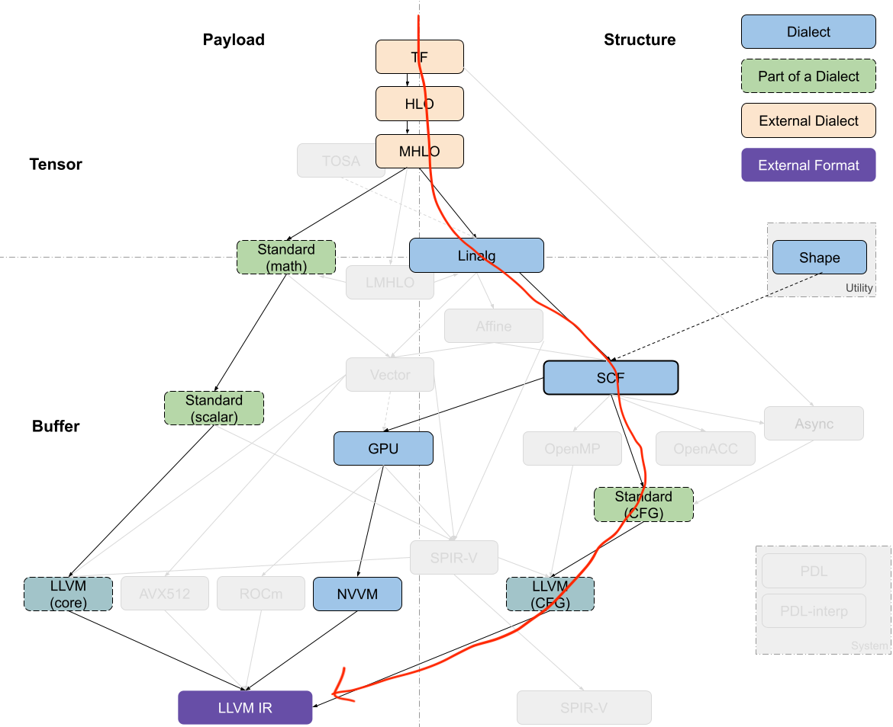

# hlo到linalg

> 在mlir中，hlo是一个广泛使用的高级表示，能够承接不同的前端框架输入；**linalg方言是目前比较重要的一层方言**，包括寒武纪在内的很多公司都使用了这一层的方言，在他的基础上去干**编译优化、调优和后端代码生成**。熟悉这两种方言并了解从 hlo→ linalg 的下降流程，看现在的支持情况和以后我们如何在上面添加支持。

两种方向：

- TF→xla_hlo→IREE Flow→LinAlg→... (IREE使用的模式)
- TF→xla_mhlo→xla_lhlo→... (TF 代码生成策略)

> [HLO to LinAlg on buffers - no conversion](https://github.com/iree-org/iree/issues/2011#top)
>
> HLO → LHLO过程会完成buffer的分配，而 IREE 会事先进行缓冲区分配。
>
> HLO+XLA buffer assignment → lhlo
>
> LHLO存在是为了保留XLA的强大机制，用于 HLO 级别的layout/buffer allocation（和其他优化）并重新进入MLIR Codegen
>
> 现在努力地将IREE的相关代码复制到TF Codegen中，这样来实现去除LHLO

使用到的工具链：tf-opt、mlir-hlo-opt，mlir编译完成后只有mlir-opt，[过程中使用到的工具链编译](codegen工具链)

**之前了解的从hlo到linalg流程**

`tf-opt train.mhlo.mlir --hlo-legalize-to-linalg -o train.linalg.mlir`


完整的流程：模型文件 → TF dialect（tf_executor Dialect → tf Dialect）→ xla_hlo→xla_lhlo → linalg Dialect



下文参考：https://discourse.llvm.org/t/llvm-ir-segmentation-fault-core-dumped/4302/1

1. 从模型 .pbtxt翻译为tf_executor Dialect （得到add.mlir）

 使用`tf-mlir-translate`工具进行翻译，其中各种选项指定了输入输出的类型以及尺寸

```cmake
$ tf-mlir-translate -graphdef-to-mlir -tf-enable-shape-inference-on-import=false add.pbtxt -tf-input-arrays=input0,input1 -tf-input-data-types=DT_INT32,DT_INT32 -tf-input-shapes=10:10 -tf-output-arrays=Add -o add.mlir
```

2. tf_executor Dialect → tf Dialect  （得到add-func.mlir）

```cmake
$ tf-opt -tf-executor-to-functional-conversion add.mlir -o add-func.mlir
```

3. tf Dialect → mhlo Dialect   （得到add-mhlo.mlir）

```cmake
$ tf-opt --tf-to-hlo-pipeline add-func.mlir -o add-mhlo.mlir
```

4. mhlo Dialect → lhlo Dialect     （得到add-lhlo.mlir）

```cmake
$ mlir-hlo-opt add-mhlo.mlir -hlo-legalize-to-lhlo -o add-lhlo.mlir
```

5. lhlo Dialect → linalg Dialect       （得到add-linalg.mlir）

```cmake
$ tf-opt add-lhlo.mlir -lhlo-legalize-to-linalg -o add-linalg.mlir
```

到此为止，这一阶段的各种表达式变换以及工具链是由TensorFlow社区维护的。从这一步往后的编译过程以及基础设施，就是由MLIR社区进行维护的了。

6. linalg Dialect → Scf Dialect    （得到add-scf.mlir）

```cmake
mlir-opt add-linalg.mlir -convert-linalg-to-loops -o add-scf.mlir
```

7. Scf Dialect → Std Dialect     （得到add-std.mlir）

```cmake
mlir-opt add-scf.mlir -convert-scf-to-std -o add-std.mlir
```

8. Std Dialect → LLVM Dialect    （得到add-llvm.mlir）

```cmake
mlir-opt add-std.mlir -convert-std-to-llvm -o add-llvm.mlir
```

9. LLVM Dialect → LLVM IR file      （得到add.ll）

```cmake
mlir-translate add-llvm.mlir -mlir-to-llvmir -o add.ll
```

10. Use `lli` to run the .ll file





