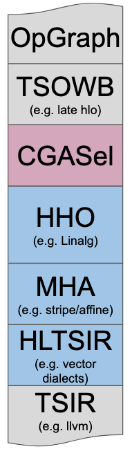
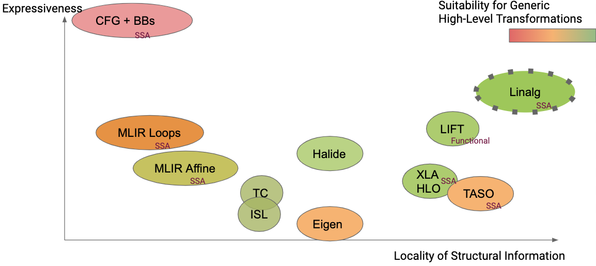

# linalg

> https://mlir.llvm.org/docs/Dialects/Linalg/
>
> 
> OpGraph: Graph of Tensor ops in MLIR
>
> TSOWB(e.g. LHLO): Target Special ops with Buffers
>
> CGASel: CodeGen Alogrithm Selector，图分治算法（搜索或RL）
>
> HHO(e.g. Linalg): 
>
> MHA: Memory Hierarchy Abstraction，循环层级
>
> HLTSIR: High Level Target Special IR，vector+target intrinsics
>
> TSIR(e.g. llamas): Target Special IR，寄存器分配、调度、机器码生成
>
> https://mlir.llvm.org/docs/Rationale/RationaleLinalgDialect/

[Linalg Dialect](https://mlir.llvm.org/docs/Dialects/Linalg/) 中，基于结构化数据对结构化计算使用了通用的表示形式(a versatile representation of structured computation on structured data)。这种dialect是为了transformations而专门设计出来的，**只需要很少量的分析就可以完成转换**；并且它**同时支持 tensor 和 buffer 作为操作数**（在tensor和memref容器上运行的更高级别的计算原语），bufferization 过程（实现tensor到buffer的转换）也可以在不改变操作本身完成。

此外， Linalg Dialect 提供了具有特定负载的 [“named” operations ](https://mlir.llvm.org/docs/Dialects/Linalg/#named-payload-carrying-opsa-namenamed_opsa)（如：矩阵乘法和卷积），也提供了用于定义 structure 的 [“generic” operations](https://mlir.llvm.org/docs/Dialects/Linalg/#payload-carrying-opsa-namepayload_opsa)。这两种形式之间可以互相转换。Linalg Dialect 的迭代结构允许它们转换为向量(vector)操作，以及基于向量或标量操作的(仿射，Affine Dialect)循环。

> 结构化的代码具有高度可组合性和可重用性：tiling和fusion转换在各个数据结构阶段都是完全通用的
>
> 结构化Ops为模式匹配和重写提供了自然锚点。

1. 只需要很少量的分析就可以完成转换： 

**Linalg ==generic op== 本质是多层完美嵌套循环（perfect loop nest）的 op 化表示。**

> Linalg generic op 里面用 indexing map 来隐性表示每层循环与输入输出的 access 关系，用附加的 region 表示针对这些输入输出进行的计算。

- linalg op 通过其 indexing map 来指定循环变量 (loop induction variable) 如何访问 (access) 操作数 (operand) 以及结果 (result)。
-  linalg op region 内的负载操作则指定了循环内部所进行的计算。

（1）linalg op背后**统一的结构** `-->` 有助于简化转换的逻辑。 因为转换只需要针对 indexing map 以及 region 进行操作，而无需考虑这具体是哪一个 linalg op。（匹配 indexing map和region的情况，而不是匹配linalg op）

（2）Linalg generic op本质是perfect loop nest的op化表示`-->` 针对 loop 做各种 transformation 的时候不可能存在非完美的情况，这样可以取消用来检测和维持 loop 完美性的逻辑，避免复杂的分析。for example, loop tiling can be applied to the loop nest computing a matrix multiplication, no need to additionally rely on affine dependence analysis to check this

==named ops== 基本就是 generic ops 上面提供的 sugar：每个 named op 都有明确的隐性的 indexing map 和 compute region，它们定义了一个 named op。**named op 是可以和 generic op 相互转换的。**

named ops 存在的作用是和上层对接变得简单。**算子层到 Linalg 层可以直接产生这些 named ops。但是在 Linalg 以及以下的层次上，transformation 主要操作的是 generic ops**，确切地说是 generic ops 背后的 [op interface](https://github.com/llvm/llvm-project/blob/main/mlir/include/mlir/Dialect/Linalg/IR/LinalgInterfaces.td)。这两种形式之间可以互相转换，编译器 transformation 不需要修改，因为这些 named ops 都有同样的 op interface，既有 transformation 可以直接操作。

2. linalg中同时存在tensor和buffer的表示

| Tensor                                                    | Buffer                                                       |
| --------------------------------------------------------- | ------------------------------------------------------------ |
| 不一定与内存相关联的不可变值 (immutable values)，重写简单 | 可变的，可能会受到混叠的影响(多个对象可能指向同样的底层存储位置) |
| 高层级运算(TF、torch、HLO)                                | 框架(组合、卷积) -->  结构(loop、vector) --> 编程模式(SIMD)  |

tensor到buffer的转换是通过bufferization完成

3. 下图是TF到LLVM IR的一种codegen

从 [MHLO ](https://github.com/tensorflow/mlir-hlo#meta-hlo-dialect-mhlo)去生成 `Linalg-on-tensors`（转换局限在tensor层面，其目的并非递降，而是为接下来的转换做准备），**并在 Linalg 上调用 bufferization 之前，在该级别上执行融合（IREE也是专注于tensor级别的fusion）。**进一步的循环转换(loop transformations)(如tiling)发生在 SCF Dialect 级别，然后转换为 target-specific GPU dialect；而有效负载操作(payload operations)则先转换为 Standard Dialect 再转换为 LLVM Dialect。

4. https://mlir.llvm.org/docs/Rationale/RationaleLinalgDialect/

利用线性代数语义定义ops和转换：Linalg **defines ops and transformations declaratively** and was originally restricted to ops with *linear-algebra like* semantics (`pointwise`, `matmul`, `conv`…).

针对 dense tensors 使用较多

尽可能地保持信息：This information captures the legality and applicability of transformations and is **not lost by lowering prematurely to loop or CFG form**. 

使用混合抽象：reflect on and integrate the key elements of the prior art success as well as avoid the common pitfalls in the area of code generation

本地改写机制：uses local rewrite rules implemented with the MLIR [Declarative Rewrite Rules](https://mlir.llvm.org/docs/DeclarativeRewrites/)

5.

