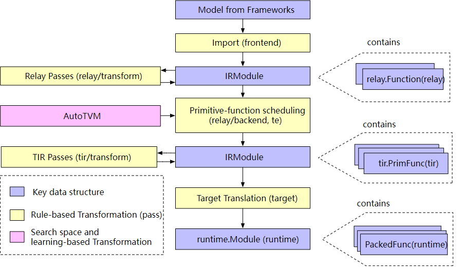

# MLC-机器学习编译

> 视频合集：[https://space.bilibili.com/1663273796/channel/collectiondetail?sid=499979&ctype=0](https://space.bilibili.com/1663273796/channel/collectiondetail?sid=499979&ctype=0)
官方文档：[https://mlc.ai/index.html](https://mlc.ai/index.html)
代码集合：[https://drive.google.com/drive/folders/1Cz1XkyjhqrQ_tAaXO5a7sQiFp2fEQ3ug](https://drive.google.com/drive/folders/1Cz1XkyjhqrQ_tAaXO5a7sQiFp2fEQ3ug)
> 

## 1. **Introduce**

### **1.1 What is MLC**

The process of transforming and optimizing machine learning execution from its development form to its deployment form.


> Development form(开发): The set of elements we use when developing machine learning models. Such as Pytorch, Tensorflow, or JAX, as well as weights associated with them.
> 
> 
> **Deployment form(部署):** The set of elements needed to execute the machine learning applications. It typically involves a set of code generated to support each step of the machine learning model, routines to manage resources (e.g. memory),and interfaces to application development environments (e.g. java API).
> 

Several goals:

- Integration and dependency minimization(集成与最小化依赖)
- Leveraging hardware native acceleration(利用硬件加速)
- Optimization in general(通用优化)

### **1.2 Reasons to Study MLC**

- Build ML Deployment Solutions
- In-depth Understanding of Existing Frameworks
- Build Software Stack for Emerging Hardware

### **1.3 Key Elements in Machine Learning Compilation**


- Tensor
- Tensor functions: weights and the sequence of computations that takes in tensors and output tensors


- Abstraction and implementation: We use **abstractions** to denote the ways we use to represent the same tensor function. Different abstractions may specify some details while leaving out other **implementation** details. (使用**抽象 (Abstraction)**来表示我们用来表示相同张量函数的方式。不同的抽象可能会指定一些细节，而忽略其他**实现(Implementations)**细节)

## 2. **Tensor Program Abstraction**

### **2.1 Primitive Tensor Function**

MLC process could be viewed as transformations among tensor function .

e.g. : several computation steps that transform tensor from input to final prediction, and each step is called a `primitive tensor function`.


`linear`,`add`,`relu`,`add` are all primitive tensor function, and they have different forms


Many frameworks offer machine leaning compilation procedures to `transform primitive tensor functions` into more specialized ones for the particular workload and deployment environment.


example transforming: thread binding, loop reorder

but we can't arbitrary transform any program

### **2.2 Tensor Program Abstraction**

代码：[mlc_1.ipynb](https://colab.research.google.com/drive/1nnVcuioohkvuGZPL02D5fZwmH3h3g8p2)

In order for us to effectively transform primitive tensor functions, we need an effective abstraction to represent the programs.

A typical abstraction for primitive tensor function implementation contains: `multi-dimensional buffers`(存储数据的多维数组), `loop nests that drive the tensor computations`(驱动张量计算的循环嵌套), `the compute statements themselves`(计算部分本身的语句).

```python
from tvm.script import tir as T
@tvm.script.ir_module
class MyModule:
  @T.prim_func
  def main(A:T.Buffer(128, 'float32'),  # (multi-dimensional)buffers: input, output, intermediate result
           B:T.Buffer(128, 'float32'),
           C:T.Buffer(128, 'float32')):
    T.func_attr({"global_symbol":"main","tir.noalias":True}). # extra annotation for the function
    for i in range(128):  # loop nests
      with T.block("C"):
        vi = T.axis.spatial(128, i)  # declare a data parallel iterator on spatial domain
        C[vi] = A[vi] + B[vi]  # computations statements
```

`Program-based transformations` can be used to optimize tensor programs —> change the program through a `sequence of transformations`  完成一系列的变换(split、parallelize、vectorize)


but we can’t perform aribitrary transformations, the tensor progrom need to incorporate some extra information. 表明 `vi` 这个特定的变量被映射到循环变量 `i`，并且所有的迭代都是独立的。

```python
# vi correspond to an iterator of length 128 and can spatially parallelized 
# without depency across other loop values of vi
vi = T.axis.spatial(128, i)
```

### 2.4 **TensorIR**

代码：[mlc_2.ipynb](https://colab.research.google.com/drive/1N_1vQpcqXrmGe7osd2cz32aLnOjQC360)

for two `128×128 matrices A and B` , we show the tensor computation below

$$
Y_{i, j} = \sum_k A_{i, k} \times B_{k, j} \\
C_{i, j} = \mathbb{relu}(Y_{i, j}) = \mathbb{max}(Y_{i, j}, 0)
$$

- numpy

```python
dtype = "float32"
a_np = np.random.rand(128, 128).astype(dtype)
b_np = np.random.rand(128, 128).astype(dtype)
# a @ b is equivalent to np.matmul(a, b)
c_mm_relu = np.maximum(a_np @ b_np, 0)
```

- python

```python
def lnumpy_mm_relu(A: np.ndarray, 
                   B: np.ndarray, 
                   C: np.ndarray):
    Y = np.empty((128, 128), dtype="float32")
    for i in range(128):
        for j in range(128):
            for k in range(128):
                if k == 0:
                    Y[i, j] = 0
                Y[i, j] = Y[i, j] + A[i, k] * B[k, j]
    for i in range(128):
        for j in range(128):
            C[i, j] = max(Y[i, j], 0)
```

- TensorIR

```python
# 装饰器 @tvm.script.ir_module 表示 MyModule 是一个 tvm.ir.module.IRModule
@tvm.script.ir_module
class MyModule:
		# 装饰器 @T.prim_func 表示 mm_relu 是一个 tvm.tir.function.PrimFunc
    @T.prim_func
    def mm_relu(A: T.Buffer((128, 128), "float32"),  # shape, datatype
                B: T.Buffer((128, 128), "float32"),
                C: T.Buffer((128, 128), "float32")):
        # 函数的额外信息， global_symbol 对应函数名，tir.noalias 是一个属性，表示所有的缓冲存储器不重叠
        T.func_attr({"global_symbol": "mm_relu", "tir.noalias": True})
        Y = T.alloc_buffer((128, 128), dtype="float32")
        for i, j, k in T.grid(128, 128, 128):
            with T.block("Y"):
                # 下面三个语句相当于 vi, vj, vk = T.axis.remap("SSR", [i, j, k])
                vi = T.axis.spatial(128, i)
                vj = T.axis.spatial(128, j)
                vk = T.axis.reduce(128, k)
                with T.init():
                    Y[vi, vj] = T.float32(0)
                Y[vi, vj] = Y[vi, vj] + A[vi, vk] * B[vk, vj]
        for i, j in T.grid(128, 128):
            with T.block("C"):
                vi = T.axis.spatial(128, i)
                vj = T.axis.spatial(128, j)
                C[vi, vj] = T.max(Y[vi, vj], T.float32(0)) # relu
```

对比

TensorIR

```python
# intermediate results
Y = T.alloc_buffer((128, 128), dtype="float32")

# for loop
for i, j, k in T.grid(128, 128, 128):

# computational block
with T.block("Y"):
    vi = T.axis.spatial(128, i)
    vj = T.axis.spatial(128, j)
    vk = T.axis.reduce(128, k)
    with T.init():
        Y[vi, vj] = T.float32(0)
    Y[vi, vj] = Y[vi, vj] + A[vi, vk] * B[vk, vj]
```

numpy

```python
# intermediate results
Y = np.empty((128, 128), dtype="float32")

# for loop
for i in range(128):
    for j in range(128):
        for k in range(128):

# computational block
vi, vj, vk = i, j, k
if vk == 0:
    Y[vi, vj] = 0
Y[vi, vj] = Y[vi, vj] + A[vi, vk] * B[vk, vj]

```

A `**T.block**` is a basic unit of computation in TensorIR. **一个块包含一组块轴（vi、vj、vk）和围绕它们定义的计算**。块信息帮助验证用于执行计算的外部循环的正确性

在每个块轴(block axis)都映射到外部循环迭代器的情况下，我们可以使用`T.axis.remap`在一行中声明所有块轴。

`[block_axis] = T.axis.[axis_type]([axis_range], [mapped_value])`  axis_type声明了块轴的属性（`spatial`, `reduce`）

```python
vi = T.axis.spatial(range_of_i, i)
vj = T.axis.spatial(range_of_j, j)
vk = T.axis.reduce(range_of_k, k)
等价于
# # SSR means the properties of each axes are "spatial", "spatial", "reduce"
vi, vj, vk = T.axis.remap("SSR", [i, j, k]) # 语法糖：让程序更易读和理解的语法
```

对于一组固定的 `vi` 和 `vj`，计算块在 `Y` 的空间位置 (`Y[vi, vj]`) 处生成一个点值，该点值独立于 `Y` 中的其他位置（具有不同的`vi`, `vj` 值的位置）。我们可以称 `vi`、`vj` 为**空间轴**，因为它们直接对应于块写入的缓冲区空间区域的开始。 涉及归约的轴（`vk`）被命名为**归约轴**。   例如：固定(vi, vj)为(0, 1)，对于vk in range(128)，执行Block Y，计算得到Y[vi, vj]


上一节提到的 `extra informations(block axis range and their properties)` 不仅仅是用来改变 transforms，而且可以用来validate the correctness of the external loops that are used to carry out the computation

这些信息也可以用于后续的优化分析，spatial axes都可以进行parallize，而reduce axes的并行就需要一些特定的策略。

装饰器：一个 IRModule 可以包含多个张量函数

```python
# 装饰器 @tvm.script.ir_module 表示 MyModule 是一个 tvm.ir.module.IRModule
@tvm.script.ir_module
class MyModule:
		# 装饰器 @T.prim_func 表示 mm_relu 是一个 tvm.tir.function.PrimFunc
    @T.prim_func
    def mm_relu(A: T.Buffer((128, 128), "float32"),
                B: T.Buffer((128, 128), "float32"),
                C: T.Buffer((128, 128), "float32")):
```

使用 transforms 变换程序

```python
# 首先创建一个以给定的 MyModule 作为输入的 Schedule 辅助类, 这样变化时不会影响到基类
sch = tvm.tir.Schedule(MyModule)
# 然后获得对块 Y 和相应循环的引用
block_Y = sch.get_block("Y", func_name="mm_relu")
i, j, k = sch.get_loops(block_Y)

```

```python
# 将块Y的循环j分成两个循环j0 j1，其中内部循环j0长度为4
j0, j1 = sch.split(j, factors=[None, 4])
print(sch.mod.script()) --> 

# from tvm.script import ir as I
# from tvm.script import tir as T

@I.ir_module
class Module:
    @T.prim_func
    def mm_relu(A: T.Buffer((128, 128), "float32"), B: T.Buffer((128, 128), "float32"), C: T.Buffer((128, 128), "float32")):
        T.func_attr({"global_symbol": "mm_relu", "tir.noalias": T.bool(True)})
        # with T.block("root"):
        Y = T.alloc_buffer((128, 128))
        for i, j_0, j_1, k in T.grid(128, 32, 4, 128):
            with T.block("Y"):
                vi = T.axis.spatial(128, i)
                vj = T.axis.spatial(128, j_0 * 4 + j_1)
                vk = T.axis.reduce(128, k)
                T.reads(A[vi, vk], B[vk, vj])
                T.writes(Y[vi, vj])
                with T.init():
                    Y[vi, vj] = T.float32(0)
                Y[vi, vj] = Y[vi, vj] + A[vi, vk] * B[vk, vj]
        for i, j in T.grid(128, 128):
            with T.block("C"):
                vi, vj = T.axis.remap("SS", [i, j])
                T.reads(Y[vi, vj])
                T.writes(C[vi, vj])
                C[vi, vj] = T.max(Y[vi, vj], T.float32(0))
```

```python
j0, j1 = sch.split(j, factors=[None, 4]) 
# 我们创建了两个新的循环，j_0 和 j_1，分别对应范围 32 和 4
sch.reorder(j0, k, j1) # 重排块Y的两个循环
print(sch.mod.script()) -->
# from tvm.script import ir as I
# from tvm.script import tir as T

@I.ir_module
class Module:
    @T.prim_func
    def mm_relu(A: T.Buffer((128, 128), "float32"), B: T.Buffer((128, 128), "float32"), C: T.Buffer((128, 128), "float32")):
        T.func_attr({"global_symbol": "mm_relu", "tir.noalias": T.bool(True)})
        # with T.block("root"):
        Y = T.alloc_buffer((128, 128))
        for i, j_0, k, j_1 in T.grid(128, 32, 128, 4):
            with T.block("Y"):
                vi = T.axis.spatial(128, i)
                vj = T.axis.spatial(128, j_0 * 4 + j_1)
                vk = T.axis.reduce(128, k)
                T.reads(A[vi, vk], B[vk, vj])
                T.writes(Y[vi, vj])
                with T.init():
                    Y[vi, vj] = T.float32(0)
                Y[vi, vj] = Y[vi, vj] + A[vi, vk] * B[vk, vj]
        for i, j in T.grid(128, 128):
            with T.block("C"):
                vi, vj = T.axis.remap("SS", [i, j])
                T.reads(Y[vi, vj])
                T.writes(C[vi, vj])
                C[vi, vj] = T.max(Y[vi, vj], T.float32(0))
```

继续使用名为 `reverse_compute_at` 的原语将块 `C` 移动到 `Y` 的内循环里

```python
block_C = sch.get_block("C", "mm_relu")
sch.reverse_compute_at(block_C, j0) # 将块C移动到 j_0的循环下
print(sch.mod.script()) -->

# from tvm.script import ir as I
# from tvm.script import tir as T

@I.ir_module
class Module:
    @T.prim_func
    def mm_relu(A: T.Buffer((128, 128), "float32"), B: T.Buffer((128, 128), "float32"), C: T.Buffer((128, 128), "float32")):
        T.func_attr({"global_symbol": "mm_relu", "tir.noalias": True})
        # with T.block("root"):
        Y = T.alloc_buffer((128, 128))
        for i, j_0 in T.grid(128, 32):
            for k, j_1 in T.grid(128, 4):
                with T.block("Y"):
                    vi = T.axis.spatial(128, i)
                    vj = T.axis.spatial(128, j_0 * 4 + j_1)
                    vk = T.axis.reduce(128, k)
                    T.reads(A[vi, vk], B[vk, vj])
                    T.writes(Y[vi, vj])
                    with T.init():
                        Y[vi, vj] = T.float32(0)
                    Y[vi, vj] = Y[vi, vj] + A[vi, vk] * B[vk, vj]
            for ax0 in range(4):
                with T.block("C"):
                    vi = T.axis.spatial(128, i)
                    vj = T.axis.spatial(128, j_0 * 4 + ax0)
                    T.reads(Y[vi, vj])
                    T.writes(C[vi, vj])
                    C[vi, vj] = T.max(Y[vi, vj], T.float32(0))
```

到目前为止，我们完成了将归约初始化和更新放在一个块体中，因为初始化和更新的外循环 `i`、`j` 通常需要彼此保持同步

在循环变换之后，我们可以将 `Y` 元素的初始化与归约更新分开（编译时会隐式完成

```python
sch.decompose_reduction(block_Y, k)
-->

# from tvm.script import ir as I
# from tvm.script import tir as T

@I.ir_module
class Module:
    @T.prim_func
    def mm_relu(A: T.Buffer((128, 128), "float32"), B: T.Buffer((128, 128), "float32"), C: T.Buffer((128, 128), "float32")):
        T.func_attr({"global_symbol": "mm_relu", "tir.noalias": T.bool(True)})
        # with T.block("root"):
        Y = T.alloc_buffer((128, 128))
        for i, j_0 in T.grid(128, 32):
            for j_1_init in range(4):
                with T.block("Y_init"):
                    vi = T.axis.spatial(128, i)
                    vj = T.axis.spatial(128, j_0 * 4 + j_1_init)
                    T.reads()
                    T.writes(Y[vi, vj])
                    Y[vi, vj] = T.float32(0)
            for k, j_1 in T.grid(128, 4):
                with T.block("Y_update"):
                    vi = T.axis.spatial(128, i)
                    vj = T.axis.spatial(128, j_0 * 4 + j_1)
                    vk = T.axis.reduce(128, k)
                    T.reads(Y[vi, vj], A[vi, vk], B[vk, vj])
                    T.writes(Y[vi, vj])
                    Y[vi, vj] = Y[vi, vj] + A[vi, vk] * B[vk, vj]
            for ax0 in range(4):
                with T.block("C"):
                    vi = T.axis.spatial(128, i)
                    vj = T.axis.spatial(128, j_0 * 4 + ax0)
                    T.reads(Y[vi, vj])
                    T.writes(C[vi, vj])
                    C[vi, vj] = T.max(Y[vi, vj], T.float32(0))
```

变换后更加类似于numpy初级代码

```python
def lnumpy_mm_relu_v3(A: np.ndarray, B: np.ndarray, C: np.ndarray):
    Y = np.empty((128, 128), dtype="float32")
    for i in range(128):
        for j0 in range(32):
            # Y_init
            for j1 in range(4):
                j = j0 * 4 + j1
                Y[i, j] = 0
            # Y_update
            for k in range(128):
                for j1 in range(4):
                    j = j0 * 4 + j1
                    Y[i, j] = Y[i, j] + A[i, k] * B[k, j]
            # C
            for j1 in range(4):
                j = j0 * 4 + j1
                C[i, j] = max(Y[i, j], 0)
```

然后我们需要**构建与运行**，调用构建函数将 IRModule 变换为 `runtime.Module`

```python
# 构建原始的MyModule
rt_lib = tvm.build(MyModule, target="llvm")
# 初始化数据
a_nd = tvm.nd.array(a_np)
b_nd = tvm.nd.array(b_np)
c_nd = tvm.nd.empty((128, 128), dtype="float32")
type(c_nd) # tvm.runtime.ndarray.NDArray

# 从 rt_lib 中获取可运行函数，并通过传递三个数组参数来执行它
func_mm_relu = rt_lib["mm_relu"]
func_mm_relu(a_nd, b_nd, c_nd)
# 进一步运行验证来检查代码差异
np.testing.assert_allclose(c_mm_relu, c_nd.numpy(), rtol=1e-5)

# 构建变换后的程序
rt_lib_after = tvm.build(sch.mod, target="llvm")
rt_lib_after["mm_relu"](a_nd, b_nd, c_nd)
np.testing.assert_allclose(c_mm_relu, c_nd.numpy(), rtol=1e-5)

# 比较两者差距
f_timer_before = rt_lib.time_evaluator("mm_relu", tvm.cpu())
print("Time cost of MyModule %g sec" % f_timer_before(a_nd, b_nd, c_nd).mean)
f_timer_after = rt_lib_after.time_evaluator("mm_relu", tvm.cpu())
print("Time cost of transformed sch.mod %g sec" % f_timer_after(a_nd, b_nd, c_nd).mean)
```

Time cost of MyModule 0.00664149 sec
Time cost of transformed sch.mod 0.00083522 sec

原因：

split得到的 j1 这一迭代产生了对 B 元素的连续访问，此外，我们使 C 的计算更接近 Y，这可以让我们拥有更好的缓存访问行为。

**通过 TVMScript 创建 TensorIR**

```python
from tvm import te

# 输入
A = te.placeholder((128, 128), "float32", name="A") #
B = te.placeholder((128, 128), "float32", name="B")
# 块轴数据
k = te.reduce_axis((0, 128), "k")
# 中间变量
Y = te.compute((128, 128), lambda i, j: te.sum(A[i, k] * B[k, j], axis=k), name="Y")
# 输出
C = te.compute((128, 128), lambda i, j: te.max(Y[i, j], 0), name="C")
# te.compute 采用签名 te.compute(output_shape, fcompute)。 
# fcompute 函数描述了对于给定的索引 (i, j) 我们要如何计算元素 Y[i, j] 的值

te_func = te.create_prim_func([A,B,C]).with_attr({"global_symbol":"mm_relu", "tir.noalias": T.bool(True)})
MyModuleTE = tvm.IRModule({"mm_relu":te_func})
print(MyModuleTE.script())
```


- 手写TensorIR，固定shape

```python
@tvm.script.ir_module
class MyModule:
    @T.prim_func
    def mm_relu(A: T.Buffer((128, 128), "float32"),  # shape, datatype
                B: T.Buffer((128, 128), "float32"),
                C: T.Buffer((128, 128), "float32")):
        T.func_attr({"global_symbol": "mm_relu", "tir.noalias": True})
        Y = T.alloc_buffer((128, 128), dtype="float32")
        for i, j, k in T.grid(128, 128, 128):
            with T.block("Y"):
                # 下面三个语句相当于 vi, vj, vk = T.axis.remap("SSR", [i, j, k])
                vi = T.axis.spatial(128, i)
                vj = T.axis.spatial(128, j)
                vk = T.axis.reduce(128, k)
                with T.init():
                    Y[vi, vj] = T.float32(0)
                Y[vi, vj] = Y[vi, vj] + A[vi, vk] * B[vk, vj]
        for i, j in T.grid(128, 128):
            with T.block("C"):
                vi = T.axis.spatial(128, i)
                vj = T.axis.spatial(128, j)
                C[vi, vj] = T.max(Y[vi, vj], T.float32(0)) # relu
```

- 通过 `te.create_prim_func` 和 `tvm.IRModule` 生成

```python
# 用te表达式生成TensorIR
from tvm import te
# 输入
A = te.placeholder((128, 128), "float32", name="A") #
B = te.placeholder((128, 128), "float32", name="B")
# 块轴数据
k = te.reduce_axis((0, 128), "k")
# 中间变量
Y = te.compute((128, 128), lambda i, j: te.sum(A[i, k] * B[k, j], axis=k), name="Y")
# 输出
C = te.compute((128, 128), lambda i, j: te.max(Y[i, j], 0), name="C")

te_func = te.create_prim_func([A,B,C]).with_attr({"global_symbol":"mm_relu", "tir.noalias": T.bool(True)})
MyModuleTE = tvm.IRModule({"mm_relu":te_func})
print(MyModuleTE.script())
```

- 手写TensorIR，动态shape

```python
# 动态shape
@tvm.script.ir_module
class MyModule_2:
    @T.prim_func
    def mm_relu(a: T.handle, b: T.handle, c: T.handle):
        n, m = T.int64(), T.int64()
        A = T.match_buffer(a, (n, m), "float32")
        B = T.match_buffer(b, (n, m), "float32")
        C = T.match_buffer(c, (n, m), "float32")
        Y = T.alloc_buffer((n, m), "float32")
        for i, j, k in T.grid(n, m, m):
            with T.block("Y"):
                vi, vj, vk = T.axis.remap("SSR", [i, j, k])
                with T.init():
                    Y[vi, vj] = T.float32(0)
                Y[vi, vj] = Y[vi, vj] + A[vi, vk] * B[vk, vj]
        for i, j in T.grid(n, m):
            with T.block("C"):
                vi = T.axis.spatial(n, i)
                vj = T.axis.spatial(m, j)
                C[vi, vj] = T.max(Y[vi, vj], T.float32(0)) # relu
MyModule_2 = tvm.IRModule({"mm_relu":te_func})
print(MyModule_2.script())
```

### 2.5 练习

代码：[mlc_2_practice.ipynb](https://colab.research.google.com/drive/1zpI8g_NBWxI3SsKWA9sRGg_YNNMZdM3d)

2.5.1 逐位相加

```python
# low-level numpy version
def lnumpy_add(a: np.ndarray, b: np.ndarray, c: np.ndarray):
  for i in range(4):
    for j in range(4):
      c[i, j] = a[i, j] + b[i, j]

# TensorIR
from tvm import te
A = te.placeholder((4, 4), "int64", name="A")
B = te.placeholder((4, 4), "int64", name="B")
C = te.compute((4, 4), lambda i, j: A[i,j]+B[i,j], name="C")
te_func = te.create_prim_func([A,B,C]).with_attr({"global_symbol":"add", "tir.noalias": T.bool(True)})
MyModuleTE = tvm.IRModule({"add":te_func})
print(MyModuleTE.script())

# 如果需要调度变换的话： sch = tvm.tir.Schedule(MyModuleTE)

输出如下：
# from tvm.script import ir as I
# from tvm.script import tir as T

@I.ir_module
class Module:
    @T.prim_func
    def add(A: T.Buffer((4, 4), "int64"), B: T.Buffer((4, 4), "int64"), C: T.Buffer((4, 4), "int64")):
        T.func_attr({"global_symbol": "add", "tir.noalias": T.bool(True)})
        # with T.block("root"):
        for i, j in T.grid(4, 4):
            with T.block("C"):
                v_i, v_j = T.axis.remap("SS", [i, j])
                T.reads(A[v_i, v_j], B[v_i, v_j])
                T.writes(C[v_i, v_j])
                C[v_i, v_j] = A[v_i, v_j] + B[v_i, v_j]
```

对比测试

```python
# init data
a = np.arange(16).reshape(4, 4)
b = np.arange(16).reshape(4, 4)
# compile
rt_lib = tvm.build(MyModuleTE,target="llvm")
a_tvm = tvm.nd.array(a)
b_tvm = tvm.nd.array(b)
c_tvm = tvm.nd.array(np.empty((4,4),dtype=np.int64))
rt_lib["add"](a_tvm,b_tvm,c_tvm)
np.testing.assert_allclose(c_tvm.numpy(),c_lnumpy,rtol=1e-5)
```

2.5.2 广播加法

```python
# low-level numpy version
def lnumpy_add(a: np.ndarray, b: np.ndarray, c: np.ndarray):
  for i in range(4):
    for j in range(4):
      c[i, j] = a[i, j] + b[j]

# TensorIR
from tvm import te
A = te.placeholder((4, 4), "int64", name="A")
B = te.placeholder((4,),"int64", name="B")
C = te.compute((4, 4), lambda i, j: A[i,j]+B[j], name="C")
te_func = te.create_prim_func([A,B,C]).with_attr({"global_symbol":"broadcast_add", "tir.noalias": T.bool(True)})
MyModuleTE_2 = tvm.IRModule({"broadcast_add":te_func})
print(MyModuleTE_2.script())

输出如下：
# from tvm.script import ir as I
# from tvm.script import tir as T

@I.ir_module
class Module:
    @T.prim_func
    def broadcast_add(A: T.Buffer((4, 4), "int64"), B: T.Buffer((4,), "int64"), C: T.Buffer((4, 4), "int64")):
        T.func_attr({"global_symbol": "broadcast_add", "tir.noalias": T.bool(True)})
        # with T.block("root"):
        for i, j in T.grid(4, 4):
            with T.block("C"):
                v_i, v_j = T.axis.remap("SS", [i, j])
                T.reads(A[v_i, v_j], B[v_j])
                T.writes(C[v_i, v_j])
                C[v_i, v_j] = A[v_i, v_j] + B[v_j]
```

对比测试

```python
# init data
a = np.arange(16).reshape(4, 4)
b = np.arange(4, 0, -1).reshape(4)

rt_lib = tvm.build(MyModuleTE_2, target="llvm")
a_tvm = tvm.nd.array(a)
b_tvm = tvm.nd.array(b)
c_tvm = tvm.nd.array(np.empty((4, 4), dtype=np.int64))
rt_lib["broadcast_add"](a_tvm, b_tvm, c_tvm)
np.testing.assert_allclose(c_tvm.numpy(), c_np, rtol=1e-5)
```

2.5.3 二维卷积

A 是输入张量，W 是权重张量，b 是批次索引，k 是输出通道，i 和 j 是图像高度和宽度的索引，di 和 dj 是权重的索引，q 是输入通道，strides 是过滤器窗口的步幅。

```python
# 初始化数据
N, CI, H, W, CO, K = 1, 1, 8, 8, 2, 3
OUT_H, OUT_W = H - K + 1, W - K + 1
data = np.arange(N*CI*H*W).reshape(N, CI, H, W)
weight = np.arange(CO*CI*K*K).reshape(CO, CI, K, K)
print(data.shape) # (1, 1, 8, 8)
print(weight.shape) # (2, 1, 3, 3)
```

```python
# torch version
import torch
data_torch = torch.Tensor(data)
weight_torch = torch.Tensor(weight)
conv_torch = torch.nn.functional.conv2d(data_torch, weight_torch)
conv_torch = conv_torch.numpy().astype(np.int64)
print(conv_torch.shape) # (1, 2, 6, 6)

# TensorIR, 会报错, 未解决, 应该是tvm版本更新后弃用了一些api
@tvm.script.ir_module
class MyBmmRelu:
  @T.prim_func
  def bmm_relu(A:T.Buffer((1,1,8,8),"int64"),B:T.Buffer((2,1,3,3),"int64"),C:T.Buffer((1,2,6,6),"int64")):
    T.func_attr({"global_symbol": "bmm_relu", "tir.noalias": True})
    for b,k,q,i,j,di,dj in T.grid(1,2,1,6,6,3,3):
      with T.block("C"):
        vb,vk,vq,vi,vj,vdi,vdj = T.axis.remap("SSSSSSSS", [b,k,q,i,j,di,dj])
        C[vb,vk,vi,vj] += A[vb,vq,vi+vdi,vj+vdj]*B[vk,vq,vdi,vdj]
sch = tvm.tir.Schedule(MyBmmRelu)
print(sch.mod.script())
```

2.5.4 调度优化步骤

```python
sch = tvm.tir.Schedule(MyBmmRelu)

# Step 1. Get blocks
Y = sch.get_block("Y", func_name="bmm_relu")
...

# Step 2. Get loops
b, i, j, k = sch.get_loops(Y)
...

# Step 3. Organize the loops
k0, k1 = sch.split(k, ...)
sch.reorder(...)
sch.compute_at/reverse_compute_at(...)
...

# Step 4. decompose reduction
Y_init = sch.decompose_reduction(Y, ...)
...

# Step 5. vectorize / parallel / unroll
sch.vectorize(...)
sch.parallel(...)
sch.unroll(...)
...
```

## 3. **Build End to END Model**



- `IRModule`：它是functions的集合，其中包含两种最关键的Function集合，即`relay::Function`和`tir::PrimFuc` 。
- 上层`relay::Function`继承自`BaseFunction`，`relay::Function`对应一个end2end的模型，可以理解为一个支持控制流，递归，以及复杂数据结构的计算图。
- 下层`tir::PrimFunc`也继承自`BaseFunction`，`tir::PrimFunc`包含了一些底层threading，vector/tensor的指令。通常为模型中的一个OP执行单元。
- `Target Translation` 编译器将IRModule变换为目标硬件上可执行的格式（即代码生成），生成的代码被封装为运行时。
- `Passes`：pass是对计算图的一些优化和转换，比如常量折叠，算符融合，死代码消除等等。
- 在编译阶段，一个`relay::Function`可能会被`lower`成多个`tir::PrimFunc`。

代码：[mlc_3.ipynb](https://colab.research.google.com/drive/1gug7gEHXlQbzTuXhwnzvyVCj_lhTgiIG#scrollTo=35Gt9rKPCghB)

在 fashion MNIST 数据集上使用一个模型，进行预测

```python
import numpy as np
import tvm
from tvm import relax
from tvm.ir.module import IRModule
from tvm.script import relax as R
from tvm.script import tir as T
```

- 加载数据

```python
import torch
import torchvision

test_data = torchvision.datasets.FashionMNIST(
    root="data",
    train=False,
    download=True,
    transform=torchvision.transforms.ToTensor()
)
test_loader = torch.utils.data.DataLoader(test_data, batch_size=1, shuffle=True)
class_names = ['T-shirt/top', 'Trouser', 'Pullover', 'Dress', 'Coat',
               'Sandal', 'Shirt', 'Sneaker', 'Bag', 'Ankle boot']

img, label = next(iter(test_loader))
img = img.reshape(1, 28, 28).numpy()
```

```python
import matplotlib.pyplot as plt

plt.figure()
plt.imshow(img[0])
plt.colorbar()
plt.grid(False)
plt.show()
print("Class:", class_names[label[0]])
```


- numpy实现

```python
# 高级numpy实现
def numpy_mlp(data, w0, b0, w1, b1):
    lv0 = data @ w0.T + b0 #y=wx+b
    lv1 = np.maximum(lv0, 0) #relu
    lv2 = lv1 @ w1.T + b1 #y=wx+b
    return lv2

# 使用底层numpy实现该模型，等价于上面的代码
def lnumpy_linear0(X: np.ndarray, W: np.ndarray, B: np.ndarray, Z: np.ndarray):
    Y = np.empty((1, 128), dtype="float32")
    for i in range(1):
        for j in range(128):
            for k in range(784):
                if k == 0:
                    Y[i, j] = 0
                Y[i, j] = Y[i, j] + X[i, k] * W[j, k]

    for i in range(1):
        for j in range(128):
            Z[i, j] = Y[i, j] + B[j]

def lnumpy_relu0(X: np.ndarray, Y: np.ndarray):
     for i in range(1):
        for j in range(128):
            Y[i, j] = np.maximum(X[i, j], 0)

def lnumpy_linear1(X: np.ndarray, W: np.ndarray, B: np.ndarray, Z: np.ndarray):
    Y = np.empty((1, 10), dtype="float32")
    for i in range(1):
        for j in range(10):
            for k in range(128):
                if k == 0:
                    Y[i, j] = 0
                Y[i, j] = Y[i, j] + X[i, k] * W[j, k]

    for i in range(1):
        for j in range(10):
            Z[i, j] = Y[i, j] + B[j]

def lnumpy_mlp(data, w0, b0, w1, b1):
    lv0 = np.empty((1, 128), dtype="float32")
    lnumpy_linear0(data, w0, b0, lv0)

    lv1 = np.empty((1, 128), dtype="float32")
    lnumpy_relu0(lv0, lv1)

    out = np.empty((1, 10), dtype="float32")
    lnumpy_linear1(lv1, w1, b1, out)
    return out

result =lnumpy_mlp(
    img.reshape(1, 784),
    mlp_params["w0"],
    mlp_params["b0"],
    mlp_params["w1"],
    mlp_params["b1"])

pred_kind = result.argmax(axis=1)
print("Low-level Numpy MLP Prediction:", class_names[pred_kind[0]])
```

- TensorIR实现

```python
@tvm.script.ir_module
class MyModule:
    @T.prim_func
    def relu0(x: T.handle, y: T.handle):
        n = T.int64()
        X = T.match_buffer(x, (1, n), "float32")
        Y = T.match_buffer(y, (1, n), "float32")
        for i, j in T.grid(1, n):
            with T.block("Y"):
                vi, vj = T.axis.remap("SS", [i, j])
                Y[vi, vj] = T.max(X[vi, vj], T.float32(0))

    @T.prim_func
    def linear0(x: T.handle,
                w: T.handle,
                b: T.handle,
                z: T.handle):
        m, n, k = T.int64(), T.int64(), T.int64()
        X = T.match_buffer(x, (1, m), "float32") # X: T.Buffer((1, 128), "float32")
        W = T.match_buffer(w, (n, m), "float32") # W: T.Buffer((10, 128), "float32")
        B = T.match_buffer(b, (n, ), "float32") # B: T.Buffer((10,), "float32")
        Z = T.match_buffer(z, (1, n), "float32") # Z: T.Buffer((1, 10), "float32")
        Y = T.alloc_buffer((1, n), "float32")
        for i, j, k in T.grid(1, n, m):
            with T.block("Y"):
                vi, vj, vk = T.axis.remap("SSR", [i, j, k])
                with T.init():
                    Y[vi, vj] = T.float32(0)
                Y[vi, vj] = Y[vi, vj] + X[vi, vk] * W[vj, vk]
        for i, j in T.grid(1, n):
            with T.block("Z"):
                vi, vj = T.axis.remap("SS", [i, j])
                Z[vi, vj] = Y[vi, vj] + B[vj]

		# R.function（Relax 函数是一种表示上层神经网络执行的全新抽象）
    @R.function
    def main(x: R.Tensor((1, "m"), "float32"),
             w0: R.Tensor(("n", "m"), "float32"),
             b0: R.Tensor(("n", ), "float32"),
             w1: R.Tensor(("k", "n"), "float32"),
             b1: R.Tensor(("k", ), "float32")):
        m, n, k = T.int64(), T.int64(), T.int64()
        with R.dataflow():
            lv0 = R.call_dps_packed("linear0", (x, w0, b0), R.Tensor((1, n), "float32"))
            lv1 = R.call_dps_packed("relu0", (lv0, ), R.Tensor((1, n), "float32"))
            out = R.call_dps_packed("linear0", (lv1, w1, b1), R.Tensor((1, k), "float32"))
            R.output(out)
        return out
```

关于 `R.function` ，观察其和numpy代码的对应，看起来是在构建神经网络


可视化其对应的计算图：


可见， `R.call_dps_packed` 是用于引入 `T.prim_func` 

以 `R.call_dps_packed("linear0", (x, w0, b0), R.Tensor((1, n), "float32"))` 为例

- prim_func: “linear0”，期望的函数是 **pure** 或 **side-effect free** 的，即仅依赖于输入参数，且仅对输入参数进行操作，不会影响函数外部的任何状态
- func_input: (x, w0, b0) ，prim_func的输入
- func_output: R.tensor((1, n), “float32”)， prim_func的输出的形状和类型

但当存在包含 side-effect 的操作时，可以使用 `R.dataflow()` ，即在dataflow block中，所有操作都需要side-effect free。 在dataflow block之外，操作可能包含side-effect。

构建模型

回忆一下之前模型的构建

```python
# 初始化数据
a_nd = tvm.nd.array(a_np)
b_nd = tvm.nd.array(b_np)
c_nd = tvm.nd.empty((128, 128), dtype="float32")
type(c_nd) # tvm.runtime.ndarray.NDArray

# 构建原始的MyModule
rt_lib = tvm.build(MyModule, target="llvm")
# 构建变换后的程序
rt_lib_after = tvm.build(sch.mod, target="llvm")

# 比较两者差距
f_timer_before = rt_lib.time_evaluator("mm_relu", tvm.cpu())
print("Time cost of MyModule %g sec" % f_timer_before(a_nd, b_nd, c_nd).mean)
f_timer_after = rt_lib_after.time_evaluator("mm_relu", tvm.cpu())
print("Time cost of transformed sch.mod %g sec" % f_timer_after(a_nd, b_nd, c_nd).mean)
```

但接下来我们使用 `relax` 来构建 

```python
ex = relax.build(MyModule, target="llvm")
type(ex) # tvm.relax.vm_build.Executable

# 我们可以初始化一个虚拟机执行器，使我们能够运行该函数。 
vm = relax.VirtualMachine(ex, tvm.cpu()) # 第二个参数可选，指定运行设备端

# 构建包含输入数据和权重的 tvm NDArray
data_nd = tvm.nd.array(img.reshape(1, 784))
nd_params = {k: tvm.nd.array(v) for k, v in mlp_params.items()}

# 通过传入输入参数和权重来运行 main 函数。
nd_res = vm["main"](data_nd,nd_params["w0"],
          nd_params["b0"],
          nd_params["w1"],
          nd_params["b1"])
pred_kind = np.argmax(nd_res.numpy(), axis=1)
print("MyModule Prediction:", class_names[pred_kind[0]])
```

### 3.6 库函数

防止重复造轮子，某些 runtime library 会集成 runtime function 来复用

- 我们首先在 `env` 中注册 `runtime function`

```python
@tvm.register_func("env.linear", override=True)
def torch_linear(x: tvm.nd.NDArray,
                 w: tvm.nd.NDArray,
                 b: tvm.nd.NDArray,
                 out: tvm.nd.NDArray):
    x_torch = torch.from_dlpack(x)
    w_torch = torch.from_dlpack(w)
    b_torch = torch.from_dlpack(b)
    out_torch = torch.from_dlpack(out)
    torch.mm(x_torch, w_torch.T, out=out_torch)
    torch.add(out_torch, b_torch, out=out_torch)

@tvm.register_func("env.relu", override=True)
def lnumpy_relu(x: tvm.nd.NDArray,
                out: tvm.nd.NDArray):
    x_torch = torch.from_dlpack(x)
    out_torch = torch.from_dlpack(out)
    torch.maximum(x_torch, torch.Tensor([0.0]), out=out_torch)
```

在这个特定的函数中，我们只是简单地调用 PyTorch 的实现。 在真实的应用场景中，我们可以使用类似的机制将调用重定向到特定的库，例如 cuDNN 或我们自己的库实现。

- 然后调用 `R.call_dps_packed` 时直接调用这些 `runtime function` 即可

```python
@tvm.script.ir_module
class MyModuleWithExternCall:
    @R.function
    def main(x: R.Tensor((1, "m"), "float32"),
             w0: R.Tensor(("n", "m"), "float32"),
             b0: R.Tensor(("n", ), "float32"),
             w1: R.Tensor(("k", "n"), "float32"),
             b1: R.Tensor(("k", ), "float32")):
        # block 0
        m, n, k = T.int64(), T.int64(), T.int64()
        with R.dataflow():
            lv0 = R.call_dps_packed("env.linear", (x, w0, b0), R.Tensor((1, n), "float32"))
            lv1 = R.call_dps_packed("env.relu", (lv0, ), R.Tensor((1, n), "float32"))
            out = R.call_dps_packed("env.linear", (lv1, w1, b1), R.Tensor((1, k), "float32"))
            R.output(out)
        return out
```

主要可使用的函数可以来自： `Relax VM kernel library` , or in `TVM runtime PackedFunc registry`, or in `global Relax functions of the VM executable`

### 3.7 混合库函数和自定义函数

```python
@tvm.script.ir_module
class MyModuleMixture:
    @T.prim_func
    def linear0(x: T.handle,
                w: T.handle,
                b: T.handle,
                z: T.handle):
        m, n, k = T.int64(), T.int64(), T.int64()
        X = T.match_buffer(x, (1, m), "float32")
        W = T.match_buffer(w, (n, m), "float32")
        B = T.match_buffer(b, (n, ), "float32")
        Z = T.match_buffer(z, (1, n), "float32")
        Y = T.alloc_buffer((1, n), "float32")
        for i, j, k in T.grid(1, n, m):
            with T.block("Y"):
                vi, vj, vk = T.axis.remap("SSR", [i, j, k])
                with T.init():
                    Y[vi, vj] = T.float32(0)
                Y[vi, vj] = Y[vi, vj] + X[vi, vk] * W[vj, vk]
        for i, j in T.grid(1, n):
            with T.block("Z"):
                vi, vj = T.axis.remap("SS", [i, j])
                Z[vi, vj] = Y[vi, vj] + B[vj]

    @R.function
    def main(x: R.Tensor((1, "m"), "float32"),
             w0: R.Tensor(("n", "m"), "float32"),
             b0: R.Tensor(("n", ), "float32"),
             w1: R.Tensor(("k", "n"), "float32"),
             b1: R.Tensor(("k", ), "float32")):
        m, n, k = T.int64(), T.int64(), T.int64()
        with R.dataflow():
            lv0 = R.call_dps_packed("linear0", (x, w0, b0), R.Tensor((1, n), "float32"))
            lv1 = R.call_dps_packed("env.relu", (lv0, ), R.Tensor((1, n), "float32"))
            out = R.call_dps_packed("env.linear", (lv1, w1, b1), R.Tensor((1, k), "float32"))
            R.output(out)
        return out

ex = relax.build(MyModuleMixture, target="llvm")
vm = relax.VirtualMachine(ex, tvm.cpu())
nd_res = vm["main"](data_nd,
                    nd_params["w0"],
                    nd_params["b0"],
                    nd_params["w1"],
                    nd_params["b1"])
pred_kind = np.argmax(nd_res.numpy(), axis=1)
print("MyModuleMixture Prediction:", class_names[pred_kind[0]])
```

### 3.8 将参数绑定到 IRModule

之前都是通过显式传递参数来构造主函数。 在许多情况下，将参数绑定为附加到 IRModule 的常量通常会降低API的复杂程度

```python
MyModuleWithParams = relax.transform.BindParams("main", nd_params)(MyModuleMixture)
# 输出-->

# from tvm.script import ir as I
# from tvm.script import tir as T
# from tvm.script import relax as R

@I.ir_module
class Module:
    @T.prim_func
    def linear0(x: T.handle, w: T.handle, b: T.handle, z: T.handle):
        m = T.int64()
        X = T.match_buffer(x, (1, m))
        n = T.int64()
        W = T.match_buffer(w, (n, m))
        B = T.match_buffer(b, (n,))
        Z = T.match_buffer(z, (1, n))
        # with T.block("root"):
        Y = T.alloc_buffer((1, n))
        for i, j, k in T.grid(1, n, m):
            with T.block("Y"):
                vi, vj, vk = T.axis.remap("SSR", [i, j, k])
                T.reads(X[vi, vk], W[vj, vk])
                T.writes(Y[vi, vj])
                with T.init():
                    Y[vi, vj] = T.float32(0)
                Y[vi, vj] = Y[vi, vj] + X[vi, vk] * W[vj, vk]
        for i, j in T.grid(1, n):
            with T.block("Z"):
                vi, vj = T.axis.remap("SS", [i, j])
                T.reads(Y[vi, vj], B[vj])
                T.writes(Z[vi, vj])
                Z[vi, vj] = Y[vi, vj] + B[vj]

    @R.function
    def main(x: R.Tensor((1, 784), dtype="float32")) -> R.Tensor((1, 10), dtype="float32"):
        with R.dataflow():
            lv0 = R.call_dps_packed("linear0", (x, metadata["relax.expr.Constant"][0], metadata["relax.expr.Constant"][1]), out_sinfo=R.Tensor((1, 128), dtype="float32"))
            lv1 = R.call_dps_packed("env.relu", (lv0,), out_sinfo=R.Tensor((1, 128), dtype="float32"))
            out = R.call_dps_packed("env.linear", (lv1, metadata["relax.expr.Constant"][2], metadata["relax.expr.Constant"][3]), out_sinfo=R.Tensor((1, 10), dtype="float32"))
            R.output(out)
        return out

# Metadata omitted. Use show_meta=True in script() method to show it.
```

## 4. 自动程序优化

代码：[mlc_4.ipynb](https://colab.research.google.com/drive/1Hh7jOTsSiSAN65P93SFWuEYox4xBBu5m)

上一节端到端的流程中，主要有三种抽象类型

- 驱动高层执行的计算图抽象
- 元张量函数的抽象
- 通过注册环境函数从而能被调用的库函数

首先通过 `te` 来构建TensorIR

```python
# 使用te构建TensorIR
from tvm import te

# 输入
A = te.placeholder((128, 128), "float32", name="A") #
B = te.placeholder((128, 128), "float32", name="B")
# 块轴数据
k = te.reduce_axis((0, 128), "k")
# 输出
C = te.compute((128, 128), lambda i, j: te.sum(A[i, k] * B[k, j], axis=k), name="C")

te_func = te.create_prim_func([A,B,C]).with_attr({"global_symbol":"main", "tir.noalias": T.bool(True)})
MyModule = tvm.IRModule({"main":te_func})
print(MyModule.script())
```

然后评估调度前的性能

```python
dtype = "float32"
a_np = np.random.rand(128, 128).astype(dtype)
b_np = np.random.rand(128, 128).astype(dtype)
c_mm = a_np @ b_np
a_nd = tvm.nd.array(a_np)
b_nd = tvm.nd.array(b_np)
c_nd = tvm.nd.empty((128, 128), dtype="float32")

lib = tvm.build(MyModule, target="llvm")
f_timer_before = lib.time_evaluator("main", tvm.cpu())
print("Time cost of MyModule before schedule: %.3f ms" % (f_timer_before(a_nd, b_nd, c_nd).mean * 1000))
```

重新组织循环访问模式（使用 `print(sch.trace)` 来输出sch使用过的schedule）

```python
def schedule_mm(sch: tvm.tir.Schedule, jfactor=4):
    block_C = sch.get_block("C", "main")
    i, j, k = sch.get_loops(block=block_C)
    j_0, j_1 = sch.split(loop=j, factors=[None, jfactor]) # (i,j,k) --> (i,j_0,j_1,k)
    sch.reorder(i, j_0, k, j_1) # (i,j_0,j_1,k) --> (i,j_0,k,j_1)
    sch.decompose_reduction(block_C, k)
    return sch
sch = tvm.tir.Schedule(MyModule)
sch = schedule_mm(sch)
IPython.display.HTML(code2html(sch.mod.script()))
```

上面的函数中可变的参数有 `jfactor` ，如何获得性能最优的参数呢，可以尝试添加一些随机元素

其中 `sch.sample_perfect_tile` 尝试使用随机数来作为 `j_factors` 的值。它在输入循环的长度的因子中进行采样，以便采样结果能完美地分割循环。

```python
def stochastic_schedule_mm(sch: tvm.tir.Schedule):
    block_C = sch.get_block("C", "main")
    i, j, k = sch.get_loops(block=block_C)
    j_factors = sch.sample_perfect_tile(loop=j, n=2)
    j_0, j_1 = sch.split(loop=j, factors=j_factors)
    sch.reorder(i, j_0, k, j_1)
    sch.decompose_reduction(block_C, k)
    return sch
```


每次运行代码都会获得不固定的结果，可以认为是 `stochastic_schedule_mm` 函数产生了一个搜索空间，我们需要在其中寻找最优


最简单的搜索算法 —> 找到

```python
# 搜索算法找最优
def random_search(mod: tvm.IRModule, num_trials=5):
    best_result = None
    best_sch = None

    for i in range(num_trials):
        sch = stochastic_schedule_mm(tvm.tir.Schedule(mod))
        lib = tvm.build(sch.mod, target="llvm")
        f_timer_after = lib.time_evaluator("main", tvm.cpu())
        result = f_timer_after(a_nd, b_nd, c_nd).mean  # 构建后到模型运行耗时

        print("=====Attempt %d, time-cost: %.3f ms====" % (i, result * 1000))
        print(sch.trace)

        # book keep the best result so far
        if best_result is None or result < best_result:
            best_result = result
            best_sch = sch

    return best_sch

sch = random_search(MyModule)
print("\n -------------the best schedule---------------- \n")
print(sch.trace)
```

在实际中部署中，我们不能使用这样暴力搜索法，而 Meta-Schedule 的 `tune_tir` API 帮助我们在搜索空间内找到一个好的解决方案

`meta_schedule` 是支持搜索可能变换空间的命名空间。Meta-Schedule 在幕后做了很多额外的事情：

- 跨越多个进程的并行基准测试。并行测试
- 使用**代价模型** (cost model) 来避免每次都进行基准测试。测量衡量
- 基于历史轨迹进行**遗传搜索** (evolutionary search)，而不是每次都随机采样。不重复探索

尽管有这些工具，但我们关键思想是保持不变的：**使用随机变换来指定好的程序的搜索空间，使用 ``tune_tir`` API 帮助在搜索空间内搜索并找到最优的调度变换**。

```python
from tvm import meta_schedule as ms

database = ms.tune_tir(
    mod=MyModule,
    target="llvm --num-cores=1",
    max_trials_global=64,
    num_trials_per_iter=64,
    space=ms.space_generator.ScheduleFn(stochastic_schedule_mm),
    work_dir="./tune_tmp",
)

sch = ms.tir_integration.compile_tir(database, MyModule, "llvm --num-cores=1") # 这样获得的sch就是最优配置的stochastic_schedule_mm
```


```python
# 评估
dtype = "float32"
a_np = np.random.rand(128, 128).astype(dtype)
b_np = np.random.rand(128, 128).astype(dtype)
c_mm = a_np @ b_np
a_nd = tvm.nd.array(a_np)
b_nd = tvm.nd.array(b_np)
c_nd = tvm.nd.empty((128, 128), dtype="float32")

lib = tvm.build(MyModule, target="llvm")
f_timer_before = lib.time_evaluator("main", tvm.cpu())
print("Time cost of MyModule before schedule: %.3f ms" % (f_timer_before(a_nd, b_nd, c_nd).mean * 1000))

lib = tvm.build(sch.mod, target="llvm")
f_timer_after = lib.time_evaluator("main", tvm.cpu())
print("Time cost of MyModule after schedule: %.3f ms" % (f_timer_after(a_nd, b_nd, c_nd).mean * 1000))
```

Time cost of MyModule before schedule: 6.276 ms
Time cost of MyModule after schedule: 2.372 ms

目前演示的只是一个拆分循环并重排序循环的案例，调度的种类用很多，例如：

- 更多级的循环转换
- 中间计算的矢量化
- 并行化和循环展开

而且，目前，**调优 API 只接受一个带有一个 `main` 函数的 IRModule**，所以可能需要一定的变换

下面以上节的end2end例子演示如何自动调优手写的函数

- 混合 手写 和 库函数 的方式来定义TensorIR模型

```python
@tvm.script.ir_module
class MyModuleMixture:
    @T.prim_func
    def linear0(X: T.Buffer((1, 784), "float32"),
                W: T.Buffer((128, 784), "float32"),
                B: T.Buffer((128,), "float32"),
                Z: T.Buffer((1, 128), "float32")):
        T.func_attr({"global_symbol": "linear0", "tir.noalias": True})
        Y = T.alloc_buffer((1, 128), "float32")
        for i, j, k in T.grid(1, 128, 784):
            with T.block("Y"):
                vi, vj, vk = T.axis.remap("SSR", [i, j, k])
                with T.init():
                    Y[vi, vj] = T.float32(0)
                Y[vi, vj] = Y[vi, vj] + X[vi, vk] * W[vj, vk]

        for i, j in T.grid(1, 128):
            with T.block("Z"):
                vi, vj = T.axis.remap("SS", [i, j])
                Z[vi, vj] =  Y[vi, vj] + B[vj]

    @R.function
    def main(x: R.Tensor((1, 784), "float32"),
             w0: R.Tensor((128, 784), "float32"),
             b0: R.Tensor((128,), "float32"),
             w1: R.Tensor((10, 128), "float32"),
             b1: R.Tensor((10,), "float32")):
        with R.dataflow():
            lv0 = R.call_dps_packed("linear0", (x, w0, b0), R.Tensor((1, 128), dtype="float32"))
            lv1 = R.call_dps_packed("env.relu", (lv0,), R.Tensor((1, 128), dtype="float32"))
            out = R.call_dps_packed("env.linear", (lv1, w1, b1), R.Tensor((1, 10), dtype="float32"))
            R.output(out)
        return out

@tvm.register_func("env.linear", override=True)
def torch_linear(x: tvm.nd.NDArray,
                 w: tvm.nd.NDArray,
                 b: tvm.nd.NDArray,
                 out: tvm.nd.NDArray):
    x_torch = torch.from_dlpack(x)
    w_torch = torch.from_dlpack(w)
    b_torch = torch.from_dlpack(b)
    out_torch = torch.from_dlpack(out)
    torch.mm(x_torch, w_torch.T, out=out_torch)
    torch.add(out_torch, b_torch, out=out_torch)

@tvm.register_func("env.relu", override=True)
def lnumpy_relu(x: tvm.nd.NDArray,
                out: tvm.nd.NDArray):
    x_torch = torch.from_dlpack(x)
    out_torch = torch.from_dlpack(out)
    torch.maximum(x_torch, torch.Tensor([0.0]), out=out_torch)
```

- 获取参数，方便后续通过 `relax.transform.BindParams` 构建参数绑定模型

```python
# 加载数据集
import torch
import torchvision
test_data = torchvision.datasets.FashionMNIST(
    root="data",
    train=False,
    download=True,
    transform=torchvision.transforms.ToTensor()
)
test_loader = torch.utils.data.DataLoader(test_data, batch_size=1, shuffle=True)
class_names = ['T-shirt/top', 'Trouser', 'Pullover', 'Dress', 'Coat',
               'Sandal', 'Shirt', 'Sneaker', 'Bag', 'Ankle boot']
img, label = next(iter(test_loader))
img = img.reshape(1, 28, 28).numpy()

# 可视化测试数据
import matplotlib.pyplot as plt
plt.figure()
plt.imshow(img[0])
plt.colorbar()
plt.grid(False)
plt.show()
print("Class:", class_names[label[0]])

# 下载参数
!wget -nc https://github.com/mlc-ai/web-data/raw/main/models/fasionmnist_mlp_params.pkl

# 解析获取到的参数
import pickle as pkl
mlp_params = pkl.load(open("fasionmnist_mlp_params.pkl", "rb"))
data_nd = tvm.nd.array(img.reshape(1, 784))
nd_params = {k: tvm.nd.array(v) for k, v in mlp_params.items()}
```

- 将MyModule中的需要调优的单个函数抽离出来（**调优 API 只接受一个带有一个 `main` 函数的 IRModule**）

```python
# 调优 API 只接受一个带有一个 main 函数的 IRModule, 所以变换到只有一个函数
mod_linear = tvm.IRModule.from_expr(MyModuleMixture["linear0"].with_attr("global_symbol", "main"))

# 开始自动调优 linear0
database = ms.tune_tir(
    mod=mod_linear,
    target="llvm --num-cores=1",
    max_trials_global=64,
    num_trials_per_iter=64,
    work_dir="./tune_tmp",
    # task_name="main",
)
sch = ms.tir_integration.compile_tir(database, mod_linear, "llvm --num-cores=1") # 运行结束后，sch中的func（即linear0）就是获得的性能最好的情况
```

- 把调优好的linear0函数更新

```python
MyModuleWithParams2 = relax.transform.BindParams("main", nd_params)(MyModuleMixture) # 将参数绑定为附加到 IRModule 的常量
new_func = sch.mod["main"].with_attr("global_symbol", "linear0") # 定位sch中调优好的新linear0
gv = MyModuleWithParams2.get_global_var("linear0") # 定位MyModule中的linear0
MyModuleWithParams2.update_func(gv, new_func) # 替换
IPython.display.HTML(code2html(MyModuleWithParams2.script()))
```

调优前后的 linear0 函数对比，看起来自动进行了 `vectorize` 、 `parallelize` 、 `loop-fused` 这类的操作

```python
def linear0(X: T.Buffer((1, 784), "float32"),
                W: T.Buffer((128, 784), "float32"),
                B: T.Buffer((128,), "float32"),
                Z: T.Buffer((1, 128), "float32")):
        T.func_attr({"global_symbol": "linear0", "tir.noalias": True})
        Y = T.alloc_buffer((1, 128), "float32")
        for i, j, k in T.grid(1, 128, 784):
            with T.block("Y"):
                vi, vj, vk = T.axis.remap("SSR", [i, j, k])
                with T.init():
                    Y[vi, vj] = T.float32(0)
                Y[vi, vj] = Y[vi, vj] + X[vi, vk] * W[vj, vk]

        for i, j in T.grid(1, 128):
            with T.block("Z"):
                vi, vj = T.axis.remap("SS", [i, j])
                Z[vi, vj] =  Y[vi, vj] + B[vj]
```

```python
def linear0(X: T.Buffer((1, 784), "float32"), W: T.Buffer((128, 784), "float32"), B: T.Buffer((128,), "float32"), Z: T.Buffer((1, 128), "float32")):
        T.func_attr({"global_symbol": "linear0", "tir.noalias": T.bool(True)})
        # with T.block("root"):
        Y = T.alloc_buffer((1, 128))
        for i_0_j_0_fused in T.parallel(2, annotations={"pragma_auto_unroll_max_step": 512, "pragma_unroll_explicit": 1}):
            for i_1, j_1 in T.grid(1, 2):
                for i_2_init, j_2_init, i_3_init, j_3_init in T.grid(1, 32, 1, 1):
                    with T.block("Y_init"):
                        vi = T.axis.spatial(1, i_1 + i_2_init + i_3_init)
                        vj = T.axis.spatial(128, i_0_j_0_fused * 64 + j_1 * 32 + j_2_init + j_3_init)
                        T.reads()
                        T.writes(Y[vi, vj])
                        T.block_attr({"meta_schedule.tiling_structure": "SSRSRS"})
                        Y[vi, vj] = T.float32(0)
                for k_0, i_2, j_2, k_1, i_3, j_3 in T.grid(196, 1, 32, 4, 1, 1):
                    with T.block("Y_update"):
                        vi = T.axis.spatial(1, i_1 + i_2 + i_3)
                        vj = T.axis.spatial(128, i_0_j_0_fused * 64 + j_1 * 32 + j_2 + j_3)
                        vk = T.axis.reduce(784, k_0 * 4 + k_1)
                        T.reads(Y[vi, vj], X[vi, vk], W[vj, vk])
                        T.writes(Y[vi, vj])
                        T.block_attr({"meta_schedule.tiling_structure": "SSRSRS"})
                        Y[vi, vj] = Y[vi, vj] + X[vi, vk] * W[vj, vk]
            for ax0 in range(1):
                for ax1_fused in T.vectorized(64):
                    with T.block("Z"):
                        vi = T.axis.spatial(1, ax0)
                        vj = T.axis.spatial(128, i_0_j_0_fused * 64 + ax1_fused)
                        T.reads(Y[vi, vj], B[vj])
                        T.writes(Z[vi, vj])
                        Z[vi, vj] = Y[vi, vj] + B[vj]def linear0(X: T.Buffer((1, 784), "float32"),
                W: T.Buffer((128, 784), "float32"),
                B: T.Buffer((128,), "float32"),
                Z: T.Buffer((1, 128), "float32")):
        T.func_attr({"global_symbol": "linear0", "tir.noalias": True})
        Y = T.alloc_buffer((1, 128), "float32")
        for i, j, k in T.grid(1, 128, 784):
            with T.block("Y"):
                vi, vj, vk = T.axis.remap("SSR", [i, j, k])
                with T.init():
                    Y[vi, vj] = T.float32(0)
                Y[vi, vj] = Y[vi, vj] + X[vi, vk] * W[vj, vk]

        for i, j in T.grid(1, 128):
            with T.block("Z"):
                vi, vj = T.axis.remap("SS", [i, j])
                Z[vi, vj] =  Y[vi, vj] + B[vj]
```

- 构建并运行对比

```python
# 构建调优前模型
MyModuleWithParams_before = relax.transform.BindParams("main", nd_params)(MyModuleMixture) # 将参数绑定为附加到 IRModule 的常量
ex = relax.build(MyModuleWithParams_before, target="llvm")
vm = relax.VirtualMachine(ex, tvm.cpu())
nd_res = vm["main"](data_nd)
pred_kind = np.argmax(nd_res.numpy(), axis=1)
print("MyModuleWithParams_before Prediction:", class_names[pred_kind[0]]) # 预测结果
ftimer = vm.module.time_evaluator("main", tvm.cpu(), number=100)
print("MyModuleWithParams_before time-cost: %g ms" % (ftimer(data_nd).mean * 1000)) # 耗时
# 构建调优后模型
ex = relax.build(MyModuleWithParams_after, target="llvm")
vm = relax.VirtualMachine(ex, tvm.cpu())
nd_res = vm["main"](data_nd)
pred_kind = np.argmax(nd_res.numpy(), axis=1)
print("MyModuleWithParams_after Prediction:", class_names[pred_kind[0]])
ftimer = vm.module.time_evaluator("main", tvm.cpu(), number=100)
print("MyModuleWithParams_after time-cost: %g ms" % (ftimer(data_nd).mean * 1000)) # 耗时
```

MyModuleWithParams_before Prediction: Coat
MyModuleWithParams_before time-cost: 0.344454 ms
MyModuleWithParams_after Prediction: Coat
MyModuleWithParams_after time-cost: 0.143232 ms

> 如果想用上述方法调优库函数 `env.linear` 的话会报错 `Cannot find global var "env.linear" in the Module`
> 

## **5. Integration with Machine Learning Frameworks**

代码：[mlc_5.ipynb](https://colab.research.google.com/drive/1ReCVQIC6HRnntLLFMBICwl5TMEWIt4W0)

```python
import numpy as np
import tvm
from tvm import relax
from tvm.ir.module import IRModule
from tvm.script import relax as R
from tvm.script import tir as T

import torch
import torch.nn as nn
from torch import fx
from torch.nn import functional as F
```

### 5.2 通过 te 构建 TensorIR

这步骤是构建 `@T**.**prim_func`

```python
# 实现conv
from tvm import te
def te_matmul(A: te.Tensor, B: te.Tensor) -> te.Tensor:
    assert A.shape[1] == B.shape[0]
    n = A.shape[0]
    m = B.shape[1]
    k = te.reduce_axis((0, A.shape[1]), name="k")
    return te.compute((n, m), lambda i, j: te.sum(A[i, k] * B[k, j], axis=k), name="matmul")
# A = te.placeholder((128, 128), name="A", dtype="float32")
# B = te.placeholder((128, 128), name="B", dtype="float32")
# C = te_matmul(A, B)
# te.create_prim_func([A, B, C]).show()

# 实现relu
def te_relu(A: te.Tensor) -> te.Tensor:
    return te.compute(A.shape, lambda *i: te.max(A(*i), 0), name="relu")
# X1 = te.placeholder((10,), name="X1", dtype="float32")
# Y1 = te_relu(X1)
# te.create_prim_func([X1, Y1]).show()

# conv + relu
C = te_matmul(A, B)
D = te_relu(C)
te.create_prim_func([A, B, D]).show() # 建议只传入输入和输出
print("\n ================================= \n")
te.create_prim_func([A, B, C, D]).show() # 但也可以将中间结果C传入
```

### 5.3 **使用 BlockBuilder 构造 IRModule**

这步是构建 `@I**.**ir_module`

多个TensorIR构成IRModule。为了构建端到端的模型执行，我们还需要能够通过计算图连接多个 TensorIR 函数。

- `with bb.dataflow()` ：创建一个 dataflow block
- `bb.emit_te(te_matmul, A, B)` ：Relax 函数中的每一行都是由 `emit_te` 调用生成的
    - 为 A 和 B 创建一个输入 `te.placeholder`
    - 通过 `te_matmul` 函数运行它们
    - 调用 `te.create_prim_func` 来创建一个 TensorIR 函数
    - 通过 `call_dps_packed` 生成对函数的调用
- `bb.emit_output(D)` ：创建该 dataflow block 的输出变量
- `bb.emit_func_output` ：标记函数输出

```python
A = relax.Var("A", relax.TensorStructInfo((128, 128), "float32"))
B = relax.Var("B", relax.TensorStructInfo((128, 128), "float32"))
bb = relax.BlockBuilder()

with bb.function("main"):        
    with bb.dataflow(): # with R.dataflow():
        C = bb.emit_te(te_matmul, A, B) # lv = R.call_tir(cls.te_matmul, (A, B), out_sinfo=R.Tensor((128, 128), dtype="float32"))
        D = bb.emit_te(te_relu, C) # lv1 = R.call_tir(cls.te_relu, (lv,), out_sinfo=R.Tensor((128, 128), dtype="float32"))
        R = bb.emit_output(D) # gv: R.Tensor((128, 128), dtype="float32") = lv1
    bb.emit_func_output(R, params=[A, B]) # return gv

MyModule = bb.get()
MyModule.show()
```

输出

```python
# from tvm.script import ir as I
# from tvm.script import tir as T
# from tvm.script import relax as R

@I.ir_module
class Module:
    @T.prim_func
    def te_matmul(A: T.Buffer((T.int64(128), T.int64(128)), "float32"), B: T.Buffer((T.int64(128), T.int64(128)), "float32"), matmul: T.Buffer((T.int64(128), T.int64(128)), "float32")):
        T.func_attr({"tir.noalias": T.bool(True)})
        # with T.block("root"):
        for i, j, k in T.grid(T.int64(128), T.int64(128), T.int64(128)):
            with T.block("matmul"):
                v_i, v_j, v_k = T.axis.remap("SSR", [i, j, k])
                T.reads(A[v_i, v_k], B[v_k, v_j])
                T.writes(matmul[v_i, v_j])
                with T.init():
                    matmul[v_i, v_j] = T.float32(0)
                matmul[v_i, v_j] = matmul[v_i, v_j] + A[v_i, v_k] * B[v_k, v_j]

    @T.prim_func
    def te_relu(A: T.Buffer((T.int64(128), T.int64(128)), "float32"), relu: T.Buffer((T.int64(128), T.int64(128)), "float32")):
        T.func_attr({"tir.noalias": T.bool(True)})
        # with T.block("root"):
        for i0, i1 in T.grid(T.int64(128), T.int64(128)):
            with T.block("relu"):
                v_i0, v_i1 = T.axis.remap("SS", [i0, i1])
                T.reads(A[v_i0, v_i1])
                T.writes(relu[v_i0, v_i1])
                relu[v_i0, v_i1] = T.max(A[v_i0, v_i1], T.float32(0))

    @R.function
    def main(A: R.Tensor((128, 128), dtype="float32"), B: R.Tensor((128, 128), dtype="float32")) -> R.Tensor((128, 128), dtype="float32"):
        cls = Module
        with R.dataflow():
            lv = R.call_tir(cls.te_matmul, (A, B), out_sinfo=R.Tensor((128, 128), dtype="float32"))
            lv1 = R.call_tir(cls.te_relu, (lv,), out_sinfo=R.Tensor((128, 128), dtype="float32"))
            gv: R.Tensor((128, 128), dtype="float32") = lv1
            R.output(gv)
        return gv
```

### 5.4 从 PyTorch 导入成为 IRModule

```python
# 定义网络
class MyModel(nn.Module):
    def __init__(self):
        super(MyModel, self).__init__()
        self.weight1 = nn.Parameter(torch.randn(128, 128))
        self.weight2 = nn.Parameter(torch.randn(128, 128))

    def forward(self, x):
        x = torch.matmul(x, self.weight1)
        x = torch.relu(x)
        x = torch.matmul(x, self.weight2)
        x = torch.relu(x)
        return x

# 实例化
model = MyModel()
fx_module = fx.symbolic_trace(model)
print(type(fx_module))
print("\n")
fx_module.graph.print_tabular()
```


然后，构造映射函数，主要流程如下：

- 创建一个 `node_map`，将 `fx.Node` 映射到相应的 `relax.Var`，该 `relax.Var` 代表 IRModule 中的已翻译节点。
- 以拓扑顺序迭代 FX 图中的节点。
- 给定映射输入，获取节点的映射输出。

```python
def map_param(param: nn.Parameter):
    return relax.const(
        param.data.cpu().numpy(), relax.TensorStructInfo(param.data.shape, "float32")
    )

def fetch_attr(fx_mod, target: str):
    """Helper function to fetch an attr"""
    target_atoms = target.split('.')
    attr_itr = fx_mod
    for i, atom in enumerate(target_atoms):
        if not hasattr(attr_itr, atom):
            raise RuntimeError(f"Node referenced nonexistant target {'.'.join(target_atoms[:i])}")
        attr_itr = getattr(attr_itr, atom)
    return attr_itr

def from_fx(fx_mod, input_shapes, call_function_map, call_module_map):
    input_index = 0
    node_map = {}
    named_modules = dict(fx_mod.named_modules())

    bb = relax.BlockBuilder()

    fn_inputs = []
    fn_output = None
    with bb.function("main"):
        with bb.dataflow():
            for node in fx_mod.graph.nodes:
                if node.op == "placeholder":
                    # create input placeholder
                    shape = input_shapes[input_index]
                    input_index += 1
                    input_var = relax.Var(
                        node.target, relax.TensorStructInfo(shape, "float32")
                    )
                    fn_inputs.append(input_var)
                    node_map[node] = input_var
                elif node.op == "get_attr":
                    node_map[node] = map_param(fetch_attr(fx_mod, node.target))
                elif node.op == "call_function":
                    node_map[node] = call_function_map[node.target](bb, node_map, node)
                elif node.op == "call_module":
                    named_module = named_modules[node.target]
                    node_map[node] = call_module_map[type(named_module)](bb, node_map, node, named_module)
                elif node.op == "output":
                    output = node_map[node.args[0]]
                    assert fn_output is None
                    fn_output = bb.emit_output(output)
        # output and finalize the function
        bb.emit_func_output(output, fn_inputs)
    return bb.get()

# 通过 emit_te API 定义函数映射
def map_matmul(bb, node_map, node: fx.Node):
    A = node_map[node.args[0]]
    B = node_map[node.args[1]]
    return bb.emit_te(te_matmul, A, B)
def map_relu(bb, node_map, node: fx.Node):
    A = node_map[node.args[0]]
    return bb.emit_te(te_relu, A)

MyModule = from_fx(
    fx_module,
    input_shapes = [(1, 128)],
    call_function_map = {
      torch.matmul: map_matmul,
      torch.relu: map_relu,
    },
    call_module_map={},
)

MyModule.show()
```

当定义的网络只有 conv—relu 两层时，输出基本和用 **te** 和 **BlockBuilder** 构建 IRModule 相同

如果定义的网络是上述代码的conv1—relu—conv—relu 四层时，输出如下：

基础块 + main 函数中 `R.call_tir` 调用

```python
# from tvm.script import ir as I
# from tvm.script import tir as T
# from tvm.script import relax as R

@I.ir_module
class Module:
    @T.prim_func
    def te_matmul(A: T.Buffer((T.int64(128), T.int64(128)), "float32"), B: T.Buffer((T.int64(128), T.int64(128)), "float32"), matmul: T.Buffer((T.int64(128), T.int64(128)), "float32")):
        T.func_attr({"tir.noalias": T.bool(True)})
        # with T.block("root"):
        for i, j, k in T.grid(T.int64(128), T.int64(128), T.int64(128)):
            with T.block("matmul"):
                v_i, v_j, v_k = T.axis.remap("SSR", [i, j, k])
                T.reads(A[v_i, v_k], B[v_k, v_j])
                T.writes(matmul[v_i, v_j])
                with T.init():
                    matmul[v_i, v_j] = T.float32(0)
                matmul[v_i, v_j] = matmul[v_i, v_j] + A[v_i, v_k] * B[v_k, v_j]

    @T.prim_func
    def te_relu(A: T.Buffer((T.int64(128), T.int64(128)), "float32"), relu: T.Buffer((T.int64(128), T.int64(128)), "float32")):
        T.func_attr({"tir.noalias": T.bool(True)})
        # with T.block("root"):
        for i0, i1 in T.grid(T.int64(128), T.int64(128)):
            with T.block("relu"):
                v_i0, v_i1 = T.axis.remap("SS", [i0, i1])
                T.reads(A[v_i0, v_i1])
                T.writes(relu[v_i0, v_i1])
                relu[v_i0, v_i1] = T.max(A[v_i0, v_i1], T.float32(0))

    @R.function
    def main(x: R.Tensor((128, 128), dtype="float32")) -> R.Tensor((128, 128), dtype="float32"):
        cls = Module
        with R.dataflow():
            lv = R.call_tir(cls.te_matmul, (x, metadata["relax.expr.Constant"][0]), out_sinfo=R.Tensor((128, 128), dtype="float32"))
            lv1 = R.call_tir(cls.te_relu, (lv,), out_sinfo=R.Tensor((128, 128), dtype="float32"))
            lv2 = R.call_tir(cls.te_matmul, (lv1, metadata["relax.expr.Constant"][1]), out_sinfo=R.Tensor((128, 128), dtype="float32"))
            lv3 = R.call_tir(cls.te_relu, (lv2,), out_sinfo=R.Tensor((128, 128), dtype="float32"))
            gv: R.Tensor((128, 128), dtype="float32") = lv3
            R.output(gv)
        return lv3
```

上面演示了手写 映射函数 的操作，我们需要利用 `te` 手写 `prim_func`，就像下面，十分繁琐 

```python
# 实现conv
from tvm import te
def te_matmul(A: te.Tensor, B: te.Tensor) -> te.Tensor:
    assert A.shape[1] == B.shape[0]
    n = A.shape[0]
    m = B.shape[1]
    k = te.reduce_axis((0, A.shape[1]), name="k")
    return te.compute((n, m), lambda i, j: te.sum(A[i, k] * B[k, j], axis=k), name="matmul")
# 实现relu
def te_relu(A: te.Tensor) -> te.Tensor:
    return te.compute(A.shape, lambda *i: te.max(A(*i), 0), name="relu")
```

其实，我们可以重用来自 TVM TOPI (TVM operator inventory) 的预定义 TE 库

```python
from tvm import topi
def map_matmul(bb, node_map, node: fx.Node):
    A = node_map[node.args[0]]
    B = node_map[node.args[1]]
    return bb.emit_te(topi.matmul, A, B)

def map_relu(bb, node_map, node: fx.Node):
    A = node_map[node.args[0]]
    return bb.emit_te(topi.nn.relu, A)

MyModule = from_fx(
    fx_module,
    input_shapes = [(128, 128)],
    call_function_map = {
      torch.matmul: map_matmul,
      torch.relu: map_relu,
    },
    call_module_map={},
)

MyModule.show()
```

输出

```python
# from tvm.script import ir as I
# from tvm.script import tir as T
# from tvm.script import relax as R

@I.ir_module
class Module:
    @T.prim_func
    def matmul(A: T.Buffer((T.int64(128), T.int64(128)), "float32"), B: T.Buffer((T.int64(128), T.int64(128)), "float32"), T_matmul: T.Buffer((T.int64(128), T.int64(128)), "float32")):
        T.func_attr({"tir.noalias": T.bool(True)})
        # with T.block("root"):
        for ax0, ax1, k in T.grid(T.int64(128), T.int64(128), T.int64(128)):
            with T.block("T_matmul"):
                v_ax0, v_ax1, v_k = T.axis.remap("SSR", [ax0, ax1, k])
                T.reads(A[v_ax0, v_k], B[v_k, v_ax1])
                T.writes(T_matmul[v_ax0, v_ax1])
                with T.init():
                    T_matmul[v_ax0, v_ax1] = T.float32(0)
                T_matmul[v_ax0, v_ax1] = T_matmul[v_ax0, v_ax1] + A[v_ax0, v_k] * B[v_k, v_ax1]

    @T.prim_func
    def relu(A: T.Buffer((T.int64(128), T.int64(128)), "float32"), compute: T.Buffer((T.int64(128), T.int64(128)), "float32")):
        T.func_attr({"tir.noalias": T.bool(True)})
        # with T.block("root"):
        for i0, i1 in T.grid(T.int64(128), T.int64(128)):
            with T.block("compute"):
                v_i0, v_i1 = T.axis.remap("SS", [i0, i1])
                T.reads(A[v_i0, v_i1])
                T.writes(compute[v_i0, v_i1])
                compute[v_i0, v_i1] = T.max(A[v_i0, v_i1], T.float32(0))

    @R.function
    def main(x: R.Tensor((128, 128), dtype="float32")) -> R.Tensor((128, 128), dtype="float32"):
        cls = Module
        with R.dataflow():
            lv = R.call_tir(cls.matmul, (x, metadata["relax.expr.Constant"][0]), out_sinfo=R.Tensor((128, 128), dtype="float32"))
            lv1 = R.call_tir(cls.relu, (lv,), out_sinfo=R.Tensor((128, 128), dtype="float32"))
            lv2 = R.call_tir(cls.matmul, (lv1, metadata["relax.expr.Constant"][1]), out_sinfo=R.Tensor((128, 128), dtype="float32"))
            lv3 = R.call_tir(cls.relu, (lv2,), out_sinfo=R.Tensor((128, 128), dtype="float32"))
            gv: R.Tensor((128, 128), dtype="float32") = lv3
            R.output(gv)
        return lv3
```

在大多数机器学习框架中，有时先转换为更高一级的内置的原始算子会更有帮助。

以之前end2end的代码为例

```python
# 定义网络
class MLP(nn.Module):
    def __init__(self):
        super(MLP, self).__init__()
        self.linear0 = nn.Linear(784, 128, bias=True)
        self.relu = nn.ReLU()
        self.linear1 = nn.Linear(128, 10, bias=True)

    def forward(self, x):
        x = self.linear0(x)
        x = self.relu(x)
        x = self.linear1(x)
        return x

# 实例化模型
import pickle as pkl
mlp_model = MLP()
mlp_params = pkl.load(open("fasionmnist_mlp_params.pkl", "rb"))
mlp_model.linear0.weight.data = torch.from_numpy(mlp_params["w0"])
mlp_model.linear0.bias.data = torch.from_numpy(mlp_params["b0"])
mlp_model.linear1.weight.data = torch.from_numpy(mlp_params["w1"])
mlp_model.linear1.bias.data = torch.from_numpy(mlp_params["b1"])

# 映射函数
def map_nn_relu_op(bb, node_map, node, nn_mod):
    A = node_map[node.args[0]]
    return bb.emit(relax.op.nn.relu(A))
def map_nn_linear_op(bb, node_map, node, nn_mod):
    x = node_map[node.args[0]]
    w = map_param(nn_mod.weight)
    b = map_param(nn_mod.bias)
    return bb.emit(relax.op.linear(x, w, b))

MLPModuleHighLevel = from_fx(
    fx.symbolic_trace(mlp_model),
    input_shapes = [(1, 784)],
    call_function_map={
    },
    call_module_map={
        torch.nn.Linear: map_nn_linear_op,
        torch.nn.ReLU: map_nn_relu_op,
    },
)

MLPModuleHighLevel.show()
```

输出

```python
# from tvm.script import ir as I
# from tvm.script import relax as R

@I.ir_module
class Module:
    @R.function
    def main(x: R.Tensor((1, 784), dtype="float32")) -> R.Tensor((1, 10), dtype="float32"):
        with R.dataflow():
            lv: R.Tensor((784, 128), dtype="float32") = R.permute_dims(metadata["relax.expr.Constant"][0], axes=None)
            lv1: R.Tensor((1, 128), dtype="float32") = R.matmul(x, lv, out_dtype="void")
            lv2: R.Tensor((1, 128), dtype="float32") = R.add(lv1, metadata["relax.expr.Constant"][1])
            lv3: R.Tensor((1, 128), dtype="float32") = R.nn.relu(lv2)
            lv4: R.Tensor((128, 10), dtype="float32") = R.permute_dims(metadata["relax.expr.Constant"][2], axes=None)
            lv5: R.Tensor((1, 10), dtype="float32") = R.matmul(lv3, lv4, out_dtype="void")
            lv6: R.Tensor((1, 10), dtype="float32") = R.add(lv5, metadata["relax.expr.Constant"][3])
            gv: R.Tensor((1, 10), dtype="float32") = lv6
            R.output(gv)
        return lv6
```

## 6. **GPU and Hardware Acceleration**

代码：[mlc_6.ipynb](https://colab.research.google.com/drive/1RRuVgjaI4NUhXarz-SSvjjkA_KhrdoYI)

要对 GPU 进行编程，我们需要创建一组线程块 (thread blocks)，每个 thread 映射到单个核心，而 block 映射到流式多处理器 (SM)


### 6.1 向量加

- 定义MyModule

```python
import numpy as np
import tvm
from tvm import relax
from tvm.ir.module import IRModule
from tvm.script import relax as R
from tvm.script import tir as T
from tvm import te

# 输入
A = te.placeholder((1024,), "float32", name="A")
B = te.placeholder((1024,), "float32", name="B")
# 输出
C = te.compute((1024,), lambda i: A[i]+B[i], name="C")

te_func = te.create_prim_func([A,B,C]).with_attr({"global_symbol":"mm_relu", "tir.noalias": T.bool(True)})
MyModuleVecAdd = tvm.IRModule({"main":te_func})
print(MyModuleVecAdd.script())
```

- 首先将 i 拆成两部分

```python
sch = tvm.tir.Schedule(MyModuleVecAdd)
block_C = sch.get_block("C")
i, = sch.get_loops(block=block_C)
i0, i1 = sch.split(i, [None, 128])
sch.mod.show()
```

- 然后我们将迭代器绑定到 GPU 线程块


```python
sch.bind(i0, "blockIdx.x")
sch.bind(i1, "threadIdx.x")
sch.mod.show()
```

**`for** i_0, i_1 **in** T**.**grid(8, 128):`   —>

```
for i_0in T.thread_binding(8, thread="blockIdx.x"):
	for i_1in T.thread_binding(128, thread="threadIdx.x"):
```

- 在GPU上构建与运行

```python
rt_mod = tvm.build(sch.mod, target="cuda")

A_np = np.random.uniform(size=(1024,)).astype("float32")
B_np = np.random.uniform(size=(1024,)).astype("float32")
A_nd = tvm.nd.array(A_np, tvm.cuda(0))
B_nd = tvm.nd.array(B_np, tvm.cuda(0))
C_nd = tvm.nd.array(np.zeros((1024,), dtype="float32"), tvm.cuda(0))

rt_mod["main"](A_nd, B_nd, C_nd)
print(A_nd)
print(B_nd)
print(C_nd)
```

会报错，为什么呢？


还是安心使用手写吧

```python
@tvm.script.ir_module
class MyModuleVecAdd:
    @T.prim_func
    def main(A: T.Buffer((1024,), "float32"),
             B: T.Buffer((1024,), "float32"),
             C: T.Buffer((1024,), "float32")) -> None:
        T.func_attr({"global_symbol": "main", "tir.noalias": True})
        for i in T.grid(1024):
            with T.block("C"):
                vi = T.axis.remap("S", [i])
                C[vi] = A[vi] + B[vi]
# 首先将循环 i 拆分成两个循环
sch = tvm.tir.Schedule(MyModuleVecAdd)
block_C = sch.get_block("C")
i, = sch.get_loops(block=block_C)
i0, i1 = sch.split(i, [None, 128])
# 绑定
sch.bind(i0, "blockIdx.x")
sch.bind(i1, "threadIdx.x")
# 构建运行
rt_mod = tvm.build(sch.mod, target="cuda")
A_np = np.random.uniform(size=(1024,)).astype("float32")
B_np = np.random.uniform(size=(1024,)).astype("float32")
A_nd = tvm.nd.array(A_np, tvm.cuda(0))
B_nd = tvm.nd.array(B_np, tvm.cuda(0))
C_nd = tvm.nd.array(np.zeros((1024,), dtype="float32"), tvm.cuda(0))
rt_mod["main"](A_nd, B_nd, C_nd)
print(A_nd)
print(B_nd)
print(C_nd)
```

### 6.2 **窗口求和**


```python
@tvm.script.ir_module
class MyModuleWindowSum:
    @T.prim_func
    def main(A: T.Buffer((1027,), "float32"),
             B: T.Buffer((1024,), "float32")) -> None:
        T.func_attr({"global_symbol": "main", "tir.noalias": True})
        for i in T.grid(1024):
            with T.block("C"):
                vi = T.axis.remap("S", [i])
                B[vi] = A[vi] + A[vi + 1] + A[vi + 2]

# 将循环绑定到GPU线程上
sch = tvm.tir.Schedule(MyModuleWindowSum)
nthread = 128
block_C = sch.get_block("C")
i,  = sch.get_loops(block=block_C)
i0, i1 = sch.split(i, [None, nthread])
sch.bind(i0, "blockIdx.x")
sch.bind(i1, "threadIdx.x")
sch.mod.show()

# 输出 -->
# from tvm.script import ir as I
# from tvm.script import tir as T

@I.ir_module
class Module:
    @T.prim_func
    def main(A: T.Buffer((1027,), "float32"), B: T.Buffer((1024,), "float32")):
        T.func_attr({"global_symbol": "main", "tir.noalias": T.bool(True)})
        # with T.block("root"):
        for i_0 in T.thread_binding(8, thread="blockIdx.x"):
            for i_1 in T.thread_binding(128, thread="threadIdx.x"):
                with T.block("C"):
                    vi = T.axis.spatial(1024, i_0 * 128 + i_1)
                    T.reads(A[vi:vi + 3])
                    T.writes(B[vi])
                    B[vi] = A[vi] + A[vi + 1] + A[vi + 2]
```

每个 GPU 线程块都包含所有线程都可以在块内访问的共享内存 (shared memory)。 我们使用`cache_read`添加一个中间阶段，将部分数据（下面绿色）缓存到共享内存上。 缓存完成后，线程可以从共享内存中读取。

```python
# 使用cache_read添加一个中间阶段，将部分数据缓存到共享内存上，实现数据复用
A_shared = sch.cache_read(block_C, read_buffer_index=0, storage_scope="shared")
sch.compute_at(A_shared, i1)
sch.mod.show()

# 因为内存是跨线程共享的，所以我们需要重新拆分循环并将获取过程的内部迭代器绑定到线程索引上
# 这样可以 多个线程一起工作以将数据带到共享内存中
ax = sch.get_loops(A_shared)[-1]
ax0, ax1 = sch.split(ax, [None, nthread])
sch.bind(ax1, "threadIdx.x")
sch.mod.show()
```

左：使用 `cache_read` 后； 右：重新划分后


然后检查相应的底层代码（CUDA 中），生成的代码包含两部分：

- 在主机 (CPU) 上的调用 GPU 程序的部分；
- 相应计算的 CUDA 内核。

```python
rt_mod = tvm.build(sch.mod, target="cuda")
print(rt_mod.imported_modules[0].get_source())

# 输出 -->
#if (((__CUDACC_VER_MAJOR__ == 11) && (__CUDACC_VER_MINOR__ >= 4)) || \
     (__CUDACC_VER_MAJOR__ > 11))
#define TVM_ENABLE_L2_PREFETCH 1
#else
#define TVM_ENABLE_L2_PREFETCH 0
#endif

#ifdef _WIN32
  using uint = unsigned int;
  using uchar = unsigned char;
  using ushort = unsigned short;
  using int64_t = long long;
  using uint64_t = unsigned long long;
#else
  #define uint unsigned int
  #define uchar unsigned char
  #define ushort unsigned short
  #define int64_t long long
  #define uint64_t unsigned long long
#endif
extern "C" __global__ void __launch_bounds__(128) main_kernel0(float* __restrict__ A, float* __restrict__ B) {
  __shared__ float A_shared[130];
  for (int ax0_0 = 0; ax0_0 < 2; ++ax0_0) {
    if (((ax0_0 * 64) + (((int)threadIdx.x) >> 1)) < 65) {
      A_shared[((ax0_0 * 128) + ((int)threadIdx.x))] = A[(((((int)blockIdx.x) * 128) + (ax0_0 * 128)) + ((int)threadIdx.x))];
    }
  }
  __syncthreads();
  B[((((int)blockIdx.x) * 128) + ((int)threadIdx.x))] = ((A_shared[((int)threadIdx.x)] + A_shared[(((int)threadIdx.x) + 1)]) + A_shared[(((int)threadIdx.x) + 2)]);
}
```

### 6.3 矩阵乘法

```python
@tvm.script.ir_module
class MyModuleMatmul:
    @T.prim_func
    def main(A: T.Buffer((1024, 1024), "float32"),
             B: T.Buffer((1024, 1024), "float32"),
             C: T.Buffer((1024, 1024), "float32")) -> None:
        T.func_attr({"global_symbol": "main", "tir.noalias": True})
        for i, j, k in T.grid(1024, 1024, 1024):
            with T.block("C"):
                vi, vj, vk = T.axis.remap("SSR", [i, j, k])
                with T.init():
                    C[vi, vj] = 0.0
                C[vi, vj] = C[vi, vj] + A[vi, vk] * B[vk, vj]
```

- 分块

引入 **本地存储分块 (Local Blocking) ，**进行循环拆分，来增加整体内存复用


```python
# 进行循环拆分，来增加整体内存复用，并且本地存储切分块
def blocking(sch,
             tile_local_y,
             tile_local_x,
             tile_block_y,
             tile_block_x,
             tile_k):
    block_C = sch.get_block("C")
    C_local = sch.cache_write(block_C, 0, "local")

    i, j, k = sch.get_loops(block=block_C)

    i0, i1, i2 = sch.split(loop=i, factors=[None, tile_block_y, tile_local_y])
    j0, j1, j2 = sch.split(loop=j, factors=[None, tile_block_x, tile_local_x])
    k0, k1 = sch.split(loop=k, factors=[None, tile_k])
    sch.unroll(k1)
    sch.reorder(i0, j0, i1, j1, k0, k1, i2, j2)
    sch.reverse_compute_at(C_local, j1)

    sch.bind(i0, "blockIdx.y")
    sch.bind(j0, "blockIdx.x")

    sch.bind(i1, "threadIdx.y")
    sch.bind(j1, "threadIdx.x")
    sch.decompose_reduction(block_C, k0)

    return sch

sch = tvm.tir.Schedule(MyModuleMatmul)
sch = blocking(sch, 8, 8, 8, 8, 4)
sch.mod.show()
```

输出

```python
# from tvm.script import ir as I
# from tvm.script import tir as T

@I.ir_module
class Module:
    @T.prim_func
    def main(A: T.Buffer((1024, 1024), "float32"), B: T.Buffer((1024, 1024), "float32"), C: T.Buffer((1024, 1024), "float32")):
        T.func_attr({"global_symbol": "main", "tir.noalias": T.bool(True)})
        # with T.block("root"):
        C_local = T.alloc_buffer((1024, 1024), scope="local")
        for i_0 in T.thread_binding(16, thread="blockIdx.y"):
            for j_0 in T.thread_binding(16, thread="blockIdx.x"):
                for i_1 in T.thread_binding(8, thread="threadIdx.y"):
                    for j_1 in T.thread_binding(8, thread="threadIdx.x"):
                        for i_2_init, j_2_init in T.grid(8, 8):
                            with T.block("C_init"):
                                vi = T.axis.spatial(1024, i_0 * 64 + i_1 * 8 + i_2_init)
                                vj = T.axis.spatial(1024, j_0 * 64 + j_1 * 8 + j_2_init)
                                T.reads()
                                T.writes(C_local[vi, vj])
                                C_local[vi, vj] = T.float32(0)
                        for k_0 in range(256):
                            for k_1 in T.unroll(4):
                                for i_2, j_2 in T.grid(8, 8):
                                    with T.block("C_update"):
                                        vi = T.axis.spatial(1024, i_0 * 64 + i_1 * 8 + i_2)
                                        vj = T.axis.spatial(1024, j_0 * 64 + j_1 * 8 + j_2)
                                        vk = T.axis.reduce(1024, k_0 * 4 + k_1)
                                        T.reads(C_local[vi, vj], A[vi, vk], B[vk, vj])
                                        T.writes(C_local[vi, vj])
                                        C_local[vi, vj] = C_local[vi, vj] + A[vi, vk] * B[vk, vj]
                        for ax0, ax1 in T.grid(8, 8):
                            with T.block("C_local"):
                                v0 = T.axis.spatial(1024, i_0 * 64 + i_1 * 8 + ax0)
                                v1 = T.axis.spatial(1024, j_0 * 64 + j_1 * 8 + ax1)
                                T.reads(C_local[v0, v1])
                                T.writes(C[v0, v1])
                                C[v0, v1] = C_local[v0, v1]
```

评估： GEMM-Blocking: 869.513318 GFLOPS

```python
rt_mod = tvm.build(sch.mod, target="cuda")
dev = tvm.cuda(0)
A_np = np.random.uniform(size=(1024, 1024)).astype("float32")
B_np = np.random.uniform(size=(1024, 1024)).astype("float32")
A_nd = tvm.nd.array(A_np, dev)
B_nd = tvm.nd.array(B_np, dev)
C_nd = tvm.nd.array(np.zeros((1024, 1024), dtype="float32"), dev)

num_flop = 2 * 1024 * 1024 * 1024
evaluator = rt_mod.time_evaluator("main", dev, number=10)

print("GEMM-Blocking: %f GFLOPS" % (num_flop / evaluator(A_nd, B_nd, C_nd).mean / 1e9))
```

- 共享内存

我们的第一次尝试没有考虑位于同一个 GPU 线程块中的相邻线程，我们可以将它们需要的数据加载到一块共享内存 (shared memory) 中。

下面的转换完成了这项操作：

```python
def cache_read_and_coop_fetch(sch, block, nthread, read_idx, read_loc):
    read_cache = sch.cache_read(block=block, read_buffer_index=read_idx, storage_scope="shared")
    sch.compute_at(block=read_cache, loop=read_loc)
    # vectorized cooperative fetch
    inner0, inner1 = sch.get_loops(block=read_cache)[-2:]
    inner = sch.fuse(inner0, inner1)
    _, tx, vec = sch.split(loop=inner, factors=[None, nthread, 4])
    sch.vectorize(vec)
    sch.bind(tx, "threadIdx.x")

def blocking_with_shared(
    sch,
    tile_local_y,
    tile_local_x,
    tile_block_y,
    tile_block_x,
    tile_k):
    block_C = sch.get_block("C")
    C_local = sch.cache_write(block_C, 0, "local")

    i, j, k = sch.get_loops(block=block_C)

    i0, i1, i2 = sch.split(loop=i, factors=[None, tile_block_y, tile_local_y])
    j0, j1, j2 = sch.split(loop=j, factors=[None, tile_block_x, tile_local_x])
    k0, k1 = sch.split(loop=k, factors=[None, tile_k])

    sch.reorder(i0, j0, i1, j1, k0, k1, i2, j2)
    sch.reverse_compute_at(C_local, j1)

    sch.bind(i0, "blockIdx.y")
    sch.bind(j0, "blockIdx.x")

    tx = sch.fuse(i1, j1)
    sch.bind(tx, "threadIdx.x")
    nthread = tile_block_y * tile_block_x
    cache_read_and_coop_fetch(sch, block_C, nthread, 0, k0)
    cache_read_and_coop_fetch(sch, block_C, nthread, 1, k0)
    sch.decompose_reduction(block_C, k0)

    return sch

sch = tvm.tir.Schedule(MyModuleMatmul)
sch = blocking_with_shared(sch, 8, 8, 8, 8, 8)
sch.mod.show()
```

输出

```python
# from tvm.script import ir as I
# from tvm.script import tir as T

@I.ir_module
class Module:
    @T.prim_func
    def main(A: T.Buffer((1024, 1024), "float32"), B: T.Buffer((1024, 1024), "float32"), C: T.Buffer((1024, 1024), "float32")):
        T.func_attr({"global_symbol": "main", "tir.noalias": T.bool(True)})
        # with T.block("root"):
        C_local = T.alloc_buffer((1024, 1024), scope="local")
        A_shared = T.alloc_buffer((1024, 1024), scope="shared")
        B_shared = T.alloc_buffer((1024, 1024), scope="shared")
        for i_0 in T.thread_binding(16, thread="blockIdx.y"):
            for j_0 in T.thread_binding(16, thread="blockIdx.x"):
                for i_1_j_1_fused in T.thread_binding(64, thread="threadIdx.x"):
                    for i_2_init, j_2_init in T.grid(8, 8):
                        with T.block("C_init"):
                            vi = T.axis.spatial(1024, i_0 * 64 + i_1_j_1_fused // 8 * 8 + i_2_init)
                            vj = T.axis.spatial(1024, j_0 * 64 + i_1_j_1_fused % 8 * 8 + j_2_init)
                            T.reads()
                            T.writes(C_local[vi, vj])
                            C_local[vi, vj] = T.float32(0)
                    for k_0 in range(128):
                        for ax0_ax1_fused_0 in range(2):
                            for ax0_ax1_fused_1 in T.thread_binding(64, thread="threadIdx.x"):
                                for ax0_ax1_fused_2 in T.vectorized(4):
                                    with T.block("A_shared"):
                                        v0 = T.axis.spatial(1024, i_0 * 64 + (ax0_ax1_fused_0 * 256 + ax0_ax1_fused_1 * 4 + ax0_ax1_fused_2) // 8)
                                        v1 = T.axis.spatial(1024, k_0 * 8 + (ax0_ax1_fused_0 * 256 + ax0_ax1_fused_1 * 4 + ax0_ax1_fused_2) % 8)
                                        T.reads(A[v0, v1])
                                        T.writes(A_shared[v0, v1])
                                        A_shared[v0, v1] = A[v0, v1]
                        for ax0_ax1_fused_0 in range(2):
                            for ax0_ax1_fused_1 in T.thread_binding(64, thread="threadIdx.x"):
                                for ax0_ax1_fused_2 in T.vectorized(4):
                                    with T.block("B_shared"):
                                        v0 = T.axis.spatial(1024, k_0 * 8 + (ax0_ax1_fused_0 * 256 + ax0_ax1_fused_1 * 4 + ax0_ax1_fused_2) // 64)
                                        v1 = T.axis.spatial(1024, j_0 * 64 + (ax0_ax1_fused_0 * 256 + ax0_ax1_fused_1 * 4 + ax0_ax1_fused_2) % 64)
                                        T.reads(B[v0, v1])
                                        T.writes(B_shared[v0, v1])
                                        B_shared[v0, v1] = B[v0, v1]
                        for k_1, i_2, j_2 in T.grid(8, 8, 8):
                            with T.block("C_update"):
                                vi = T.axis.spatial(1024, i_0 * 64 + i_1_j_1_fused // 8 * 8 + i_2)
                                vj = T.axis.spatial(1024, j_0 * 64 + i_1_j_1_fused % 8 * 8 + j_2)
                                vk = T.axis.reduce(1024, k_0 * 8 + k_1)
                                T.reads(C_local[vi, vj], A_shared[vi, vk], B_shared[vk, vj])
                                T.writes(C_local[vi, vj])
                                C_local[vi, vj] = C_local[vi, vj] + A_shared[vi, vk] * B_shared[vk, vj]
                    for ax0, ax1 in T.grid(8, 8):
                        with T.block("C_local"):
                            v0 = T.axis.spatial(1024, i_0 * 64 + i_1_j_1_fused // 8 * 8 + ax0)
                            v1 = T.axis.spatial(1024, j_0 * 64 + i_1_j_1_fused % 8 * 8 + ax1)
                            T.reads(C_local[v0, v1])
                            T.writes(C[v0, v1])
                            C[v0, v1] = C_local[v0, v1]
```

评估：GEMM-Blocking: 1336.590416 GFLOPS

```python
rt_mod = tvm.build(sch.mod, target="cuda")
dev = tvm.cuda(0)
evaluator = rt_mod.time_evaluator("main", dev, number=10)

print("GEMM-Blocking: %f GFLOPS" % (num_flop / evaluator(A_nd, B_nd, C_nd).mean / 1e9))
```

### 6.4 自动代码优化

```python
from tvm import meta_schedule as ms

database = ms.tune_tir(
    mod=MyModuleMatmul,
    target="nvidia/tesla-p100",
    max_trials_global=64,
    num_trials_per_iter=64,
    work_dir="./tune_tmp",
    # task_name="main"
)
sch = ms.tir_integration.compile_tir(database, MyModuleMatmul, "nvidia/tesla-p100")
sch.mod.show()
```

```python
rt_mod = tvm.build(sch.mod, target="nvidia/tesla-p100")
dev = tvm.cuda(0)
evaluator = rt_mod.time_evaluator("main", dev, number=10)

print("MetaSchedule: %f GFLOPS" % (num_flop / evaluator(A_nd, B_nd, C_nd).mean / 1e9))
```

### 6.5 te.Stage的vectorize

（1）函数说明

vectorize(*var*)[¶](https://tvm.apache.org/docs/reference/api/python/te.html#tvm.te.Stage.vectorize)

- Vectorize the iteration.
- Parameters
    - **var** (*[IterVar](https://tvm.apache.org/docs/reference/api/python/tir.html#tvm.tir.IterVar)*) – 需要被vectorize的轴（axis）

（2）用法示例

`vectorize`是用来 将一个`te.Tensor`的某一个维度进行向量化操作 的函数。当使用`vectorize`时，tvm需要指定作用tensor和作用维度，进而对该维度进行向量化并进行SIMD并行加速。

```python
import tvm
from tvm import te

n = te.var('n')
m = te.var('m')
# 占位符张量
A = te.placeholder((n, m), name='A')
# 使用te.compute函数定义了B的计算方式
B = te.compute((n, m), lambda i, j: A[i, j] * 2, name='B')
# 创建一个调度器s，对B进行向量化
s = te.create_schedule(B.op)
# 对张量B的第一个维度进行划分，划分为8个子块
xo, xi = s[B].split(B.op.axis[0], factor=8)
# 对张量B的第二个维度进行张量化操作
s[B].vectorize(xi)
# 生成优化后的代码，以实现向量化优化。
func = tvm.build(s, [A, B], target='llvm')
```

上面的代码中，使用 `vectorize` 对`B`的 `xi`维度进行了向量化操作，tvm会将 `B` 中 `xi` 所在的维度视为向量化维度，并使用 SIMD 指令进行加速。最后调用 `tvm.build` 方法，使用创建的计算图编译出一个可执行的函数。

### 6.6 te.Stage的tensorize

（1）函数说明

tensorize(*var*, *tensor_intrin*)[¶](https://tvm.apache.org/docs/reference/api/python/te.html#tvm.te.Stage.tensorize)

- Tensorize the computation enclosed by var with tensor_intrin
- Parameters
    - **var** (*[IterVar](https://tvm.apache.org/docs/reference/api/python/tir.html#tvm.tir.IterVar)*) – 需要被tensorize的轴（axis）
    - **tensor_intrin** (*[TensorIntrin](https://tvm.apache.org/docs/reference/api/python/tir.html#tvm.tir.TensorIntrin)*) – 自定义的张量级别实现函数，这个轴上的每个元素都会运用这个函数。

（2）用法示例

`tensorize` 是用来对一个Stage进行自定义的张量级别实现的函数。当使用`tensorize` 时，tvm需要指定作用对象并接受一个函数(tensorized function)作为输入参数，这个函数包含用户自定义的张量级别实现。

[https://tvm.apache.org/docs/how_to/work_with_schedules/tensorize.html](https://tvm.apache.org/docs/how_to/work_with_schedules/tensorize.html)

[https://github.com/apache/tvm/blob/main/src/te/operation/tensorize.cc](https://github.com/apache/tvm/blob/main/src/te/operation/tensorize.cc)

- 自定义函数

这个函数其实代表的是某种后端，例如下面的GEMV实现。它包括两部分：

第一部分是GEMV的计算定义，TVM使用它来匹配原始Matmul调度中的计算模式；

第二个是指定如何在设备上执行GEMV，这在intrin_func下面完成。

最后的te.decl_tensor_intrin声明如何执行计算c.op

```python
def intrin_gemv(m, l):
    a = te.placeholder((l,), name="a")
    b = te.placeholder((m, l), name="b")
    k = te.reduce_axis((0, l), name="k")
    c = te.compute((m,), lambda i: te.sum(a[k] * b[i, k], axis=k), name="c")
    Ab = tvm.tir.decl_buffer(a.shape, a.dtype, name="A", offset_factor=1, strides=[1])
    Bb = tvm.tir.decl_buffer(b.shape, b.dtype, name="B", offset_factor=1, strides=[te.var("s1"), 1])
    Cb = tvm.tir.decl_buffer(c.shape, c.dtype, name="C", offset_factor=1, strides=[1])
 
    def intrin_func(ins, outs):
        ib = tvm.tir.ir_builder.create()
        aa, bb = ins
        cc = outs[0]
        ib.emit(
            tvm.tir.call_extern(
                "int32",
                "gemv_update",
                cc.access_ptr("w"),
                aa.access_ptr("r"),
                bb.access_ptr("r"),
                m,
                l,
                bb.strides[0],
            )
        )
        return ib.get()
 
    return te.decl_tensor_intrin(c.op, intrin_func, binds={a: Ab, b: Bb, c: Cb})
```

- tensorize用法如下

`tensorize` 是用来对一个算子进行自定义的张量级别实现的函数。当使用`tensorize` 时，tvm需要指定作用对象并接受一个函数(tensorized function)作为输入参数，这个函数包含用户自定义的张量级别实现。

```python
# 代码定义了长度为32的一维向量求和计算
import tvm
from tvm import te

n = 16
m = 32
x = te.placeholder((m,), name="x")
y = te.placeholder((m,), name="y")
z = te.compute(x.shape, lambda i: x[i] + y[i], name="z")
s = te.create_schedule(z.op)
# 将循环次数为32的一重for循环拆分为二重for循环
# 其中外层循环的迭代次数为2，内层循环的迭代次数为16
xo, xi = s[z].split(z.op.axis[0], factor=n)

# tvm.tir.call_packed()调用自定义函数vadd()完成向量求和，并指定了vadd()函数的输入输出数据及数据形状
def vadd(n, x_ptr, y_ptr, out_ptr):
  for i in range(n):
    out_ptr[i] = x_ptr[i] + y_ptr[i]
def intrin_func(ins, outs):
  return tvm.tir.call_packed("vadd", ins[0].data, outs[0].data, ins[0].shape[0])

# 定义计算模式及其对应的intrinsic函数后，可通过调用te.decl_tensor_intrin()函数声明如何执行计算
# tvm.tir.decl_buffer()：声明了intrinsic函数要求的输入输出缓冲区的形状、数据类型和数据布局等信息
Xb = tvm.tir.decl_buffer(x.shape, x.dtype, name="X", offset_factor=1, strides=[1])
Yb = tvm.tir.decl_buffer(y.shape, y.dtype, name="Y", offset_factor=1, strides=[1])
Zb = tvm.tir.decl_buffer(z.shape, z.dtype, name="Z", offset_factor=1, strides=[1])
# te.decl_tensor_intrin()函数
# - 第二个参数intrin_func：指定了执行计算的IR程序
# - 第三个参数binds：Tensor结构到Buffer结构的映射
intrin = te.decl_tensor_intrin(z.op, intrin_func, binds={x: Xb, y: Yb, z: Zb})

# 将intrin函数应用到中间节点的内层循环上
s[z].tensorize(xi, intrin)
```

> 上面的代码可以说明tensorize的使用方法，但应该还存在一些问题，可正确运行的代码见
> 
> 
> [https://zhuanlan.zhihu.com/p/339356901](https://zhuanlan.zhihu.com/p/339356901)
> 

## **7. Computational Graph Optimization**

代码：[mlc_7.ipynb](https://colab.research.google.com/drive/1-q3LQDuPzFzb8bhG3Y1O7gN8B_WqBWB5)

本节重点在 计算图之间的高层变换

```python
import numpy as np
import tvm
from tvm import relax, topi
from tvm.ir.module import IRModule
from tvm.script import relax as R
from tvm.script import tir as T

@tvm.script.ir_module
class MyModule:
    @R.function
    def main(x: R.Tensor((3, 4), "float32"), y: R.Tensor((3, 4), "float32")):
        with R.dataflow():
            lv0 = relax.op.multiply(x, y)
            gv0 = relax.op.add(lv0, y)
            R.output(gv0)
        return gv0
```

MyModule 包含一个带有两个图层 op 的 relax 函数，其中包含 relax.op.multiply 和relax.op.add。我们的目标是找到这两个运算符并将它们替换为一个 relax.op.ewise_fma 运算符的调用


改写程序可以通过递归遍历 MyModule 的 AST ，并生成转换后的 AST 来实现。下面的代码块遵循一种称为 **访问者模式 (visitor pattern)** 的设计模式，它允许我们访问每个 AST 节点并将它们重写为转换后的版本。

```python
@relax.expr_functor.mutator
class EwiseFMARewriter(relax.PyExprMutator):
    def visit_call_(self, call):
        call = self.visit_expr_post_order(call)
        add_op = tvm.ir.Op.get("relax.add")
        multiply_op = tvm.ir.Op.get("relax.multiply")
        ewise_fma_op = tvm.ir.Op.get("relax.ewise_fma")

        if call.op != add_op:
            return call

        value = self.lookup_binding(call.args[0])
        if not isinstance(value, relax.Call) or value.op != multiply_op:
            return call

        fma_call = relax.Call(
            ewise_fma_op, [value.args[0], value.args[1], call.args[1]], None, None
        )
        return fma_call

updated_fn = EwiseFMARewriter().visit_expr(MyModule["main"])
updated_fn = relax.analysis.remove_all_unused(updated_fn)
updated_fn.show()
```

