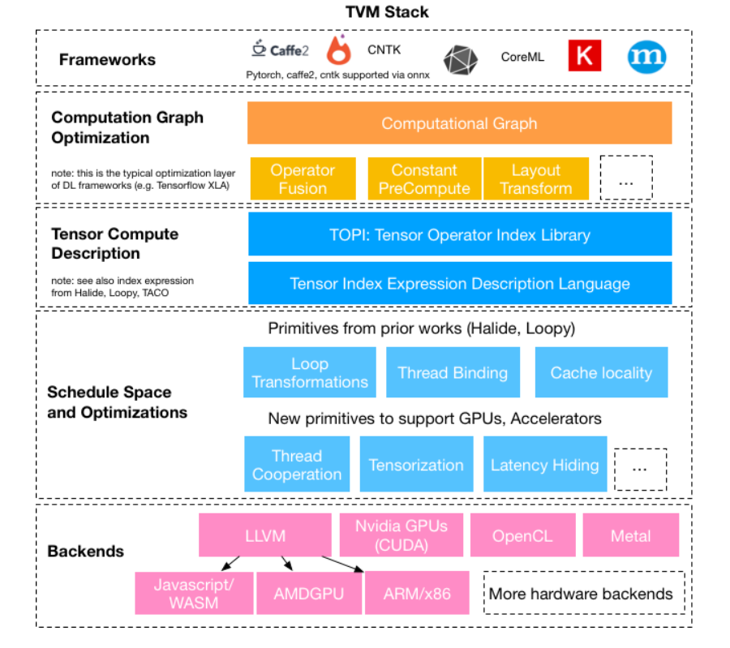
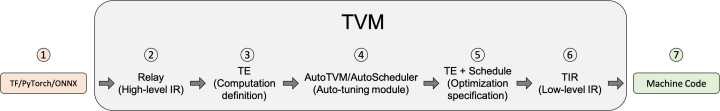
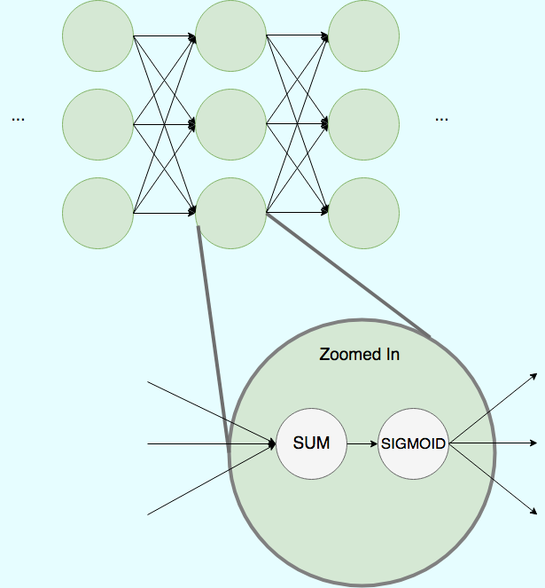
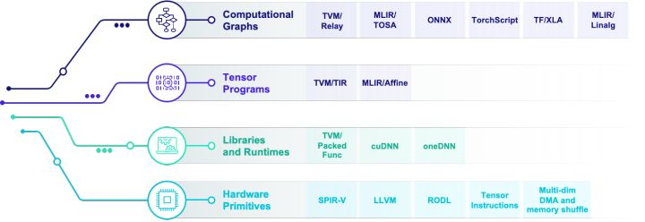
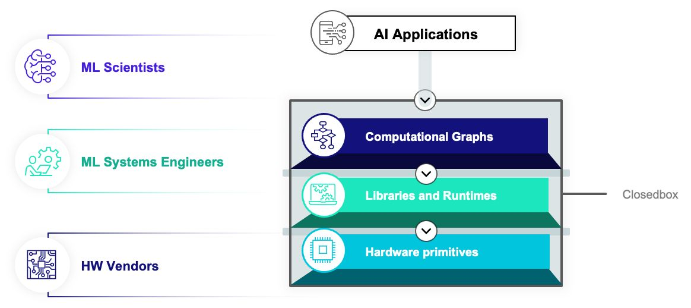
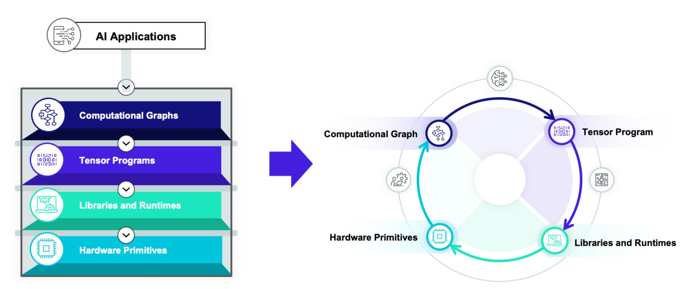
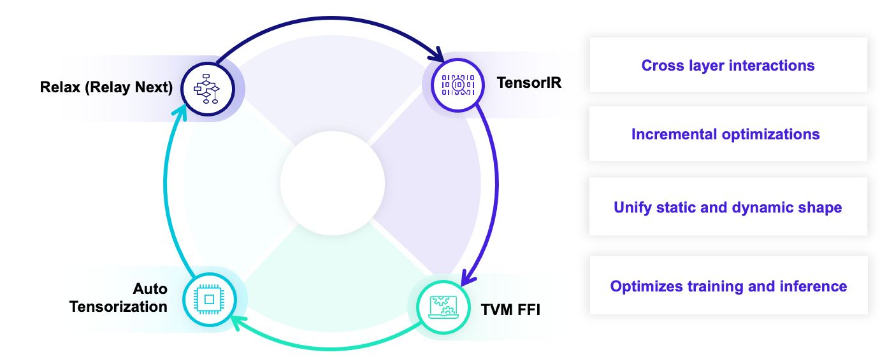
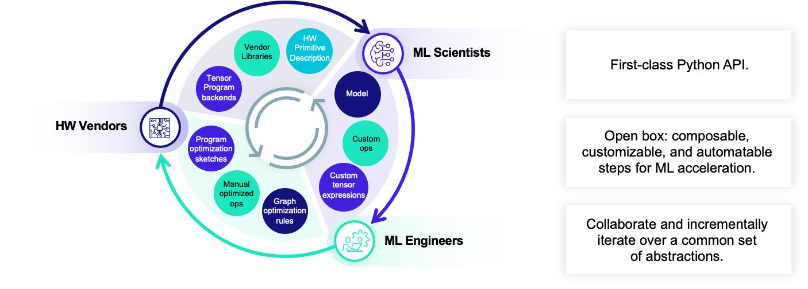
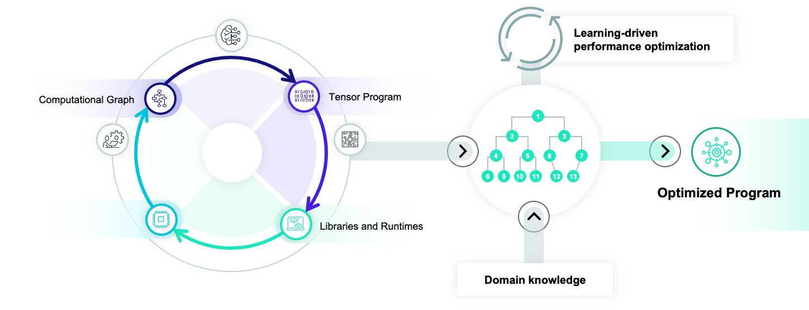
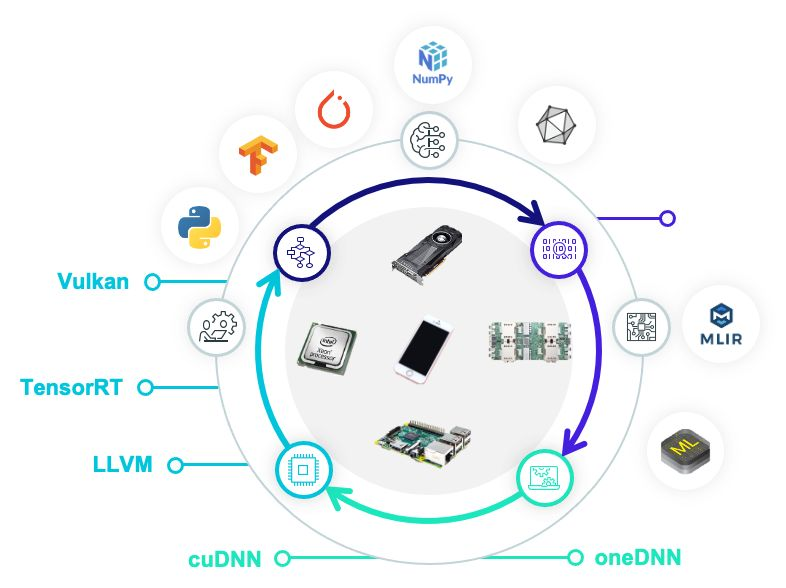

# TVM



## 1. TVM 简介

### 1.1 是什么

TVM是一个`端到端`的机器学习编译框架，它的目标是==优化机器学习模型让其高效运行在不同的硬件平台上==。

- 前端支持：TensorFlow, Pytorch, MXNet, ONNX等几乎所有的主流框架。

- 后端支持：CUDA,ROCm,Vulkan,Metal,OpenCL,LLVM,C,WASM及不同的设备平台(GPU,CPU,FPGA及各种自定义NPU)。

### 1.2 做什么

- **作为使用者：** 使用TVM导入训练好的模型，进行优化，编译到特定目标平台，运行模型。
- **作为开发者：** 绝大部分使用者其实也是TVM的开发者。开发者使用TVM通常是为了支持新的硬件平台，为此除了==添加新的后端==，一般也需要配套扩展对应的算子以及调度策略等。

### 1.3 基本步骤



\1. **导入其他框架的模型**

\2. **将该模型转换成Relay**（TVM的高层级IR）

(注：目前正在开发Relay的迭代relax，见[Relax: TVM 的下一代图层级 IR - 知乎 (zhihu.com)](https://zhuanlan.zhihu.com/p/523395133))

>Relay支持特性： 
>
>- 传统数据流式的表示
>-   函数式语言风格的表示 
>- 两种风格的混合 Relay 能够进行图层次的优化 

\3. **将Relay转换成更细粒度的Tensor Expression(TE) Relay使用FuseOps 将模型划分成小的子图**，在此过程中可以使用一些schedule原语进行优化（如tiling, vectorization, parallelization, unrolling, and fusion） TOPI包含一些预定义的常用Operator。

\4.**搜索最佳调度策略**（AutoTVM或AutoScheduler） 

- **AutoTVM**: 模板化的自动调优模块。 常用算子的搜索模板也在TOPI中提供. 

- **AutoScheduler (a.k.a. Ansor)**: 无模板的自动调优模块，自动生成搜索空间

\5. **选择模型编译的最优配置**。 自动调优会生成JSON格式的优化记录.
\6. **编译生成Tensor IR **(TVM的低层级IR，相对于Relay）。 

TVM支持的后端包括:

- LLVM, 通过它可以生成llvm支持的所有硬件如x86, ARM.

- 特定编译器，如NVCC, NVIDIA的编译器。通过BYOC(Bring Your Own Codegen)框架实现

\7. **编译生成机器代码**。 TVM可以将模型编译成可链接的对象模块来通过轻量级的运行时来运行。 它提供多种语言的支持。TVM也支持将模型和运行时统一打包。

## 2. TVM 的发展

参考：

[新一代深度学习编译技术变革和展望 - 知乎 (zhihu.com)](https://zhuanlan.zhihu.com/p/446935289)

[Apache TVM Unity: a vision for the ML software & hardware ecosystem in 2022](https://tvm.apache.org/2021/12/15/tvm-unity)

### 2.1 现状——四类抽象


当前深度学习编译生态围绕着四类抽象展开：

- 计算图表示：**将深度学习程序表示为DAG**（有向无环图），然后进行类似于算子融合，改写，并行等高级优化。The computational graph abstraction encodes the flow of data between coarse-grained(粗粒度) tensor operators. Computational graphs are the high-level abstraction users interact with in TensorFlow, MXNet, and PyTorch.

> 在传统的深度学习框架中，模型被表示为计算图
>
> <center>
>     
>     
> </center>

- 张量程序表示:Tensor programs implement the code for operators in computational graph. Deep learning compliers generate the low-level C++ or CUDA code for computations like convolutions or matrix multiplications.
- 算子库和运行环境：Similary, libraries and runtimes include pre-written code to exectue and orchestare(预先编制的) tensor operations. BLAS packages and libraries like cuDNN provide extensively tuned operator  implementations for specific hardware targets.
- 硬件专用指令：Hardware primitives are at the bottom of the stack. Here, low-level assembly languages and hardware accelerator interfaces expose the raw capabilities of the machine.



### 2.2 问题——两向boundary

当前最大问题：==如何设计各个层级的抽象，并且对它们进行有效的整合==

当前大家都遵循一种**多层渐近优化(Multi-stage lowering)**的方式，这种方式的大致思路是我们在每一层抽象中采用一个(有时多个)中间表示，并在每一个层级(dialect，abstraction)做一些内部优化，然后把问题丢给下一个层级继续进行优化。



但是这样每一个层级抽象基本由一个比较独立的团体维护，**层与层之间往往比较松耦合**。

这可以主要分解为`horizontal boundaries`和`vertical boundaries` 。

\1. Horizontal boundaries

当前的编译优化方案主要分为两类：

一类是**以手工优化为主的算子库驱动方案(library driven)**。这类方案一般可以比较容易地让更多的优化专家加入，但本身也会带来较多的工程开销。

另一类是**以自动优化为主的编译方案(compliation driven)**。该方案往往能够带来更多的编译优化效果，但较难引入领域知识。

当前的框架基本都只是为了两者中的其中一个设计，而我们发现较好的解决方案往往同时需要机器学习工程师的输入和自动化。(Most deep learning frameworks are library-based, while most deep learning compilers cannot **incorporate libraries and runtimes**.)

Library-based stacks excel on standard styles of ML models because they benefit form years of engineering investment common operators. On the other side, **the flexibity and automation in compliation-based frameworks can be better for emerging models that require new operators**.


\2. Vertical boundaries

Vertical boundaries exist in both styles of software stack. (mostly, due to multi-stage lowering)

我们往往把不同层级的抽象分开来设计，虽然在抽象内部可以做到比较灵活的优化，但是**在一个抽象到另外一个抽象转换时候往往需要通过translator或者lowering批量转换**。这将导致我们在两类抽象的边界上耗费较多的精力。而且往往这种转换是单向的，并不能将后层的信息反馈给前层进行指导优化。(很多张量程序优化本身可以反过来指导计算图层级的算子融合和数据排布，但是单向架构较难利用这一反馈。)

Frameworks choose data layout and operator fusion strategies at the graph level; then the tensor computations carry out the operators selected in the computational graph; and these operators map onto a fixed set of hardware primitives. It’s a one-shot, unidirectional workflow: performance constraints at the level of tensor programs, for example, cannot feed back to influence the data layout at the computational graph level. And incorporating custom hardware typically means manually propagating new features through all three layers.

Summary：TVM和MLIR一类基础框架的出现，让我们已经可以比较容易地搭建出某一个层级的抽象或者dialect并且让它们之间通过multi-stage lowering的方式从高到低级抽象进行逐层变换和转换，但难点出现在抽象的转换边界上。

### 2.3 未来——从箭头到圈

The goal is to enable cross-layer interactions and automate their optimization. TVM Unity will build interfaces for the abstractions to ineract and exchange infromation. 

TVM团队为了实现上述目标，演化到新一代深度学习编译系统的核心技术路线——`TVM Unity`。



整个技术路线包含三大关键点：

- Unify：统一多层抽象
- Interact：交互开放迭代
- Automate：自动优化整合

\1. **Unify：统一多层抽象(Unifying Abstractions )**

我们承认每一类抽象的重要性，但是需要在不同类别的抽象之间进行协同设计，并且可以让每一个层级和其它层级进行交互。



TVM的重点主要放在四个抽象上：

`Relax(Relay Next)`：relay的进一步迭代(见[Relax: TVM 的下一代图层级 IR - 知乎 (zhihu.com)](https://zhuanlan.zhihu.com/p/523395133)))，直接引入first class symbolic shape的支持。

`TensorIR`：负责张量级别程序和硬件专用指令的整合。

`TVM FFI(PackedFunc)`：使我们可以灵活地引入任意的算子库和运行库函数(library and runtime)，在各个编译模块和自定义模块里面相互调用。

`AutoTensorization`：用来解决硬件基元(hardware primitive)和张量程序(tensor programs)对接。

```python
import tvm.script
from tvm.script import tir as T, relax as R

@tvm.script.ir_module
class MyIRModule:
    # Define a TIR based operation.
	@T.prim_func
	def tir_mm(X: T.Buffer[(n, d), "float32"],
                   W: T.Buffer[(d, m), "float32"],
                   Y: T.Buffer[(n, m), "float32"]):
        for i, j, k  in T.grid(n, m, d):
            with T.block("body"):
                vi, vj, vk = T.axis.remap("SSR", [i, j, k])
		with T.init():
            Y[vi, vj] = 0
        # Can be mapped on to HW intrinsics.
        Y[vi, vj] += X[vi, vk] * W[vk, wj]

	@R.function
	def relax_func(x: R.Tensor[(n, d), "float32"], w: R.Tensor[(d, m), "float32"]):
        with R.dataflow()
            # Invoke the TIR code.
            lv0: R.Tensor[(n, m), "float32"] = R.call_dps((n, m), tir_mm, [x, w])
            lv1: R.Tensor[(n * m,), "float32"] = R.flatten(lv0)
            gv0: R.Tensor[lv2, "float32"] = R.exp(lv1)
            R.output(gv0)

        # Invoke external update rule.
        R.call_packed("custom_inplace_update", gv0)
        return gv0
```

以上这个程序样例就展示了我们统一抽象的设计目标。这是一个通过TVMScript表示的IRModule。MyIRModule是包含了两种函数。其中tir_mm是一个TensorIR级别的函数。新一代的TensorIR的设计目标是实现 ==张量程序和硬件专用指令之间的通过自动张量化的联动==。再看relax_func这个函数。其中有几个关键点。R.call_dps((n, m), tir_mm, [x, w])是在计算图级别直接对于TensorIR函数tir_mm的直接调用。并且我们通过特殊的调用形式使得张量程序依然以和图算子一样的方式出现在计算图中。支持这一特性意味着计算图需要和张量程序层级表示进行联合设计，使得计算图的优化可以利用张量程序层级的信息。最后 R.call_packed("custom_inplace_update", gv0) 允许计算图直接和TVM FFI函数进行交互。

Our particular example shows interactions between: (1) **computational graph and tensor programs**; (2) **computational graph and runtime libraries**; (3) Finally **tensor programs and hardware primitives** through on-going automatic tensorization developments in TensorIR.

>多层抽象之间的相互统一整合还有一些其他优势，例如快速算子优化：
>
>在传统的编译流程中常见的做法是引入在每个层级引入新的改写规则。但是在统一抽象下，我们可以**直接引入一个pass把一个局部算子先改写成call_packed调用一个手写的外部算子**。在确认性能合理的情况下再考虑如何把一个局部改写变成更加自动化的方案。同样我们也可以把手工算子和自动代码生成的方案更加有机地整合在一起。最后，因为对于TensorIR程序的调用直接被表示再图程序中，我们可以直接把对于TensorIR的改写优化变成对于对应计算图的调用改写，使得张量级别变换的信息可以反馈到图级别的变换中去。

\2. **Interact：交互开放迭代**

Better ML systems require collaboration between ML scientists, ML engineers, and hardware engineers. 算法专家希望开发新的模型和自定义算子，机器学习系统工程师需要开发系统优化，硬件厂商需要迭代自己的硬件。每一类人都会变对不同层级的抽象。

At the highest level, an ML scientist can specify the `operator` they need to construct the next generation of a model. ML engineers can work at the `tensor computation` level to make this new operation efficient. Finally, these tensor computations can rely on `hardware primitives` written by hardware engineers. The work at each level will interact through `Python APIs` within the TVM ecosystem. 



\3. **Automate：自动优化整合**

A unified ML system creates a new, larger search space than a system stack with strict boundaries. Decisions within tensor computations can influence the structure of the operator graph, and new hardware primitives can drastically change the optimal mappings at every other layer. TVM Unity will expose all these cross-layer interactions for automated optimization. 



- Learning-driven optimization：==using ML to optimize ML by exploring the expanded joint search space and minimize the computational cost==.

-  Domain knowledge：==leverage domain experts’ help== when possible, and ==create mechanisms to effectively incorporate domain information== to help guide the automatic optimizations.

### 2.4  New Capabilities with Unity

只有当把这个圈和整个机器学习和硬件生态一起整合的时候我们才可以发挥最大的效率。而抽象的整合使得我们可以更加容易地提供更多种整合方式。我们可以通过子图整合把TVM整合入已有的框架中，也可以把常见的硬件后端整合入TVM本身。统一的抽象可以使得这样的整合以相对统一的方式发生在各个层级。



With TVM Unity, hardware vendors will easily onboard into TVM via a simple set of operators and then incrementally transition to compilation-based integration for better flexibility. This way, new hardware capabilities can get started improving AI applications without reinventing the whole system stack.

