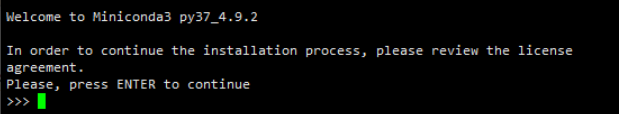
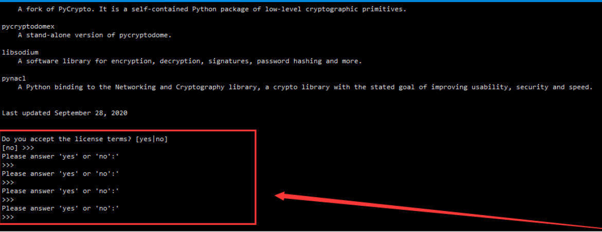
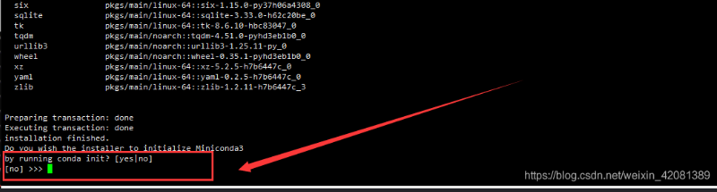
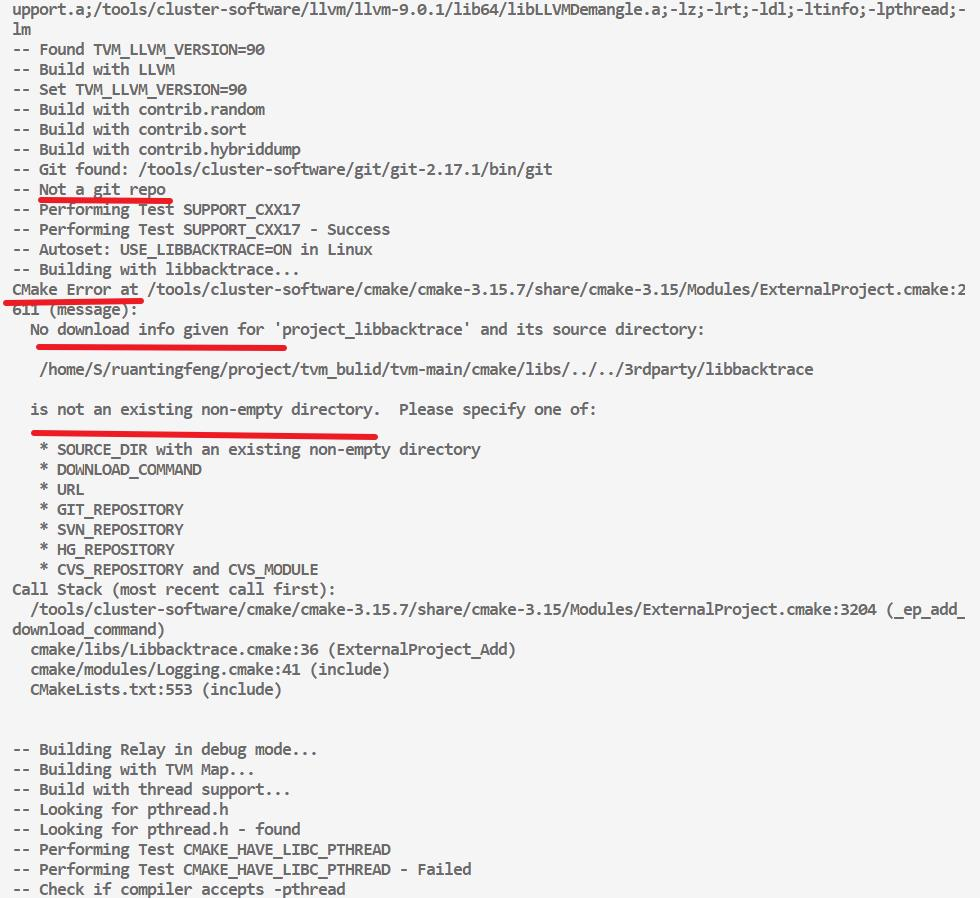
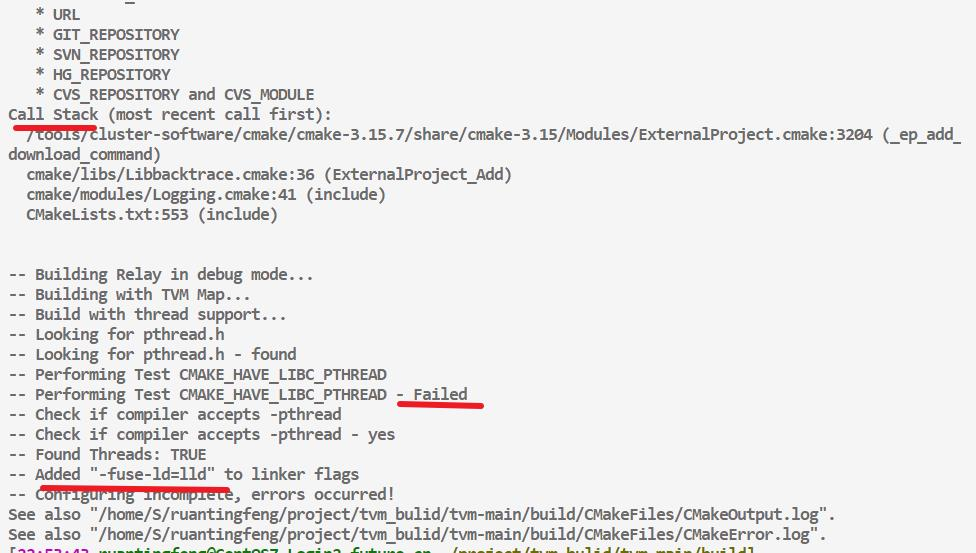

# 深度学习编译器[0]——TVM的编译与安装

**讲在前头：本文是本人在许多朋友、网络资料的帮助下，依旧踩了无数坑(我好没本事┭┮﹏┭┮)，最后完成在服务器(CentOS7)上安装 TVM0.9 + python3.7 的记录，希望对你们有点帮助(＾Ｕ＾)ノ**

本文所配置的服务器没有`sudo`权限，并且我都是以自己的路径为例，务必**根据自己的情况进行调整**！！

## 0. 前言

在本节，将介绍服务器配置python开发环境，只需要了解TVM安装的读者请到下一节。

而且本节介绍的并不是直接在服务器中`wget`，而是在windows中下好后，使用git上传到服务器上(谁让我一开始只找到这个方法呢qwq)。

本节参考：[ centos7安装miniconda](https://blog.csdn.net/weixin_42081389/article/details/117322323)

### 0.1 下载miniconda

使用conda能更方便地进行环境建立与管理，而`miniconda`具备我们在服务器上使用所需要的一切功能，且体积较小，故采用miniconda配置服务器python环境。

> 我们直接去国内的清华源下载，下载链接地址：
>
>  https://mirrors.tuna.tsinghua.edu.cn/anaconda/miniconda/
>
> 具体下载哪个，要根据自己的服务器来配置。

由于TVM目前对**python3.7以及3.8支持较好**，使用更高的3.9及以上版本可能并不支持，所以我们需要限制miniconda的版本。我使用的是`Miniconda3-py37_4.9.2-Linux-x86_64.zip`，我也将我使用的安装包放在下面：

> miniconda安装包 和 tvm0.9 源码
>
> 链接：https://pan.baidu.com/s/1myWDBcBUO6BR7bHw08ik5A?pwd=7ged 
> 提取码：7ged

### 0.2 上传到服务器并解压

下载到本地后，进入压缩包所在文件夹，右键`Git Base Here`，然后使用`scp`命令，命令格式如下，然后输入自己的密码即可

```cpp
scp local_file remote_username@remote_ip:remote_folder
```

例如我执行的指令：`scp -r Miniconda3-py37_4.9.2-Linux-x86_64.zip ruantingfeng@62.234.201.16:/home/S/ruantingfeng/python_env/conda_env`

务必提前在服务器中建立相应的文件夹！

上传完成后，在服务器中进入相应的文件夹，执行`unzip Miniconda3-py37_4.9.2-Linux-x86_64.zip`，解压获得 Miniconda3-py37_4.9.2-Linux-x86_64.sh 文件。

### 0.3 安装

执行 `sh Miniconda3-py37_4.9.2-Linux-x86_64.sh` 启动安装

<div style="text-align: center;"></div>

回车下一步，然后然后长按`enter`，直到出现让输入`yes/no`

<div style="text-align: center;"></div>

输入 yes 即可，然后回需要输入你需要安装的地址，我这里直接安装到/home/S/ruantingfeng/miniconda/

<div style="text-align: center;"></div>

installer to initialize Miniconda3 ，输入`yes`，回车

<div style="text-align: center;"></div>

### 0.4 设置环境变量

实验室内的服务器是在 `.bashrc`中设置相关的环境变量

VIM基本使用： [vim基本操作](https://www.jianshu.com/p/e2a85cc01bcc)

```cpp
vim ~/.bashrc
```

按`i`进入输入模式，在后面加上(这个和你的安装路径相关)，

```cpp
export PATH=/home/S/ruantingfeng/miniconda3/bin:$PATH
```

然后按`esc`退出编辑模式，按`:wq`保存并退出，再激活配置文件

```cpp
source ~/.bashrc
```

然后使用`conda -V`检测是否安装成功

### 0.5 conda换源以及设置

我们会发现每次开启终端都会自动激活conda base环境，我们可以使用

```cpp
conda config --set auto_activate_base false
```

来关闭，这样每次重新连接终端就不会自动激活base环境了。

然后进行conda换源，`.condarc`文件一般在`.bashrc`同路径下，

<div style="text-align: center;"></div>

```cpp
vim ~/.condarc
```

把以下内容复制到文件里面

```python
channels:
  - defaults
show_channel_urls: true
default_channels:
  - https://mirrors.tuna.tsinghua.edu.cn/anaconda/pkgs/main
  - https://mirrors.tuna.tsinghua.edu.cn/anaconda/pkgs/r
  - https://mirrors.tuna.tsinghua.edu.cn/anaconda/pkgs/msys2
custom_channels:
  conda-forge: https://mirrors.tuna.tsinghua.edu.cn/anaconda/cloud
  msys2: https://mirrors.tuna.tsinghua.edu.cn/anaconda/cloud
  bioconda: https://mirrors.tuna.tsinghua.edu.cn/anaconda/cloud
  menpo: https://mirrors.tuna.tsinghua.edu.cn/anaconda/cloud
  pytorch: https://mirrors.tuna.tsinghua.edu.cn/anaconda/cloud
  pytorch-lts: https://mirrors.tuna.tsinghua.edu.cn/anaconda/cloud
  simpleitk: https://mirrors.tuna.tsinghua.edu.cn/anaconda/cloud
```

保存退出后，使用`conda config --show`即可配置的源，最后使用`conda update --all`，完成python环境配置。

### 0.6 常用conda命令

```python
conda create -n B --clone A       // 克隆环境A来创建名为B的环境
conda activate xxxx               // 开启xxxx环境
conda deactivate                  // 关闭环境
conda info -e                    // 显示所有的虚拟环境
conda remove -n xxxx --all       // 删除已创建的xxxx虚拟环境

conda update --all               // 更新环境中的包

conda clean -p      // 删除没有用的包
conda clean -t      // tar打包

conda config --show   // 查看全部配置
```

## 1. 下载、编译、安装、测试

本节默认大家已经安装好cmake、llvm、gcc环境，环境参考如下，将此条件下于linux系统上从头开始构建和安装 TVM0.9 软件包。

> 本文成功安装所基于的环境：(llvm和gcc版本造成了编译中的一些问题)
>
> - CentOS7
> - llvm/8.00
> - gcc/9.3.0
> - cmake/3.15.7

参考：[从源码安装 — TVM 文档 (daobook.github.io)](https://daobook.github.io/tvm/docs/install/from_source.html)

(这个文档的流程比较冗余，请选择性食用

### 1.0 安装必要的依赖

(1) linux相关的依赖

> [从源码安装 — TVM 文档 (daobook.github.io)](https://daobook.github.io/tvm/docs/install/from_source.html) ： 要在 Ubuntu/Debian 等 linux 操作系统上安装这些最小的先决条件，请执行（在终端）
>
> ```python
> sudo apt-get update
> sudo apt-get install -y python3 python3-dev python3-setuptools gcc libtinfo-dev zlib1g-dev build-essential cmake libedit-dev libxml2-dev
> ```

由于实验室内的服务器个人没有root权限，但linux相关的依赖(`libtinfo-dev zlib1g-dev build-essential cmake libedit-dev libxml2-dev`)服务器上都配置好了，所以我并没有使用上面的命令，只需要考虑python相关的依赖。

(2) python相关的依赖

请务必确保安装环境中的python版本为`3.8或者3.7`，**tvm对其他python版本可能不支持**。如果你使用conda管理python环境，可以`conda create --n tvm_build python=3.8.2`新建一个python环境，再我们安装后续tvm可能使用的python库函数。我以安装到base环境中为例

```python
conda activate base
conda install pip3 numpy decorator attrs tornado psutil xgboost cloudpickle
conda deactivate
```

### 1.1 下载源码

源码存在两种下载方式：

(1) 从下载页面[Download (apache.org)](https://tvm.apache.org/download)直接下载

这种方法强烈建议，尤其是你的**服务器没有挂代理**，简单且代码全面(后续可能遇见的一些报错大概率是由于源码不全造成的)。但下载网页上最新tvm源码版本只更新到0.9，得使用git clone才能获取最新的0.10，对于学习够用了。

(2) 从 github 克隆源码 repo重要的是，一定要用 `--recursive` 选项来克隆子模块

```cpp
git clone --recursive https://github.com/apache/tvm tvm
```

如果不使用`--recursive` 选项，将只能下载到`tvm-main`模块，缺少编译时必要的子模块，但如果服务器没有代理，基本上不可能下载下来。下图就是因为tvm源码不全造成的问题：

<div style="text-align: center;"></div>

> 我还尝试过在本地(windows)挂代理，执行下述指令
>
> ```cpp
> git clone --recursive https://github.com/apache/tvm tvm
> git submodule init
> git submodule update
> ```
>
> 再压缩成zip，上传到服务器，但是这样下载出来的源码存在问题，在服务器上编译不会通过！

本文采用的第一种方法，从下载页面[Download (apache.org)](https://tvm.apache.org/download)直接下载，然后使用`scp`推送给服务器(见本文的0.2节)，例如我执行的指令如下(记得要提前建立相关文件夹)：

```cpp
scp -r apache-tvm-src-v0.9.0.tar.gz ruantingfeng@62.234.201.16:/home/S/ruantingfeng/project/tvm
```

然后进入相关文件夹并解压源码(第三行相当于apache-tvm-src-v0.9.0文件夹重命名为tvm文件夹)

```cpp
cd /home/S/ruantingfeng/project/tvm
tar -zxvf apache-tvm-src-v0.9.0.tar.gz
mv apache-tvm-src-v0.9.0 tvm 
cd tvm
```
解压完成时，tvm文件夹有如下内容

<center>
    
</center>

### 1.2 配置config.cmake

```python
mkdir build
cp cmake/config.cmake build
cd build
```

`mkdir build`是为了将build时和源码隔离开，这样的话，**如果在后续编译(`cmake ..`或`make -j4`)时出现问题，可以直接将build文件夹删除掉(rm -rf build)，重新执行上述三个指令**。

我们需要编辑`config.cmake`来定制编译选项，请**务必认真阅读config.cmake中的内容**。

- 如果要使用某些后端和库(如CUDA, OpenCL, RCOM, METAL, VULKAN,等)。这里以CUDA为例，将 set(USE_CUDA OFF) 修改为 set(USE_CUDA ON)，其他库同理。

- 为了帮助调试，需要启用嵌入式图形执行器和调试功能 set(USE_GRAPH_DEBUG ON) 、 set(USE_PROFILER ON)

- 如果要调试 IR，要启用 set(USE_RELAY_DEBUG ON) ，并在`.bashrc`中设置环境变量：

  ```python
  export TVM_LOG_DEBUG="ir/transform.cc=1;relay/ir/transform.cc=1"
  ```

- tvm需要使用llvm构建，需要 LLVM  路径，设置 set(USE_LLVM /path/to/your/llvm/bin/llvm-config)
  ```python
  # 例如我的
  set(USE_LLVM "/tools/cluster-software/llvm/llvm-9.0.1/bin/llvm-config")
  ```
  如果你是 PyTorch 的用户，建议设置 (USE_LLVM "/path/to/llvm-config --link-static") ，并且**加上** set(HIDE_PRIVATE_SYMBOLS ON)，以避免 TVM 和 PyTorch 使用的不同版本 LLVM 之间的潜在 symbol 冲突。


提供我所使用的项目(相对原文件修改的内容)作为参考

```python
# 使用llvm编译
set(USE_LLVM "/tools/cluster-software/llvm/llvm-9.0.1/bin/llvm-config --link-static")
set(HIDE_PRIVATE_SYMBOLS ON)
# 调试 IR
set(USE_RELAY_DEBUG ON)
# 使用onnx，需要你的python环境中已经安装有onnx
set(USE_TARGET_ONNX ON)
# 使用pytorch，需要你的python环境中已经安装有pytorch
set(USE_PT_TVMDSOOP ON)
# 关掉这个可以解决掉make时的某个warn
set(USE_LIBBACKTRACE OFF)
```

### 1.3 编译源码
```python
cmake .. 
make -j4
```
(1) 使用`cmake..`根据config.cmake建立makefile。

**此时报错大部分是因为源码下载不全出现的问题**，例如

<center>
    
    
</center>


如果源码下载完全，且conifg.make更改的语法正确，`cmake ..`一般不会报错。

最后输出得到

<div style="text-align: center;"></div>

(2) 使用`make -j4`开始编译

当然，根据服务器性能，可以使用更多的线程参数，我使用的就是`make -j32`

运行获得

<div style="text-align: center;"></div>

(3) 在`make -j4`步骤可能遇见的问题

① gcc版本问题 —— g++: error: unrecognized command line option ‘-fuse-ld=lld’

当你运行时报错如下 ，是因为gcc版本可能过低，我遇见下面问题时的环境是 `gcc/7.5.0 、cmake/3.15.7 、 llvm/9.0.1`

```cpp
[ 21%] Built target tvm_runtime_objs
Scanning dependencies of target tvm_runtime
[ 22%] Linking CXX shared library libtvm_runtime.so
g++: error: unrecognized command line option ‘-fuse-ld=lld’; did you mean ‘-fuse-ld=bfd’?
make[2]: *** [libtvm_runtime.so] Error 1
make[1]: *** [CMakeFiles/tvm_runtime.dir/all] Error 2
make[1]: *** Waiting for unfinished jobs....
```

但网络上各种博客[TVM：源码编译安装](https://blog.csdn.net/weixin_44966641/article/details/121176854)的编译环境中gcc版本也都是 gcc/7.5.0 ，我也不知道为什么我会遇见问题。在学长的建议下，我更换使用了 `gcc/9.3.0` ，这样运行就不会报上述问题。

② llvm版本问题 —— ld.lld: error: undefined symbol

在解决上述问题后，我遇见了下一个问题(忘了截图了qwq)，遇见下面问题时的环境是 `llvm/9.0.1、gcc/9.3.0 、cmake/3.15.7 `

**在 Linking CXX shared library libtvm_allvisible.so 时候报错一堆 ld.lld: error: undefined symbol**

学长指出应该是LLVM版本存在问题，他推荐使用llvm/8.0.0，然后我就将原有的llvm/9.0.1卸载，重新安装了llvm/8.0.0，参考：[centos7编译安装llvm8.0.0](https://blog.csdn.net/xingyu97/article/details/97113122)，完美运行。

### 1.4 安装tvm

(1) 方法一：通过 `setup.py` 安装

我们当前在`tvm/build`目录下，需要进入`tvm/python目录`执行`setup.py`，我以安装到conda base环境中为例，在命令行中执行以下指令

```python
cd ..
cd python
conda activate base
python setup.py install --user
conda deactivate
```

这样就完成了安装

(2) 方法二：设置环境变量安装

在 `~/.bashrc` 中添加以下内容，其中 `PYTHONPATH` 来告诉 python 在哪里找到这个库。一旦你拉出代码并重建项目，这些变化将立即反映出来。添加完成后再使用`source ~/.bashrc`立即写入环境。

理论上这样就不需要再次调用 `setup`，但这种方法对我没用，所以我还是使用了第一种。

```cpp
export TVM_HOME=/path/to/tvm
export PYTHONPATH=$TVM_HOME/python:${PYTHONPATH}
```

### 1.5 测试安装是否成功

(1) 方法一：直接导入

激活环境并进入python环境

```python
conda activate base
python3
```

导入tvm包

```python
import tvm
print(tvm__version__)
```

输出如下即可

<div style="text-align: center;"></div>

```python
from tvm import te
n = te.var("n")
A = te.placeholder((n,), name="A")
B = te.placeholder((n,), name="B")
C = te.compute(A.shape, lambda i:A[i]+B[i], name="C")
```

<div style="text-align: center;"></div>

(2) 方法二：Google Test

我们使用 [Google Test](https://github.com/google/googletest) 来驱动 TVM 中的 C++ 测试。安装 C++ Tests 的过程和 TVM 无关，为避免污染 TVM 目录，我们切换到其他文件夹下，执行如下命令：

```cpp
git clone https://github.com/google/googletest
cd googletest
mkdir build
cd build
cmake ..
make
make install
```

切换回 `tvm` 文件夹下，执行命令：

```cpp
./tests/scripts/task_cpp_unittest.sh
```

理论上如无报错，TVM 安装成功。

但可惜，我报错了，这应该是内部代码做检查用的，应该没影响(自我安慰)。

<div style="text-align: center;"></div>

## 结语

到这里tvm和相关的python环境就完成配置了，但一千个人有一千个哈姆雷特，每个人的服务器环境也都有一定区别，希望你能顺利安装！

由衷感谢室友以及学长的悉心帮助~

相关链接： 

[深度学习编译器[1]——TVM简介和发展 - 知乎 (zhihu.com)](https://zhuanlan.zhihu.com/p/564262811)

