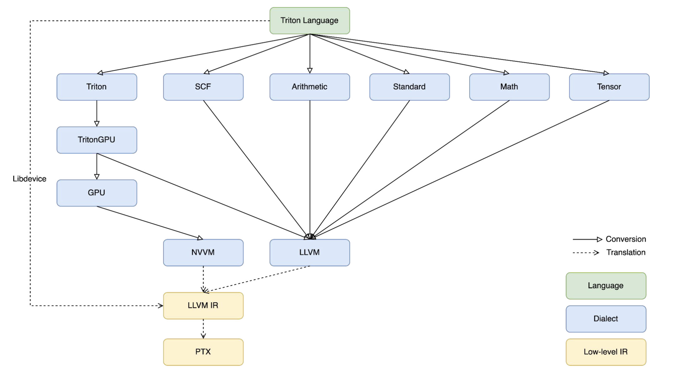
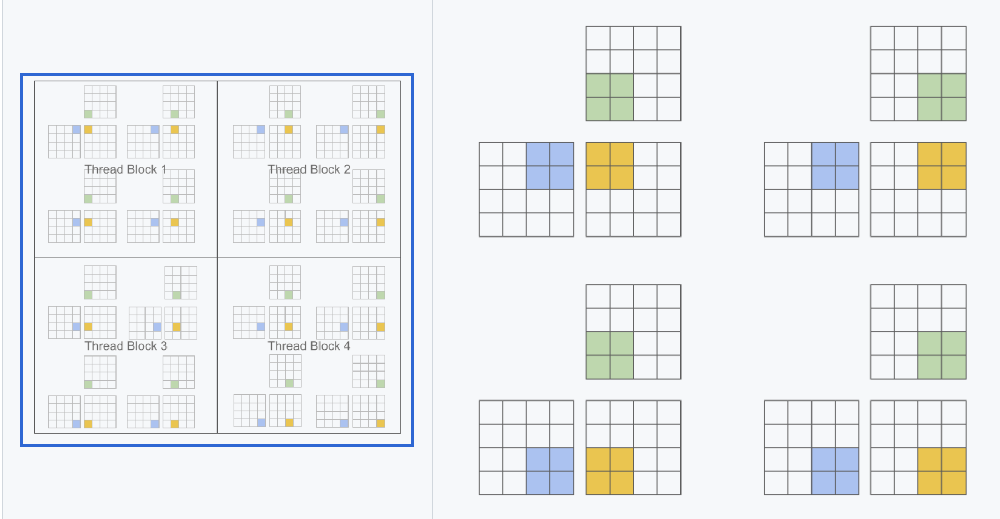

# triton language

## cuda vs triton

<div style="text-align: center;"></div>

gpu架构图如下

<div style="text-align: center;"></div>

## triton compiler

<div style="text-align: center;"></div>

为了支持多后端

<div style="text-align: center;"></div>

## 🌰：add

```python
import torch

import triton
import triton.language as tl

@triton.jit
def add_kernel(x_ptr,  # *Pointer* to first input vector.
               y_ptr,  # *Pointer* to second input vector.
               output_ptr,  # *Pointer* to output vector.
               n_elements,  # Size of the vector.
               BLOCK_SIZE: tl.constexpr,  # Number of elements each program should process.
               # NOTE: `constexpr` so it can be used as a shape value.
               ):
    # There are multiple 'programs' processing different data. We identify which program
    # we are here:
    pid = tl.program_id(axis=0)  # We use a 1D launch grid so axis is 0.
    # This program will process inputs that are offset from the initial data.
    # For instance, if you had a vector of length 256 and block_size of 64, the programs
    # would each access the elements [0:64, 64:128, 128:192, 192:256].
    # Note that offsets is a list of pointers:
    block_start = pid * BLOCK_SIZE
    offsets = block_start + tl.arange(0, BLOCK_SIZE)
    # Create a mask to guard memory operations against out-of-bounds accesses.
    mask = offsets < n_elements
    # Load x and y from DRAM, masking out any extra elements in case the input is not a
    # multiple of the block size.
    x = tl.load(x_ptr + offsets, mask=mask)
    y = tl.load(y_ptr + offsets, mask=mask)
    output = x + y
    # Write x + y back to DRAM.
    tl.store(output_ptr + offsets, output, mask=mask)
```

1. `@triton.jit` 装饰器decorator，表示下面这段代码是一个triton kernel
2. `x_ptr, y_ptr` 指针，为其代表的tensor的第一个元素的地址。用来将数据load到memory
3. 输入中一般也有stride，对于n维的tensor a，a.stride()会输出一个n维数组。stride用来找每个元素的指针

```python
a = torch.rand([3,6])
a.stride() # (6, 1)
# 这里的第一个维度的 stride 是 6, 因为从 a[m, k] 的地址 到 a[m+1, k] 的地址,
```

1. 超参数 `tl.constexptr` ，对于不同的硬件使用时，最佳性能的参数可能是不同的，后续由 Triton compiler 来进行搜索不同的值
2. 虚拟循环 `pid = tl.program_id(axis=0)` ，每个kernel可能被执行多次
    1. program_id是这个虚拟的 for "循环" 里面的 index (第几次循环，实际中这些循环是并行)
    2. `axis` , 是说明 "循环"有几层，此处 axis = 0表示展开为1维来访问（维度概念类比memref的维度，第一维相当于memref的最内维）
    
    ```python
    pid = tl.program_id(axis=0)
    # 当访问数据总长256, BLOCK_SIZE=64
    # tl.arange(0, BLOCK_SIZE) -> [0, 63]
    # 0， 64， 128， 192
    block_start = pid * BLOCK_SIZE
    # 所以数据访问时是按照 [0:64, 64:128, 128:192, 192:256]
    offsets = block_start + tl.arange(0, BLOCK_SIZE)
    ```
    
    c. 调用kernel时，需要说明该kernel执行循环有几层，每层有几次，这就是 `grid` 的概念
    
3. 显示地load和store，批量数据处理，一次处理一个BLOCK_SIZE的数据，SIMD行为

```python
    # load 和 store 时都是使用基地址加偏移 获得一片数据，mask表示只获得这片数据中的一部分
    x = tl.load(x_ptr + offsets, mask=mask)
    y = tl.load(y_ptr + offsets, mask=mask)
    # 写回时也需要mask
    tl.store(output_ptr + offsets, output, mask=mask)
```

## SIMD对编程范式

比CUDA的SIMT编程范式，由多个thread并行处理

triton是SIMD编程范式，一次处理一片数据（基于block算法的编程范式）

<div style="text-align: center;"></div>


## 显式地load和store

（对标gather和scatter） load和store都是BLOCK为单位

```python
x = tl.load(x_ptr + offsets, mask=mask)
tl.store(output_ptr + offsets, output, mask=mask)
```

- offsets

offsets 为要处理数据的范围，由当前block_start和range计算而成

Block_Size是以tl.constexptr（超参数）形式传入，所以在auto_tuning时，会自动获取（访存+计算）最优的Block_Size

`pid = tl.program_id(axis=0)`  这表示了kernel需要几层循环包裹

```python
block_start = pid * BLOCK_SIZE
offsets = block_start + tl.arange(0, BLOCK_SIZE)
```

- mask

mask 为遮盖，类似decoder Attn中的mask。一是规范访存行为，防止越界；二是过滤对本次计算不必须的数据。

例如offset=1024，mask为一个1024维的数组，每个数为0/1，当某位为1时，则load该数据，当某位为0时，舍弃。

load：从DRAM读到SRAM

store：从SRAM写回DRAM

减少了DRAM上

## block-level control- and data-flow analysis

triton compiler依赖block-level control- and data-flow analysis来静态地schedule iterator blocks

离散优化：尽量保证数据加载连续性—>分析每一步操作并总结出stride和strideVal，最终用于静态信息将tl.load优化成tensor.extract_slice（下降结果ir中最耗时的是copy），比d2d的离散访存速度快

## grid：每个triton kernel跑在一个grid内

调用kernel时需要指明这个循环有多少层，每层多少次，这就是grid的概念

以Matmul而言，若A为MxK，B为KxN，那么C的大小就是MxN（M和N为parallel axis大小，K为reduction轴大小）

每次分块计算，单块大小BLOCK_SIZE_M x BLOCK_SIZE_N，总共进行 $\frac{M}{\text{BLOCK\_{SIZE}\_{M}}} \times \frac{N}{\text{BLOCK\_{SIZE}\_{N}}}$​​次

Triton中关于grid定义：

```python
    grid = lambda META: (
        triton.cdiv(M, META['BLOCK_SIZE_M']) * triton.cdiv(N, META['BLOCK_SIZE_N']),
    )
    matmul_kernel[grid](
        a, b, c,
        M, N, K,
        a.stride(0), a.stride(1),
        b.stride(0), b.stride(1),
        c.stride(0), c.stride(1),
        ACTIVATION=activation
    )
```

对比Cuda中launch kernel的行为

```cpp
    dim3 block(BLOCK_SIZE_M, BLOCK_SIZE_N);  
    dim3 grid((M + BLOCK_SIZE_M - 1) / BLOCK_SIZE_M, (N + BLOCK_SIZE_N - 1) / BLOCK_SIZE_N);
    matmul_kernel<<<grid,block>>>(Ad, Bd, Cd, M, N, K);
```


下面的group-order的行为能获得更好的data-reuse

<div style="text-align: center;"></div>

分析：A和B中的内容都是行优先存储，以计算九个数为例，那么原始的一次load需要9+9$\times$9=90次read和9次write。而group order中，一次load需要9$\times$3+3$\times$9=54次read和9次write

- num_pid_m 和 num_pid_n 就是为来获得矩阵长宽各可以分为多少个block（上图的黄色小块）

```python
pid = tl.program_id(axis=0)
# number of program ids along the M / N axis 
num_pid_m = tl.cdiv(M, BLOCK_SIZE_M)
num_pid_n = tl.cdiv(N, BLOCK_SIZE_N)
```

- num_pid_in_group 代表了上图的红色框 (高是 `GROUP_SIZE_M` , 宽是 `num_pid_n`)中包含多少个黄色小块，这样一个红色框叫一个group

```python
# number of program in group
num_pid_in_group = GROUP_SIZE_M * num_pid_n
```

- group_id表示当前循环iter是在哪个红色框内

```python
# id of the group which related to this program
group_id = pid // num_pid_in_group
```

- first_pid_m 表示当前所在的的group内的第一个黄色block是全局的第几个黄色block（从m的维度上看）

```python
# row-id of the first program in the group
first_pid_m = group_id * GROUP_SIZE_M = (pid // (GROUP_SIZE_M * num_pid_n)) * GROUP_SIZE_M
```

- 重复计算下group_size_m，防止越界

```python
group_size_m = min(num_pid_m - first_pid_m, GROUP_SIZE_M)
```

- 得到当前循环需要处理哪个块 [pid_m, pid_n]

pid_m ≤ first_pid_m + group_size_m

pid_n 是从左到右一列列来的，000111222

```python
# row-id of the p in the launch grid
pid_m = first_pid_m + pid % group_size_m # 行id
# col-id of the p in the launch grid
pid_n = (pid % num_pid_in_group) // group_size_m # 列id
# num_pid_in_group = GROUP_SIZE_M * num_pid_n
```

a_ptr 是A矩阵第一个元素的地址

`offs_am` 和 `offs_bn` 是 A 矩阵 9 个 block 中第一个 block 中, 每个元素在整个 A 矩阵中的坐标，即 m 维度的 index 和 k 维度的 index

```python
    # `a_ptrs` is a block of [BLOCK_SIZE_M, BLOCK_SIZE_K] pointers
    # `b_ptrs` is a block of [BLOCK_SIZE_K, BLOCK_SIZE_N] pointers
    offs_am = (pid_m * BLOCK_SIZE_M + tl.arange(0, BLOCK_SIZE_M)) % M
    offs_bn = (pid_n * BLOCK_SIZE_N + tl.arange(0, BLOCK_SIZE_N)) % N
    offs_k = tl.arange(0, BLOCK_SIZE_K)
    a_ptrs = a_ptr + (offs_am[:, None] * stride_am + offs_k[None, :] * stride_ak)
    b_ptrs = b_ptr + (offs_k[:, None] * stride_bk + offs_bn[None, :] * stride_bn)
```

```python
offs_cm = pid_m * BLOCK_SIZE_M + tl.arange(0, BLOCK_SIZE_M)
offs_cn = pid_n * BLOCK_SIZE_N + tl.arange(0, BLOCK_SIZE_N)
c_ptrs = c+ptr + stride_cm * offset_cm[:, None] + stride_cn * offset_cn[None, :]
c_mask = (offset_cm[:, None] < M) & (offset_cn[None, :] < N)
tl.store(c_ptrs, mask=c_mask)
```

计算循环，mask保证load和store不越界

```python
    for k in range(0, tl.cdiv(K, BLOCK_SIZE_K)):
        # Load the next block of A and B, generate a mask by checking the K dimension.
        a = tl.load(a_ptrs, mask=offs_k[None, :] < K - k * BLOCK_SIZE_K, other=0.0)
        b = tl.load(b_ptrs, mask=offs_k[:, None] < K - k * BLOCK_SIZE_K, other=0.0)
        # We accumulate along the K dimension.
        accumulator += tl.dot(a, b)
        # 计算下K个BLOCK
        a_ptrs += BLOCK_SIZE_K * stride_ak
        b_ptrs += BLOCK_SIZE_K * stride_bk
```

## 打印ir的方法

在kernel后增加

```python
     kernel = add_kernel[grid](x, y, output, n_elements, BLOCK_SIZE=1024)
     print(kernel.asm['ttir'])
     print(kernel.asm['ttgir'])
     print(kernel.asm['llir'])
     print(kernel.asm['ptx'])
```

## num_warp

一般体现在module Attr上

```python
"triton_gpu.num-warps" = 4 : i32
```

tritongpu ir相比ttir仅多了一个Blocked Layout，本质上描述的是Block对Memory的Access Pattern

```python
 #blocked = #triton_gpu.blocked<{sizePerThread = [1], threadsPerWarp = [32], warpsPerCTA = [4], order = [0]}>
```

就是一个Block里有4个Warp，一个Warp有32个Thread，一个Thread处理1个元素。

Blocked Layout只是一种Pattern，但按照这个Pattern会多次访问，总访问量达到BLOCK_SIZE

## layout

Layout：定义了Data是如何被Thread处理

- **Distributed Layout：**Blocked Layout, MMA Layout, DotOperand Layout都属于此类。这些Layout的特点都是映射函数会将特定的Tensor交给特定的Thread去处理，达到一个**distribution**的效果
- **Shared Layout：**GPU中的Shared Memory是可以被一个Block内的任意线程访问的，映射函数被定义为任意Tensor->任意Thread

### distributed layout

Distributed encodings have a layout function that is entirely characterized by a d-dimensional tensor L. Note that L doesn't need to have the same shape (or even the same rank) as the tensor it is encoding.

<div style="text-align: center;"></div>

### block layout

An encoding where each warp owns a contiguous portion of the target tensor. This is typically the kind of data layout **used to promote memory coalescing in LoadInst and StoreInst.**

`#blocked0 = #triton_gpu.blocked<{sizePerThread = [1, 8], threadsPerWarp = [8, 4], warpsPerCTA = [8, 1], order = [1, 0]}>`


- **sizePerThread = [1, 8]：每个线程处理数据Size**
- **threadsPerWarp = [8, 4]： warp内线程的布局**
- **warpsPerCTA = [8, 1]：CTA（Block）内warp的布局**
- **order = [1, 0]：按行访问**

该BLock访存模式一次能处理(1x8x8, 8x4) = (64, 32)规模的shape。但若输入op的shape为(128, 32)，那么让每个thread处理两个连续块即可，即第一个thread处理(0, 0:7), (64, 0:7)两个块

CTA（Cooperative Thread Array）：CTA是一个线程组，由一组线程组成，这些线程可以在GPU上的多个处理器中并行执行。**CTA中的线程可以协同工作，通过共享内存等方式进行通信和协作**。CTA通常是在CUDA编程模型中使用的概念，它是将工作任务划分为较小的线程块以便并行执行的基本单元。

**一个CTA通常由多个warp组成**。一个CTA的线程数量可以是32的倍数（例如，CTA可以有32、64、96等线程）。
CTA内的线程被划分为一组一组的warp，每个warp中的线程同时执行相同的指令。

CGA（Cooperative Grid Array）：CGA是一种更高级的概念，它是一组CTA的集合，可以在GPU上协同工作。CGA可以用于更大规模的并行计算，将任务划分为多个CTA进行执行，并且CTA之间可以通过全局内存进行通信和同步。

### shared layout

In order to **avoid shared memory bank conflicts**, elements may be **swizzled** in memory. 

同一个warp内的thread同时访问同一列的数据

<div style="text-align: center;"></div>

[http://www.giantpandacv.com/project/OneFlow/【BBuf的CUDA笔记】十三，OpenAI Triton 入门笔记一/](http://www.giantpandacv.com/project/OneFlow/%E3%80%90BBuf%E7%9A%84CUDA%E7%AC%94%E8%AE%B0%E3%80%91%E5%8D%81%E4%B8%89%EF%BC%8COpenAI%20Triton%20%E5%85%A5%E9%97%A8%E7%AC%94%E8%AE%B0%E4%B8%80/)