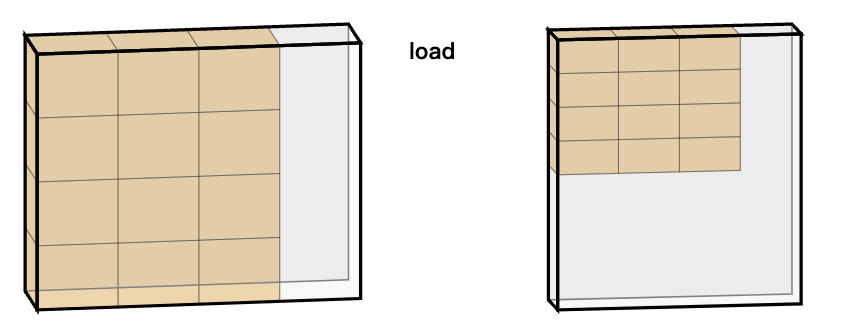
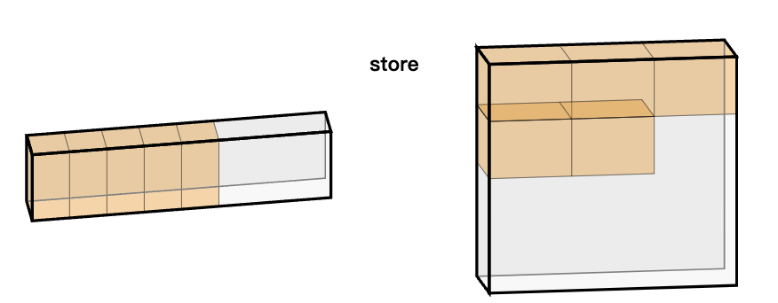
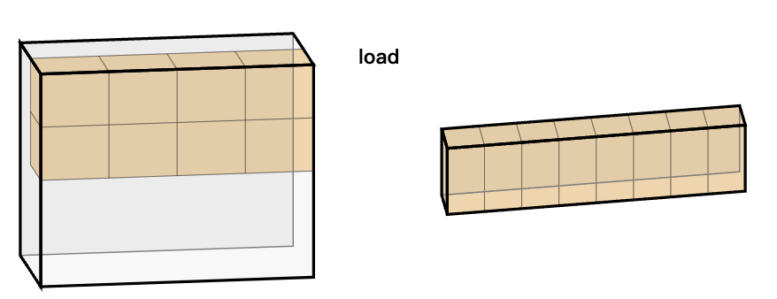
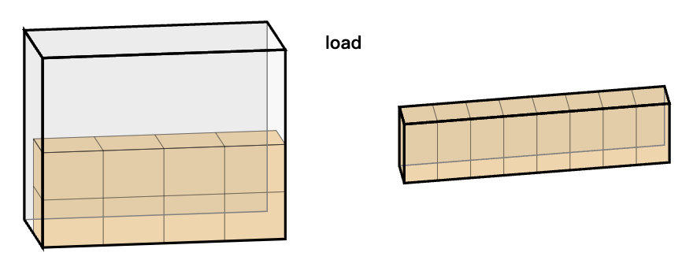
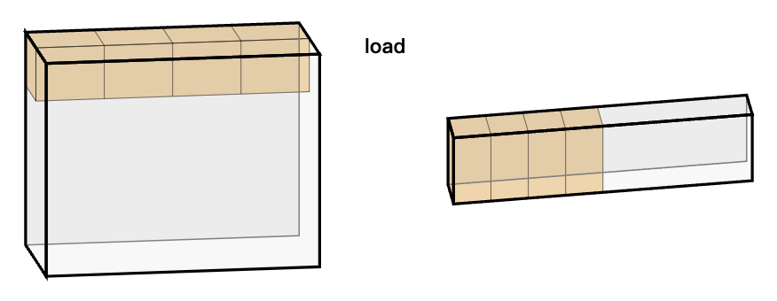

# [triton language](https://triton-lang.org/main/python-api/triton.language.html)

理解triton语法的repo：[triton-puzzles](https://github.com/srush/Triton-Puzzles)

[🌰: vector-add](./Triton_base.md##elements)

```python
import torch
import triton
import triton.language as tl
```

## detector

- triton.autotune：自动调优detector，用于自动找到最佳配置

使用上需要提供一个configs（包含在kernel中定义的 `tl.constexpr`）列表，autotune会多次运行kernel函数来评估configs中的所有配置。（配置是人为给出的，所以空间不大，依赖人为经验）

- triton.heuristics：启发式detector，根据输入参数动态调整 kernel 的行为

例如，如果B（偏置）不为None，则HAS_BIAS为真

```python
@triton.heuristics({"HAS_X1": lambda args: args["X1"] is not None})
@triton.heuristics({"HAS_W1": lambda args: args["W1"] is not None})
@triton.heuristics({"HAS_B1": lambda args: args["B1"] is not None})
```

## tl.constexpr

超参数，对于不同的硬件使用时，最佳性能的参数可能是不同的，其值由 Triton Compiler 进行搜索，会人为给一个由 **`@auto-tuning` 标记的 `configs`**（依赖人为经验）。

## Memory/Pointer Ops

```bash
load
store
make_block_ptr
advance
```


### [tl.load](https://triton-lang.org/main/python-api/generated/triton.language.load.html#triton.language.load) & [tl.store](https://triton-lang.org/main/python-api/generated/triton.language.store.html#triton.language.store)

load(*pointer*, *mask=None*, *other=None*, *boundary_check=()*, *padding_option=''*, *cache_modifier=''*, *eviction_policy=''*, *volatile=False*). 

主要是前三个参数：

- pointer: 输入的指针，直接传入对象数组即可
- mask: 保证read和write时的边界，只读这部分
- other: load后，其他区域的填充值

```python
@triton.jit
def demo(x_ptr):
    i_range = tl.arange(0, 8)[:, None]
    j_range = tl.arange(0, 4)[None, :]
    range = i_range * 4 + j_range # 这个4是步长，代表第一维每个数据之间差4
    print(range)
    x = tl.load(x_ptr + range, (i_range < 4) & (j_range < 3), 0)
    print(x)

demo(torch.ones(4, 4))
```

> 如果输入是多维的，在给range时一定要给正确的stride，不然会重复读

输出

```python
range = [[ 0  1  2  3] x = [[1. 1. 1. 0.]
         [ 4  5  6  7]      [1. 1. 1. 0.]
         [ 8  9 10 11]      [1. 1. 1. 0.]
         [12 13 14 15]      [1. 1. 1. 0.]
         [16 17 18 19]      [0. 0. 0. 0.]
         [20 21 22 23]      [0. 0. 0. 0.]
         [24 25 26 27]      [0. 0. 0. 0.]
         [28 29 30 31]]     [0. 0. 0. 0.]]
```

<div style="text-align: center;"></div>


store(*pointer*, *value*, *mask=None*, *boundary_check=()*, *cache_modifier=''*, *eviction_policy=''*)

主要是前三个参数：

- pointer: 输入的指针，直接传入对象数组即可
- value: 写入的值
- mask:  保证read和write时的边界，只有这部分会被写，其他保持原值

```python
@triton.jit
def demo(z_ptr):
    range = tl.arange(0, 8)
    z = tl.store(z_ptr + range, 10, range < 5)
    print(z)

demo(z)
```

输出，只有mask内的range被写了value

```python
tensor([[10., 10., 10.],
        [10., 10.,  1.],
        [ 1.,  1.,  1.],
        [ 1.,  1.,  1.]])
```

<div style="text-align: center;"></div>


不同pid的load是并行的

```python
@triton.jit
def demo(x_ptr):
    pid = tl.program_id(0)
    range = tl.arange(0, 8) + pid * 8 # pid = 0, 1, 2
    x = tl.load(x_ptr + range, range < 20)
    print("Print for each", pid, x)

demo(torch.ones(2, 4, 4))
```

下图是pid=0 / 1/ 2 时所load的数据

<div style="display: flex;">
  
  
  
</div>


## Programming Model

```bash
    tensor
    program_id
    num_programs
```

### [program_id](https://triton-lang.org/main/python-api/generated/triton.language.program_id.html#triton.language.program_id)

Input: axis

返回当前程序在axis上的id

### [num_programs](https://triton-lang.org/main/python-api/generated/triton.language.num_programs.html#triton.language.num_programs)

Input: axis

返回axis上当前有多少程序实例

## Creation Ops

```bash
    arange
    cat
    full
    zeros
    zeros_like
```

## Shape Manipulation Ops

```bash
    broadcast
    broadcast_to
    expand_dims
    interleave
    join
    permute
    ravel
    reshape
    split
    trans
    view
```

## Linear Algebra Ops

```bash
    dot
```

## Indexing Ops

```bash
    flip
    where
    swizzle2d
```

## Math Ops

```bash
    abs
    cdiv
    clamp
    cos
    div_rn
    erf
    exp
    exp2
    fma
    fdiv
    floor
    log
    log2
    maximum
    minimum
    sigmoid
    sin
    softmax
    sqrt
    sqrt_rn
    umulhi
```

## Reduction Ops
```bash
    argmax
    argmin
    max
    min
    reduce
    sum
    xor_sum
```

## Scan/Sort Ops
```bash
    associative_scan
    cumprod
    cumsum
    histogram
    sort
```

## Atomic Ops
```bash
    atomic_add
    atomic_and
    atomic_cas
    atomic_max
    atomic_min
    atomic_or
    atomic_xchg
    atomic_xor
```

## Random Number Generation
```bash
    randint4x
    randint
    rand
    randn
```

## Iterators
```bash
    range
    static_range
```

## Inline Assembly
```bash
    inline_asm_elementwise
```

## Compiler Hint Ops

```bash
    debug_barrier
    max_constancy
    max_contiguous
    multiple_of
```

### debug_barrier

插入一个barrier来同步block中的所有thread

### tl.max_contiguous & tl.multiple_of

```python
  offs_am = (pid_m * BLOCK_SIZE_M + tl.arange(0, BLOCK_SIZE_M)) % M
  offs_bn = (pid_n * BLOCK_SIZE_N + tl.arange(0, BLOCK_SIZE_N)) % N
```

由于编译器无法感知数据的连续性，所以加载数据时会**离散地**处理数据。
如果编写kernel时提前已知数据连续，可以使用 `tl.max_contiguous & tl.multiple_of` 去标识加载数据的连续性，这样编译器就可连续地处理该段数据。

- max_contiguous(input, values)：标识input中前values个元素为连续

- multiple_of(input, values)：标识input中的元素是values的倍数

```python
  offs_am = tl.max_contiguous(tl.multiple_of((pid_m * BLOCK_SIZE_M + tl.arange(0, BLOCK_SIZE_M)) % M, BLOCK_SIZE_M), BLOCK_SIZE_M)
  offs_am = tl.max_contiguous(tl.multiple_of((pid_m * BLOCK_SIZE_M + tl.arange(0, BLOCK_SIZE_M)) % M, BLOCK_SIZE_M), BLOCK_SIZE_M)
```

### tl.max_constany

max_constany(input, values)：标识input中前values个元素为常量


## Debug Ops
```bash
    static_print
    static_assert
    device_print
    device_assert
```