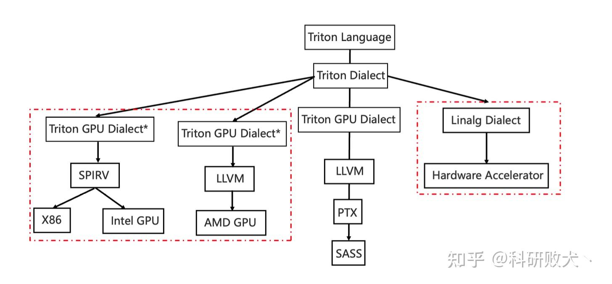
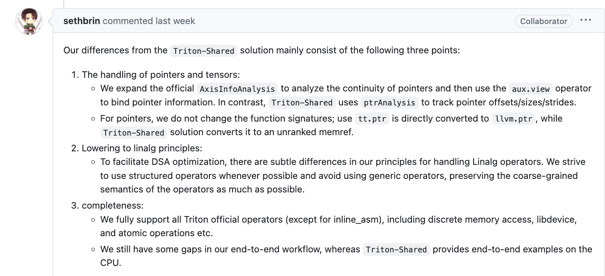
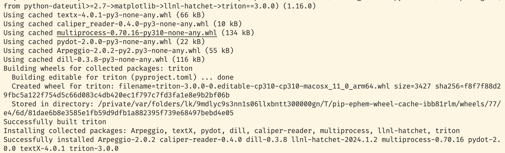
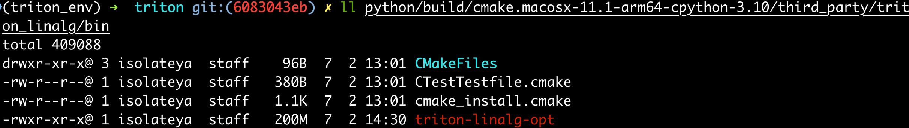

# Triton-Linalg

最近尝试了一下 `Triton-Linalg` ，一个开源的工作，支持了几乎所有 `triton` 原语到 `linalg-on-tensor` 的下降流程，在这里记录一下自己的学习过程。项目仓库： [Triton-Linalg 仓库](​github.com/Cambricon/triton-linalg/tree/master)。

不看长文请调转：

https://zhuanlan.zhihu.com/p/706401510

这将是一篇长文（车轱辘话全集），大该有以下部分，但是大体还在施工～

- [x] 介绍（背景、优缺点、和triton-shared的区别）
- [x] 环境配置 : clone & 编译
- [x] 测试使用（测试一些例子，简单介绍一下使用）
- [x] dialect
  - [x] Auxiliar
  - [x] LinalgExt
- [ ] Analysis
- [ ] Conversion+
- [ ] Pipeline

关于 Triton-Linalg 项目技术细节 主要还是在后三节 `Analysis` , `Conversion` 以及 `Pipeline`，但目前还没整理好（还没时间看qwq），闲暇时再继续总结下。本人知识深度有限，还望大家指正~

## 介绍

### what's this

- linalg

了解 `mlir` 的同学一定不陌生 `linalg`，可以简单地认为是一个胶水层，能表示很多computation、structure信息，起承上启下的作用。

下图是基于mlir的设计compiler时，一些常用的`dialect`，图源[2023 EuroLLVM - MLIR Dialect Design and Composition for Front-End Compilers]( youtube.com/watch?v=hIt6J1_E21c)。


当前从模型到 linalg 的技术路线社区已经比较成熟（例如 `model->onnx->stablehlo->linalg`，或者翻翻 [IREE](https://github.com/iree-org/iree) 的代码），可以说，硬件厂商支持 基于`mlir`的ai compiler的主要工作在 `linalg` 往下，设计 HWS(HardWare-Special) Dialect。

- triton

很多大佬都介绍过了，都写得很好，例如：
[bbuf大佬的笔记](https://mp.weixin.qq.com/s/RMR_n1n6nBqpdMl6tdd7pQ)，
[董鑫​大佬关于如何入门的回答](https://www.zhihu.com/question/622685131/answer/3217107882)

一搜一个不吱声，直接埋头开卷！

简单来说，`triton` 可以让大家用更少的时间获得较为不错的性能，来验证自己的想法，深受现在学界的喜爱。当然工业界一些很好的 triton 工作了，例如 [lightllm](https://github.com/ModelTC/lightllm)中有很多用triton实现的kernel。


- triton-linalg

[triton-linalg](https://github.com/Cambricon/triton-linalg) 顾名思义，是**为triton(dialect)下降到linalg(dialect)提供了一条可行的路线**。如果大家看过 `triton` 的源码就会发现目前它的下降行为十分直接，一个猛子完成 `triton dialect->triton gpu dialect->llvm`(见[triton conversion](https://github.com/triton-lang/triton/tree/main/lib/Conversion))，在这些转换中分布着一些gpu硬件特有的trick保证来codegen出的ir性能不错。

“但是，代价是什么呢” -> 于我而言，代价是需要很多硬件背景知识才能读懂为什么要那么做，以及只能用在 GPU 上，为NV帝国添砖瓦，什么时候才能把价钱打下来


开始“龙场悟道“（自闭）：

那么有没有一种和硬件无关的层级表示 ir 能方便大家读懂且接入自己的硬件呢？
->

直接从 ttir(triton dialect ir) 接自己的 dialect(类似 TritonGPUDialect)?
->

那万一以后 `triton` 又不行了，出来一个其他的呢，又适配一遍么？
->

开摆！（x）看看业界领先经验（√）-> 跟紧 [mojo](https://github.com/modularml/mojo)大法师，拥抱 `mlir` 社区，而 `linalg` 作为 `mlir` 社区中很重要的一个中间层。

### what can we do with this

- triton 重要性： triton 从 pytorch2.0 后已正式作为 `inductor` 的 gpu 后端，也就是说用户写到的 python 代码会经过 `inductor` 得到 `triton language`，然后经过编译后再执行，实现性能提升。接入 triton = 接入 pytorch = 走上人生巅峰 = 给别人埋bug...

> 感兴趣的同学可以了解下 [torch.compile](https://pytorch.org/docs/stable/torch.compiler.html)

- 扩展性： linalg - to - HW special dialect
（借用一下大佬的图，来源见水印）


- 中间层级优化：trion目前GPU的下降路线过于生硬，可以说是直接一把 `conversion`，一把下降会导致难以优化中间 IR（例如离散性优化），这对 `SIMT` 虽然影响不大（每个wrap内的thread执行的指令相同，可能进行Memory-Coalescing，提升访存效率），但是离散地访存行为对 `SIMD` 的影响无疑是巨大的。
以说是直接一把 `conversion`，一把下降会导致难以优化中间 IR（例如离散性优化），这对 `SIMT` 虽然影响不大，但是离散地访存行为对 `SIMD` 的影响无疑巨大

### triton-shared

[triton-shared](https://github.com/microsoft/triton-shared) 是 microsoft（巨硬）家实现 triton-to-linalg 的工作（以及实现以CPU作为后端），也扩展了特定的 Dialect。

### diff with triton-shared

[发现issue中有大哥关于区别的回答，update一下]



- 支持完整度不同

  算子层面，triton-linalg 支持更全面，triton-shared 暂时还没支持 `atomic/libdevice` 等算子。验证层面，triton-shared 有naive CPU端到端的功能验证支持，而triton-linalg缺少完整端到端功能验证，到 linalg 后的支持需要应用者自己参与，只是提供了轮子。

- 下降行为不同

  `triton-linalg` 引入了两种新 dialect (LinalgExt和Auxiliary) 来完整算子支持， `triton-shared`引入了 `TritonStructured`。以及其他一些算子的下降逻辑不同。

以指针访存(tl.load)的处理为例：

- triton-shared: 指针转为 `memref<*xf32>` -> 通过`pointer analysis`计算出 `strides,shapes,offset`，使用 `memref.reinterpret_cast` 将memref<*xf32>转成数据实际存放的memref -> 通过 `memref.copy + bufferization.to_tensor` 转成tensor语义下的操作

- triton-linalg: 指针会使用`llvm.inttoptr`  转为 `llvm.ptr` (和 `triton` [官方一致](https://github.com/triton-lang/triton/blob/main/lib/Conversion/TritonGPUToLLVM/ElementwiseOpToLLVM.cpp#L792))-> 通过`AxisInfoAnalysis`计算出 `strides,shapes,offset`，使用 `aux.view` 将`llvm.ptr`转成数据实际存放的memref -> 通过 `bufferization.to_tensor` 转为tensor语义下的操作，再使用 `linalg.copy`(连续访存) 或 `linalg_ext.gather`(离散访存) 来获取数据


## 环境配置

- clone

```bash
export TRITON_PLUGIN_DIRS=$(pwd)/triton-linalg
git clone --recurse-submodules https://github.com/Cambricon/triton-linalg.git
cd triton-linalg/triton
```

- python 环境

```bash
conda create --name triton_env python=3.10 # 版本要大于等于3.8
conda activate triton_env
conda install numpy matplotlib pybind11 lit pytest isort pandas tabulate scipy flake8 autopep8
conda install pytorch torchvision # 我也不确定需不需要，反正cpu的不大
```

- 相关工具
按照 https://github.com/Cambricon/triton-linalg README 内容进行环境配置和编译

由于我是在 macOS 上编译，所以直接通过 `brew` 安装了相关工具
```bash
brew install cmake ninja-build ccache clang lld
conda install pytest-xdist cython # 记得要装cython
```

正常在 linux 下使用 `apt-get` 安装相关工具链即可
```bash
python3 -m pip install --upgrade pip
python3 -m pip install cmake ninja pytest-xdist cython # 这样装的cmake版本目前是3.26
sudo apt-get update -y
sudo apt-get install -y ccache clang lld
```

- 编译
```bash
# macos中lld是不能work的，所以不要添加相关的编译选项，在linux下就没问题
#TRITON_BUILD_WITH_CLANG_LLD=true TRITON_BUILD_WITH_CCACHE=true pip install -e python --no-build-isolation -vvv
pip3 install -e python --no-build-isolation
```

> note: 我用 macOS 编译的时候遇见编译报错  “找不到 `bits/std_abs.h`”。
> 翻了一下 macOS (`/Library/Developer/CommandLineTools/SDKs/MacOSX14.4.sdk/usr/include/`)的clang确实没有。
> 只需要把 `lib/Dialect/Triton/Transforms/InferAxisInfoInterfaceImpl.cpp` 中的 `bits/std_abs.h` 换成 `stdlib.h` 即正常编译

编译完成：


编译好的 `triton-linalg-opt` 在 `triton-linalg/triton/python/build/{current_cmake_version}/third_party/triton_linalg/bin/triton-linalg-opt` ，如果没有找到，说明没有设置环境变量 `export TRITON_PLUGIN_DIRS=$(pwd)/triton-linalg` 没有配置对，重新设置下再运行一次编译命令即可。



## 测试使用

### 差生文具多

为了方便索引，编译完成后在 `triton-linalg/triton/python/build/` 目录下有一个 `compile_commands.json`，将其 `cp` 到 `triton-linalg`目录下， 再在 `vscode` 中简单地配置下
ctrl + p 输入 clangd，先点击 下载language server；然后 加 settings.json , ctrl + p → '> 打开工作区设置json’

```bash
{
    "clangd.arguments": [
        "--header-insertion=never",
        "--compile-commands-dir=${workspaceFolder}/",
        "--query-driver=**",
    ]
}
```

加个环境变量，方便使用
```bash
export PATH=xxx/triton-linalg/triton/python/build/{current_cmake_version}/third_party/triton_linalg/bin:$PATH
```

### 打印ir的方法

- 在kernel后增加

```python
    grid = lambda META: (triton.cdiv(M, META['BLOCK_SIZE_M']) * triton.cdiv(N, META['BLOCK_SIZE_N']), )
    kernel = matmul_kernel[grid](
        a, b, c,  #
        M, N, K,  #
        a.stride(0), a.stride(1),  #
        b.stride(0), b.stride(1),  #
        c.stride(0), c.stride(1),  #
        ACTIVATION=activation  #
    )
    print(kernel.asm['ttir'])
    print(kernel.asm['ttgir'])
    print(kernel.asm['llir'])
    print(kernel.asm['ptx'])
```

- 运行python文件时加上 `MLIR_ENABLE_DUMP=1`

dumps the IR before every MLIR pass Triton runs

### 一窥ttir

`triton-llinalg-opt` 真正能吃下的输入并不是 python，而是 `ttir` (triton ir)，可以理解成一般性流程是 python -> ttit -> linalg / gpu dialect -> llvm


以 `tutorials/03-matrix-multiplication.py` 为例，输入：

```python
def matmul_kernel(
        # Pointers to matrices
        a_ptr, b_ptr, c_ptr,
        # Matrix dimensions
        M, N, K,
        # The stride variables represent how much to increase the ptr by when moving by 1
        # element in a particular dimension. E.g. `stride_am` is how much to increase `a_ptr`
        # by to get the element one row down (A has M rows).
        stride_am, stride_ak,  #
        stride_bk, stride_bn,  #
        stride_cm, stride_cn,
        # Meta-parameters
        BLOCK_SIZE_M: tl.constexpr, BLOCK_SIZE_N: tl.constexpr, BLOCK_SIZE_K: tl.constexpr,  #
        GROUP_SIZE_M: tl.constexpr,  #
        ACTIVATION: tl.constexpr  #
):
    pid = tl.program_id(axis=0)
    num_pid_m = tl.cdiv(M, BLOCK_SIZE_M)
    num_pid_n = tl.cdiv(N, BLOCK_SIZE_N)
    num_pid_in_group = GROUP_SIZE_M * num_pid_n
    group_id = pid // num_pid_in_group
    first_pid_m = group_id * GROUP_SIZE_M
    group_size_m = min(num_pid_m - first_pid_m, GROUP_SIZE_M)
    pid_m = first_pid_m + ((pid % num_pid_in_group) % group_size_m)
    pid_n = (pid % num_pid_in_group) // group_size_m

    offs_am = (pid_m * BLOCK_SIZE_M + tl.arange(0, BLOCK_SIZE_M)) % M
    offs_bn = (pid_n * BLOCK_SIZE_N + tl.arange(0, BLOCK_SIZE_N)) % N
    offs_k = tl.arange(0, BLOCK_SIZE_K)
    a_ptrs = a_ptr + (offs_am[:, None] * stride_am + offs_k[None, :] * stride_ak)
    b_ptrs = b_ptr + (offs_k[:, None] * stride_bk + offs_bn[None, :] * stride_bn)

    accumulator = tl.zeros((BLOCK_SIZE_M, BLOCK_SIZE_N), dtype=tl.float32)
    for k in range(0, tl.cdiv(K, BLOCK_SIZE_K)):
        a = tl.load(a_ptrs, mask=offs_k[None, :] < K - k * BLOCK_SIZE_K, other=0.0)
        b = tl.load(b_ptrs, mask=offs_k[:, None] < K - k * BLOCK_SIZE_K, other=0.0)
        accumulator = tl.dot(a, b, accumulator)
        a_ptrs += BLOCK_SIZE_K * stride_ak
        b_ptrs += BLOCK_SIZE_K * stride_bk

    if ACTIVATION == "leaky_relu":
        accumulator = leaky_relu(accumulator)
    c = accumulator.to(tl.float16)

    offs_cm = pid_m * BLOCK_SIZE_M + tl.arange(0, BLOCK_SIZE_M)
    offs_cn = pid_n * BLOCK_SIZE_N + tl.arange(0, BLOCK_SIZE_N)
    c_ptrs = c_ptr + stride_cm * offs_cm[:, None] + stride_cn * offs_cn[None, :]
    c_mask = (offs_cm[:, None] < M) & (offs_cn[None, :] < N)
    tl.store(c_ptrs, c, mask=c_mask)
```

输出 ttir 时
主要下降为 tt.ops + arith.ops，具体参考 `triton/python/triton/language/semantic.py`

```mlir
// 这个保存为 matmul.ttir
module {
  tt.func public @matmul_kernel(%arg0: !tt.ptr<f16>, %arg1: !tt.ptr<f16>, %arg2: !tt.ptr<f16>, %arg3: i32, %arg4: i32, %arg5: i32, %arg6: i32, %arg7: i32, %arg8: i32) {
    // blockarg对应：（都是根据ir推出来的）
    // %arg0: a_ptr, %arg1: b_ptr, %arg2: c_ptr
    // %arg3: M, %arg4: N, %arg5: K
    // %arg6: stride_am, %arg7: stride_bk, %arg8: stride_cm
    // 推出： stride_ak = 1, stride_bn = 1, stride_cn = 1

    // 常量部分，有些是这次 tuning 选择的 config 中的 超参数（tl.constexpr）具体值
    %cst = arith.constant dense<0.000000e+00> : tensor<128x64xf16>
    %cst_0 = arith.constant dense<0.000000e+00> : tensor<64x64xf16>
    %c63_i32 = arith.constant 63 : i32
    %c127_i32 = arith.constant 127 : i32
    %c1_i32 = arith.constant 1 : i32
    %c0_i32 = arith.constant 0 : i32
    %cst_1 = arith.constant dense<64> : tensor<128x64xi32>
    %cst_2 = arith.constant dense<0.000000e+00> : tensor<128x64xf32>
    %c64_i32 = arith.constant 64 : i32
    %c128_i32 = arith.constant 128 : i32
    %c8_i32 = arith.constant 8 : i32

    // pid = tl.program_id(axis=0)
    %0 = tt.get_program_id x : i32

    // %arg3: M, %arg4: N
    // num_pid_m = tl.cdiv(M, BLOCK_SIZE_M)
    // (x + (2^n - 1)) / 2^n -> 实现向上取整
    // 这次 tuning config的 BLOCK_SIZE_M 是 128
    %1 = arith.addi %arg3, %c127_i32 : i32
    %2 = arith.divsi %1, %c128_i32 : i32

    // num_pid_n = tl.cdiv(N, BLOCK_SIZE_N)
    // 这次 tuning config的 BLOCK_SIZE_N 是 64
    %3 = arith.addi %arg4, %c63_i32 : i32
    %4 = arith.divsi %3, %c64_i32 : i32

    // num_pid_in_group = GROUP_SIZE_M * num_pid_n
    // 这次 tuning config的 GROUP_SIZE_M 是 8
    %5 = arith.muli %4, %c8_i32 : i32

    // group_id = pid // num_pid_in_group
    %6 = arith.divsi %0, %5 : i32

    // frist_pid_m = group_id * GROUP_SIZE_M
    %7 = arith.muli %6, %c8_i32 : i32

    // group_size_m = min(num_pid_m - first_pid_m, GROUP_SIZE_M)
    %8 = arith.subi %2, %7 : i32
    %9 = arith.minsi %8, %c8_i32 : i32

    // pid_m = first_pid_m + ((pid % num_pid_in_group) % group_size_m)
    // %11 = pid % group_size_m + first_pid_m 这里对不上 pid_m 的计算
    %10 = arith.remsi %0, %9 : i32
    %11 = arith.addi %7, %10 : i32

    // pid_n = (pid % num_pid_in_group) // group_size_m
    %12 = arith.remsi %0, %5 : i32
    %13 = arith.divsi %12, %9 : i32

    // offs_am = (pid_m * BLOCK_SIZE_M + tl.arange(0, BLOCK_SIZE_M)) % M
    %14 = arith.muli %11, %c128_i32 : i32
    // %15 = tl.arange(0, BLOCK_SIZE_M)
    %15 = tt.make_range {end = 128 : i32, start = 0 : i32} : tensor<128xi32>
    %16 = tt.splat %14 : i32 -> tensor<128xi32>
    // %17 = pid_m * BLOCK_SIZE_M + tl.arange(0, BLOCK_SIZE_M)
    %17 = arith.addi %16, %15 : tensor<128xi32>
    %18 = tt.splat %arg3 : i32 -> tensor<128xi32>
    %19 = arith.remsi %17, %18 : tensor<128xi32>

    // offs_bn = (pid_n * BLOCK_SIZE_N + tl.arange(0, BLOCK_SIZE_N)) % N
    %20 = arith.muli %13, %c64_i32 : i32
    // 因为BLOCK_SIZE_K = BLOCK_SIZE_N， 所以复用了make_range
    // offs_k = tl.arange(0, BLOCK_SIZE_K) = tl.arange(0, BLOCK_SIZE_N)
    %21 = tt.make_range {end = 64 : i32, start = 0 : i32} : tensor<64xi32>
    %22 = tt.splat %20 : i32 -> tensor<64xi32>
    // %23 = pid_n * BLOCK_SIZE_N + tl.arange(0, BLOCK_SIZE_N)
    %23 = arith.addi %22, %21 : tensor<64xi32>
    %24 = tt.splat %arg4 : i32 -> tensor<64xi32>
    %25 = arith.remsi %23, %24 : tensor<64xi32>

    // a_ptrs = a_ptr + (offs_am[:, None] * stride_am + offs_k[None, :] * stride_ak)
    %26 = tt.expand_dims %19 {axis = 1 : i32} : tensor<128xi32> -> tensor<128x1xi32>
    // %arg6: stride_am, splat 成同shape tensor，然后乘
    %27 = tt.splat %arg6 : i32 -> tensor<128x1xi32>
    %28 = arith.muli %26, %27 : tensor<128x1xi32>
    // %29 = offs_k = tl.arange(0, BLOCK_SIZE_K)
    %29 = tt.expand_dims %21 {axis = 0 : i32} : tensor<64xi32> -> tensor<1x64xi32>
    // 这里是 stride_ak = 1
    %30 = tt.broadcast %28 : tensor<128x1xi32> -> tensor<128x64xi32>
    %31 = tt.broadcast %29 : tensor<1x64xi32> -> tensor<128x64xi32>
    %32 = arith.addi %30, %31 : tensor<128x64xi32>
    // 把 a_ptr splat 成 对应 shape
    %33 = tt.splat %arg0 : !tt.ptr<f16> -> tensor<128x64x!tt.ptr<f16>>
    %34 = tt.addptr %33, %32 : tensor<128x64x!tt.ptr<f16>>, tensor<128x64xi32>

    // b_ptrs = b_ptr + (offs_k[:, None] * stride_bk + offs_bn[None, :] * stride_bn)
    %35 = tt.expand_dims %21 {axis = 1 : i32} : tensor<64xi32> -> tensor<64x1xi32>
    // %arg7: stride_bk
    %36 = tt.splat %arg7 : i32 -> tensor<64x1xi32>
    %37 = arith.muli %35, %36 : tensor<64x1xi32>
    %38 = tt.expand_dims %25 {axis = 0 : i32} : tensor<64xi32> -> tensor<1x64xi32>
    %39 = tt.broadcast %37 : tensor<64x1xi32> -> tensor<64x64xi32>
    // 这里是 stride_bn = 1
    %40 = tt.broadcast %38 : tensor<1x64xi32> -> tensor<64x64xi32>
    %41 = arith.addi %39, %40 : tensor<64x64xi32>
    %42 = tt.splat %arg1 : !tt.ptr<f16> -> tensor<64x64x!tt.ptr<f16>>
    %43 = tt.addptr %42, %41 : tensor<64x64x!tt.ptr<f16>>, tensor<64x64xi32>

    // scf.for 循环上界 tl.cdiv(K, BLOCK_SIZE_K)
    // %arg5: K, 这次 tuning config的 BLOCK_SIZE_K 是 64
    %44 = arith.addi %arg5, %c63_i32 : i32
    %45 = arith.divsi %44, %c64_i32 : i32

    // %47 = BLOCK_SIZE_K * stride_bk
    %46 = arith.muli %arg7, %c64_i32 : i32
    %47 = tt.splat %46 : i32 -> tensor<64x64xi32>

    // for k in range(0, tl.cdiv(K, BLOCK_SIZE_K)), %arg9即k
    // 每一轮都在改变：%arg10: accumulator, %arg11: %a_ptrs, %12: %b_ptrs
    %48:3 = scf.for %arg9 = %c0_i32 to %45 step %c1_i32 iter_args(%arg10 = %cst_2, %arg11 = %34, %arg12 = %43) -> (tensor<128x64xf32>, tensor<128x64x!tt.ptr<f16>>, tensor<64x64x!tt.ptr<f16>>)  : i32 {
      // %67 = K - k * BLOCK_SIZE_K
      %66 = arith.muli %arg9, %c64_i32 : i32
      %67 = arith.subi %arg5, %66 : i32

      // a_mask计算 splat 后和 offsets_k 比较
      %68 = tt.splat %67 : i32 -> tensor<1x64xi32>
      %69 = arith.cmpi slt, %29, %68 : tensor<1x64xi32>
      %70 = tt.broadcast %69 : tensor<1x64xi1> -> tensor<128x64xi1>
      // tl.load(a_ptrs, mask=offs_k[None, :] < K - k * BLOCK_SIZE_K, other=0.0)
      %71 = tt.load %arg11, %70, %cst : tensor<128x64x!tt.ptr<f16>>

      // b_mask计算 splat 后和 offsets_k 比较
      %72 = tt.splat %67 : i32 -> tensor<64x1xi32>
      %73 = arith.cmpi slt, %35, %72 : tensor<64x1xi32>
      %74 = tt.broadcast %73 : tensor<64x1xi1> -> tensor<64x64xi1>
      // b = tl.load(b_ptrs, mask=offs_k[:, None] < K - k * BLOCK_SIZE_K, other=0.0)
      %75 = tt.load %arg12, %74, %cst_0 : tensor<64x64x!tt.ptr<f16>>

      // accumulator = tl.dot(a, b, accumulator)
      %76 = tt.dot %71, %75, %arg10, inputPrecision = tf32 : tensor<128x64xf16> * tensor<64x64xf16> -> tensor<128x64xf32>

      // a_ptrs += BLOCK_SIZE_K * stride_ak
      // 前面的代码推论出 stride_ak = 1，%cst_1 = arith.constant dense<64> : tensor<128x64xi32>，相当于 1x64(BLOCK_SIZE_K)
      %77 = tt.addptr %arg11, %cst_1 : tensor<128x64x!tt.ptr<f16>>, tensor<128x64xi32>

      // b_ptrs += BLOCK_SIZE_K * stride_bk
      %78 = tt.addptr %arg12, %47 : tensor<64x64x!tt.ptr<f16>>, tensor<64x64xi32>

      // 返回，给下次循环作为blockarg
      scf.yield %76, %77, %78 : tensor<128x64xf32>, tensor<128x64x!tt.ptr<f16>>, tensor<64x64x!tt.ptr<f16>>
    }

    // c = accumulator.to(tl.float16)
    %49 = arith.truncf %48#0 : tensor<128x64xf32> to tensor<128x64xf16>

    // c_ptrs = c_ptr + stride_cm * offs_cm[:, None] + stride_cn * offs_cn[None, :]
    // offs_cm = %17 = pid_m * BLOCK_SIZE_M + tl.arange(0, BLOCK_SIZE_M)
    %50 = tt.expand_dims %17 {axis = 1 : i32} : tensor<128xi32> -> tensor<128x1xi32>
    // %arg8: stride_cm, %52 = stride_cm * offs_cm[:, None]
    %51 = tt.splat %arg8 : i32 -> tensor<128x1xi32>
    %52 = arith.muli %51, %50 : tensor<128x1xi32>
    // %arg2: c_ptr
    %53 = tt.splat %arg2 : !tt.ptr<f16> -> tensor<128x1x!tt.ptr<f16>>
    %54 = tt.addptr %53, %52 : tensor<128x1x!tt.ptr<f16>>, tensor<128x1xi32>
    // offs_cn = %23 = pid_n * BLOCK_SIZE_N + tl.arange(0, BLOCK_SIZE_N)
    // 推断出 stride_cn = 1
    %55 = tt.expand_dims %23 {axis = 0 : i32} : tensor<64xi32> -> tensor<1x64xi32>
    %56 = tt.broadcast %54 : tensor<128x1x!tt.ptr<f16>> -> tensor<128x64x!tt.ptr<f16>>
    %57 = tt.broadcast %55 : tensor<1x64xi32> -> tensor<128x64xi32>
    %58 = tt.addptr %56, %57 : tensor<128x64x!tt.ptr<f16>>, tensor<128x64xi32>

    // c_mask = (offs_cm[:, None] < M) & (offs_cn[None, :] < N)
    %59 = tt.splat %arg3 : i32 -> tensor<128x1xi32>
    %60 = arith.cmpi slt, %50, %59 : tensor<128x1xi32>
    %61 = tt.splat %arg4 : i32 -> tensor<1x64xi32>
    %62 = arith.cmpi slt, %55, %61 : tensor<1x64xi32>
    %63 = tt.broadcast %60 : tensor<128x1xi1> -> tensor<128x64xi1>
    %64 = tt.broadcast %62 : tensor<1x64xi1> -> tensor<128x64xi1>
    %65 = arith.andi %63, %64 : tensor<128x64xi1>

    // tl.store(c_ptrs, c, mask=c_mask)
    tt.store %58, %49, %65 : tensor<128x64x!tt.ptr<f16>>
    tt.return
  }
}
```

## 瞅瞅linalg

终于，linalg登场了，看懂这一步的ir，才好理解triton-linalg的主要工作。我们继续lower到linalg上，一眼 `tensor + linalg + bufferization`，以及两个该仓库自定义的dialect (aux + linalg_ext)，后节会讲讲。

总结一下，在这段ir中（**根据连续性情况，load/store指令会下降出不同的结果**）有以下对应关系：

| ttir     | linalg        |
| -------- | ------------- |
| arith.ops 标量计算 | arith.ops 标量计算 |
| arith.constant表示的tensor | linalg.fill |
| tt.make_range | linalg_ext.make_range |
| arith.ops tensor计算 | linalg.map{arith.ops} |
| tt.broadcast | linalg.broadcast |
| tt.addptr | linalg.map{arith.muli+arith.addi} |
| tt.dot | linalg.matmul |
| 可变mask中的信息 mul + sub + cmp |  可变mask中的信息 mul + sub + fill + pad |
| tt.load | llvm.inttoptr + aux.view + bufferization.to_tensor + linalg_ext.gather |
| tt.store | llvm.inttoptr + aux.view + bufferization.materialize_in_destination|

对ptr进行load/store时，通过llvm.inttoptr + aux.view转为来对memref的操作。
（现在只是对比ir的情况获得的上表，具体还要看 [TritonToLinalg.cpp](https://github.com/Cambricon/triton-linalg/blob/master/lib/Conversion/TritonToLinalg/TritonToLinalg.cpp) 中的代码，咱之后再分析）

`ExtractLikeMoveBackwardPass` 和 `Canonicalizer` 导致 `-triton-to-linalg`输出的结果比较难理解，所以在直接`-triton-to-linalg -mlir-print-ir-after-all` 看 `TritonToLinalgPass` 结束后的ir。下面这段ir还没有经过 `cse` 和 `canonicalize`，所以显得比较冗余。

```mlir
// triton-linalg-opt -triton-to-linalg matmul.ttir
#map = affine_map<(d0, d1)[s0, s1] -> (d0 * s1 + s0 + d1)>
module {
  func.func @matmul_kernel(%arg0: i64, %arg1: i64, %arg2: i64, %arg3: i32, %arg4: i32, %arg5: i32, %arg6: i32, %arg7: i32, %arg8: i32) {
    %cst = arith.constant 0.000000e+00 : f16
    %0 = tensor.empty() : tensor<128x64xf16>
    // arith.constant 表示的tensor下降为 linalg.fill
    %1 = linalg.fill ins(%cst : f16) outs(%0 : tensor<128x64xf16>) -> tensor<128x64xf16>
    %cst_0 = arith.constant 0.000000e+00 : f16
    %2 = tensor.empty() : tensor<64x64xf16>
    %3 = linalg.fill ins(%cst_0 : f16) outs(%2 : tensor<64x64xf16>) -> tensor<64x64xf16>
    %c63_i32 = arith.constant 63 : i32
    %c127_i32 = arith.constant 127 : i32
    %c1_i32 = arith.constant 1 : i32
    %c0_i32 = arith.constant 0 : i32
    %c64_i32 = arith.constant 64 : i32
    %4 = tensor.empty() : tensor<128x64xi32>
    %5 = linalg.fill ins(%c64_i32 : i32) outs(%4 : tensor<128x64xi32>) -> tensor<128x64xi32>
    %cst_1 = arith.constant 0.000000e+00 : f32
    %6 = tensor.empty() : tensor<128x64xf32>
    %7 = linalg.fill ins(%cst_1 : f32) outs(%6 : tensor<128x64xf32>) -> tensor<128x64xf32>
    %c64_i32_2 = arith.constant 64 : i32
    %c128_i32 = arith.constant 128 : i32
    %c8_i32 = arith.constant 8 : i32

    // tt.get_program_id 在目前还没该变，后续应该类似gpu的行为，转为(x, y, z)来表示任务id
    %8 = tt.get_program_id x : i32
    // %arg3: M, %arg4: N
    // num_pid_m = tl.cdiv(M, BLOCK_SIZE_M)
    %9 = arith.addi %arg3, %c127_i32 : i32
    %10 = arith.divsi %9, %c128_i32 : i32
    // num_pid_n = tl.cdiv(N, BLOCK_SIZE_N)
    %11 = arith.addi %arg4, %c63_i32 : i32
    %12 = arith.divsi %11, %c64_i32_2 : i32
    // num_pid_in_group = GROUP_SIZE_M  * num_pid_n
    %13 = arith.muli %12, %c8_i32 : i32
    // group_id = pid // num_pid_in_group
    %14 = arith.divsi %8, %13 : i32
    // frist_pid_m = group_id * GROUP_SIZE_M
    %15 = arith.muli %14, %c8_i32 : i32
    // group_size_m = min(num_pid_m - first_pid_m, GROUP_SIZE_M)
    %16 = arith.subi %10, %15 : i32
    %17 = arith.minsi %16, %c8_i32 : i32
    // pid_m = first_pid_m + ((pid % num_pid_in_group) % group_size_m)
    %18 = arith.remsi %8, %17 : i32
    %19 = arith.addi %15, %18 : i32
    // pid_n = (pid % num_pid_in_group) // group_size_m
    %20 = arith.remsi %8, %13 : i32
    %21 = arith.divsi %20, %17 : i32
    %22 = arith.muli %19, %c128_i32 : i32

    // offs_am = (pid_m * BLOCK_SIZE_M + tl.arange(0, BLOCK_SIZE_M)) % M
    %23 = tensor.empty() : tensor<128xi32>
    %c0_i32_3 = arith.constant 0 : i32
    %c128_i32_4 = arith.constant 128 : i32
    // tt.make_range -> linalg_ext.make_range
    %24 = linalg_ext.make_range {operandSegmentSizes = array<i32: 2, 1>} ins(%c0_i32_3, %c128_i32_4 : i32, i32) outs(%23 : tensor<128xi32>) -> tensor<128xi32>
    %25 = tensor.empty() : tensor<128xi32>
    // tt.splat -> linalg.fill
    %26 = linalg.fill ins(%22 : i32) outs(%25 : tensor<128xi32>) -> tensor<128xi32>
    %27 = tensor.empty() : tensor<128xi32>
    // arith.ops+tensor -> linalg.map{arith.ops}
    %mapped = linalg.map { arith.addi {overflowFlags = #arith.overflow<none>} } ins(%26, %24 : tensor<128xi32>, tensor<128xi32>) outs(%27 : tensor<128xi32>)
    %28 = tensor.empty() : tensor<128xi32>
    %29 = linalg.fill ins(%arg3 : i32) outs(%28 : tensor<128xi32>) -> tensor<128xi32>
    %30 = tensor.empty() : tensor<128xi32>
    %mapped_5 = linalg.map { arith.remsi } ins(%mapped, %29 : tensor<128xi32>, tensor<128xi32>) outs(%30 : tensor<128xi32>)

    // offs_bn = (pid_n * BLOCK_SIZE_N + tl.arange(0, BLOCK_SIZE_N)) % N
    %31 = arith.muli %21, %c64_i32_2 : i32
    %32 = tensor.empty() : tensor<64xi32>
    %c0_i32_6 = arith.constant 0 : i32
    %c64_i32_7 = arith.constant 64 : i32
    // offs_k = tl.arange(0, BLOCK_SIZE_K) = tl.arange(0, BLOCK_SIZE_N)
    %33 = linalg_ext.make_range {operandSegmentSizes = array<i32: 2, 1>} ins(%c0_i32_6, %c64_i32_7 : i32, i32) outs(%32 : tensor<64xi32>) -> tensor<64xi32>
    %34 = tensor.empty() : tensor<64xi32>
    %35 = linalg.fill ins(%31 : i32) outs(%34 : tensor<64xi32>) -> tensor<64xi32>
    %36 = tensor.empty() : tensor<64xi32>
    %mapped_8 = linalg.map { arith.addi {overflowFlags = #arith.overflow<none>} } ins(%35, %33 : tensor<64xi32>, tensor<64xi32>) outs(%36 : tensor<64xi32>)
    %37 = tensor.empty() : tensor<64xi32>
    %38 = linalg.fill ins(%arg4 : i32) outs(%37 : tensor<64xi32>) -> tensor<64xi32>
    %39 = tensor.empty() : tensor<64xi32>
    %mapped_9 = linalg.map { arith.remsi } ins(%mapped_8, %38 : tensor<64xi32>, tensor<64xi32>) outs(%39 : tensor<64xi32>)

    // mapped_14 = (offs_am[:, None] * stride_am + offs_k[None, :] * stride_ak)
    // tt.expaned_dims -> tensor.expand_shape
    %expanded = tensor.expand_shape %mapped_5 [[0, 1]] : tensor<128xi32> into tensor<128x1xi32>
    %40 = tensor.empty() : tensor<128x1xi32>
    %41 = linalg.fill ins(%arg6 : i32) outs(%40 : tensor<128x1xi32>) -> tensor<128x1xi32>
    %42 = tensor.empty() : tensor<128x1xi32>
    %mapped_10 = linalg.map { arith.muli {overflowFlags = #arith.overflow<none>} } ins(%expanded, %41 : tensor<128x1xi32>, tensor<128x1xi32>) outs(%42 : tensor<128x1xi32>)
    %expanded_11 = tensor.expand_shape %33 [[0, 1]] : tensor<64xi32> into tensor<1x64xi32>
    // tt.broadcast -> tensor.collapse_shape + linalg.broadcast
    %collapsed = tensor.collapse_shape %mapped_10 [[0, 1]] : tensor<128x1xi32> into tensor<128xi32>
    %43 = tensor.empty() : tensor<128x64xi32>
    %broadcasted = linalg.broadcast ins(%collapsed : tensor<128xi32>) outs(%43 : tensor<128x64xi32>) dimensions = [1]
    %collapsed_12 = tensor.collapse_shape %expanded_11 [[0, 1]] : tensor<1x64xi32> into tensor<64xi32>
    %44 = tensor.empty() : tensor<128x64xi32>
    %broadcasted_13 = linalg.broadcast ins(%collapsed_12 : tensor<64xi32>) outs(%44 : tensor<128x64xi32>) dimensions = [0]
    %45 = tensor.empty() : tensor<128x64xi32>
    %mapped_14 = linalg.map { arith.addi {overflowFlags = #arith.overflow<none>} } ins(%broadcasted, %broadcasted_13 : tensor<128x64xi32>, tensor<128x64xi32>) outs(%45 : tensor<128x64xi32>)

    // mapped_22 = (offs_k[:, None] * stride_bk + offs_bn[None, :] * stride_bn)
    %expanded_15 = tensor.expand_shape %33 [[0, 1]] : tensor<64xi32> into tensor<64x1xi32>
    %46 = tensor.empty() : tensor<64x1xi32>
    %47 = linalg.fill ins(%arg7 : i32) outs(%46 : tensor<64x1xi32>) -> tensor<64x1xi32>
    %48 = tensor.empty() : tensor<64x1xi32>
    %mapped_16 = linalg.map { arith.muli {overflowFlags = #arith.overflow<none>} } ins(%expanded_15, %47 : tensor<64x1xi32>, tensor<64x1xi32>) outs(%48 : tensor<64x1xi32>)
    %expanded_17 = tensor.expand_shape %mapped_9 [[0, 1]] : tensor<64xi32> into tensor<1x64xi32>
    %collapsed_18 = tensor.collapse_shape %mapped_16 [[0, 1]] : tensor<64x1xi32> into tensor<64xi32>
    %49 = tensor.empty() : tensor<64x64xi32>
    %broadcasted_19 = linalg.broadcast ins(%collapsed_18 : tensor<64xi32>) outs(%49 : tensor<64x64xi32>) dimensions = [1]
    %collapsed_20 = tensor.collapse_shape %expanded_17 [[0, 1]] : tensor<1x64xi32> into tensor<64xi32>
    %50 = tensor.empty() : tensor<64x64xi32>
    %broadcasted_21 = linalg.broadcast ins(%collapsed_20 : tensor<64xi32>) outs(%50 : tensor<64x64xi32>) dimensions = [0]
    %51 = tensor.empty() : tensor<64x64xi32>
    %mapped_22 = linalg.map { arith.addi {overflowFlags = #arith.overflow<none>} } ins(%broadcasted_19, %broadcasted_21 : tensor<64x64xi32>, tensor<64x64xi32>) outs(%51 : tensor<64x64xi32>)

    // scf.for 循环上界 tl.cdiv(K, BLOCK_SIZE_K)
    %52 = arith.addi %arg5, %c63_i32 : i32
    %53 = arith.divsi %52, %c64_i32_2 : i32
    %54 = arith.muli %arg7, %c64_i32_2 : i32
    %55 = tensor.empty() : tensor<64x64xi32>
    %56 = linalg.fill ins(%54 : i32) outs(%55 : tensor<64x64xi32>) -> tensor<64x64xi32>
    %57:3 = scf.for %arg9 = %c0_i32 to %53 step %c1_i32 iter_args(%arg10 = %7, %arg11 = %mapped_14, %arg12 = %mapped_22) -> (tensor<128x64xf32>, tensor<128x64xi32>, tensor<64x64xi32>)  : i32 {
      // 计算 b_ptrs
      // %arg12 第一轮是 (offs_k[:, None] * stride_bk + offs_bn[None, :] * stride_bn)
      // 之后会被更新 %arg12 += BLOCk * stride_ak，保证 b_ptrs 的变化
      %126 = tensor.empty() : tensor<64x64xi64>
      %127 = linalg.fill ins(%arg1 : i64) outs(%126 : tensor<64x64xi64>) -> tensor<64x64xi64>
      %128 = tensor.empty() : tensor<64x64xi64>
      // tt.addptr -> linalg.map{arith.addi}
      %mapped_69 = linalg.map ins(%127, %arg12 : tensor<64x64xi64>, tensor<64x64xi32>) outs(%128 : tensor<64x64xi64>)
        (%in: i64, %in_117: i32) {
          %179 = arith.extsi %in_117 : i32 to i64
          %c2_i64 = arith.constant 2 : i64
          %180 = arith.muli %179, %c2_i64 : i64
          %181 = arith.addi %in, %180 : i64
          linalg.yield %181 : i64
        }

      // 计算 a_ptrs
      %129 = tensor.empty() : tensor<128x64xi64>
      %130 = linalg.fill ins(%arg0 : i64) outs(%129 : tensor<128x64xi64>) -> tensor<128x64xi64>
      %131 = tensor.empty() : tensor<128x64xi64>
      %mapped_70 = linalg.map ins(%130, %arg11 : tensor<128x64xi64>, tensor<128x64xi32>) outs(%131 : tensor<128x64xi64>)
        (%in: i64, %in_117: i32) {
          %179 = arith.extsi %in_117 : i32 to i64
          %c2_i64 = arith.constant 2 : i64
          %180 = arith.muli %179, %c2_i64 : i64
          %181 = arith.addi %in, %180 : i64
          linalg.yield %181 : i64
        }

      // K - k * BLOCK_SIZE_K
      %132 = arith.muli %arg9, %c64_i32_2 : i32
      %133 = arith.subi %arg5, %132 : i32
      %134 = tensor.empty() : tensor<1x64xi32>
      %135 = linalg.fill ins(%133 : i32) outs(%134 : tensor<1x64xi32>) -> tensor<1x64xi32>
      %136 = arith.index_cast %133 : i32 to index
      %c0_71 = arith.constant 0 : index
      // mask，当k满足%137>0时，为true；反之为false
      %137 = arith.maxsi %136, %c0_71 : index
      %c64_72 = arith.constant 64 : index
      // 保证索引小于BLOCK_SIZE_K
      %138 = arith.minsi %c64_72, %137 : index
      %139 = tensor.empty(%138) : tensor<1x?xi1>
      %true_73 = arith.constant true
      %140 = linalg.fill ins(%true_73 : i1) outs(%139 : tensor<1x?xi1>) -> tensor<1x?xi1>
      %false_74 = arith.constant false
      %141 = tensor.empty() : tensor<1x64xi1>
      %c0_75 = arith.constant 0 : index
      %dim_76 = tensor.dim %141, %c0_75 : tensor<1x64xi1>
      %c0_77 = arith.constant 0 : index
      %c1_78 = arith.constant 1 : index
      %142 = arith.addi %c0_77, %c1_78 : index
      %143 = arith.subi %dim_76, %142 : index
      %c1_79 = arith.constant 1 : index
      %dim_80 = tensor.dim %141, %c1_79 : tensor<1x64xi1>
      %c0_81 = arith.constant 0 : index
      %144 = arith.addi %c0_81, %138 : index
      %145 = arith.subi %dim_80, %144 : index
      // mask的信息: minsi + maxsi -> pad -> broadcasted，然后作为 linalg_ext.gather的mask输入
      %146 = linalg_ext.pad ins(%140 : tensor<1x?xi1>) outs(%141 : tensor<1x64xi1>) pvalue(%false_74 : i1) low = [%c0_77, %c0_81] high = [%143, %145] {
      ^bb0(%arg13: i1):
        linalg_ext.yield %arg13 : i1
      } -> tensor<1x64xi1>
      // tt.broadcast -> tensor.collapse_shape + linalg.broadcast
      %collapsed_82 = tensor.collapse_shape %146 [[0, 1]] : tensor<1x64xi1> into tensor<64xi1>
      %147 = tensor.empty() : tensor<128x64xi1>
      %broadcasted_83 = linalg.broadcast ins(%collapsed_82 : tensor<64xi1>) outs(%147 : tensor<128x64xi1>) dimensions = [0]

      // tl.load(a_ptrs, mask=offs_k[None, :] < K - k * BLOCK_SIZE_K, other=0.0)
      %c0_i32_84 = arith.constant 0 : i32
      %c0_i32_85 = arith.constant 0 : i32
      %148 = tensor.empty() : tensor<128x64xi32>
      %149 = linalg.fill ins(%c0_i32_85 : i32) outs(%148 : tensor<128x64xi32>) -> tensor<128x64xi32>
      %150 = tensor.empty() : tensor<128x64xi32>
      // layout + 0，感觉没啥意义的计算
      %mapped_86 = linalg.map { arith.addi {overflowFlags = #arith.overflow<none>} } ins(%arg11, %149 : tensor<128x64xi32>, tensor<128x64xi32>) outs(%150 : tensor<128x64xi32>)
      // a_ptr -> !llvm.ptr
      %151 = llvm.inttoptr %arg0 : i64 to !llvm.ptr
      // aux.view 从地址(%151是a_ptr)中获得一个无穷大的memref，然后使用bufferization.to_tensor转为tensor来计算
      %view_memref_87 = aux.view %151 to offset: [0], sizes: [9223372036854775807], strides: [1] : !llvm.ptr to memref<9223372036854775807xf16>
      %152 = bufferization.to_tensor %view_memref_87 restrict writable : memref<9223372036854775807xf16>
      %collapsed_88 = tensor.collapse_shape %1 [[0, 1]] : tensor<128x64xf16> into tensor<8192xf16>
      %expanded_89 = tensor.expand_shape %collapsed_88 [[0, 1]] : tensor<8192xf16> into tensor<8192x1xf16>
      %collapsed_90 = tensor.collapse_shape %mapped_86 [[0, 1]] : tensor<128x64xi32> into tensor<8192xi32>
      %expanded_91 = tensor.expand_shape %collapsed_90 [[0, 1]] : tensor<8192xi32> into tensor<8192x1xi32>
      %collapsed_92 = tensor.collapse_shape %broadcasted_83 [[0, 1]] : tensor<128x64xi1> into tensor<8192xi1>
      // input, indices, mask
      %153 = linalg_ext.gather dimension_map = [0] ranged_data(false) signed_indice(true) ins(%152, %expanded_91, %collapsed_92 : tensor<9223372036854775807xf16>, tensor<8192x1xi32>, tensor<8192xi1>) outs(%expanded_89 : tensor<8192x1xf16>) {
      ^bb0(%arg13: f16, %arg14: f16):
        linalg_ext.yield %arg13 : f16
      } -> tensor<8192x1xf16>
      %154 = builtin.unrealized_conversion_cast %153 : tensor<8192x1xf16> to tensor<128x64xf16>

      // b = tl.load(b_ptrs, mask=offs_k[:, None] < K - k * BLOCK_SIZE_K, other=0.0)
      %155 = tensor.empty() : tensor<64x1xi32>
      %156 = linalg.fill ins(%133 : i32) outs(%155 : tensor<64x1xi32>) -> tensor<64x1xi32>
      %157 = arith.index_cast %133 : i32 to index
      %c0_93 = arith.constant 0 : index
      %158 = arith.maxsi %157, %c0_93 : index
      %c64_94 = arith.constant 64 : index
      %159 = arith.minsi %c64_94, %158 : index
      %160 = tensor.empty(%159) : tensor<?x1xi1>
      %true_95 = arith.constant true
      %161 = linalg.fill ins(%true_95 : i1) outs(%160 : tensor<?x1xi1>) -> tensor<?x1xi1>
      %false_96 = arith.constant false
      %162 = tensor.empty() : tensor<64x1xi1>
      %c0_97 = arith.constant 0 : index
      %dim_98 = tensor.dim %162, %c0_97 : tensor<64x1xi1>
      %c0_99 = arith.constant 0 : index
      %163 = arith.addi %c0_99, %159 : index
      %164 = arith.subi %dim_98, %163 : index
      %c1_100 = arith.constant 1 : index
      %dim_101 = tensor.dim %162, %c1_100 : tensor<64x1xi1>
      %c0_102 = arith.constant 0 : index
      %c1_103 = arith.constant 1 : index
      %165 = arith.addi %c0_102, %c1_103 : index
      %166 = arith.subi %dim_101, %165 : index
      %167 = linalg_ext.pad ins(%161 : tensor<?x1xi1>) outs(%162 : tensor<64x1xi1>) pvalue(%false_96 : i1) low = [%c0_99, %c0_102] high = [%164, %166] {
      ^bb0(%arg13: i1):
        linalg_ext.yield %arg13 : i1
      } -> tensor<64x1xi1>
      %collapsed_104 = tensor.collapse_shape %167 [[0, 1]] : tensor<64x1xi1> into tensor<64xi1>
      %168 = tensor.empty() : tensor<64x64xi1>
      %broadcasted_105 = linalg.broadcast ins(%collapsed_104 : tensor<64xi1>) outs(%168 : tensor<64x64xi1>) dimensions = [1]
      %c0_i32_106 = arith.constant 0 : i32
      %c0_i32_107 = arith.constant 0 : i32
      %169 = tensor.empty() : tensor<64x64xi32>
      %170 = linalg.fill ins(%c0_i32_107 : i32) outs(%169 : tensor<64x64xi32>) -> tensor<64x64xi32>
      %171 = tensor.empty() : tensor<64x64xi32>
      %mapped_108 = linalg.map { arith.addi {overflowFlags = #arith.overflow<none>} } ins(%arg12, %170 : tensor<64x64xi32>, tensor<64x64xi32>) outs(%171 : tensor<64x64xi32>)
      %172 = llvm.inttoptr %arg1 : i64 to !llvm.ptr
      %view_memref_109 = aux.view %172 to offset: [0], sizes: [9223372036854775807], strides: [1] : !llvm.ptr to memref<9223372036854775807xf16>
      %173 = bufferization.to_tensor %view_memref_109 restrict writable : memref<9223372036854775807xf16>
      %collapsed_110 = tensor.collapse_shape %3 [[0, 1]] : tensor<64x64xf16> into tensor<4096xf16>
      %expanded_111 = tensor.expand_shape %collapsed_110 [[0, 1]] : tensor<4096xf16> into tensor<4096x1xf16>
      %collapsed_112 = tensor.collapse_shape %mapped_108 [[0, 1]] : tensor<64x64xi32> into tensor<4096xi32>
      %expanded_113 = tensor.expand_shape %collapsed_112 [[0, 1]] : tensor<4096xi32> into tensor<4096x1xi32>
      %collapsed_114 = tensor.collapse_shape %broadcasted_105 [[0, 1]] : tensor<64x64xi1> into tensor<4096xi1>
      %174 = linalg_ext.gather dimension_map = [0] ranged_data(false) signed_indice(true) ins(%173, %expanded_113, %collapsed_114 : tensor<9223372036854775807xf16>, tensor<4096x1xi32>, tensor<4096xi1>) outs(%expanded_111 : tensor<4096x1xf16>) {
      ^bb0(%arg13: f16, %arg14: f16):
        linalg_ext.yield %arg13 : f16
      } -> tensor<4096x1xf16>
      %175 = builtin.unrealized_conversion_cast %174 : tensor<4096x1xf16> to tensor<64x64xf16>

      // tt.dot -> linalg.matmul
      %176 = linalg.matmul {__allow_tf32__} ins(%154, %175 : tensor<128x64xf16>, tensor<64x64xf16>) outs(%arg10 : tensor<128x64xf32>) -> tensor<128x64xf32>

      // 更新layout，%5 = BLOCK_SIZE_K * stride_ak(1)
      %177 = tensor.empty() : tensor<128x64xi32>
      %mapped_115 = linalg.map { arith.addi {overflowFlags = #arith.overflow<none>} } ins(%arg11, %5 : tensor<128x64xi32>, tensor<128x64xi32>) outs(%177 : tensor<128x64xi32>)
      %178 = tensor.empty() : tensor<64x64xi32>
      // %56 = BLOCK_SIZE_K * stride_bk(%arg6)
      %mapped_116 = linalg.map { arith.addi {overflowFlags = #arith.overflow<none>} } ins(%56, %arg12 : tensor<64x64xi32>, tensor<64x64xi32>) outs(%178 : tensor<64x64xi32>)
      scf.yield %176, %mapped_115, %mapped_116 : tensor<128x64xf32>, tensor<128x64xi32>, tensor<64x64xi32>
    }
    // c = accumulator.to(tl.float16)
    %58 = tensor.empty() : tensor<128x64xf16>
    %mapped_23 = linalg.map { arith.truncf } ins(%57#0 : tensor<128x64xf32>) outs(%58 : tensor<128x64xf16>)

    // offs_cm, offs_cn
    %expanded_24 = tensor.expand_shape %mapped [[0, 1]] : tensor<128xi32> into tensor<128x1xi32>
    %59 = tensor.empty() : tensor<128x1xi32>
    %60 = linalg.fill ins(%arg8 : i32) outs(%59 : tensor<128x1xi32>) -> tensor<128x1xi32>
    %61 = tensor.empty() : tensor<128x1xi32>
    %mapped_25 = linalg.map { arith.muli {overflowFlags = #arith.overflow<none>} } ins(%60, %expanded_24 : tensor<128x1xi32>, tensor<128x1xi32>) outs(%61 : tensor<128x1xi32>)
    %expanded_26 = tensor.expand_shape %mapped_8 [[0, 1]] : tensor<64xi32> into tensor<1x64xi32>
    %collapsed_27 = tensor.collapse_shape %mapped_25 [[0, 1]] : tensor<128x1xi32> into tensor<128xi32>
    %62 = tensor.empty() : tensor<128x64xi32>
    %broadcasted_28 = linalg.broadcast ins(%collapsed_27 : tensor<128xi32>) outs(%62 : tensor<128x64xi32>) dimensions = [1]
    %63 = tensor.empty() : tensor<128x64xi64>
    %64 = linalg.fill ins(%arg2 : i64) outs(%63 : tensor<128x64xi64>) -> tensor<128x64xi64>
    %collapsed_29 = tensor.collapse_shape %expanded_26 [[0, 1]] : tensor<1x64xi32> into tensor<64xi32>
    %65 = tensor.empty() : tensor<128x64xi32>
    %broadcasted_30 = linalg.broadcast ins(%collapsed_29 : tensor<64xi32>) outs(%65 : tensor<128x64xi32>) dimensions = [0]
    %66 = tensor.empty() : tensor<128x64xi32>
    %mapped_31 = linalg.map { arith.addi {overflowFlags = #arith.overflow<none>} } ins(%broadcasted_30, %broadcasted_28 : tensor<128x64xi32>, tensor<128x64xi32>) outs(%66 : tensor<128x64xi32>)
    %67 = tensor.empty() : tensor<128x64xi64>
    // c_ptrs = c_ptr + layout_c
    %mapped_32 = linalg.map ins(%64, %mapped_31 : tensor<128x64xi64>, tensor<128x64xi32>) outs(%67 : tensor<128x64xi64>)
      (%in: i64, %in_69: i32) {
        %126 = arith.extsi %in_69 : i32 to i64
        %c2_i64 = arith.constant 2 : i64
        %127 = arith.muli %126, %c2_i64 : i64
        %128 = arith.addi %in, %127 : i64
        linalg.yield %128 : i64
      }

    // c_mask计算
    %68 = tensor.empty() : tensor<128x1xi32>
    %69 = linalg.fill ins(%arg3 : i32) outs(%68 : tensor<128x1xi32>) -> tensor<128x1xi32>
    %70 = arith.index_cast %22 : i32 to index
    %c128 = arith.constant 128 : index
    %71 = arith.addi %c128, %70 : index
    %72 = arith.index_cast %arg3 : i32 to index
    %73 = arith.maxsi %72, %70 : index
    %74 = arith.minsi %71, %73 : index
    %75 = arith.subi %74, %70 : index
    %76 = tensor.empty(%75) : tensor<?x1xi1>
    %true = arith.constant true
    %77 = linalg.fill ins(%true : i1) outs(%76 : tensor<?x1xi1>) -> tensor<?x1xi1>
    %false = arith.constant false
    %78 = tensor.empty() : tensor<128x1xi1>
    %c0 = arith.constant 0 : index
    %dim = tensor.dim %78, %c0 : tensor<128x1xi1>
    %c0_33 = arith.constant 0 : index
    %79 = arith.addi %c0_33, %75 : index
    %80 = arith.subi %dim, %79 : index
    %c1 = arith.constant 1 : index
    %dim_34 = tensor.dim %78, %c1 : tensor<128x1xi1>
    %c0_35 = arith.constant 0 : index
    %c1_36 = arith.constant 1 : index
    %81 = arith.addi %c0_35, %c1_36 : index
    %82 = arith.subi %dim_34, %81 : index
    %83 = linalg_ext.pad ins(%77 : tensor<?x1xi1>) outs(%78 : tensor<128x1xi1>) pvalue(%false : i1) low = [%c0_33, %c0_35] high = [%80, %82] {
    ^bb0(%arg9: i1):
      linalg_ext.yield %arg9 : i1
    } -> tensor<128x1xi1>
    %84 = tensor.empty() : tensor<1x64xi32>
    %85 = linalg.fill ins(%arg4 : i32) outs(%84 : tensor<1x64xi32>) -> tensor<1x64xi32>
    %86 = arith.index_cast %31 : i32 to index
    %c64 = arith.constant 64 : index
    %87 = arith.addi %c64, %86 : index
    %88 = arith.index_cast %arg4 : i32 to index
    %89 = arith.maxsi %88, %86 : index
    %90 = arith.minsi %87, %89 : index
    %91 = arith.subi %90, %86 : index
    %92 = tensor.empty(%91) : tensor<1x?xi1>
    %true_37 = arith.constant true
    %93 = linalg.fill ins(%true_37 : i1) outs(%92 : tensor<1x?xi1>) -> tensor<1x?xi1>
    %false_38 = arith.constant false
    %94 = tensor.empty() : tensor<1x64xi1>
    %c0_39 = arith.constant 0 : index
    %dim_40 = tensor.dim %94, %c0_39 : tensor<1x64xi1>
    %c0_41 = arith.constant 0 : index
    %c1_42 = arith.constant 1 : index
    %95 = arith.addi %c0_41, %c1_42 : index
    %96 = arith.subi %dim_40, %95 : index
    %c1_43 = arith.constant 1 : index
    %dim_44 = tensor.dim %94, %c1_43 : tensor<1x64xi1>
    %c0_45 = arith.constant 0 : index
    %97 = arith.addi %c0_45, %91 : index
    %98 = arith.subi %dim_44, %97 : index
    %99 = linalg_ext.pad ins(%93 : tensor<1x?xi1>) outs(%94 : tensor<1x64xi1>) pvalue(%false_38 : i1) low = [%c0_41, %c0_45] high = [%96, %98] {
    ^bb0(%arg9: i1):
      linalg_ext.yield %arg9 : i1
    } -> tensor<1x64xi1>
    %collapsed_46 = tensor.collapse_shape %83 [[0, 1]] : tensor<128x1xi1> into tensor<128xi1>
    %100 = tensor.empty() : tensor<128x64xi1>
    %broadcasted_47 = linalg.broadcast ins(%collapsed_46 : tensor<128xi1>) outs(%100 : tensor<128x64xi1>) dimensions = [1]
    %collapsed_48 = tensor.collapse_shape %99 [[0, 1]] : tensor<1x64xi1> into tensor<64xi1>
    %101 = tensor.empty() : tensor<128x64xi1>
    %broadcasted_49 = linalg.broadcast ins(%collapsed_48 : tensor<64xi1>) outs(%101 : tensor<128x64xi1>) dimensions = [0]
    %102 = tensor.empty() : tensor<128x64xi1>
    %mapped_50 = linalg.map { arith.andi } ins(%broadcasted_47, %broadcasted_49 : tensor<128x64xi1>, tensor<128x64xi1>) outs(%102 : tensor<128x64xi1>)
    %103 = arith.index_cast %22 : i32 to index
    %c128_51 = arith.constant 128 : index
    %104 = arith.addi %c128_51, %103 : index
    %105 = arith.index_cast %arg3 : i32 to index
    %106 = arith.maxsi %105, %103 : index
    %107 = arith.minsi %104, %106 : index
    %108 = arith.subi %107, %103 : index
    %109 = arith.index_cast %31 : i32 to index
    %c64_52 = arith.constant 64 : index
    %110 = arith.addi %c64_52, %109 : index
    %111 = arith.index_cast %arg4 : i32 to index
    %112 = arith.maxsi %111, %109 : index
    %113 = arith.minsi %110, %112 : index
    %114 = arith.subi %113, %109 : index
    %c128_53 = arith.constant 128 : index
    %115 = arith.minsi %108, %c128_53 : index
    %c0_54 = arith.constant 0 : index
    %116 = arith.maxsi %115, %c0_54 : index
    %c64_55 = arith.constant 64 : index
    %117 = arith.minsi %c64_55, %114 : index
    %c0_56 = arith.constant 0 : index
    %118 = arith.maxsi %117, %c0_56 : index
    %c0_i32_57 = arith.constant 0 : i32
    %c0_i32_58 = arith.constant 0 : i32
    %119 = tensor.empty() : tensor<128x64xi32>
    %120 = linalg.fill ins(%c0_i32_58 : i32) outs(%119 : tensor<128x64xi32>) -> tensor<128x64xi32>
    %121 = tensor.empty() : tensor<128x64xi32>
    %mapped_59 = linalg.map { arith.addi {overflowFlags = #arith.overflow<none>} } ins(%mapped_31, %120 : tensor<128x64xi32>, tensor<128x64xi32>) outs(%121 : tensor<128x64xi32>)
    %c0_60 = arith.constant 0 : index
    %c1_61 = arith.constant 1 : index
    %c0_62 = arith.constant 0 : index
    %c0_63 = arith.constant 0 : index
    %extracted = tensor.extract %mapped_59[%c0_62, %c0_63] : tensor<128x64xi32>
    %extracted_64 = tensor.extract %mapped_59[%c1_61, %c0_63] : tensor<128x64xi32>
    %122 = arith.subi %extracted_64, %extracted : i32
    %123 = arith.index_cast %122 : i32 to index
    %c1_65 = arith.constant 1 : index
    %c0_66 = arith.constant 0 : index
    %c0_67 = arith.constant 0 : index
    %extracted_68 = tensor.extract %mapped_59[%c0_66, %c0_67] : tensor<128x64xi32>
    %124 = arith.index_cast %extracted_68 : i32 to index

    // tl.store
    %125 = llvm.inttoptr %arg2 : i64 to !llvm.ptr
    %view_memref = aux.view %125 to offset: [%124], sizes: [%116, %118], strides: [%123, 1] : !llvm.ptr to memref<?x?xf16, #map>
    %extracted_slice = tensor.extract_slice %mapped_23[0, 0] [%116, %118] [1, 1] : tensor<128x64xf16> to tensor<?x?xf16>
    bufferization.materialize_in_destination %extracted_slice in writable %view_memref : (tensor<?x?xf16>, memref<?x?xf16, #map>) -> ()
    return
  }
}
```

## Dialect

`triton-linalg` 中新增的自定义 `dialect` 最重要的是 [Auxiliar](https://github.com/Cambricon/triton-linalg/tree/master/include/triton-linalg/Dialect/Auxiliary) 和 [LinalgExt](https://github.com/Cambricon/triton-linalg/tree/master/include/triton-linalg/Dialect/LinalgExt)，也为新增 `dialect` 提供了一个很好的范本：
- 自定义op
- 为op实现`TilingInterface`
- 为dialect挂`DialectInlinerInterface`
- ...

让我们带着 “**新引入的dialect是为了cover哪些算子的转换，有什么好处？**” 的疑问去阅读一下相关源码。

`TableGen` 是 `LLVM` 中用来添加内容(op、dialect、interface、pass等)的一种文件格式，方便，主要是起对象声明等作用。为了方便对相关内容的理解，这里简单介绍一下 `TableGen` 文件，一些基础语法的概念见： [[LLVM] tablegen](../LLVM/TableGen.md ':include')。我们以 `aux::ViewOp` 为例，简单过一下

aux.view在AuxiliaryOps.td中的[定义](https://github.com/Cambricon/triton-linalg/blob/master/include/triton-linalg/Dialect/Auxiliary/IR/AuxiliaryOps.td#L91)

ViewOp 继承自 Aux_Op 的基类，并注册了多个 `interface`，使用 [DeclareOpInterfaceMethods](https://reviews.llvm.org/D79030?id=261051) 声明的interface时需要**被重写覆盖**，而其他都是默认继承（采用默认实现）。

```cpp
def ViewOp :
  Aux_Op<"view", [
      DeclareOpInterfaceMethods<OpAsmOpInterface, ["getAsmResultNames"]>,
      AttrSizedOperandSegments,
      OffsetSizeAndStrideOpInterface,
      ViewLikeOpInterface]> {
```

`summary` 和 `description` 中分别是该`aux.view` 简短描述（一般就一句话）和详细描述（包含各个参数示例等）。这里可以了解到 `aux.view` 的输入为指针、offset、sizes、strides（警觉，memref layout三件套！），会从指针中获得一个 `layout` 为 输入`offset、sizes、strides`的 `memref`。

```cpp
  let summary = "To view a ptr as a memref.";
  let description = [{
    Attach offset, sizes, strides to a llvm pointer.
    Example:
    ```mlir
    aux.view %ptr to
      offset: [0],
      sizes: [%size0, 10],
      strides: [1, %stride1]
    : llvm.ptr<f32> to memref<?x10xf32, strided<[1, ?], offset: 0>>
    ```

    This operation creates a new memref descriptor using the base of the
    ptr and applying the input arguments to the other metadata.
    In other words:
    ```mlir
    %dst = aux.view %src to
      offset: [%offset],
      sizes: [%sizes],
      strides: [%strides]
    ```
    means that `%dst`'s descriptor will be:
    ```mlir
    %dst.base = %src
    %dst.aligned = %src
    %dst.offset = %offset
    %dst.sizes = %sizes
    %dst.strides = %strides
    ```
  }];
```

`arguments` 描述拉 aux.view 的输入对象以及类型。 `Variadic` 表示可变长度（表示当前arg可能有多个），后接类型限制。`OptionalAttr` 表示可选的属性。

> 关于 `Variadic` 引用 [一篇博客](https://blog.csdn.net/displayMessage/article/details/117483688) 的内容做补充
> 通常，Op是没有可变操作数或者只有一个可变操作数。对于后一种情况，可以通过静态可变操作数的定义很容易的推导出动态可变操作数。但是，如果一个Op有多个可变长度操作数(可选的或可变长度的)，需要用**SameVariadicOperandSize或AttrSizedOperandSegments**特征来表明所有的可变长度操作数都有与之对应的动态值。

```cpp
  let arguments = (ins
    LLVM_AnyPointer:$ptr,
    Variadic<Index>:$offsets,
    Variadic<Index>:$sizes,
    Variadic<Index>:$strides,
    DenseI64ArrayAttr:$static_offsets,
    DenseI64ArrayAttr:$static_sizes,
    DenseI64ArrayAttr:$static_strides,
    OptionalAttr<StrAttr>:$cache_mode);
  let results = (outs AnyMemRef:$result);
```

`assemblyFormat` 指定该操作在打印和解析时的格式。

```cpp
  let assemblyFormat = [{
    $ptr `to` `offset` `` `:`
    custom<DynamicIndexList>($offsets, $static_offsets)
    `` `,` `sizes` `` `:`
    custom<DynamicIndexList>($sizes, $static_sizes)
    `` `,` `strides` `` `:`
    custom<DynamicIndexList>($strides, $static_strides)
    attr-dict `:` type($ptr) `to` type($result)
  }];
```

`builder` 声明了 aux.view 有多少种 `build` 的方法，这些方法就表明了在使用 `OpBuilder` 的 `create` 函数创建 `aux::ViewOp` 应该的输入。 在TableGen中定义完后，还需要在 [AuxiliaryDialect.cpp](https://github.com/Cambricon/triton-linalg/blob/master/lib/Dialect/Auxiliary/IR/AuxiliaryDialect.cpp#L165) 中显示编写对应的 `ViewOp::build` 函数。

*如果td中没有为 op 声明 builder，那说明op的build方法只有一种，直接使用 arguements中所有作为参数。**

```cpp
  let builders = [
    // Build a ViewOp with mixed static and dynamic entries.
    OpBuilder<(ins "MemRefType":$resultType, "Type":$elementType,
      "Value":$source, "OpFoldResult":$offset, "ArrayRef<OpFoldResult>":$sizes,
      "ArrayRef<OpFoldResult>":$strides,
      "StringAttr": $cacheMode,
      CArg<"ArrayRef<NamedAttribute>", "{}">:$attrs)>,
    // Build a ViewOp with static entries.
    OpBuilder<(ins "MemRefType":$resultType, "Type":$elementType,
      "Value":$source, "int64_t":$offset, "ArrayRef<int64_t>":$sizes,
      "ArrayRef<int64_t>":$strides,
      "StringAttr": $cacheMode,
      CArg<"ArrayRef<NamedAttribute>", "{}">:$attrs)>,
    // Build a ViewOp with dynamic entries.
    OpBuilder<(ins "MemRefType":$resultType, "Type":$elementType,
      "Value":$source, "Value":$offset, "ValueRange":$sizes,
      "ValueRange":$strides,
      "StringAttr": $cacheMode,
      CArg<"ArrayRef<NamedAttribute>", "{}">:$attrs)>,
    // Build a ViewOp with dynamic entries and inferred result type.
    OpBuilder<(ins "Type":$elementType, "Value":$source, "Value":$offset,
      "ValueRange":$sizes, "ValueRange":$strides,
      "StringAttr": $cacheMode,
      CArg<"ArrayRef<NamedAttribute>", "{}">:$attrs)>,
    OpBuilder<(ins "Type":$elementType, "Value":$source, "OpFoldResult":$offset,
      "ArrayRef<OpFoldResult>":$sizes,
      "ArrayRef<OpFoldResult>":$strides,
      "StringAttr": $cacheMode,
      CArg<"ArrayRef<NamedAttribute>", "{}">:$attrs)>
  ];
}
```

`extraClassDeclaration` 中是以 c++ 代码的形式为 aux.view 注册了一些函数，可以直接使用，这些函数都可以在编译出的 `AuxiliaryOps.h.inc` 中找到。

```cpp
  let extraClassDeclaration = [{
    /// Returns the dynamic sizes for this subview operation if specified.
    ::mlir::Operation::operand_range getDynamicSizes() { return getSizes(); }

    /// Return the list of Range (i.e. offset, size, stride). Each
    /// Range entry contains either the dynamic value or a ConstantIndexOp
    /// constructed with `b` at location `loc`.
    ::mlir::SmallVector<::mlir::Range, 8> getOrCreateRanges(
        ::mlir::OpBuilder &b, ::mlir::Location loc) {
      return ::mlir::getOrCreateRanges(*this, b, loc);
    }

    // The result of the op is always a ranked memref.
    MemRefType getType() { return getResult().getType().cast<MemRefType>(); }
    Value getViewSource() { return getPtr(); }
    Value getOffset() {
      return getOffsets().empty() ? nullptr : getOffsets()[0];
    }

    /// Return the expected rank of each of the`static_offsets`, `static_sizes`
    /// and `static_strides` attributes.
    std::array<unsigned, 3> getArrayAttrMaxRanks() {
      unsigned resultRank = getResult().getType().cast<ShapedType>().getRank();
      return {1, resultRank, resultRank};
    }

    /// Return the number of leading operands before the `offsets`, `sizes` and
    /// and `strides` operands.
    static unsigned getOffsetSizeAndStrideStartOperandIndex() { return 1; }
  }];
```

`hasVerifier` 属性用于控制op是否注册 `verify` 函数（用于检测构造的行为是否正确），这里表示 aux.view 将会自定义 `verify` 函数，位于 [lib/Dialect/Auxiliary/IR/AuxiliaryDialect.cpp](https://github.com/Cambricon/triton-linalg/blob/master/lib/Dialect/Auxiliary/IR/AuxiliaryDialect.cpp#L235)

```cpp
  let hasVerifier = 1;
```

### Auxiliar

Auxiliary Dialect的相关代码位于：

```bash
include/triton-linalg/Dialect/Auxiliary
lib/Dialect/Auxiliary
```

- aux.store

看描述有些像 copy 的行为，下面的ir表示将 %c1 存到 %0。

```mlir
aux.store %c1, %0: tensor<1xf32> to tensor<1xf32>
```

构造 aux.store 时只需要简单地给定src和dst：

```cpp
Value to, from;
rewriter.create<aux::StoreResourceOp>(op.getLoc(), to, from);
```

当前在 `triton-linalg` 中的使用只有 **某种情况下** 的 [tt.store下降](https://github.com/Cambricon/triton-linalg/blob/master/lib/Conversion/TritonToLinalg/LoadStoreConversion.cpp#L332)，这种情况下 `tt.store` 下降成了 `llvm.inttoptr` + `aux.view` + `bufferization.to_tensor` + `linalg_ext.scatter`，我们在后续 `Conversion` 中将再分析相关的 pattern。

- aux.view

在前文简要介绍 `TableGen` 时已经讲解了 view op 相关的定义，这里不再赘述。aux.view 用于从地址 `ptr` 中根据 `offset & sizes & shapes` 获得一个具体的 `memref`。

当前在 `triton-linalg` 中的使用是对 `ttir` 中对指针进行处理，下降为： `llvm.inttoptr` + `aux.view` + `bufferization.to_tensor`，方便后续tensor上的操作。

```mlir
%ptr = llvm.inttoptr %arg0 : i64 to !llvm.ptr
%view_memref = aux.view %ptr to offset: [0], sizes: [9223372036854775807], strides: [1] : !llvm.ptr to memref<9223372036854775807xf16>
%view_tensor = bufferization.to_tensor %view_memref restrict writable : memref<9223372036854775807xf16>
```

指针相关的处理逻辑主要在，结合 op conversion 过程理解更好，所以后文遇见再讲。
```bash
include/triton-linalg/Dialect/Triton/Utils/PointerMetaInfoTracker.h
lib/Dialect/Triton/Utils/PointerMetaInfoTracker.cpp
```

- aux.optimization_barrier

作为一种表达 不要优化的 `compiler hint` 的 op 存在，例如保护一个空循环不要被消除

```mlir
scf.for %i = 0 to 128 step %c1 {
  aux.optimization_barrier
}
```

当前在 `triton-linalg` 中并没有构造使用，或许是某个 pattern 会构造出特殊的 ir 供之后的 pattern 使用，使用 `aux.optimization_barrier` 保护这段 ir 不被删除。

- aux.print / aux.scalar.print

继承了 `DestinationStyleOpInterface`，承接 `tt.print` 的下降。

```mlir
// triton-linalg-opt  test/Conversion/triton-to-linalg.mlir --convert-triton-to-linalg --split-input-file
%1 = tt.get_program_id x : i32
%2 = tt.get_program_id y : i32
%3 = tt.get_program_id z : i32
aux.scalar.print(%1 : i32) {format = "pid ("}
aux.scalar.print(%2 : i32) {format = ", "}
aux.scalar.print(%3 : i32) {format = ", "}
aux.scalar.print {format = ") "}
%4 = aux.print(%arg0 : tensor<16xi32>) {format = ""} -> (tensor<16xi32>)
```

为 `aux.print` 注册了 `TilingInterface`，根据相关代码：

```bash
include/triton-linalg/Dialect/Auxiliary/Transforms/AuxOpTilingInterface.h
lib/Dialect/Auxiliary/Transforms/AuxOpTilingInterface.cpp
```

可以了解到为一个自定义的op定义它的 `TilingInterface` 需要重新实现以下函数，感兴趣的同学可以深入学习。
- getDestinationOperands
- getLoopIteratorTypes
- getIterationDomain
- getTiledImplementation
- getResultTilePosition
- generateResultTileValue
- generateScalarImplementation

### LinalgExt

LinalgExt Dialect的相关代码位于：

```bash
include/triton-linalg/Dialect/LinalgExt
lib/Dialect/LinalgExt
```

LinalgExt 新定义了挺多 op，这里只大概介绍当前在 `triton-linalg` 中有使用到的op。

- linalg_ext.make_rang

根据 input 建立一个 1D 的 static shape tensor，例如以下ir。

```mlir
%c0_i32 = arith.constant 0 : i32
%c128_i32 = arith.constant 128 : i32
%range = linalg_ext.make_range {operandSegmentSizes = array<i32: 2, 1>} ins(%c0_i32, %c128_i32 : i32, i32) outs(%21 : tensor<128xi32>) -> tensor<128xi32>
```
用来承接 `tt.make_range` 的下降。

```
triton language: tl.arange(0, BLOCK_SIZE_M)
ttir: %range = tt.make_range {end = 128 : i32, start = 0 : i32} : tensor<128xi32>
linalg: %range = linalg_ext.make_range {operandSegmentSizes = array<i32: 2, 1>} ins(%c0_i32, %c128_i32 : i32, i32) outs(%21 : tensor<128xi32>) -> tensor<128xi32>
```

- linalg_ext.gather

gather 是一种将非连续内存位置的数据收集到连续内存位置的操作。`linalg_ext.gather` 的输入一般为 2个(input, indices) 或 3个(input, indices, mask)。

```mlir
%input: tensor<16x8xf32>
%indices: tensor<4x1xi32>
%mask: tensor<4xi1>
%init: tensor<4x2x4xf32>
%gather = linalg_ext.gather
            dimension_map = [1]
            ranged_data(true) signed_indice(false)
            ins(%input, %indices, %mask: tensor<16x8xf32>, tensor<4x1xi32>, tensor<4xi1>)
            outs(%init: tensor<4x2x4xf32>) {
              ^bb0(%arg0 :f32, %arg1: f32):
                linalg_ext.yield %arg0 : f32
            } -> tensor<4x2x4xf32>
```

以 op conversion 中 `TritonScatteredLoadOpConversion` 为例分析，input, indices, mask 都是根据 `tt.load` 的operand计算得到。

```bash
%load = tt.load %ptr, %mask, %other
                  │     │      │
           ┌──────┘     │      └──────┐
           │            │             │
%gather:   ▼            ▼             ▼
       %input         %mask         %init
       %indice
```

[TODO: 解释 gather 的计算机制，或许可以参考下[stablehlo.gather](https://github.com/openxla/stablehlo/blob/main/docs/spec.md#gather)]

```mlir
func.func @standard_gather(%operand: tensor<1x4x8xf32>, %start_indices: tensor<1x8x2xi32>) -> tensor<1x8x8xf32> {
  %collapsed = tensor.collapse_shape %start_indices [[0, 1], [2]] : tensor<1x8x2xi32> into tensor<8x2xi32>
  %0 = "mhlo.gather"(%operand, %collapsed) {
    dimension_numbers = #mhlo.gather<
      offset_dims = [1, 2, 3],
      start_index_map = [0, 1],
      index_vector_dim = 1
    >,
    indices_are_sorted = false,
    slice_sizes = dense<[1, 1, 8]> : tensor<3xi64>
  } : (tensor<1x4x8xf32>, tensor<8x2xi32>) -> tensor<8x1x1x8xf32>
  %collapsed_0 = tensor.collapse_shape %0 [[0], [1, 2, 3]] : tensor<8x1x1x8xf32> into tensor<8x8xf32>
  %expanded = tensor.expand_shape %collapsed_0 [[0, 1], [2]] : tensor<8x8xf32> into tensor<1x8x8xf32>
  return %expanded : tensor<1x8x8xf32>
}

%operand表示输入；%start_indices表示开始索引张量，提供了%operand中进行切片的开始位置

dimension_number属性定义了如何映射索引和维度：

collapsed_slice_dim表示再输出中被折叠（即忽略）的切片维度
index_vector_dim表示在%start_indices中，哪一个维度表示索引向量的维度, 1意味着每行%start_indices的数据代表一个索引向量
offset_dims表示在输出张量中未折叠的维度的顺序。这里是[1, 2]，意味着切片后的数据将填充到输出张量的第1维和第2维
start_index_map：指定如何映射%start_indices的列到%operand的维度，这里[0, 1]表示%start_indices的第0列对应%operand的第0维，以此类推。
indices_are_sorted：这个属性指示开始索引是否已经排序，这里是false，意味着不假设索引是有序的。

slice_sizes：指定每个维度上的切片大小

（1）operand.rank = offset_dims.size + collapsed_slice_dims.size

（2）slice_sizes.size = operand.rank

```

- linalg_ext.scatter

`scatter` 是一种将连续内存位置的数据分散到非连续内存位置的操作。与 `linalg_ext.gather` 相似（gather和scatter可以看作是语义相反的两个操作），`linalg_ext.scatter` 的输入一般为 2个(update, indices) 或 3个(update, indices, mask)。

```mlir
%update: tensor<4x2x4xf32>
%indices: tensor<4x1xi32>
%mask: tensor<4xi1>
%init: tensor<16x8xf32>
%scatter = linalg_ext.scatter
            dimension_map = [1]
            ranged_data(true)
            overlap_window(false) signed_indice(true)
            ins(%update, %indice, %mask: tensor<4x2x4xf32>, tensor<4x1xi32>, tensor<4xi1>)
            outs(%init: tensor<16x8xf32>) {
              ^bb0(%arg0 :f32, %arg1: f32):
                linalg_ext.yield %arg0 : f32
            } -> tensor<16x8xf32>
```

以 op conversion 中 `TritonScatteredStoreOpConversion` 为例分析，input, indices, mask 都是根据 `tt.store` 的operand计算得到。

```bash
%store = tt.store %ptr, %value, %mask
                    │      │      │
             ┌──────┘      │      └──────┐
             │             │             │
%scatter:    ▼             ▼             ▼
          %indice       %update        %mask
%init: tensor.emnpty
```

[TODO: 解释 scatter 的计算机制]

- linalg_ext.atomic_rmw \ linalg_ext.gather_atomic_rmw

`AtomicRMW` 是一种原子读-修改-写（Read-Modify-Write）操作，用于在多线程或并行计算环境中对共享内存进行原子操作。这种操作确保了在对某个内存位置进行读取、修改和写入的过程中，不会被其他线程或进程打断，从而避免数据竞争和不一致性。（来自chatgpt的解释）

`linalg_ext.atomic_rmw` 的inputs有一个，inits有两个(src和dst)；`linalg_ext.gather_atomic_rmw` 的inputs有多个(input, indice, mask)，inits有两个(src和dst)。承接 `tt.atomic_rmw` 的下降，如果分析出 `ptr` 的访问行为是连续的就用 `linalg_ext.atomic_rmw`，反之则用 `linalg_ext.gather_atomic_rmw`。

```mlir
linalg_ext.atomic_rmw addf release ins(%input : tensor<4xf32>) outs(%src, %dst : tensor<4xf32>, tensor<4xf32>) -> tensor<4xf32>, tensor<4xf32>

linalg_ext.gather_atomic_rmw addf relaxed ins(%input, %indice, %mask : tensor<4x1xf32>, tensor<4x1xi32>, tensor<4xi8>) outs(%src, %dst : tensor<?xf32>, tensor<4x1xf32>) -> tensor<?xf32>, tensor<4x1xf32>
```

- linalg_ext.atomic_cas / linalg_ext.gather_atomic_cas

`AtomicCAS` 是原子比较并交换（Compare-And-Swap）的缩写，它是一种常见的原子操作，用于在并发编程中实现线程安全的更新操作。AtomicCAS 操作将内存位置的当前值与预期值进行比较，如果相等，则将该内存位置更新为新值，反之则用原值。（来自chatgpt的解释）

`linalg_ext.atomic_cas` 的inputs有三个(input, cmp, val)，inits有一个；`linalg_ext.gather_atomic_cas` 的inputs有四个(input, cmp, val, indice)。承接 `tt.atomic_cas` 的下降，如果分析出 `ptr` 的访问行为是连续的就用 `linalg_ext.atomic_cas`，反之则用 `linalg_ext.gather_atomic_cas`。

```mlir
linalg_ext.atomic_cas relaxed ins(%input, %cmp, %val : tensor<128xi32>, tensor<128xi32>, tensor<128xi32>) outs(%init : tensor<128xi32>) -> tensor<128xi32>

linalg_ext.gather_atomic_cas release ins(%input, %cmp, %val, %indice: tensor<?xi32>, tensor<128xi32>, tensor<128xi32>, tensor<128xi64>) outs(%init : tensor<128xi32>) -> tensor<128xi32>
```

- linalg_ext.pad

pad行为，构造时需要 ins, outs, pvalue(pad用的value), low(下界), high(上届)。

```mlir
%pad = linalg_ext.pad
  ins(%input:tensor<4x4xf32>)
  outs(%init:tensor<6x8xf32>)
  pvalue(0.0:f32)
  low = [1, 2]
  high = [1, 2] {} -> tensor<6x8xf32>
```

一般用作将 dynamic shape 给 pad 成 `static shape`，在 `triton-linalg` 中用来表示可变 mask 的信息，例如 `offs_k[None, :] < K - k * BLOCK_SIZE_K`，会构造类似下面的ir

```mlir
%71 = arith.muli %arg9, %c64_i32 : i32
%72 = arith.subi %arg5, %71 : i32

// mask，当k满足%72>0时，为true；反之为false
%73 = arith.index_cast %72 : i32 to index
%74 = arith.maxsi %73, %c0 : index
%75 = arith.minsi %74, %c64 : index
// 保证块大小 小于BLOCK_SIZE_K
%76 = tensor.empty(%75) : tensor<1x?xi1>
%77 = linalg.fill ins(%true : i1) outs(%76 : tensor<1x?xi1>) -> tensor<1x?xi1>
%78 = arith.subi %c64, %75 : index
%79 = linalg_ext.pad ins(%77 : tensor<1x?xi1>) outs(%39 : tensor<1x64xi1>) pvalue(%false : i1) low = [0, 0] high = [0, %78] {
^bb0(%arg13: i1):
  linalg_ext.yield %arg13 : i1
} -> tensor<1x64xi1>
```

- linalg_ext.scan

`scan` 操作，也称为前缀和（prefix sum），是一种常见的并行算法，用于处理数组或序列。scan 操作对输入序列的每个元素应用某种二元操作（如加法或乘法），并产生一个新的序列，其中每个元素是输入序列中所有前面元素的累积结果。（来自chatgpt的解释）

以加法为例：

```bash
B[0] = A[0]
B[1] = A[0] + A[1]
B[2] = A[0] + A[1] + A[2]
B[3] = A[0] + A[1] + A[2] + A[3]
B[4] = A[0] + A[1] + A[2] + A[3] + A[4]
```

该算子的形式如下，沿着给定的 `dimensions` 对 `input` 执行 `scan` 算法。用于承接 `tt.scan` 的下降。

```mlir
%scanned = linalg_ext.scan
    ins(%input:tensor<16x32x64xf32>)
    outs(%output, %init: tensor<16x32x64xf32>, tensor<16x64xf32>)
    dimension = [1]
    {
    ^bb0(%in: f32, %out: f32, %init: f32):
      %0 = arith.addf %init, %in: f32
      linalg_ext.yield %0, %0: f32, f32
    }
```

- linalg_ext.libdevice_call / linalg_ext.scalar_libdevice_call`

承接 `tt.extern_elementwise` 的下降，若返回值为标量，则下降成 `linalg_ext.scalar_libdevice_call`；若返回值为张量，则下降成 `linalg_ext.libdevice_call`。

```mlir
%libdevicecall = linalg_ext.libdevice_call
    ins(%arg1, %arg2 : tensor<16x32x64xf32>, tensor<16x32x64xf32>)
    outs(%init: tensor<16x32x64xf32>)
    symbol = "__cn_vector_add_f32_rn" -> tensor<16x32x64xf32>

%libdevicecall = linalg_ext.scalar_libdevice_call
    ins(%arg0 : f32)
    symbol = "__cn_scalar_abs_f32" -> f32
```

- linalg_ext.assert

assert op是用来 debug 的，`linalg_ext.assert` 输入为一个 `condition tensor`，一个 `message string`，如果 condition 是 false 的话（应该是 condition tensor 中的每个值都满足），就会打印 message 并中断程序，和c++中的 `assert(condition && "messagge info")` 效果一样。用来承接 `tt.assert`下降。

```mlir
%1 = linalg_ext.assert {msg = "x > 0"} ins(%arg0 : tensor<32xi32>) -> tensor<32xi32>
```

## Analysis

```bash
include/triton-linalh/Analysis/AxisInfoAnalysis.h
lib/Analysis/AxisInfoAnalysis.cpp
```

指针相关的分析：

1. 获得访存时目标memref的layout，以从ptr中获得正确的memref
2. 优化op下降(例如尽可能地连续访存)

## Conversion

```bash
include/triton-linalg/Conversion
lib/Conversion
```

`triton-linalg` 的 `Conversion` 部分包含了以下四种 `Dialect-to-Dialect` 的 `Conversion`，覆盖了 `ttir` 中可能出现的ir。

```bash
ArithToLinalg
MathToLinalg
TritonToLinalg
TritonToTensor(目前只有 tt.cat 到 tensor.insert_slice 的转换，本质上也是 tt.ops 的下降，所以就放在 TritonToLinalg 一起讲)
```

### arith.ops / math.ops

这两个 `Conversion` 都是为了将 **输出为 tensor** 的 `arith.ops` / `math.ops` 转化为 `linalg.map{arith.ops}` / `linalg.map{math.ops}`，以方便后续对 `linalg-on-tensor` 的 ir 表示统一处理（例如 `tile 和 bufferize`）。当输出为标量时不处理。

(1) arith.constant

完成以下转换：

```mlir
arith.constant dense<0.0> : tensor<axf32>
->
%cst = arith.constant 0.0 : f32
%empty = tensor.empty() : tensor<axf32>
%fill = linalg.fill ins(%cst : f32) outs(%empty : tensor<axf32>) -> tensor<axf32>
```

当 `arith.constant` 的值都是一样 `ArithConstantPattern` 才会成功，对于下面的 constant 是不会转为 `linalg.fill` 的。

```bash
%cst_tensor = arith.constant dense<[0, 1, 2, 3]> : tensor<4xi32>
```

(2) arith.select

完成以下转换：

- `cond` 为 `tensor` 时，直接作为 `linalg.map` 的 `ins`

```mlir
%select = arith.select %cond, %trueVal, %falseVal : tensor<128xf32>
->
%empty = tensor.empty() : tensor<128xf32>
%mapped = linalg.map { arith.select } ins(%cond, %trueVal, %falseVal : tensor<128xi1>, tensor<128xf32>, tensor<128xf32>) outs(%empty : tensor<128xf32>)
```

- `cond` 为 标量(i1) 时，通过 `fill` 生成一个表示 `cond` 的 `tensor`，使用 `fill` 作为`linalg.map` 的 `ins`

```mlir
%select = arith.select %cond, %trueVal, %falseVal : tensor<128xf32>
->
%empty = tensor.empty() : tensor<128xi1>
%fill = linalg.fill ins(%cond : i1) outs(%empty : tensor<128xi1>) -> tensor<128xi1>
%empty1 = tensor.empty() : tensor<128xf32>
%mapped = linalg.map { arith.select } ins(%fill, %trueVal, %falseVal : tensor<128xi1>, tensor<128xf32>, tensor<128xf32>) outs(%empty1 : tensor<128xf32>)
```

- 其他 arith.ops / math.ops

剩下这些op的都有 `SameOperandsAndResultType`，因此每个 `operand` 的 `type` 完全相同，且这些op只有单个输出。

转换函数逻辑较为简单，获取 `resultType` 后以 `operands` 来创建 `linalg.map`，主要的逻辑在 [GenericOpPattern](https://github.com/Cambricon/triton-linalg/blob/master/include/triton-linalg/Conversion/LinalgCommon/Pattern.h#L28)。完成以下转换：

```mlir
%add = arith.addi %lhs, %rhs : tensor<128xi32>
->
%mapped = linalg.map { arith.addi } ins(%lhs, %rhs : tensor<128xi32>, tensor<128xi32>) outs(%empty : tensor<128xi32>)
```

### tt.ops

代码中包含了很多 `triton.ops` 的下降 `pattern`，除了 `atomic` 以及 `load, store`。这节也只介绍除 `atomic/load/store` 之外的 `tt.ops` 下降 `pattern`。
```bash
lib/Conversion/TritonToLinalg/TritonToLinalg.cpp
```

可以注意到，许多pattern的代码都有使用 `TypeConverter` 修改 `ResultType` 的行为。

```cpp
auto type = typeConverter->convertType(op.getResult().getType());
if (!type)
  return failure();
```

若输入的 `Type` 是 `triton::PointerType` 时，这段代码会将其修改为 `IntegerType(64)`，将指针等同为`i64`类型（后续直接从该i64表示的地址中取数），即

```bash
!tt.ptr<f32> -> i64
!tt.ptr<!tt.ptr<f16>> -> i64
tensor<256x!tt.ptr<f32>> -> tensor<256xi64>
```

> 虽然这样不管 `!tt.ptr` 中的 `elemType` 直接转为 `i64` 导致现在损失了 `elemType` 信息，但是在 `LoadStoreConversion` 时会直接使用 `tt.load` 的 `resultType` 的 `elemType`。


- tt.func / tt.return / tt.call

直接下降到 `FuncDialect` 中对应的 `func.func`, `func.return`, `func.call` op。

- tt.broadcast

`tt.broadcast` 会改变 `dimSize` 为 1 的维度，这和 `linalg.broadcast` 会同时扩展维度的行为不一致，所以需要先使用 `tensor.collapse_shape` fold 掉 `unitDim`，再用 `linalg.broadcast` 扩展到对应 resultType。

```mlir
tt.broadcast %arg0 : tensor<1x32x1xf32> -> tensor<2x32x4xf32>
->
%collapsed = tensor.collapse_shape %arg0 [[0, 1, 2]] : tensor<1x32x1xf32> into tensor<32xf32>
%empty = tensor.empty() : tensor<2x32x4xf32>
%broadcasted = linalg.broadcast ins(%collapsed : tensor<32xf32>) outs(%empty : tensor<2x32x4xf32>) dimensions = [0, 2]
```

- tt.splat

`tt.splat` 一般用来将一个标量数据 `splat` 到一个 tensor，和 `linalg.fill` 语义相同。

```mlir
%splat = tt.splat %arg0 : i32 -> tensor<1024xi32>
->
%empty = tensor.empty() : tensor<1024xi32>
%fill = linalg.fill ins(%arg0: i32) outs(%empty : tensor<1024xi32>) -> tensor<1024xi32>
```

- tt.expand_dims

`tt.expand_dims` 用来扩展维度，有一个输入来指定需要扩展的维度，一次仅扩展1维，扩展后的维度dimSize为1。

```mlir
%expand = tt.expand_dims %arg0 {axis = 2: i32} : tensor<8x4xi32> -> tensor<8x4x1xi32>
->
%expand = tensor.expand_shape %arg0 [[0], [1, 2]] : tensor<8x4xi32> into tensor<8x4x2xi32>
```

- tt.addptr

`tt.addptr` 用来实现指针的加法操作，`lhs` 为 `ptr`，`rhs` 为 `offset`。operand的shape相同，可以为rankedTensor(下降为`linalg.map{addi}`)或scalar(下降为`arith.addi`)。`offset` 可以理解为是数组的下标，以标量相加为例， `ptr` 是取数的地址， `%offset` 是取的数个数。

当ptr为标量时：

```mlir
%scalar_addptr = tt.addptr %arg0, %arg1: !tt.ptr<f16>, i32
->
%0 = arith.extsi %arg1 : i32 to i64
// 相当于取了 %arg1 个类型为 f16 的数据，所以需要乘以2(=16/8)对齐地址
%c2_i64 = arith.constant 2 : i64
%1 = arith.muli %0, %c2_i64 : i64
%2 = arith.addi %arg0, %1 : i64

%tensor_addptr = tt.addptr %arg0, %arg1: tensor<256x!tt.ptr<f32>>, tensor<256xi32>
->
%mapped = linalg.map ins(%arg0, %arg1 : tensor<256xi64>, tensor<256xi32>) outs(%empty : tensor<256xi64>)
  (%in: i64, %in_0: i32) {
    %0 = arith.extsi %in_0 : i32 to i64
    %c4_i64 = arith.constant 4 : i64
    %1 = arith.muli %0, %c4_i64 : i64
    %2 = arith.addi %in, %1 : i64
    linalg.yield %2 : i64
  }
```

当ptr为rankedTensor时，我们构造以下计算 `b_ptrs` 的ir，下降得到：

```mlir
// b_ptrs = b_ptr + (offs_k[:, None] * stride_bk + offs_bn[None, :] * stride_bn)
tt.func @b_ptrs(%b_ptr: !tt.ptr<f16>, %offs_bn: tensor<64xi32>, %stride_bk: i32) {
  %0 = tt.make_range {end = 64 : i32, start = 0 : i32} : tensor<64xi32>
  %1 = tt.expand_dims %0 {axis = 1 : i32} : tensor<64xi32> -> tensor<64x1xi32>
  %2 = tt.splat %stride_bk : i32 -> tensor<64x1xi32>
  %3 = arith.muli %1, %2 : tensor<64x1xi32>
  %4 = tt.expand_dims %offs_bn {axis = 0 : i32} : tensor<64xi32> -> tensor<1x64xi32>
  %5 = tt.broadcast %3 : tensor<64x1xi32> -> tensor<64x64xi32>
  %6 = tt.broadcast %4 : tensor<1x64xi32> -> tensor<64x64xi32>
  %7 = arith.addi %5, %6 : tensor<64x64xi32>
  %8 = tt.splat %b_ptr : !tt.ptr<f16> -> tensor<64x64x!tt.ptr<f16>>
  %9 = tt.addptr %8, %7 : tensor<64x64x!tt.ptr<f16>>, tensor<64x64xi32>
  tt.return
}
->
其中 `tt.addptr` 下降得到的部分ir是
%9 = linalg.fill ins(%arg0 : i64) outs(%8 : tensor<64x64xi64>) -> tensor<64x64xi64>
%10 = tensor.empty() : tensor<64x64xi64>
%mapped_4 = linalg.map ins(%9, %mapped_3 : tensor<64x64xi64>, tensor<64x64xi32>) outs(%10 : tensor<64x64xi64>)
  (%in: i64, %in_5: i32) {
    %11 = arith.extsi %in_5 : i32 to i64
    %c2_i64 = arith.constant 2 : i64
    %12 = arith.muli %11, %c2_i64 : i64
    %13 = arith.addi %in, %12 : i64
    linalg.yield %13 : i64
  }
```

- tt.make_range

`tt.make_range` 是由 `tl.arange` 下降来的，表示一个连续数组`[start, end)`。从 `tt.make_range`可以直接获取到 `start`(op.getStart()) 和 `end`(op.getEnd()) 值

```mlir
%range = tt.make_range {end = 129 : i32, start = 1 : i32} : tensor<128xi32>
->
%c1_i32 = arith.constant 1 : i32
%c129_i32 = arith.constant 129 : i32
%range = linalg_ext.make_range {operandSegmentSizes = array<i32: 2, 1>} ins(%c1_i32, %c129_i32 : i32, i32) outs(%0 : tensor<128xi32>) -> tensor<128xi32>
```

- tt.dot

`tt.dot` 就是矩阵乘，从 `tt.dot` 中使用 `getA(), getB(), getC()` 就能获取到 `input, filter, bias` ，然后直接构造 `linalg.matmul` 即可。

```mlir
%dot =  tt.dot %input, %filter, %bias, inputPrecision = tf32 : tensor<128x64xf16> * tensor<64x64xf16> -> tensor<128x64xf32>
->
%0 = linalg.matmul ins(%input, %filter : tensor<128x64xf16>, tensor<64x64xf16>) outs(%bias : tensor<128x64xf16>) -> tensor<128x64xf16>
```

- tt.bitcast

`tt.bitcast` 用于在同bit位下cast数据类型(e.g. f16->bf16)。直接下降到 `arith.bitcast`，若operand是tensor就下降为 `linalg.map{arith.bitcast}`。

```mlir
%bitcast = tt.bitcast %arg0 : tensor<128xi32> -> tensor<128xf32>
->
%bitcast = linalg.map { arith.bitcast } ins(%arg0 : tensor<128xi32>) outs(%0 : tensor<128xf32>)
```

- tt.extern_elementwise

调用额外函数(libdevice)。自定义了 `linalg_ext.libdevice_call` 和 `linalg_ext.scalar_libdevice_call

```mlir
%0 = tt.extern_elementwise %arg0, %arg1 {libname = "a",  libpath = "b",  symbol = "__cn_vector_mul_f32_rn", pure = true} : (tensor<16x16xf32>, tensor<16x16xf32>) -> (tensor<16x16xf32>)
->
%1 = linalg_ext.libdevice_call ins(%arg0, %arg1 : tensor<16x16xf32>, tensor<16x16xf32>) outs(%0 : tensor<16x16xf32>) symbol = "__cn_vector_mul_f32_rn" -> tensor<16x16xf32>
```

- tt.int_to_ptr / tt.ptr_to_int

`tt.int_to_ptr` 和 `tt.ptr_to_int` 分别是用来实现 int64-to-pointer 和 pointer-to-int 的，但 conversion 的每一个pattern都会使用 `TypeConverter` 来将 `!tt.ptr` 转为 `int64`，这两个op也就没了作用。都直接使用它们的第一个 operand 来替换 `rewriter.replaceOp(op, adaptor.getOperands()[0]);`。

- tt.trans

`tt.trans` 用来对 tensor 进行转置，其 `op.getOrder()` 得到的值直接作为 `linalg.transpose` 的 permutation 参数。

```mlir
%trans = tt.trans %arg0 {order=array<i32: 1, 0>} : tensor<16x32xf32> -> tensor<32x16xf32>
->
%trans = linalg.transpose ins(%arg0 : tensor<16x32xf32>) outs(%empty : tensor<32x16xf32>) permutation = [1, 0]
```

- tt.print / tt.assert

`tt.ptint` 和 `tt.assert` 都是 debug 时用的算子，分别转为自定义的 `aux.print` 或 `aux.scalar.print` 和 `linalg_ext.assert`。

对于 `tt.print` 算子，下降时一定会产生三个 `aux.scalar.print` 用来打印三维 pid 信息。

- tt.reduce

`tt.reduce` 用于 reduce 某一个维度。由于 `linalg.reduce` 的 `init` 也参与运算，所以就需要从 `tt.reduce` 中获得这个 `init`。使用 `arith::getNeutralElement` 去获取 `tt.reduce` 内进行计算的 `payloadOp` 的 `getNeutralElement` 作为 `linalg.fill` 的 fillVal，如果没有，那么则将 `tt.reduce`的第一个值抽出来单独计算作为 init。（因为reduce内的计算可能受初值的影响，所以不能简单地以0为初值）

`TritonReducePattern`算其中比较复杂的conversion，推荐大家阅读下，尤其是`corner case`的处理。

```mlir
%0 = "tt.reduce" (%arg0) ({
^bb0(%arg1: i32, %arg2: i32):
  %1 = arith.subi %arg1, %arg2 : i32
  tt.reduce.return %1 : i32
}) {axis = 1 : i32} : (tensor<1x2048xi32>) -> tensor<1xi32>
->
// 由于 `arith::getNeutralElement` 没从 `arith.subi` 中获取到期望的 fillVal
// 那么则extract出reduction轴上的第一个值作为linalg.reduce的init
%extracted_slice = tensor.extract_slice %arg0[0, 0] [1, 1] [1, 1] : tensor<1x2048xi32> to tensor<1x1xi32>
%collapsed = tensor.collapse_shape %extracted_slice [[0, 1]] : tensor<1x1xi32> into tensor<1xi32>
%extracted_slice_0 = tensor.extract_slice %arg0[0, 1] [1, 2047] [1, 1] : tensor<1x2048xi32> to tensor<1x2047xi32>
%reduced = linalg.reduce ins(%extracted_slice_0 : tensor<1x2047xi32>) outs(%collapsed : tensor<1xi32>) dimensions = [1]
  (%in: i32, %init: i32) {
    %0 = arith.subi %in, %init : i32
    linalg.yield %0 : i32
  }
```

- tt.scan

`tt.scan` 操作对输入序列的每个元素应用某种二元操作（如加法或乘法），并产生一个新的序列，其中每个元素是输入序列中所有前面元素的累积结果。和 `tt.reduce` 下降时相同，将第一个数 `tensor.extract_slice` 出来作为 `linalg_ext.scan` 的 init。最后再将 `linalg_ext.scan` 的结果和 init 通过 `tensor.insert_slice` 结合起来。

以加法为例：

```bash
%0 = "tt.scan" (%arg0) ({
 ^bb0(%arg1: i32, %arg2: i32):
   %1 = arith.addi %arg1, %arg2 : i32
   tt.scan.return %1 : i32
 }) {axis = 1 : i32, reverse = false} : (tensor<1x2048xi32>) -> tensor<1x2048xi32>
->
%extracted_slice = tensor.extract_slice %arg0[0, 1] [1, 2047] [1, 1] : tensor<1x2048xi32> to tensor<1x2047xi32>
%0 = tensor.empty() : tensor<1x2047xi32>
%extracted_slice_0 = tensor.extract_slice %arg0[0, 0] [1, 1] [1, 1] : tensor<1x2048xi32> to tensor<1x1xi32>
%collapsed = tensor.collapse_shape %extracted_slice_0 [[0, 1]] : tensor<1x1xi32> into tensor<1xi32>
%scanned:2 = linalg_ext.scan ins(%extracted_slice : tensor<1x2047xi32>) outs(%0, %collapsed : tensor<1x2047xi32>, tensor<1xi32>) dimensions = [1] reverse = false {
^bb0(%in: i32, %arg1: i32, %arg2: i32):
  %1 = arith.addi %in, %arg2 : i32
  linalg_ext.yield %1, %1 : i32, i32
} -> tensor<1x2047xi32>, tensor<1xi32>
%inserted_slice = tensor.insert_slice %scanned#0 into %arg0[0, 1] [1, 2047] [1, 1] : tensor<1x2047xi32> into tensor<1x2048xi32>
```

- tt.cat

`tt.cat` 一般在最高维进行 concatenate，而且两个 operand 的type完全相同(td中标明了`SameTypeOperands`)，所以只需要用两个 `tensor.insert_slice` 拼接即可。第一个的`tensor.insert_slice` 的 offset 为0，第二个的 offset 为 operand_shape[0]。

```mlir
%cat = tt.cat %lhs, %rhs : tensor<32xf32> -> tensor<64xf32>
->
%empty = tensor.empty() : tensor<64xf32>
%inserted_slice = tensor.insert_slice %lhs into %empty[0] [32] [1] : tensor<32xf32> into tensor<64xf32>
%offset = arith.constant 32 : index
%inserted_slice_1 = tensor.insert_slice %rhs into %inserted_slice[%offset] [32] [1] : tensor<32xf32> into tensor<64xf32>
```

- tt.join

`tt.join` 和 `tt.cat` 类似，都是拼接tensor，但 `join` 会（在最外维）增加维度，而  `cat` 只（在最外维）改变DimSize不会增加维度。也下降到 `tensor.insert_slice`。

```mlir
%join = tt.join %arg0, %arg1 : tensor<2x8xi8> -> tensor<2x8x2xi8>
->
%insert1 = tensor.insert_slice %arg0 into %empty[0, 0, 0] [2, 8, 1] [1, 1, 1] : tensor<2x8xi8> into tensor<2x8x2xi8>
%insert2 = tensor.insert_slice %arg1 into %insert1[0, 0, 1] [2, 8, 1] [1, 1, 1] : tensor<2x8xi8> into tensor<2x8x2xi8>
```

- tt.split

`tt.split` 用于将一个 tensor 沿**最内维** 均分为两部分，要求最内维 DimSize = 2。直接下降为 `tensor.extract_slice`。

```mlir
%0, %1 = tt.split %arg0 : tensor<2x8x2xi8> -> tensor<2x8xi8>
->
%extract1 = tensor.extract_slice %arg0[0, 0, 0] [2, 8, 1] [1, 1, 1] : tensor<2x8x2xi8> to tensor<2x8xi8>
%extract2 = tensor.extract_slice %arg0[0, 0, 1] [2, 8, 1] [1, 1, 1] : tensor<2x8x2xi8> to tensor<2x8xi8>
```

- tt.clampf

`tt.clampf` 有三个参数 `getX()`, `getMin()`, `getMax()` ，表示将 `getX()` 限制在 `[getMin(), getMax()]` 之间的数。根据 `op.getPropagateNan()` 的属性下降为

```mlir
- triton::PropagateNan::NONE
  arith.maxnumf + arith.minnumf (当比较值中有NaN时，直接选择另一个值作为输出)

- triton::PropagateNan::ALL
  arith.maximumf + arith.minimumf
```

- tt.precise_sqrt / tt.precise_divf / tt.mulhiui

tt.precise_sqrt / tt.precise_divf 直接下降到 math.sqrt / math.divf， `tt.mulhiui` 下降到自定义的 `math_ext.mulhiui`。

- tt.histogram

`tt.histogram` 是表直方图的算子，当前下降用的是比较 naive 的实现，后续应该会增加 `linalg_ext` 的op来承接。

### mask 信息

当 `arith.cmpi` 和 `arith.select` 是用来做计算 mask 时，可以将 `arith.cmpi` 转为 `maxsi + minsi + fill(%true) + pad` 的格式，将 `arith.select` 转为 `tensor.extract_slice + pad` 的格式，直接获取信息。

TODO...

### ptr

load : `blockarg` -> `llvm.inttooptr` -> `aux.view` -> `bufferization.to_tensor` -> `tensor`

store : `bufferize.materialize_in_destination` 就是 `copy a tensor`

TODO...

### summary

依然以上文 `tutorials/03-matrix-multiplication.py` 的例子作总结：

输入参数部分的对应如下，需要注意 `tl.constexpr` 的数值只是某一个(tuning config下) kernel 的编译的结果。

| matmul_kernel param | tt.func blockarg |
|---------------------|----------------|
| a_ptr, b_ptr, c_ptr | %arg0, %arg1, %arg2 |
| M, N, K             | %arg3, %arg4, %arg5 |
| stride_am, stride_ak| %arg6, 1          |
| stride_bk, stride_bn| %arg7, 1          |
| stride_cm, stride_cn| %arg8, 1          |
| BLOCK_SIZE_M,  BLOCK_SIZE_N, BLOCK_SIZE_K | 128, 64, 64 |
| GROUP_SIZE_M        | 8      |
| ACTIVATION          | None      |


op-to-op conversion summary:

尽量在 `arith`, `math`, `linalg`, `tensor` 中找到能承接 `tt.ops` 到op，`arith.ops`, `math.ops` 只处理标量，如果是op操作tensor，那下降到 `linalg.map{arith.ops/math.ops}`。且所有 `!tt.ptr` 都被 `TypeConverter` 给转为 `i64` 了。

| ttir     | linalg-on-tensor        |
| -------- | ------------- |
| arith.ops 标量计算   | arith.ops 标量计算      |
| arith.ops / math.ops tensor计算   | linalg.map{arith.ops}  / linalg.map{math.ops}    |
| tt.get_program_id x : i32  |  tt.get_program_id x : i32 |
| tt.func / tt.return / tt.call | func.func, func.return, func.call |
| tt.broadcast      | tensor.collapse_shape + linalg.broadcast     |
| tt.splat | linalg.fill |
|  tt.expand_dims  |  tensor.expand_shape |
| tt.addptr | linalg.map{addi} |
| tt.make_range | linalg_ext.make_range |
| tt.dot | linalg.matmul |
| tt.bitcast | linalg.map{bitcast} |
| tt.extern_elementwise | linalg_ext.libdevice_call / linalg_ext.scalar_libdevice_call |
| tt.int_to_ptr / tt.ptr_to_int | 直接使用第一个 operand 替换使用 |
| tt.trans | linalg.transpose |
| tt.print | aux.print / aux.scalar.print |
| tt.assert | linalg_ext.assert |
| tt.reduce | linalg.reduce |
| tt.scan | linalg_ext.scan |s
| tt.cat  | tensor.insert_slice |
| tt.join / tt.split | tensor.insert_slice + tensor.insert_slice |
| tt.clampf | arith.maximumf(arith.maxnumf) + arith.minimumf(arith.minnumf) |
| tt.precise_sqrt / tt.precise_divf / tt.mulhiui | math.sqrt / math.divf / math_ext.mulhiui |
| tt.histogram | 比较 naive 的实现，后续会改为 linalg_ext.histogram |

代码中构造 `tensor.empty` 作为输出时，很多都是使用
```cpp
Value init = rewriter.create<tensor::EmptyOp>(loc, resultTy.getShape(),
                                              resultTy.getElementType());
```

但这都要求 `resultTy` 是 `static shape` 的 `RankedTensorType`，应该都改用 `lib/Dialect/Utils/ShapeUtils.cpp` 中的 `getDim` 函数，不然遇见 `dynamic shape` 就会 `coredump`.

```cpp
auto initDims = triton::getDims(rewriter, loc, resultVal);
Value init =
rewriter.create<tensor::EmptyOp>(loc, initDims, resultTy.getElementType());
```


## Pipeline
一些优化transform pass

## 结语

感谢 `cambricon/triton-linalg` 团队优秀的工作，衷心希望社区多一些基于 `mlir` 的开源代码。

才疏学浅，只能以当下的见识为大家分享该项目的工作，欢迎大家指出问题～