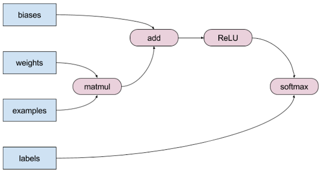
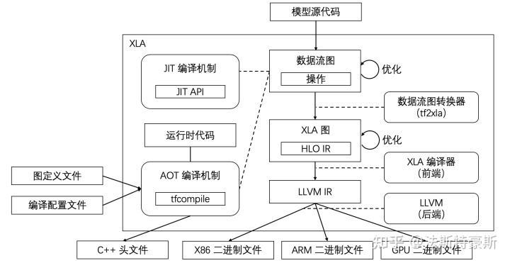
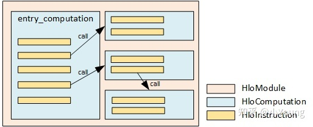

## xla

[XLA 源码深入解读](https://zhuanlan.zhihu.com/p/427444916)

XLA（加速线性代数）是一种针对特定领域的线性代数编译器，能够加快 TensorFlow 模型的运行速度。

> XLA good at 
>
> (1) transforming code back and forth between the scalar and the vector worlds
>
> (2) passing function boundaries for handling both host and device code
>
> (3) complying to stringent requirements imposed by energy-efficient xPUs

更一般来说，XLA 可以获取 TensorFlow 操作的整个子图，并将它们融合到需要最少内核启动次数的高效循环中。获得的融合内核可以利用模型专属信息进行优化。（算子融合、中间值传输）




```python
def model_fn(x, y, z):
  return tf.reduce_sum(x + y * z)
```

例如上述代码中，原始的tf会启动三个内核：分别对应于乘法、加法和减法运算。但XLA能将加法、乘法和减法“融合”到一个 GPU 内核中，以只使用一个内核就可以完成计算。融合操作不会将由 `y*z` 和 `x+y*z` 生成的中间值写出到内存中；而是直接将这些中间计算的结果“流式传输”给用户，同时将它们完全保留在 GPU 寄存器中。


XLA 接受在 HLO 中定义的计算图（“计算”）并将其编译为适用于各种架构的机器指令。

XLA对输入的HLO计算图进行**与目标设备无关的优化，如CSE（公共子表达式消除），算子融合，运行时内存分配分析**。输出为优化后的HLO计算图 HLO IR。
然后，将HLO计算图发送到后端（Backend），后端结合特定的硬件属性对HLO计算图进行进一步的HLO级优化，例如将某些操作或其组合进行模式匹配从而优化计算库调用。最后，后端将HLO IR转化为LLVM IR，LLVM再进行低级优化并生成机器码。

> XLA IR在优化中，会将一些具名算子节点（BatchNormalization）直接替换为包含计算细节（+-*/），同时插入一些相关的add、multiply和maximum等节点；或者将另外的具名算子（Conv）替换为cuDNN API，并且插入相应的call、reshape等节点。接下来，会做一些fusion和dse等优化操作。

<div style="text-align: center;"></div>


tf2lxa：graph compile -> hlo graph build -> hlo pass pipeline -> hlo dataflow analysis -> codegen


## HLO


### 层次划分

HLO IR可以分成三个层次，HloModule, HloComputation和HloInstruction。

<div style="text-align: center;"></div>

- HloModule

一个编译单元，相当于一个完整的**可执行程序**，所以有入口函数，也就是 entry_computation, 有且仅有一个。输入可以是多个参数，但输出只有一个（root instruction的值），**如果要返回多个值，需要把多个值构造成一个元组（tuple）返回**。一个module可以包含多个computation，除了entry_computation，其他的都是"nested"，也就是被调用。

ENTRY ----------------> 程序入口，ROOT--------------> 程序输出 

一个HloModule可以包含很多个HloComputation

- HloComputation

是HLO IR中间层的表示，相当于程序中的一个**函数**。一个HloModule只能有一个entry_conputation，其他的computation是被entry_computation调用的。我们可以把entry_computation类比作main函数。每个HloComputation可以包含多个HloInstruction，但只能有一个root_instruction，root_instruction的output就是该computation的output。

- HloInstruction

HLO IR最底层的表示，相当于程序中的一条指令，一个HloInstruction可包含多个算子。computation的input用parameter表示。HloInstruction也可以调用HloComputation。一个HloInstruction只有一个输出，如果需要多个output，就打包成一个Tuple。

data dependency：如果一个instruction的output是另一个instruction的input，我们就说两个instruction之间存在data dependency。HLO中使用operand和uses两个fields来表示data dependency。

```cpp
class HloInstruction {
  ...
  InstructionVector operands_;
  std::vector<HloInstruction*> users_;
  absl::flat_hash_map<const HloInstruction*, int64> user_map_;
  ...
};
```

<div style="text-align: center;"></div>

control dependency：有些instruction之间并没有数据依赖，但是我们仍然可能对这些instruction的执行顺序有额外的要求。在HloInstruction中有control_successors\_和control_predecessors_两个fields来表示control dependency。


### 多种HLO

https://github.com/tensorflow/mlir-hlo

- `DHLO`：Dynamic HLO

在XLA的HLO IR基础上，扩展了一套具有完备动态shape表达能力的IR。静态场景下，HLO IR中的shape表达会被静态化，所有的shape计算会被固化为编译时常量保留在编译结果中；而在动态shape场景下，IR本身需要有足够的能力表达shape计算和动态shape信息的传递。

- `CHLO`："Client" HLO

最初设计用于映射XLA的client APi，更接近前端。其中的ops可以来自XlaBuilder或者XLA helper functions，支持隐式广播、支持动态型型状。设计初衷是为了贴近client级别，方便渐进细化下降。

> 隐式广播指的是那些**没有具体指定发送给哪个应用程序的广播**

| CHLO |                                                              |
| :--- | ------------------------------------------------------------ |
| 入口 | 通过XlaBuilder API，TF2XLA kernels、JAX、PyTorch bridge直接使用这些API；<br />legalization from TensorFlow ops in the TF Graph Compiler |
| 出口 | MHLO；<br />调用XlaBuilder API导出到 xla::HloInstructionProto |

- `MHLO`: "Meta"-HLO

https://tensorflow.google.cn/mlir/hlo_ops

和xla_hlo相近，没有隐式广播，但支持动态形状

隐式捕获控制流ops，便于优化；输出结果多个，不用组合成一个元组；拥有不能加在client dialect或server dialect的ops；verification发生在boundary；更彻底地支持动态形状，无需更新所有users/backends

大量得映射在 linalg named ops 

| MHLO |                                                              |
| :--- | :----------------------------------------------------------- |
| 入口 | Legalization from CHLO dialect or conversion from XLA HLO；<br />直接从TF Graph Compiler获得 |
| 出口 | LMHLO；<br />Linalg IREE                                     |

- `LMHLO`: "Late"-"Meta"-HLO

与 MHLO 相同，但在 buffers (e.g., memref)  而不是 tensors 上，在缓冲区分配后作用

**LMHLO是为了帮助迁移 XLA 后端而临时引入的**，在这个级别上建模的大部分内容已经可以表示出来了`linalg`。在 LHLO 上执行转换的通道应该理想地遵守 Linalg 上存在的严格接口并且足够通用。

> tensor values (immutable) 和in-memory buffers (side-effecting)

| LMHLO |                       |
| :---- | :-------------------- |
| 入口  | 缓冲区分配后从XLA转入 |
| 出口  | Codegen（LLVM IR）    |

> [HLO to LHLO conversion and fusion #41424](https://github.com/tensorflow/tensorflow/issues/41424)


<div style="text-align: center;"></div>
