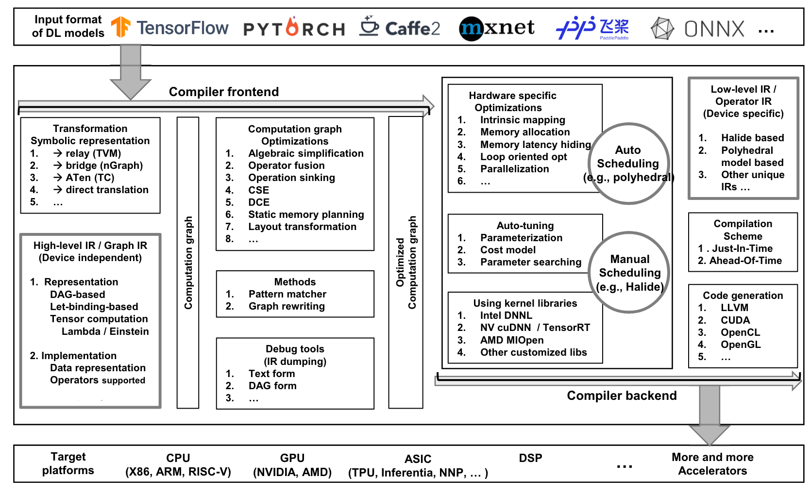
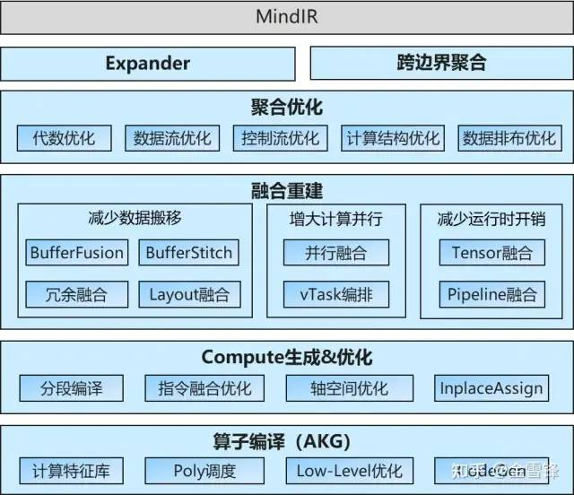

# AI compiler 概述

>  https://arxiv.org/abs/2002.03794

## 特点

不同于传统编译器，AI compiler有以下特点：

**1）Python作为解释器语言前端**

AI compiler不需要Lexer/Parser，而是将输入的前端语言（Python）转为AST并构造得到计算图IR，侧重于保留shape、layout、Tensor计算等特征信息，某些编译器还会保留控制流信息。

**2）多层级IR设计**

在框架前段主要对Tensor进行抽象封装，开发者只关心逻辑意义上的模型和算子；在后端算子性能优化时，侧重于更细粒度的循环调度，协同考虑目标硬件特点。

- 图编译器：TF的XLA（HLO），TVM的Relay等，重点关注==非循环相关的优化==。除了传统编译器常见的常量折叠、代数化简、公共子表达式等优化，还会完成Layout转换、算子融合等优化，通过分析和优化现有网络计算图逻辑，对原有的计算逻辑进行拆分、重组、融合等，以提升资源利用率。

> High-level IR 也称为 Graph IR，用于表示计算图，常见下面两种形式
>
> - **DAG-based IR**：是一种最为传统的方式，用点和边组织成一个有向无环图（Directed Acyclic Graph, DAG），从而充分利用现有的极其充分的 DAG 优化算法，而且实现简单，但是==缺少计算域的定义会导致语义的二义性==。
> - **Let-binding-based IR**：Let-binding 其实类似于变量定义，用于定义一个具有作用域的表达式。这样计算时就不必像 DAG 一样递归的计算一个个点，而是可以==将每个 let 定义的结果建立一个映射表==，之后查表即可。
>
> 不同的High-level IR，有不同的方式表示 tensor 之间的运算
>
> - **Function-based**：用函数来封装操作符，XLA 的 IR 采用此种形式。
> - **Lambda expression**：通过变量绑定和替换来描述计算，TVM 采用这种形式。
> - **Einstein notation**：也称为爱因斯坦求和约定（summation convention），这种表达方式下无需定义中间变量，IR 可以通过未定义变量的出现找出真正的表达式，TC 采用这种形式。
>

- 算子编译器：CANN TBE、TVM(HalideIR)等，侧重==嵌套循环的优化==。针对Low-level IR主要有循环变换、循环切分等调度优化，与硬件intrinsic映射、内存分配等后端pass优化。当前的自动调优主要分为基于搜索（搜索空间生成与减枝）和基于polyhedral（依赖约束）的。

> Low-level IR 能够在更细粒度的层面上表示模型，从而能够针对于硬件进行优化
>
> - **Halide-based IR**：Halide 基本思想为将计算和调度分离。相较于直接给定一个特定的模式，Halide 会尝试各种可能的调度方式并选择最好的一个。
> - **Polyhedral-based IR**：Polyhedral 模型使用 linear programming, affine transformations 以及其他的数学方法来优化具有静态控制流边界和分支的以循环为基础的代码。
> - **其他 IR**：也有其他的编译器采用了除了以上两种方式之外的 IR，然后将硬件优化交给 LLVM IR 等设施，MLIR 就是一个例子。

- Codegen：当前基本都收敛到LLVM IR。

**4）面向社神经网络的特定优化**

- 数据类型——Tensor（计算一般被抽象为Tensor的计算）
- 自动微分——基于计算图、基于source2source的自动微分
- 自动并行：数据并行、算子级模型并行、Pipeline模型并行、优化器模型并行

**4）DSA芯片框架的支持**

SIMT、SIMD、Dataflow：AI的训练和推理对性能和时延都非常敏感，常用集合通信技术

## 发展

当前主要在第二阶段向第三阶段的发展过程中，主要问题如下：

1、表达上，计算图层和算子层还是分开的，算法工程师关注图层的表达，算子的表达和实现主要是由框架开发者和后端硬件厂商来提供。当下对图层内、算子层内的优化都相对充分，并在开展两层边界间的融合优化。但未来希望将图算表达统一起来

2、功能上，动态shape、稀疏网络的优化、并行优化等功能需要得到更好的支持

3、效率上，在算子实现的schedule、tiling、codegen等方面需要兼顾效率和性能，需要实现自动化的同时 维持较好的优化后性能

## 技术要点

### 前端

**（1）High-level IR**

High-level IR 也称为 Graph IR，用于表示计算图，常见下面两种形式

- **DAG-based IR**：是一种最为传统的方式，用点和边组织成一个有向无环图（Directed Acyclic Graph, DAG），从而充分利用现有的极其充分的 DAG 优化算法，而且实现简单，但是==缺少计算域的定义会导致语义的二义性==。
- **Let-binding-based IR**：Let-binding 其实类似于变量定义，用于定义一个具有作用域的表达式。这样计算时就不必像 DAG 一样递归的计算一个个点，而是可以==将每个 let 定义的结果建立一个映射表==，之后查表即可。

不同的High-level IR，有不同的方式表示 tensor 之间的运算

- **Function-based**：用函数来封装操作符，XLA 的 IR 采用此种形式。
- **Lambda expression**：通过变量绑定和替换来描述计算，TVM 采用这种形式。
- **Einstein notation**：也称为爱因斯坦求和约定（summation convention），这种表达方式下无需定义中间变量，IR 可以通过未定义变量的出现找出真正的表达式，TC 采用这种形式。

**（2）Graph IR实现**

**（3）前端优化**

前端优化发生于计算图构建完成后，输入后端前，主要目标是优化计算图，因此是硬件无关的。优化通常是以一个称为 passes 的东西定义，通过遍历图和转化图结构来进行优化，文中将优化分为三个级别

- **Node-level optimizations**：结点级别的优化指的是在结点内部进行优化，包括删除结点或者替换成一个更低开销的结点，例如清除 Nop 指令（Nop Elimination）和 0 维度的 tensor （Zero-dim-tensor elimination，即vector？）。
- **Block-level optimizations**：块级别的优化可以优化结点之间的关系。Algebraic simplification 可以通过调整运算顺序、结点间结合关系等等方式替换一个高开销的运算符或者是将常量间操作替换成结果（常量折叠）等等。Operator fusion 可以融合运算符，比如减少内存分配次数，结合循环，减少同步的开销等等。Operator sinking 能够将一些操作放到相近的位置，创造更多的机会进行优化。
- **Dataflow-level optimizations**：数据流级别的优化，文中提到了四种。Common sub-expression elimination 也就是如果一个值常被计算得到但不会变化，那么后续不再计算。Dead code elimination 删除了无法抵达的代码（通常是由优化导致的）。Static memory planning 尽可能的重用内存。Layout transformation 生成更好的数据布局，不过这部分可能会依赖于硬件。

HLO IR中的计算图优化

### 后端

后端优化首先就是针对于硬件的优化，从而生成更加高效的代码。一种方法是利用 LLVM，另一种方法是用深度学习领域定制的优化。

- **Hardware intrinsic mapping**：将一段 low-level IR 转化成硬件上已高度优化的指令。
- **Memory allocation and fetching**：GPU 上有专有的内存和共享的内存，两者容量和延迟均不同，因此存在不同的调度策略。
- **Memory latency hiding**：利用流水线，通过重排指令将访存的指令尽可能靠近从而一次取出更多数据，访存同时执行之前的代码，减少内存延迟的影响。
- **Loop oriented optimizations**：文中提到了 loop fusion（融合相同边界的循环）, sliding windows（循环计算的变量仅在使用时计算，但会导致两个循环串行化）, tiling（拆分循环为几部分，更好的利用局部性）, loop reordering（修改循环内部代码顺序）, and loop unrolling（展开循环再采用更多的优化方法）等方法优化循环。
- **Parallelization**：将代码并行化以充分利用硬件性能。

### 自动调优

在优化过程中许多场景下有许多参数可以调整，因此后端优化的另一方向就是自动调优（Auto-tuning），分为如下几个部分

- **Parameterization**：将数据中特征和优化选项作为参数提取出来。
- **Cost model**：用于评估模型的性能，分为三类 1）黑盒模型，只考虑运行时间，简单但是缺少指导优化的信息，2）ML为基础的模型，用机器学习的方法预测性能，能够在找到新配置时更新模型提升准确率，3）预定义的模型，根据编译任务的特征建立一个可以评估任务性能的模型，相比 ML 模型计算花费小，但是换到新任务上就需要重建模型。
- **Searching technique**：搜索最佳的参数。首先需要对其初始化并决定搜索空间，之后可以采用基因算法、模拟退火算法、强化学习等方法进行搜索。
- **Acceleration**：加速调优，主要分为两个方向，1）并行化和 2）配置重用，用之前的调优配置加速搜索。

最后是采用已经被高度优化过后的核心库，例如来自 NVIDIA 的 cuDNN 和 Intel 的 DNNL 等等以充分利用硬件。

## 挑战

**挑战一：Python的静态化**

通过JIT等技术，让Python程序转化为静态IR，方便后续的优化进行。目前AI框架静态优化方案主要使用修饰符方式。典型的如numba，通过修饰符，进行部分Python语句加速。

1、Tracing Based

2、ByteCode Based

3、AST Based

其中tracing和bytecode的方式接近于JIT（just-in-time）的方式，而AOT（ahead-of-time） Based方式接近于AOT的方式。

> 主要难点：类型推导、数据类型转换、控制流处理、JIT编译性能

**挑战二：多样化的后端硬件，如何充分发挥算力**

不同的架构：CPU的SIMD单元、GPU的SIMT架构、NPU的专用架构等，近期Dataflow+SIMD这样的DSA芯片占比逐步提升。

Dataflow架构特点：

1、DFG的调度执行更加能发挥芯片性能，主要进行整图/子图的调度，而不是GPU的kernel调度

2、较强大的Cube处理单元（类SIMD），较为复杂的内存管理机制

这类架构性能优化更难：

1、性能优化更依赖于图算融合优化，图层和算子层独立优化无法完全发挥性能，需要==打开图和算子的边界==，尝试子图切分、子图内垂直融合优化（buffer fusion等）和水平并行优化（msa rammer等）

2、需要更复杂的优化手段，标量+向量+张量+加速指令、多级的存储结构，导致Schedule、Tilling、Vectorization/Tensorization复杂

> 业界已有方案
>
> 1、XLA：基本上的思路是把图层下发的子图中的算子全部打开成小算子，然后基于这张小算子组成的子图进行编译优化，整体设计主要通过HLO/LLO/LLVM层层lowering实现，算子打开/子图融合优化/融合算子生成的规则都是手工提前指定。
>
> 2、TVM：分为Relay和TVM两层，Relay关注图层，TVM关注算子层，总体思路与XLA是类似的，Relay做子图的优化、TVM实现融合算子的生成，区别在于TVM是开放的架构，提供了compute和schedule分离的方案，方便定制算子生成的优化。

**挑战三：自动并行与自动微分**

一方面，当前大模型训练碰到内存墙、性能墙需要依赖复杂的切分策略来解决：

1、Scale out：多维混合并行能力，含：数据并行、算子级模型并行、流水线并行、优化器并行（ZeRO）等

2、Scale up：重计算、Host/Devcie并行等

另一方面，传统的自动微分是通过控制流展开来解决，一旦循环次数多，性能会大大劣化。

## 未来

几个方向：

- **Dynamic shape and pre/post processing**：动态形状的模型还可以变得更高效。同时模型变得很复杂，不可避免将数据处理放进模型，而预处理和后处理现在还是由 Python 的解释器在执行，容易成为性能瓶颈，所以可以考虑让深度学习编译器加入更多的控制流从而实现对数据处理部分代码一同进行优化。
- **Advanced auto-tuning**：如今的自动调优着重于单独的操作符，但局部最优并不能产生全局最优，作者提出可以考虑两个不同操作符间操作的调优。
- **Polyhedral model**：一方面自动调优可以用先前的配置降低多面体模型的开销，另一方面多面体模型自动调度可以减少自动调优时的搜索空间，从而提高整体的效率。
- **Subgraph partitioning**：将计算图分割成数个子图，然后针对各个子图再进行各自的处理。
- **Quantization**：传统的量化策略只是用固定的几种策略，而在深度学习编译器中则可以利用编译过程中优化机会获得更有效地量化策略。
- **Unified optimizations**：作者提出不同的编译器间难以分享最新的优化手段，因此提出可以统一优化的过程从而重用优化的方法。
- **Differentiable programming**：微分编程好像是个很有趣的方向，不过目前对于深度学习编译器来说还是个十分具有挑战性的方向。
- **Privacy protection**：作者提到在边缘-云系统中，边缘设备和云设备通信过程中被窃听，攻击者就可以用中间结果训练另一个模型来获取隐私信息。一个解决方法是添加噪声，但在哪里添加噪声和如何自动添加噪声都是研究方向。

## MindSpore

基于多层规约的图算融合引擎、自动算子生成：

