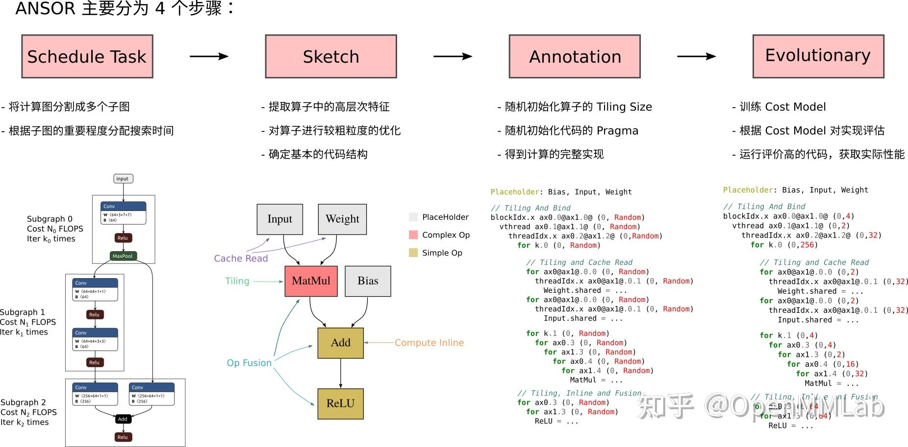

# 切图算法

在 [Auto-Parallelism](../../paper_read/Auto-parallelism%20summary/Auto_Parallelism.md) 文件中讲到了ai compiler可能涉及的两种切图算法：

（1）为了设备分布式执行切图，将计算图（静态图）切为子图， 为了在内存受限的独立设备上执行

例如：FlexFlow、Alpa

（2）为了launch kernel切图(算子融合)，子图对于硬件kernel可能过大，无法融合为1个kernel，为了便于在auto-scheduler时直接融（tile）为一个kernel，故将将子图切为适应硬件kernel大小的片段

当时在 [Auto-Parallelism](../../paper_read/Auto-parallelism%20summary/Auto_Parallelism.md) 中分析了第一类切图算法，本文就学习一下第二类——为了launch kernel切图(算子融合)

## 相关工作

为了launch kernel切图也经常以算子融合的形式实现，很多ai compiler都实现了各自的切图算法

### 手写pattern

手写一些融合的pattern，例如：`conv2d + relu`，`conv2d + bn + relu`，`conv2d + bn + relu + pool`等，常见让计算密集型和访存密集型算子融合，减小整体执行开销。针对特定场景有较好的收益，但泛化性较差（总不能手动枚举所有优化可能吧，总得编译时间和性能trade-off）

> 推荐两篇讲访存和计算的知乎文章：https://zhuanlan.zhihu.com/p/600489819, https://zhuanlan.zhihu.com/p/688613416

### XLA

XLA的op fusion是在HLO IR层做的，相关代码见[fusion_pipeline.cc](https://github.com/openxla/xla/blob/main/xla/service/gpu/fusion_pipeline.cc)。

- PriorityFusion: 实现了FusionQueue，queue中都是producer。根据cost model来fuse instructions，并且通过动态地更新优先级（benefit最大）来选择下一个fusion对象。

- InstructionFusion: 纵向fusion，将从producer到consumer的所有指令融合为一个kernel。

- FusionMerger: 当合并结果不会增加字节传输，将融合后的指令进行合并。

- MultiOutputFusion: 横向融合的一种，将多个output的指令融合为一个kernel。

- HorizontalLoopFusion: 将多个fusion op横向融合在一起launch

### TVM

TVM的算子融合是在relay层做的，相关代码见[graph_partitioner.cc](https://github.com/apache/tvm/blob/main/src/relay/analysis/graph_partitioner.cc)和[fuse_op.cc](https://github.com/apache/tvm/blob/main/src/relay/transforms/fuse_ops.cc)

其将算子分为7类：ElemWise，Broadcast，Injective，CommReduce，OutEWiseFusable，Tuple，Opaque，不同的算子间有不同的融合rule

主体实现代码：

```cpp
std::vector<GraphPartitioner::Group*> GraphPartitioner::Partition(
    const IndexedForwardGraph& graph) {
  // 每个节点初始化为一个group
  this->InitGroups(graph);
  if (opt_level_ == 0) return std::move(groups_);
  // get post dominator tree
  auto post_dom_tree = DominatorTree::PostDom(arena_, graph);
  // run fusion algorithm.
  for (int phase = 0; phase < 3; ++phase) {
    this->RunFuse(graph, post_dom_tree, phase);
  }
  return std::move(groups_);
}
```

个人想法：ansor生成Sketch已经是在图划分后，而划图就已经考虑了op的融合行为，所以给定的rule中会有融合的rule，会尽量尝试融合

<div style="text-align: center;"></div>

