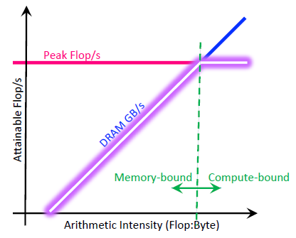

# data reuse

参考：**[AI芯片：高性能卷积计算中的数据复用](https://www.cnblogs.com/sea-wind/p/11421688.html)**

> 1.用矩阵相乘代表卷积，优化矩阵相乘
> 
> 
> 2.从硬件设计上帮助卷积实现
> 

卷积计算是神经网络中最重要的一类计算，本文分析了高性能卷积计算中的数据复用，这是AI芯片设计中需要优化的重点之一，全文结构如下

- 数据复用的动机
- 存储-计算分离框架下，针对卷积计算的优化思路
- 针对卷积计算的硬件架构设计分析
- 已经面临的挑战和解决方向
- 神经网络中数据复用的未来

## 1. 数据复用的动机

深度学习的发展过程中，较高的计算量是制约其应用的因素之一。卷积神经网络中，主要计算为三维的卷积计算（后简称为卷积），现有的主流处理器难以高性能，高效能的完成卷积计算。相比一般的通用计算，**卷积计算中存在的大量数据复用以及计算的规则性**，在硬件的微架构（后简称为架构）设计和计算优化上有很大的优化空间，由此诞生了众多针对深度学习加速的AI芯片。卷积计算过程可以表示如下

```c
for i = 1 : Ho
    for j = 1 : Wo
        for k = 1 : Co
            for l = 1 : Hf
                for m = 1 : Wf
                    for n = 1 : Ci
                        out[i,j,k] += In[i*s+l.j*s+m,n]*F[l,m,n];
```

| 数据维度 | 描述 |
| --- | --- |
| Ho/Wo | 输出feature map的高和宽 |
| Co | 输出的channel数目 |
| Hf/Wf | filter的高和宽 |
| Ci | 输入的channel数目 |
| s | 卷积计算的stride |

据此可推算出输入输出数据的数据复用关系，如下表

| Type | Mem Refs | Ops | Ops/Memory |
| --- | --- | --- | --- |
| Filter | 𝐻𝑓𝑊𝑓𝐶𝑖𝐶𝑜 | 𝐻𝑜𝑊𝑜𝐶𝑜𝐻𝑓𝑊𝑓𝐶𝑖 | 𝐻𝑜𝑊𝑜 |
| Input | 𝐻𝑜𝑊𝑜𝐶𝑖𝑠2 | 𝐻𝑜𝑊𝑜𝐶𝑜𝐻𝑓𝑊𝑓𝐶𝑖 | 𝐻𝑓𝑊𝑓𝐶𝑜/𝑠2 |
| Output | 𝐻𝑜𝑊𝑜𝐶𝑜 | 𝐻𝑜𝑊𝑜𝐶𝑜𝐻𝑓𝑊𝑓𝐶𝑖 | 𝐻𝑓𝑊𝑓𝐶𝑖 |

可以看出，卷积计算过程中对Filter，Input和Output的数据均有很高的数据复用；充分利用计算过程中的数据复用是达到高性能和高效能的关键，这主要有以下几个方面原因

\1. 利用数据复用**更容易达到设计的峰值性能**

根据Roofline模型很容易解释第一点原因。Roofline模型是一种面向吞吐量的性能评价模型，它指出在理想情况下，处理器性能的理论上界。如下图（Ref. [CS217_Lec6](https://cs217.stanford.edu/)）所示，**在数据复用不高的情况下，峰值性能受限于内存**（Memory-bound）。



\2. 利用数据复用**可以降低内存访问，降低功耗**

访问不同存储的归一化能耗比可以解释第二点原因。充分利用数据复用，使得访存多发生在RF等靠近ALU的存储上，可以极大降低功耗。


\3. 广义来看，卷积中规则的数据复用，可以**降低处理器设计中缓存/控制逻辑的设计复杂度**，提高总体的性能

在CPU中，FPU和ALU只占CPU面积的很小一部分，大部分面积是控制逻辑的缓存。而卷机操作没有分支跳跃等控制逻辑，可以抛开专用处理器中复杂的控制和缓存设计，减小芯片面积，提升性能，降低功耗。

## 2. 高性能卷积的计算方法

### 2.1卷积即矩阵乘法

很多线性代数库充分**结合了矩阵计算中的数据复用关系和处理器缓存的层次设计结构**，对矩阵-矩阵乘法进行了充分的优化（GEMM，通用矩阵乘法）。*C* = *AB* + *C*的矩阵乘法可以表示为

```c
for i = 1 : m
    for j = 1 : n
        for k = 1 : t
            C(i,j) = A(i,k)*B(k,j) + C(i,j)
```

可见矩阵乘法的形式类似于卷积。实际上，针对三维的Tensor进行展开（即将第一节卷积计算中的六层循环的内三层进行合并），很容易将卷积计算转化为矩阵乘法计算(im2col)。 其中一种展开方式如下图 （Ref. [CS217_Lec9](https://cs217.stanford.edu/)）


卷积计算等价为矩阵乘法计算；而卷积计算中的数据复用关系等价为了矩阵计算中的数据复用关系。矩阵-矩阵乘的复杂度如下所示

| Ex. | Mem Refs | Ops | Ops/Memory |
| --- | --- | --- | --- |
| Matrix-Matrix Mult | 4𝑛2 | 2𝑛3 | 𝑛/2 |

现有的处理器架构从存储和计算之间的关系上来看都是类似的，**处理器计算性能的上限可以通过计算单元及其运行频率确定**。为了高性能的完成矩阵计算，即使得性能达到Roofline模型中峰值，需要**对矩阵计算的三层循环进行优化**。在进行分析之前，需要明确两点固有的特性

- 处理器的存储是分层设计的，越靠近计算的单元，带宽越大，容量越小
- Roofline模型和访存的带宽有关，如下图所示


如果矩阵存储在内存中（DDR）,直接按三层循环进行矩阵计算，那么每个周期需要访问*𝑎*, *𝑏*, *𝑐*三个数，此时性能会受**限于DDR带宽**。将矩阵放在片上的Cache中是一个好的选择，但是片上Cache的容量往往较小。解决这一个矛盾的方法是对大的矩阵进行分块，此时矩阵计算可以表示为

```c
for i = 1 : MR : m  // step MR
    for j = 1 : NR : n  // step NR
        for k = 1 : KC : c  // step KC
        // block-dot product in cache
        // Csub_{NR*MR} += Asub_{MR*KC}*B_sub(KC*NR)
        // opt. mirco kernel
            for ir = 1:MR
                for jr = 1:NR
                    for kr = 1: KC
                        Csub(ir,jr) += Asub(ir,kr)*Bsub(kr,jr);
```

采用这一分块方式，假设矩阵存储在DDR，分块后的矩阵存储在片上Cache；完成*MR* × *NR* × *NC*次乘法计算只需要从DDR获取*MR* × *NR* + *NR* × *NC* + *MR* × *NC*个数据，**合理的分块能降低对DDR的访问。** 针对具有不同存储层次的处理器以及不同大小的矩阵计算而言，有不同的分块方式以达到峰值性能。虽然这一方法针对矩阵计算进行了很好的优化，但对于卷积计算而言，依旧存在缺陷

- im2col计算过程中针**对Tensor进行了Reshape和Duplicate**，这会增加带宽的消耗
- 转化得到的矩阵乘法和传统的矩阵**计算维度相差较大**，可能无法获得好的性能

由于这些缺陷存在，如果没有针对硬件架构进行特殊的设计，卷积即矩阵乘法的设计思路往往无法达到峰值性能。

### 2.2 卷积即卷积

采用矩阵-矩阵乘法进行卷积计算忽略了卷积本身的特性。卷积计算实际上是一类很**特殊的计算**（天生的数据复用），以一维的离散卷积为例，函数*f*, *g*之间的卷积可表示为 
$(𝑓∗𝑔)[𝑛]=\sum^{∞}_{m=-∞}𝑓[𝑚]𝑔[𝑛−𝑚]$
以有限长脉冲响应(Finite impulse response，FIR)滤波器作为离散卷积的一维特例，可表示为 
$𝑦[𝑛]=\sum^{N}_{i=0}𝑏_𝑖⋅𝑥[𝑛−𝑖]$
一维的脉动阵列FIR滤波器的一种实现方式，其实现结构如下图，采用这种结构，**每输入一个*x*[*n*]，就能计算得到一个*y*[*n*]。**这种特殊的数据复用是根据卷积计算的特殊性质得到的。


在卷积神经网络中，卷积层的计算一般也存在这种数据复用关系（除kernelsize <= stide情况外）。如果能用好这一特性，不再将卷积转化为矩阵乘法，**直接计算卷积**，能获得更高的性能。为了达到这一目标，和分析矩阵乘法类似，对卷积的六层循环进行分析

```c
for i = 1 : Ho
    for j = 1 : Wo
        for k = 1 : Co
            for l = 1 : Hf
                for m = 1 : Wf
                    for n = 1 : Ci
                        out[i,j,k] += In[i*s+l.j*s+m,n]*F[l,m,n];
```

类似GEMM，最内层循环会被并行化，为了达到更好的性能，可以**对循环顺序进行调整**

> Zhang J , Franchetti F , Low T M . High Performance Zero-Memory Overhead Direct Convolutions[J]. 2018.
> 
- 为了提高并行性，由于Co循环的各个计算之间相互独立，将其放置到最内层循环
- 由于Wf,Hf可能会很小，为了保证并行性，将Wo放到Co循环外

完成调整之后，**对卷积计算进行分块**


为了进一步提高访存的效率，Input/Ouput/Filter在内存中的排布方式也需要进行相应的调整，此处不再描述。

无论是将卷积转化为矩阵计算，或者直接计算卷积，都能够通过分块的方式相对高效的完成卷积计算；由于**将卷积转化为矩阵计算有一定开销**，其性能可能会受到一定影响，但矩阵计算具有更高的灵活性。

## 3. 高性能卷积的架构设计

### 3.1 GEMM加速器

实现一个硬的GEMM加速器可以加速矩阵计算，进而加速卷积计算。针对**GEMM的分块矩阵（即内层循环）**进行硬件加速是一种简单，高效且相对灵活的选择，其优势包括

- 简单，计算单元实现GEMM的mirco kernel即可，易于集成
- 灵活，支持所有可用GEMM加速的算法（理论上）
- 编译器设计和调度有很多参考实现

类似设计包括Nvidia的Volta架构，其加速核心被称为Tensor Core；以及华为的达芬奇架构（Davinci Core），其卷积的计算核心被称为CUBE Core。

\1. Nvidia的Volta架构

其中，Nvidia的每个Tensor Core是一个4 × 4 × 4 的MAC阵列。计算*C* = *AB* + *C*时，矩阵*A*, *B* 中的元素广播到4个不同的MAC上，同时每个四个乘法的结构累加到一起，如下图所示（Ref.[Volta Tensor Core GPU Achieves New AI Performance Milestones](https://devblogs.nvidia.com/tensor-core-ai-performance-milestones/)）


Nvidia Volta架构中，Tensor Core仅仅只是一个特殊的计算单元，其地位和FP计算单元一致。


为了保证计算单元之外设计的统一性，送入计算单元的数据位宽完全一致，和普通的FP32计算单元比，**Tensor Core在算力上有很大的优势**。由下表可以看出，由于数据复用和精度的降低，Tesnor Core的理论性能是FP32的8倍（同频，其中两倍受益于精度的降低）。

| Ex. | DataWidth | Data Num | Ops |
| --- | --- | --- | --- |
| FP32 | 256 | 8 | 16 |
| Tensor Core | 256 | 16 | 128 |

\2. 华为的达芬奇架构

达芬奇中的CUBE Core是一个16×16×1616×16×16的MAC阵列（以Davinci Max为例），如下图所示（hotchips31），具有更高的数据复用关系。


Davinci Core进行了更多的设计，配合完成高性能的卷积计算。MTE中的img2col表明其进行了3D Tensor到Matrix的转换。(Ref. [华为在hotchips详细介绍了达芬奇架构](https://www.jiqizhixin.com/articles/2019-08-20-4))


前文提到“卷积即矩阵乘法的设计思路无法达到峰值性能”，但有了**硬件架构的联合设计**，这一结论不再成立。譬如在Davinci Core中，在L0 Buffer进行Img2col可以降低由于im2col增加的访存带宽，合理设计的L0 BufferA/B/C也能应对卷积操作中大量的中间结果。

### 3.2 脉动阵列

脉动阵列的典型代表是Google TPU，Google TPU中设计的脉动阵列也是针对矩阵乘法设计（虽然有的脉动阵列也可直接计算卷积，但TPU并没有采用这一类设计）。**Google TPU的其计算核心为一个256 × 256的二维脉动阵列**，如下图所示。


### 3.3 直接卷积加速器

> Ref: Y.-H. Chen, T. Krishna, J. Emer, V. Sze, “Eyeriss: An Energy-Efficient Reconfigurable Accelerator for Deep Convolutional Neural Networks,” IEEE Journal of Solid State Circuits (JSSC), ISSCC Special Issue, Vol. 52, No. 1, pp. 127-138, January 2017.
> 

Eyeriss是一种直接针对卷积计算优化的加速器，和其他加速器不同，Eyeriss针对Convolution Reuse进行了优化。按Ref的分类标准，是一种Row Stationary。

由于卷积神经网络计算卷积时C方向的特殊性，Convolution Reuse仅在H和W方向存在。以kernelsiz=3，stride=1为例，卷积计算中row方向的数据复用如下图


此时ifmap中的元素3被利用了三次，只需要从存储中访问一次元素3，就能完成3次计算。当扩展为二维时，有


即ifmap的row方向在不同PE之间进行复用；而实际上ifmap的col方向的数据会暂存在PE内的RF上，col方向的数据也在RF上进行复用。

Eyeriss利用了convolution resue，同时也可以利用其他resue的手段。譬如上图中的filter在水平PE之间复用，psum在垂直的若干个PE之间复用。这意味这Eyeriss相比其他结构做到了更多的数据复用，可以进一步降低功耗。

### 3.4 基于变化域的卷积计算

一维卷积的计算复杂度为*O*(*n*2)，由于时域卷积等于频域相乘，**对于离散信号而言，可以通过快速傅里叶变换**（Fast Fourier Transform，FFT）及其逆变换将信号在时域和频域之间变换。而FFT的计算复杂度为*O*(*nlogn*)，当*n*取值较大时，其计算复杂度会远低于直接计算一维卷积。

类似的，可以考虑在其他域进行二维/三维卷积的计算；针对卷积神经网络中的加速，有

- FFT based Method ([Fast training of convolutional networks through FFTs](https://arxiv.org/abs/1312.5851))
- Winograd Method ([Fast Algorithms for Convolutional Neural Networks](https://arxiv.org/abs/1509.09308))

但若想取得一定的加速比，这些方法对卷积核的大小和步长均有要求；这一类方法均难以适应卷积核日益小型化的发展趋势。

## 4. 轻量化网络带来的新的设计挑战

当大多数AI芯片中的神经网络加速器还在使用AlexNet/VGG/ResNet跑benchmark时，新的网络层出不穷。一些为了运行在嵌入式设备上而设计的轻量化网络通过压缩卷积中各个维度的计算来降低计算量，这很大程度影响了卷积计算中的数据复用关系。考虑在轻量化网络中使用的Point Wise Conv和Depth Wise Conv，以及延时受限系统中Batch=1的全连接层，有下表

| Type | Ops/Memory |
| --- | --- |
| Point-Wise Convolution Layer | Input: $Co/s2 $
Filter:$ H_oW_o$
Output:$Ci$ |
| Depth-Wise Convolution Layer | Input:$ HfWf/s2 $
Filter: $H_oW_o
$
Output:$H_fW_f$ |
| Batch=1 Fully Connect Layer | Input: $Co $
Filter: 1 
Output:$Ci$ |

而第三节中一些典型的基于数据复用的加速其设计中，若想达到最优性能，对数据复用的要求是

| Architectures | Input1 | Input2 | Output |
| --- | --- | --- | --- |
| 16 × 16 × 16 Cube Core | 16 | 16 | 16 |
| 256 × 256 Systolic Array | 256 | 1350 | 256 |
| Eyeriss V1(Theo. low bound) | 168 | 42 | 42 |

数据复用关系的失配会让这些加速器在运行这些特定的Layer时出现严重的效率问题。譬如TPU V1在计算3 × 3Depthwise Conv时效率不可能超过9/256 = 3.5。这样低的效率使得这些设计良好的网络带来的数量级的计算量下降变得毫无意义。

从根源上看，Cube Core或者Systolic Array的优化目标都是Matrix-Matrix乘法，而Batch=1得FC和Depthwise Conv更贴近于Matrix-Vector乘法，这在本质上就是不同的。即使在软件层面的优化上，这两个运算也是分别进行优化的（GEMM和GEMV）。

而对于芯片设计而言，已经面临的挑战是如何设计一个在多变的复用关系下均能保证较高效率的神经网络加速器。完成这一目标，至少有两种不同的设计方向

- 具有灵活互联结构的可重构加速器
- 标量+矢量+向量的异构加速器

### 4.1 具有灵活互联结构的可重构加速器

上述的几乎所有的讨论和设计，都能归结到降低数据带宽上。一旦数据带宽降低后，其灵活性就受到了很大的限制，这是无法计算GEMV的原因之一。如果需要加速器能够在各种情况下有良好的表现，最直接的解决方案就是在设计上提供高的带宽和灵活性。 Eyeriss V2就采用这种思路对Eyeriss V1进行改进，以高效支持MobileNet。为了提供高带宽，Eyeriss设计了层次化2D Mesh的Noc


设计中一个PE Cluster具有12个PE，12个PE之间互相连接；PE Cluster通过一个2D Mesh进行互联。Global Buffer到PE之间具有丰富的连线，在不同计算模式下可以以Multicast，broadcast和unicast进行数据传输，充分满足不同计算下的数据需求。


尽管Eyeriss V2中并没有提到可重构，但其Noc在计算不同网络时有不同的选通路径，和可重构的思想一致。一般谈到硬件可重构，一般会想到FPGA（Field－Programmable Gate Array，现场可编程大规模逻辑门阵列）。通过FPGA片上丰富的的互联结构和查找表，FPGA理论上可以用于实现各种形式的电路。

FPGA可以创造出各种可能，但FPGA设计上有很多冗余，在布局布线和加载上也会花费较多时间。究其本因，是因为FPGA采用了很底层的基本单元来构建整个电路。与FPGA这种细粒度可重构相对应的是粗粒度可重构网络，粗细度可重构不像FPGA一样可以控制每一个bit的选通，而是提供了一系列基本的计算单元和互联结构。根据算法的需求，可以采用不同的方式构建这些计算单元。譬如Plasticine中的PCU中，每个FU由前向，反馈等多种路径，可以构建不同的计算单元。

> Ref: Prabhakar R, Zhang Y, Koeplinger D, et al. Plasticine: A Reconfigurable Architecture For Parallel Paterns[C]// Acm/ieee International Symposium on Computer Architecture. 2017.
> 


多个PCU之间通过交换网络和其他PCU及PMU（Memory）相连，可以配合完成不同的操作。这些都以增加片上各个单元之间的互联性为基础。


采用可重构设计的还有清华大学微电子系设计的Thinker芯片，具体可参考A High Energy Efficient Reconfigurable Hybrid Neural Network Processor for Deep Learning Applications。这样的具有灵活互联结构的可重构加速器，可以支持矩阵-矩阵乘法，矩阵-向量乘法以及更多的其他计算，具有较强的灵活性。

### 4.2 标量+矢量+向量的异构加速器

另一种思路是对某些运算做到极致的支持，其他的运算通过CPU或者其他的Core来计算；从华为达芬奇架构，到Google TPU2/3的设计上，都有的体现，华为的达芬奇架构可参见3.1节，Google V2/3的框图如下


Google的框图并没有透露太多的细节，仅仅表面TPU中由于MXU和scalar/vector units；华为的达芬奇架构则指出了

- Vector：2048bit vector with special functions（activation functions，NMS，ROI，SORT）
- Cube：4096 FP16 MACs

虽然Vector Unit似乎并不能计算FC Layer或者Depthwise Conv Layer，但这也代表了一种设计方向。当采用3D Matrix Unit进行矩阵计算时，随着𝑁N取值的增加，数据输入带宽随𝑁2N2增长，而MACs的数量随𝑁3N3增长，这表面针对特定的计算进行优化结果可能会更优。当然，这样的设计也有一些缺陷

- 不同计算单元之间负载可能不均衡，导致计算出现瓶颈
- 不同计算单元之间的数据传输，调度会变得复杂

当然，这种设计思想并不意味一个加速Core只能加速很受限的计算类型，依旧可以对单个的加速Core进行兼容设计，本节的讨论和4.1并不完全冲突。譬如依旧有一些简单方法可以让一个三维的MAC阵列（类似Cube Core）同时支持GEMM和GEMV操作，但依旧会有一些限制，由于数据复用的不同，这两类运算始终落在Roofline模型的不同位置。

但不管从哪个角度去解决面临的新的挑战，暂时都没有看到一个完美的解决方案。或许我们并不需要一个真正完美的解决方案，能解决一部分问题，创造价值就已经足够了。这里引用Cloud TPU（TPU V2/3）的一些说明

> Cloud TPU适合以下工作负载
> 
> - 由矩阵计算主导的模型
> - 主循环内没有自定义TensorFlow操作的模型
> - 需要训练数周或数月的模型
> - 有效批量非常大的大型和极大型模型
> 
> Cloud TPU不适合以下工作负载
> 
> - 需要频繁分支或逐项代数主导的现有代数程序
> - 稀疏方式访问内存的工作负载可能不适用于TPU
> - 需要高精度算法的工作负载

显然，Cloud TPU聚焦在大型和极大型模型的加速上，轻量化模型不在考虑范围之内；Cloud TPU甚至明确指出了暂不支持Depthwise Convolution计算。但这些都不影响Cloud TPU的应用和创造价值。

而正因为没有完美的设计，选择和取舍会变得尤为重要。

## 5. 神经网络中数据复用的展望

虽然在AI芯片设计过程中，都针对算法进行了深度的优化；同时算法也针对芯片实现进行了**定点化和低比特量化**等工作：这些看似是一个联合优化的过程。但是归根到底，既然是选择为AI应用设计芯片，在设计过程中，算法永远占主导地位。从长远来看，还需要把握算法的发展趋势。

站在硬件设计的角度来看，由于在计算机诞生之初就有了高性能并行计算的需求，很多设计实际上以及出现了很长时间，譬如数据并行的向量体系结构，VLIW，脉动阵列，稀疏计算都有40年以上的历史，2D Mesh互联也至少有30年。从设计上看，新的东西并不是很多，架构成功的关键在于是否顺应了时代的潮流，包括算法/需求的发展和底层硬件技术的发展。

在发展过程中算法和现有的硬件上的分歧往往是存在的，以本文讨论的卷积计算的数据复用为例，这和网络稀疏化的发展方向相悖。如果以极度稀疏化为目标，那么网络计算过程中的数据复用会越来越低。

神经网络中数据复用的未来如何，完全取决于算法的发展。