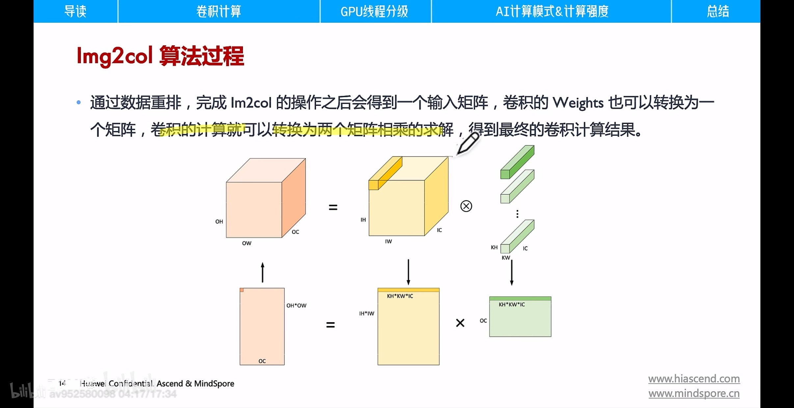
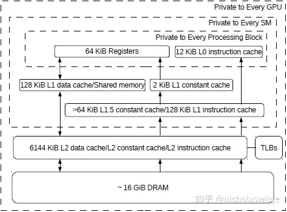
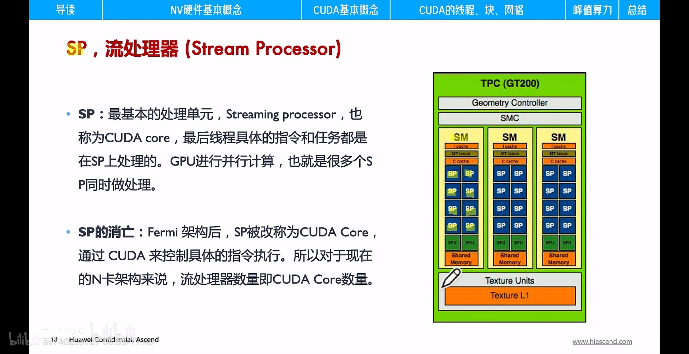

# GPU 架构

---

对图片的卷积运算可以转化为矩阵相乘运行

---

## 架构部分

GPU是一种SIMT (Single Instruction Multiple Threads)式的处理器，以其众核结构并行处理成千上万个线程。

GPU的存储层次如下图所示（以V100为例），所有SM共享L2 Cache，拥有私有的L1 Cache，私有的Shared Memory和私有的寄存器堆。在GPU的内存层次中，越往上访问延迟越低，越往下访问延迟越高。其中DRAM和各级Cache与CPU的存储层次类似；同样是SM私有的Shared Memory和Register的区别是，Register是线程私有的，而Shared Memory则是线程共享的，Register单拍即可访问，Shared Memory访问延迟大概需要二三十拍。

一块A100一共划分为8个GPC (GPU Processing Cluster)，每个GPC划分为7个TPC（Texture Processing Cluster），每个TPC包含2个SM（Streaming Multiprocessor）。

### SP

SP之后演变成了CUDA Core

### CUDA Core

CUDA Core之后演变成了单独的FP32 FPU和INT32 ALU

### SM

A100的SM如下图所示，划分为四个SM Block，每个SM Block都有自己的寄存器堆和运算部件，每个SM Block包含16个INT32部件、16个FP32部件以及8个FP64部件，它们通常被称为CUDA Core；而右侧的Tensor Core专门用于矩阵乘法运算

Warp（线程束）是 SM 基本执行单元，一个 Warp 包含 32 个并行执行的 Thread，这 32 个  Thread 执行于 SIMT 模式。也就是说所有 Thread 以锁步的方式执行同一条指令，但每个 Thread 会使用各自的 Data 执行指令分支。Warp 一直作为一个整体运行。

---

## CUDA 编程

NVIDIA提供了cuBLAS/cuDNN两类算子计算库，cuBLAS提供了使能张量计算核心的接口，用以加速矩阵乘法(GEMM)运算，cuDNN提供了对应接口加速卷积(CONV)运算等

### CUDA 编程模型

CUDA的编程模型分为三级：Grid、Block、Thread，如下图所示。每一个CUDA Kernal对应一个Grid，Grid可以包含一维、二维或三维的多个Block，Block可以包含一维、二维或三维的多个Thread。

- 网格 grid

kernel 在 device 上执行时，实际上是启动很多线程，一个 kernel 所启动的所有线程称为一个网格（grid）。一个网格上的线程共享相同的全局内存（global memory）。**对应单个device**

- 线程块 block

Grid 分为多个 block，一个 block 里面包含很多 thread， block 间无法并行执行，并且无法通行，也没有执行顺序，每个 block 包含共享内存（shared memory），block 内的 thread 共享。**对应SM**

- 线程 thread

CUDA 并行程序实际上会被多个 threads 来执行，同一个 block 中的 threads 可以同步并通过 shared memory 通信。

一个Block能且只能在一个SM中运行，一个SM可以同时运行多个Block。

在SM中，一个Block的线程按照32的粒度分组，每32个线程称为一个Warp，Warp是SM调度运行的最小单位，每个时钟周期，SM Block都会尝试选择一个可以调度的Warp发射执行

### CUDA 编程和调优

TODO

---

## tensorcore

[https://news.mydrivers.com/1/593/593001.htm](https://news.mydrivers.com/1/593/593001.htm)

[https://zhuanlan.zhihu.com/p/75753718](https://zhuanlan.zhihu.com/p/75753718)

CUDA 9.0引入了一个“warp矩阵函数” C++语言API，以便开发者可以使用GPU上的Tensor Core。该API也被称为WMMA（Warp-level Matrix Mulitply and Accumulate）API。通过WMMA API，开发者可将D = A × B + C当作warp操作，其中的A、B、C、D都是更大矩阵的tile。通过WMMA API，warp的所有线程可以合作完成在这些tile上的矩阵乘加操作。CUDA 9.0 WMMA API的tile大小有限制为16×16×16。tile的大小用M×N×K表示，A的维度是M×K，B的维度是K×N，C和D的维度是M×N。

每个tile可以进一步分割为fragment，每个fragment是映射到线程寄存器的一组tile元素。因此，输入矩阵的分布是跨线程的，每个线程只包含一部分tile。一个16×16的tile包含256个元素。warp（包括32个线程）中的每个线程在8个GPR（General-Purpose Register）中保存一个8（256/32=8）元素的fragment。

CUDA WMMA API提供三个新方法：load_matrix_sync,、store_matrix_sync 和mma_sync。这三个方法在计算出结果前会执行一个隐含的warp barrier同步。load_matrix_sync,、store_matrix_sync方法用于载入和保存线程可访问GPR中的一部分输入矩阵。mma_sync方法执行warp同步矩阵乘加操作，在GPR中产生一个M×N（如16×16）的结果D矩阵。

每个时钟周期，每个Tensor Core可完成一个4×4矩阵乘累加（MACC，Matrix multiply and Accumulation）计算。从概念上讲，Tensor Core在4*4子矩阵上运行，以计算更大的16*16矩阵。warp线程被分成8组，每组4个线程，每个线程组连续计算一个8*4块，总共要经过4组的过程，每一个线程组都处理了目标矩阵的1/8。

在一个集合中，可以并行完成四个HMMA步骤，每个步骤适用于4*2子块。这四个线程直接链接到寄存器中的那些矩阵值，因此线程组可以处理单个Step 0 HMMA指令，从而一次性计算子块。

Nvcc编译器将CUDA代码编译为主机端代码和设备端代码。设备端代码首先编译成设备无关机器语言指令集，即PTX（Parallel Thread eXecution），然后再编译成设备相关机器码SASS。

计算GEMM数据流

- NVLink：总线技术及通信协议
  
    

    
- NVSwitch：独立的NVLink芯片

---

## 架构变迁

总览

名词解释

### Fermi

SP 被取消，成为 CUDA Core，引入了 SM

### Kepler

### Maxwell

### Pascal

发现核心数没必要太多，线程可以超配

引入 NVLink，用于单机内多卡之间点到点通信（集合通信）

### Volta

CUDA Core 拆分为 单独的FP32 FPU和INT32 ALU（可以分开执行），引入 Tensorcore

### Turing

在 Tensorcore 中增加了对 INT8/INT4/Binary的支持，引入 RT Core

### Ampere

在 Tensorcore 中增加了 TF32 包括针对 AI 的扩展（使得FP32精度的AI性能提升20倍）

多实例 GPU，将 A100 划分为多达七个独立的GPU，为不同任务提供不同算力

结构稀疏性，AI 中存在大量的稀疏化结构数据

### Hopper

将 GPU 和 CPU 结合起来，成为真正的异构加速平台

