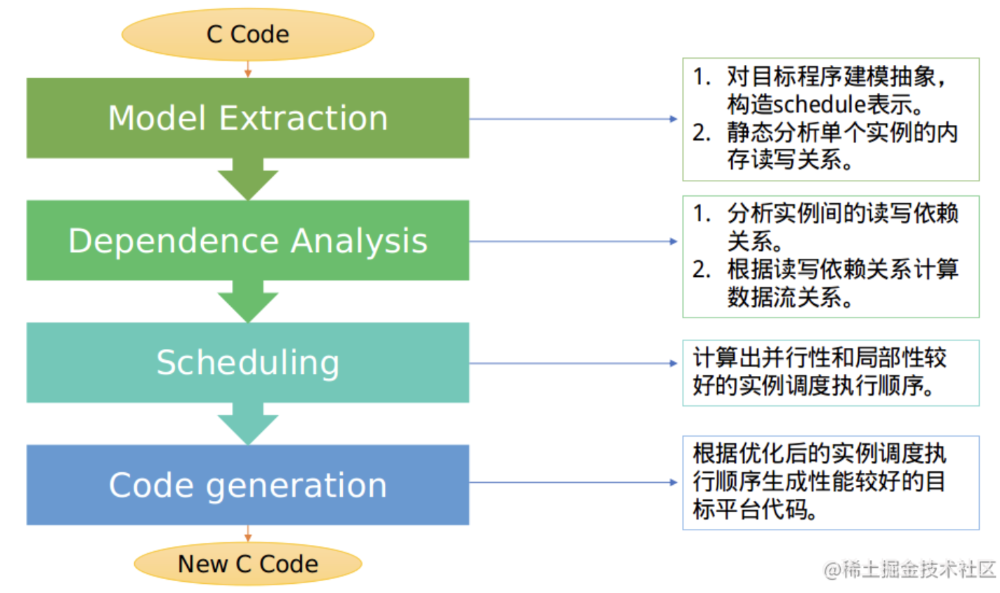

# Polyhedral Compilation

## 0. 背景

多面体模型设计初衷是更智能的在深度学习编译器内，对多种算子进行很好的融合 (fuse)，以及优化。

在编译器领域，多层 `for` 循环的代码优化往往是编译优化工作的重点内容。在深度学习编译器这一细分领域，大多神经网络中，多层 `for` 循环的算子占比多达一半以上。

因此，对这类代码的优化极其重要。优化手段之一是调整 `for` 循环语句中的每一个实例的执行顺序，即调度方式，使得新调度下的 `for` 循环代码有更好的局部性和并行性。

**多面体模型算法的思想是：**

- 将多层 `for` 循环视为多维空间。
- 通过静态分析和编译优化算法，对原目标程序进行空间变换。
- 最终将其优化为一个有较好局部性和并行性的新程序。

调度 顺序+动态执行实例间的关系 → 静态分析+编译优化 → 新的调度顺序

## 1. 整体流程

多面体模型算法的整体流程依次包括以下四个主要部分：

- 建模抽象
- 依赖分析
- 调度变换
- 代码生成



### 普通循环嵌套中应用Poly优化

下面以一段简单的循环嵌套来说明，其中N为常数。

```c
for (int i = 1; i < N; i++)
    for(int j = 1; j<N; j++)
        A[i, j] = f(A[i-1][j], A[i][j-1]);
```

如果将 写入A[i, j]的一次语句的迭代实例 表示为 下图中黑色的点表示，从而我们可以构造出一个所有黑色的点构成的一个矩形，这个矩形就可以看作是二维空间上的一个Polyhedron（多面体），这个空间称为该计算的迭代空间。


> 我们可以用代数中的集合来对这个二维空间上的Polyhedron进行表示，即{[i, j] : 1 <= i <= N - 1 and 1 <= j <= N – 1}，其中[i, j]是一个二元组，“:”后面的不等式表示这个集合的区间。我们可以给这个二元组做一个命名，叫做S，表示一个语句，那么这个语句的Polyhedron就可以表示成{S[i, j] : 1 <= i <= N - 1 and 1 <= j <= N – 1}。
> 
> 
> 由于语句S是先迭代i循环再迭代j循环，因此我们可以给语句S定义一个调度（顺序），这个调度用映射表示，即{ S[i, j] -> [i, j] }，表示语句S[i, j] 先按i的顺序迭代再按照j的顺序迭代。
> 

接下来，我们来分析语句和它访存的数组之间的关系，在代数中我们用映射来表示关系。

代码中语句S对数组A进行读和写，那么我们可以用Poly来计算出S和A之间的读写访存关系。

- **读访存**关系：{ S[i, j] -> A[i - 1, j] : 1 <= i <= N -1 and 1 <= j <= N- 1; S[i, j] -> A[i, j - 1] : 1 <= i <= N - 1 and 1 <= j <= N -1 }
- **写访存**关系：{ S[i, j] -> A[i, j] : 1 <= i <= N - 1 and 1 <= j <= N -1 }

基于这个读写访存关系，Poly就可以计算出这个循环嵌套内的依赖关系，这个依赖关系可以表示成另外一种映射关系，即{ S[i, j] -> S[i, 1 + j] : 1 <= i <= N - 1 and 1 <= j <=N - 2; S[i, j] -> S[i + 1, j] : 1 <= i <= N - 2 and 1 <= j <= N- 1 }。（由读向写映射）

Poly对程序的表示都是用集合和映射来完成的。当我们把语句实例之间的依赖关系用蓝色箭头表示在迭代空间内时，就可以得到下图所示的形式（二维空间的基是(i, j)，即对应i和j两层循环）。其中，没有依赖关系的语句实例之间是可以并行执行的，而图中绿色带内（对角线上）的所有点之间没有依赖关系，所以这些点之间可以并行执行。


Poly利用仿射变换把基(i, j)进行变换，使绿色带能**与空间基的某根轴能够平行，这样轴对应的循环就能并行**，所以我们可以将上图所示的空间转化成如下图所示的形式。此时，语句S的调度就可以表示成{ S[i, j] -> [i + j, j]}的形式。所以**Poly的变换过程也称为调度变换过程，而调度变换的过程就是变基过程、实现循环变换的过程。**


> Poly的底层原理就是求解一个系数矩阵，这个系数矩阵能够将向量(i, j)转换成向量(i + j, j)。
> 

根据这样的调度，Poly就可以利用它的代码生成器，生成下面的代码。此时，内层循环就可以并行了。（注：这里示意的是“源到源”翻译的Poly编译器，也就是Poly生成的代码还需要交给基础编译器如GCC、ICC、LLVM等编译成机器码才能运行。也有内嵌在基础编译中的Poly工具。）

```cpp
for (int c0 = 2; c0 <= 2*N-2; c0 += 1)
    #pragma omp parallel for
    for(int c1 = max(1, c0-N+1); c1 <= min(N-1, c0-1); c1 += 1)
        A[c1][c0-c1] = f(A[c1-1][c0-c1], A[c1][c0-c1-1]);
```

当然，我们这里举的例子是一个很简单的例子，在实际应用中还有很多复杂的情况要考虑。Poly几乎考虑了所有的循环变换，包括`Interchange`（交换）、`Skewing/Shifting`（倾斜/偏移）、`Reversal`（反转）、`Tiling/Blocking`（分块）、`Stripe-mining`、`Fusion`（融合）、`Fission/Distribution`（分布）、`Peeling`（剥离）、`Unrolling`（展开）、`Unswitching`、`Index-set splitting`、`Coalescing/Linearization`等。

下图中给出了几种Poly中实现的循环变换示意图，右上角的代码表示原输入循环嵌套，右下角的代码表示经过Poly变换后生成的代码。图中左边的集合和映射关系的含义分别为：*J*代表原程序语句的迭代空间，*S*表示输入程序时的调度，*T*表示Poly要计算的调度变换，*ST*就是目标调度。

- skewing变换


- Fusion变换


- Tiling变换


### 二维卷积运算中应用Poly优化

以下图所示的二维卷积运算（矩阵乘法）为例来简单介绍Poly是如何优化深度学习应用的。

```cpp
for(int k=0; k<50; k++)
    for(int j=0; j<100; j++)
        b[k][j] = B[k][j];               // S0
for(int i=0; i<100; i++)
    for(int j=0; j<100; j++)
        c[i][j] = 0;                     // S1
for(int i=0; i<100; i++)
    for(int j=0; j<100; j++)
        for(int k=0; k<50; k++)
            c[i][j] += a[i][k]*b[k][j];  // S2
for(int i=0; i<100; i++)
    for(int j=0; j<100; j++)
        c[i][j] = max(c[i][j], 1);       // S3
```

Poly会将循环嵌套内的计算抽象成一个语句。例如上图中中S1语句表示卷积初始化，S2代表卷积归约；而S0和S3则分别可以看作卷积操作前后的一些操作，比如S0可以想象成是量化语句，而S3可以看作是卷积后的relu操作等。

---

我们以CPU上的OpenMP程序为目标 对上图中的示例进行变换，来对比并行性和局部性的要求平衡。使用Poly生成下面的OpenMP代码：

> 注：不同的Poly编译器生成的代码可能会因采用的调度算法、编译选项、代码生成方式等因素而不同。
> 
> 
> 下面两种生成的代码采用的循环fusion（融合）策略不同
> 
- Poly生成的OpenMP代码——并行性大于局部性（图a）

生成代码采用了({S0}, {S1, S2, S3})的fusion策略。


- Poly生成的OpenMP代码——局部性大于并行性（图b）

生成代码使用了({S0,S1, S2, S3})的fusion策略，但是必须通过对S2向右偏移99次、S3向右偏移148次，以及循环层次的interchange（交换）来实现这样的fusion。


对比：

显然，图b所示的代码局部性更好。而并行性上，图b生成的代码中，只有最外层c0循环是可以并行的，而图a生成的代码中，S0语句的c0、c1循环都可以并行，并且包含S1、S2、 S3三条语句的循环嵌套的c0、c1循环也都可以并行，故图a生成的代码可并行循环的维度更多。

---

当我们以包含多层并行硬件抽象为目标架构时，多维并行的优势就更加明显，例如当面向GPU生成CUDA代码时：

> 为了便于阅读，我们并未开启GPU上shared memory和private memory自动生成功能。
> 
> 
> Poly也可以自动生成线程之间的同步语句。
> 
> 下图c、d中循环分块大小为32
> 
- Poly生成的CUDA代码——并行性大于局部性（图c）

图a对应的CUDA代码（如图c）会生成2个kernel（因为之前合成了两个部分），但是每个kernel内c0维度的循环被映射到GPU的线程块上，而c1维度被映射到GPU的线程上。（线程块上线程布局为32*16）


- Poly生成的CUDA代码——局部性大于并行性（图d）

图b对应的CUDA代码（如图d）只有一个kernel，但是只有c0维度的循环被映射到GPU的线程块和线程两级并行抽象上。（线程块上线程布局为32* 4* 4）


## 2. Poly在深度学习领域中发挥的作用

从对上层应用的约束角度来看，作为一种通用程序设计语言的编译优化模型，Poly本身对应用是敏感的，只能处理满足一定约束条件的、规则的应用。**Poly要求被分析的应用中，循环边界、数组下标都是仿射表达式，而且控制流必须是静态可判定的**，我们暂且把这种对应用的要求称为静态仿射约束。

---

### 为什么Poly适合深度学习领域？

实际上，对于通用语言而言，静态仿射约束的限制对程序的要求不算低，但是**深度学习领域的大部分核心计算却恰好满足这种静态仿射约束**，所以许多深度学习编译软件栈利用Poly来实现循环优化。

从充分发挥底层AI芯片架构的能力角度出发，Poly也非常合适，因为Poly能够 自动判定和实现上层应用中循环的tiling/blocking（分块）变换 并自动将软件循环映射到并行硬件上

Poly会自动实现分块，这样才能更好地利用底层AI芯片的架构特性。以GPU为例，每个GPU上拥有自己的全局缓存（Global/Device Memory），然后每个线程块也有自己的局部缓存（Shared/Local Memory）。缓存越靠近计算单元，访存的速度越快，但是缓存空间越小。因此，当计算数据量大于缓存空间的时候，就需要通过将原来的数据进行分块的方式存储到缓存上，以此来适应目标架构的硬件特征。


而专用AI芯片的架构可能更复杂，如下图所示是TPU v2和TPU v3的架构示意图，每个TPU有多种不同类型的计算单元，包括标量、向量以及矩阵计算单元，这些不同的计算单元对应地可能会有各自不同的缓存空间，这就给分块提出了更高的要求。只有通过对应用的正确分块才能充分利用好芯片上的架构特征。


---

当前一部分深度学习编译软件栈采用了**手工调度和映射**（手写schedule和pattern matching）的方式来将上层应用部署到底层芯片上。以TVM为例，下图中给出了一个TVM的调度示例。其中，调度过程首先将计算s进行分块（对应图中的split操作），然后将分块后的维度映射到GPU的线程块和线程上（对应图中的bind操作）。


这部分工作需要由熟悉底层芯片架构的人员来编写，并且要人工分析分块的合法性，映射也需要手工完成，耗时耗力。而Poly的作用就是将上述手工调度的过程自动实现。为了实现自动调度，许多深度学习编译软件栈开始采用Poly来实现上述功能。

> Astra
> 
> 
> “Tensor comprehensions [30] built on the Halide framework and combined it with Polyhedral compilation [16] to achieve optimized kernel generation for deep learning kernels.”
> 
> - FreeeTensor
> 
> Dependence-Aware Transformation: “polyhedral analysis is introduced to analyze dependences systematically, and multiple solvers of polyhedral analysis are designed to automate the analysis.”
> 
> “Compilers based on polyhedral analysis. Multiple compilers adopt optimizations based on Polyhedral Analysis. Pluto [10], PPCG [41], and CHiLL [32] are optimizing compilers for general programs in C language.”
> 

---

### Poly在深度学习软件栈上发挥的作用如何？

首先，Poly能够计算精确的数据流信息。Poly通过**将传统的编译器中语句之间的依赖关系细化到语句实例的粒度**，分析的结果比传统的方法更精确。计算精确的数据流信息有以下三点好处。

\1. **计算精确的缓存搬移数据量**。数据搬移是程序性能提升的关键，Poly不仅能自动计算出从管理核心（如CPU）到加速芯片（如GPU）之间传输的数据总量，还负责计算加速芯片上多级缓存之间的数据搬移总量，例如从GPU的global memory到shared memory上的数据搬移。

\2. **降低内存空间使用**。通过计算精确的数据流信息，Poly可以计算出临时tensor变量，这些**临时变量的声明可在对应的缓存级别上实现，从而降低加速芯片上数据的访存开销**。

\3. **自动实现缓存上的数据部署**。以华为刚公布的昇腾AI处理器芯片为例，下图是该芯片的AI Core架构示意图。其中，UnifiedBuffer（输出缓冲区）和L1 Buffer（输入缓冲区）是低级缓存，离计算单元较远；BufferA L0/B L0/C L0是高级缓存，靠近计算单元。在低级缓存上，Poly可以**借助标记节点**，将不同计算单元所需的数据分别流向UnifiedBuffer和L1 Buffer；同时，当数据到达高级缓存时，Poly仍然可以借助标记节点将数据自动部署到BufferA L0/B L0/C L0


---

其次，Poly能够实现几乎全部的循环变换。Poly通过仿射函数来实现几乎所有循环变换及其组合，这种仿射函数的计算过程不仅要考虑应用程序的`并行性`和`局部性`，还要考虑`底层加速芯片的硬件特征`。从循环变换角度来讲，Poly对编译软件栈的贡献包括以下几个方面：

> 根据依赖关系分析的结果 自动计算出 变换后循环的并行性、循环维度以及是否可以实施分块 等特征
> 
> 
> 自动实现tiling/blocking（分块）和fusion（融合）变换
> 
> 通过代码生成方式自动实现不改变语句顺序、但只改变循环结构的变换
> 

\1. Poly中的调度算法能够**根据依赖关系分析的结果 自动计算出 变换后循环的并行性、循环维度以及是否可以实施分块 等特征**，这些特征为后面硬件上的计算任务分配、缓存上的循环变换提供了理论依据。（这些信息保存在band节点的属性中）而部分循环变换如`skewing/shifting`（倾斜/偏移）、`interchange`（交换）等都可以在调度阶段自动完成。我们以二维卷积运算（矩阵乘法）为例：

```cpp
for(int k=0; k<50; k++)
    for(int j=0; j<100; j++)
        b[k][j] = B[k][j];               // S0
for(int i=0; i<100; i++)
    for(int j=0; j<100; j++)
        c[i][j] = 0;                     // S1
for(int i=0; i<100; i++)
    for(int j=0; j<100; j++)
        for(int k=0; k<50; k++)
            c[i][j] += a[i][k]*b[k][j];  // S2
for(int i=0; i<100; i++)
    for(int j=0; j<100; j++)
        c[i][j] = max(c[i][j], 1);       // S3
```

根据不同的编译选项实现的fusion策略对应的schedule tree，其中fusion已经通过sequence节点实现

- Poly生成的OpenMP代码——并行性大于局部性（图a）：


Poly计算出来的调度用其中间表示（schedule tree）得到的结果如图（图e）（下图sequence节点的左子树中*S*1都是*S*0）：


- Poly生成的OpenMP代码——局部性大于并行性（图b）


Poly计算出来的调度用其中间表示（schedule tree）得到的结果如图（图f）：


\2. **自动实现tiling/blocking（分块）和fusion（融合）变换**。`分块是为了充分利用加速芯片上的缓存，而fusion的目的是为了生成更多的临时缓存变量，（减少中间变量的存取开销）降低访存开销`。而且，Poly通过数学变换，能够自动实现更复杂的、手工难以实现的分块形状。其中，融合可根据**调度选项**在调度变换过程实现，分块则是在调度变换之后根据**循环维度**是否可分块等特征来实现。

如图e和f就是根据不同的编译选项实现的fusion策略对应的schedule tree，其中fusion已经通过sequence节点实现，而分块在Poly上只需要**将band节点中的仿射函数进行修改**，就可以得到分块对应的schedule tree。下图是图e经过分块之后的调度树，图f的分块也可以同样的方式得到，就不再赘述了。（下图sequence节点的左子树中*S*1都是*S*0）


\3. 通过代码生成方式自动实现**不改变语句顺序、只改变循环结构**的变换。这类循环变换包括peeling（剥离）、unrolling（展开）等。这些循环变换对特殊加速芯片上的代码生成有十分重要的作用，例如一些架构可能并不喜欢循环上下界中有min/max这样的操作，此时就需要实现这类循环变换。**这类循环变换可以通过在schedule tree中的band节点上添加特殊的options属性来实现。**（注：上面schedule tree的图中没有标出options，但实际使用的schedule tree中有options，而options中的内容是一个集合或者映射表达式。）

---

第三，Poly能够自动实现存储系统的管理。在越来越复杂的加速芯片架构上，复杂的存储系统是实现芯片上计算部署的难点（手工实现耗时费力且易错）。而**Poly借助中间表示自动实现了在多级缓存结构上的存储管理**，使得底层优化和硬件开发人员从这些琐碎的工作中脱离出来。这种自动管理存储系统的实现包括以下两个方面。

> schedule tree上的特殊节点和仿射函数 → 实现并插入数据传输指令
> 
> 
> 数学关系 → 当前指令所在循环的层次和维度信息 → 为数据传输指令计算对应的调度关系
> 

\1. **自动计算缓存之间传递数据需要插入的位置**。由于数据传输指令在原程序中是不存在的，所以Poly要不仅要实现这些指令，而且要找到指令作用的位置。Poly**借助schedule tree上的特殊节点和仿射函数，实现了数据传输指令位置的准确计算和自动插入**。

\2. **自动生成数据传输指令的循环信息**。确定数据传输指令的位置后，Poly可以**根据数学关系计算出当前指令所在循环的层次和维度信息，并自动为数据传输指令计算对应的调度关系**，然后交给后端代码生成器生成代码。

现在我们总结一下流程：

原始代码（二维矩阵乘法）

→ 要求并行性大于局部性：选定fusion策略({S0}, {S1, S2, S3})，Poly生成的OpenMP代码，以及相应的schedule tree（其中fusion已经通过sequence节点实现，sequence节点的左子树中*S*1都是*S*0）


→ 分块在Poly上只需要**将band节点中的仿射函数进行修改**，就可以得到分块对应的schedule tree（下图sequence节点的左子树中*S*1都是*S*0）


→ 将fusion和分块后的schedule tree插入特殊的extension节点，带有数据传输指令的中间表示

> 下图中的kernel0和kernel1分别对应上图中最上面sequence节点下的两棵子树。
> 
> 
> to_device_B和to_device_a表示从CPU的内存上拷贝tensor b和a到GPU的global memory，这两个语句在计算之前。（to_device_B和to_device_a先后顺序随意）
> 
> from_device_c表示将GPU上的tensor c从global memory传输回CPU内存上，这个语句在计算之后。
> 
> Poly并没有传输tensor b，而是在GPU的global memory上创建和使用了tensor b。
> 


---

最后，Poly还能够自动计算出变换之后循环到硬件上的映射。在提供多级并行硬件抽象和按计算的类型提供不同计算单元的加速芯片上，**软件循环要实现到硬件上的映射，而这种映射关系也可以借助Poly的仿射函数和schedule tree上的标记来自动实现。**这可以通过在kernel0和kernel1的子树内的**band节点上添加特殊标记**来实现。

---

补充一个栗子🌰：（**[多面体模型中深度学习编译器的应用](http://giantpandacv.com/project/%E9%83%A8%E7%BD%B2%E4%BC%98%E5%8C%96/%E6%B7%B1%E5%BA%A6%E5%AD%A6%E4%B9%A0%E7%BC%96%E8%AF%91%E5%99%A8/%E5%A4%9A%E9%9D%A2%E4%BD%93%E6%A8%A1%E5%9E%8B%E5%9C%A8%E6%B7%B1%E5%BA%A6%E5%AD%A6%E4%B9%A0%E7%BC%96%E8%AF%91%E5%99%A8%E7%9A%84%E5%BA%94%E7%94%A8/)**）

```cpp
for(h=0;h<H;h++)
    for(w=0;w<W;w++)
        A[h][w] = Quant(A[h][w]) /*S0*/
for(h=0;h<H;h++)
    for(w=0;w<W;w++){
        C[h][w] = 0; /*S1*/
        for(kh=0;kh<kH;kh++)
            for(kh=0;kh<kH;kh++) 
                C[h][w] += A[h+kh][w+kw]*B[kh][kw]; /*S2*/ 这里就是在做一个卷积操作
    }
for(h=0;h<H;h++)
    for(w=0;w<W;w++)
        C[h][w] = ReLU(C[h][w]) /*S3*/ 这里在做ReLU激活
```

得到最后的schedule tree如下：


代码对应如图：


## 3. AI芯片上利用Poly进行软硬件优化的一些问题

### 关于IR

在之前的内容中，我们主要基于 Poly传统的schedule tree表示 介绍了如何实现AI芯片上的软硬件优化。Google MLIR针对schedule tree的不足，提出了一种简化的Poly IR。

```cpp
void simple_example(){
    for(int i=0; i<N; ++i){
        for(int j=0; j<N; j++){
            float tmp = X[i, j]; // S1
            A[i, j] = tmp + 1;   // S2
            B[i, j] = tmp * 4;   // S3
        }
	}
}
```

用schedule tree对该部分代码进行表示，可以得到下图所示的IR形式。（下图表示的内容和上一节画出的schedule tree一致，只不过这里用文字的形式表示）


而MLIR表示出的IR形式如下：


对比可以看出，MLIR的Poly IR对循环进行了**更加显式的表达**，而省略了schedule tree中的domain、schedule等信息。这种Poly IR**简化了Poly在实现循环变换之后的代码生成过程**。例如：在实现`Skewing/Shifting`（倾斜/偏移）变换时，MLIR可以由上图生成下图。


思考这种简化方案是否值得：

\1. 相比于传统的schedule tree表示，**虽然简化了代码生成，但是循环变换的过程更复杂了**。在schedule tree上进行循环变换，可以直接修改schedule的仿射函数来实现（如这里的倾斜变换）；但在MLIR中却要**对应地修改显式表达的循环变量及对应的下标信息**。如何平衡两者的代价？

\2. MLIR提出的简化Poly IR是为了**简化从ML Function到CFGFunction的代码生成过程**，那如果Poly变换之后的输出不是基于LLVM IR的框架是否还有必要采用这种简化的Poly IR？

### 关于循环调度

Poly的调度算法[见下面的文献]**基于线性整数规划来求解新的调度仿射函数**。而这个过程中会考虑到几乎所有的循环变换及多个循环变换之间的组合。

> Bondhugula, Uday,Albert Hartono, Jagannathan Ramanujam, and Ponnuswamy Sadayappan. “Apractical automatic polyhedral parallelizer and locality optimizer.” In29th ACM SIGPLAN Conference on Programming Language Design and Implementation(PLDI), pp. 101-113. ACM, 2008.
> 
> 
> Bondhugula, Uday,Aravind Acharya, and Albert Cohen. “The pluto+ algorithm: A practicalapproach for parallelization and locality optimization of affine loopnests.” ACM Transactions on Programming Languages and Systems (TOPLAS) 38,no. 3 (2016): 12.
> 
> Acharya, Aravind, UdayBondhugula, and Albert Cohen. “Polyhedral auto-transformation with no integerlinear programming.” In 39th ACM SIGPLAN Conference on ProgrammingLanguage Design and Implementation (PLDI), pp. 529-542. ACM, 2018.
> 
> Zinenko, Oleksandr,Sven Verdoolaege, Chandan Reddy, Jun Shirako, Tobias Grosser, Vivek Sarkar, andAlbert Cohen. “Modeling the conflicting demands of parallelism andtemporal/spatial locality in affine scheduling.” In Proceedings of the27th International Conference on Compiler Construction (CC), pp. 3-13. ACM,2018.
> 

下图是线性整数规划问题求解的示意图，其中蓝色的点表示整个空间上的整数，而图中的斜边可以看作是循环边界等信息给出的约束，这些约束构成了一个可行解区间（图中绿色部分）。那么调度问题可以抽象成在这个绿色的解空间内寻找一个目标问题（红色箭头）的最优解（在Poly 里，就是寻找按字典序最小的整数解）。


但上面所说的线性整数规划求解都是针对通用程序设计语言，如果我们将Poly应用到如深度学习这样的特定领域，是否需要考虑和通用语言一样的循环变换集合？

以一个卷积算子为例，卷积核的循环嵌套会嵌套在输入图像的循环嵌套内部，而卷积核的循环维度范围可能会比输入图像的循环维度范围小很多。当Poly计算新的调度时，输入图像的循环维度和卷积核的循环维度可能发生倾斜变换，但这种倾斜似乎对卷积计算后面的变形、代码生成等问题都不太友好。也就是说，**在DL领域中可用在全局的变化种类更少**，需要考虑的循环变换个数及其组合也就更少，可行解的区间也就更小。

假设只考虑分块和融合（fusion）这两种循环变换，这种情况下问题似乎简单一些。但是编译优化中还有一个比较关键的问题就是**如何决定实现的循环变换的顺序**。是先做融合后做分块，还是先做分块再做融合？事实上，对于循环变换的顺序判定问题，传统的Poly中间表示没有给出明确的答案，而不幸的是，MLIR也没有解决这个问题。当然，这只是极简情况下的假设。只有分块和融合显然是不够的，因为循环变换后的代码生成还要借助distribution（分布）来保证向量化等问题的发掘。

### 关于分块

多级缓存是目前市场上AI芯片采用的架构趋势，在当前的AI芯片上，分块是软件栈必须实现的一种优化手段了。针对分块这一种变化，还有许多需要考虑的问题。

以下图的二维卷机操作为例，卷积核（kernel）通过在输入图像（input）上进行“滑动”来计算输出图像（output）的结果，而这种滑动的过程在大多数情况下会导致输入图像的数据被多次访问。


---

如果我们按照卷积核的大小对输入图像进行分块，那么分块之后输入图像的每个分块之间都会存在overlap（数据重叠）问题。如何利用Poly在深度学习应用中自动实现这种满足数据重叠的分块？

一种方式是采用PolyMage类似的方法利用Poly的调度来求解这样的overlap的区间，但是这种方式有可能会导致过多的冗余计算，而且用调度来求解分块的形状在某种程度上会使Poly的过程变得更加复杂，代码生成亦如是；另一种方式是在schedule tree上利用特殊的节点来实现，但是目前这种方式的代码实现都还没有公开。

---

另外一个问题是关于分块和冗余计算的问题。冗余计算的确会给性能的提升带来一定的影响，但是这种**冗余计算的引入是为了实现分块之间的并行**。并行性和局部性有的时候是冲突的，为了达到两者之间的平衡，往往是需要作出一些其它的牺牲来达到目的。

带有冗余计算的分块是目前降低内存开销最有效的方式之一。下图列出了三种不同的分块形状，其中最左侧的梯形分块引入了冗余计算，但是这种分块在一次分块计算完成（水平方向）后，分块内需要传递给下一次计算的活跃变量（红色圆圈）总数最少，而其它形状如中间的分裂分块和最右侧的平行四边形分块剩余的活跃变量总数都很多，无法实现有效降低内存开销的目的。其它未列出的分块如钻石分块和六角形分块可以看作是分裂分块的一种特殊形式。


其它分块相关的问题还很多，比如Poly中实现的分块都是计算的分块，而数据分块只是通过计算分块和计算与数据之间的仿射函数来计算得到，这种结果能够保证数据的分块是最优的吗？

### 关于融合

融合（fusion）循环是一个挖掘局部性的过程，但加速芯片上局部性和并行性优化有时是冲突的。融合的循环越多，破坏计算并行性的可能性越大；而如果要保持计算的并行性，可能就要放弃一些循环的融合。并且，在不同的架构上哪些融合是最优的，似乎静态判定是不太可能的。

> 在CPU上生成OpenMP代码可能一层并行就足矣，这时局部性的效果可能就比并行性的效果更好；而在GPU上，由于有两层并行硬件的抽象，可能并行性的收益比局部性的效果更佳。
> 

现在许多深度学习软件栈也采用了**Auto-tuning**的方式来通过实际的多次运行来判定哪种策略是最优的。然而，即便是Auto-tuning的方式，能够保证遍历到所有的融合形式吗？如何选择一个合适的fusion策略，是必须要通过调优的方式来确定吗？

> 静态地设定pattern，在融合时进行pattern matching是肯定不足以应对越来越复杂的fusion场景的。Astitch中提出过XLA和TVM都难以fusion两类访存密集型算子。
> 
> 
> Astra中提出的 搜索schedule space并进行prune 的思想值得参考。
> 

### 关于Poly时间复杂度和对Poly的扩展

关于Poly的时间复杂度问题，我们在上文中已经提到**Poly的调度实质是线性整数规划问题的求解过程**，而实际上Poly的代码生成过程也会涉及到线性整数规划问题的求解。我们在讨论深度学习领域是否需要所有的循环变换及其组合的时候，设想从减少循环变换的个数来减小解空间，以此来加速调度的过程；另外，MLIR的初衷也是为了降低代码生成的复杂度。但问题的实质仍然是NP级别的难题，想要从质上改变这个现状，可能还需要一段比较长的时间，其它的计算机科学领域的方法比如constraint programming说不定也能是一个解决的方法。

另外，Poly的静态仿射约束对稀疏tensor等领域的扩展也提出了挑战。关于稀疏tensor的工作目前也有了一定的研究[36, 37]，但Poly无法直接应用于含有非规则下标的tensor的情况。因为Poly在解决稀疏矩阵问题的研究时，有了一定的进展[38-41]，这说明Poly的non-affine扩展还是可行的，而深度学习框架的可定制性给这个问题也创造了更多的机会。

> [36] Kjolstad,Fredrik, et al. “The tensor algebra compiler.” Proceedings of the ACMon Programming Languages 1.OOPSLA (2017): 77.
> 
> 
> [37] Chou,Stephen, Fredrik Kjolstad, and Saman Amarasinghe. “Format abstraction forsparse tensor algebra compilers.” Proceedings of the ACM on ProgrammingLanguages 2.OOPSLA (2018): 123.
> 
> [38] Benabderrahmane,Mohamed-Walid, et al. “Thepolyhedral model is more widely applicable than you think.” InternationalConference on Compiler Construction (CC). pp. 283-303. Springer, Berlin, Heidelberg,2010.
> 
> [39]Venkat, Anand, et al. “Non-affine extensions to polyhedral codegeneration.” Proceedings ofAnnual IEEE/ACM International Symposium on Code Generation and Optimization(CGO). pp. 185-194. ACM, 2014.
> 
> [40] Venkat,Anand, Mary Hall, and Michelle Strout. “Loop and data transformations forsparse matrix code.” In Proceedings of the 36th ACM SIGPLAN Conference onProgramming Language Design and Implementation (PLDI). pp. 521-532. ACM, 2015.
> 
> [41] Zhao, Jie,Michael Kruse, and Albert Cohen. “A polyhedral compilation framework forloops with dynamic data-dependent bounds.” Proceedings of the 27thInternational Conference on Compiler Construction (CC). pp. 14-24, ACM, 2018.
> 

## 参考

**[Polyhedral Model—AI芯片软硬件优化利器（一）](http://mp.weixin.qq.com/s?__biz=MzI3MDQ2MjA3OA==&mid=2247485130&idx=1&sn=a5773bf17e6854d1238b035366641bcc&chksm=ead1fbdbdda672cdf9b2480a431cef85e4d377d07f8c586a932adabd50656cbdcd7d891156bf&scene=21#wechat_redirect)**

**[Polyhedral Model—AI芯片软硬件优化利器（二）](https://mp.weixin.qq.com/s?__biz=MzI3MDQ2MjA3OA==&mid=2247485148&idx=1&sn=4af3c468f2f86ce4e51746f62db11531&chksm=ead1fbcddda672dbc40ff6579d766f15c2d7e896b6187c530a0b67230cc59186ffd6bddc3464&mpshare=1&scene=1&srcid=&sharer_sharetime=1569677815043&sharer_shareid=b33ef36fa0caf5cb82e76916516aa7df#rd])**

**[Polyhedral Model—AI芯片软硬件优化利器（三）](https://mp.weixin.qq.com/s?__biz=MzI3MDQ2MjA3OA==&mid=2247485156&idx=1&sn=f230bc30d18668496bbd6117653df0f8&chksm=ead1fbf5dda672e389d6da9f2c9b6c5832347a5cc784e26019fa7d932bc6544888ac231005ce&mpshare=1&scene=1&srcid=&sharer_sharetime=1569677822621&sharer_shareid=b33ef36fa0caf5cb82e76916516aa7df#rd)**