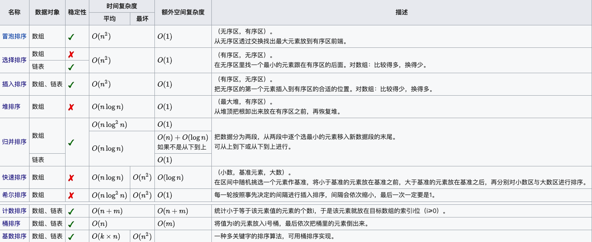

# 再不刷题，秋招咋办

# 基础算法

## 快排

每次挑出一个基准，比基准小的放左边，比基准大的放右边

```cpp
template<typename T>
void quick_sort(T arr[], int start, int end){
    if(start >= end)return;
    int l = start - 1;
    int r = end + 1;
    T pvoit = arr[l+(r-l)/2];
    **while(l < r){
        do l++; while(arr[l] < pvoit);
        do r--; while(arr[r] > pvoit);
        if( l < r) swap(arr[l], arr[r]);
    }**
    quick_sort(arr, start, r);
    quick_sort(arr, r+1, end);
}
```

<div style="text-align: center;"></div>

- 冒泡排序：比较相邻的元素

```cpp
void bubble_sort(T arr[], const int len){
    for(int i=0; i<len; i++)
        for(int j=0; j<len-i-1; j++) 
            // 每一轮最大的数都会被放到最后
            if(arr[j] > arr[j+1]){
                T tmp = arr[j];
                arr[j] = arr[j+1];
                arr[j+1] = tmp;
            }
}
```

- 插入排序：每次选择一个，然后在它左侧的数组中找到位置，其左侧是有序

```cpp
template<typename T>
void insert_sort(T arr[], const int len){
    int j;
    T tmp;
    for(int i=1; i<len; i++){
        if(arr[i] < arr[i-1]){
            tmp = arr[i]; // 给arr[i]找到合适的位置
            for(j=i-1; j>=0 && arr[j]>tmp; j--)
                arr[j+1] = arr[j]; // 左移
        }
        arr[j+1] = tmp;
    }
}
```

- 选择排序：每次选出一个最小的值

```cpp
template<typename T>
void select_sort(T arr[], const int len){
    for(int i=0; i<len-1; i++){
        int min_index = i;
        for(int j=i+1; j<len; j++)
            if(arr[j] < arr[min_index])
                min_index = j;
        if(min_index != i){
            T tmp = arr[i];
            arr[i] = arr[min_index];
            arr[min_index] = tmp;
        }
    }
}
```

# 数据结构

# 搜索与图论

# 数学知识

# 动态规划问题

## 背包问题

dp[i][j]表示将前i种物品装进限容量为j的背包可以获得的最大价值, 0<=i<=N, 0<=j<=V

物体i最多有si[i]个，其体积是vi[i]，价值是wi[i]

状态转移方程 

```cpp
for(int i=1; i<=N; i++){
	for(int j=1; j<=V; j++){
		dp[i][j] = ...
```

1. 不装入第i件物品，即`dp[i−1][j]`；
2. 装入第i件物品（前提是能装下）
    1. 01背包问题：si[i] = 1
    `dp[i][j] = max(dp[i−1][j], dp[i-1][j−vi[i]]+w[i]) // j >= v[i]`
    2. 完全背包问题：si[i] = 无穷
    `dp[i][j] = max(dp[i−1][j], dp[i][j−vi[i]]+w[i]) // j >= v[i]`
    3. 多重背包问题： si[i] 大于等于1，不等于无穷
    `k为装入第i种物品的件数, k <= min(n[i], j/w[i])`
    `dp[i][j] = max{(dp[i-1][j − k*w[i]] + k*v[i]) for every k}`

### 01背包问题

dp[i][j]表示将前i种物品装进限重为j的背包可以获得的最大价值,  0<=i<=N, 0<=j<=V

1. 不装入第i件物品，即`dp[i−1][j]`；
2. 装入第i件物品（前提是能装下），即`dp[i-1][j−vi[i]]+w[i]`

基础代码如下

```cpp
void pack_01(){
    vector<vector<int>>dp(N+1, vector<int>(V+1, 0));
    for(int i=1; i<=N; i++){
        for(int j=1; j<=V; j++){
            if(j >= vi[i]) 
                dp[i][j] = max(dp[i-1][j], dp[i-1][j-vi[i]] + wi[i]);
            else 
                dp[i][j] = dp[i-1][j];
        }
    }
    cout << dp[N][V];
}
```

由于dp[i][j]只和上一轮的数据dp[i-1][j]相关，并不需要保留更前的数据，所以可以只用一维dp数组。j的遍历改为从大到小，可以防止j值较小时被覆盖（新的dp[j]需要使用旧的dp[j-1]计算）

因此可以化简为：

```cpp
void pack_01(){
    vector<int>dp(V+1);
    for(int i=1; i<=N; i++)
        for(int j=V; j>=vi[i]; j--)
            dp[j] = max(dp[j], dp[j-vi[i]]+wi[i]);
    cout << dp[V];
}
```

上述两个代码的数据初始化如下

```cpp
		vector<int> vi(N+1, 0);
    vector<int> wi(N+1, 0);
    vi[0] = 0;
    wi[0] = 0;
    for(int i=1; i<=N; i++)
        cin >> vi[i] >> wi[i];
```

### 完全背包

dp[i][j]表示将前i种物品装进限重为j的背包可以获得的最大价值,  0<=i<=N, 0<=j<=V

1. 不装入第i件物品，即`dp[i−1][j]`；
2. 装入第i件物品（前提是能装下），即`dp[i][j−vi[i]]+w[i]`

由于每种物品有无限个，即装入第i种商品后还可以再继续装入第种商品，故转移到`dp[i][j−vi[i]]+w[i]`

状态转移方程：`dp[i][j] = max(dp[i−1][j], dp[i][j−v[i]]+w[i]) // j >= v[i]`

基础代码如下

```cpp
void pack_full(){
    vector<vector<int>>dp(N+1, vector<int>(V+1, 0));
    for(int i=1; i<=N; i++){
        for(int j=1; j<=V; j++){
            if(j >= vi[i]) 
                dp[i][j] = max(dp[i-1][j], dp[i][j-vi[i]] + wi[i]);
            else 
                dp[i][j] = dp[i-1][j];
        }
    }
    cout << dp[N][V];
}
```

由于dp[i][j]只和上一轮的数据dp[i-1][j]相关，并不需要保留更前的数据，所以可以只用一维dp数组。j的遍历改为从小到大，可以防止j值较小时被覆盖（新的dp[j]需要使用旧的dp[j-1]计算）

因此可以化简为：

```cpp
void pack_full(){
    vector<int>dp(V+1);
    for(int i=1; i<=N; i++){
        for(int j=vi[i]; j<=V; j++)
            dp[j] = max(dp[j], dp[j-vi[i]]+wi[i]);
    }
    cout << dp[V];
}
```

上述两个代码的数据初始化如下

```cpp
		vector<int> vi(N+1, 0);
    vector<int> wi(N+1, 0);
    vi[0] = 0;
    wi[0] = 0;
    for(int i=1; i<=N; i++)
        cin >> vi[i] >> wi[i];
```

更加优化：**转换成01背包**

简单的思想——考虑到第 i 种物品最多装入 V/vi[i] 件，于是可以把第 i 种物品转化为V/vi[i] 件体积及价值均不变的物品，然后求解这个01背包问题。（如物体i变成si[i]个体积vi[i]，价值wi[i]的物体）

更高效的转化方法是采用二进制的思想——把第 i 种物品拆成体积为 $v_i[i]2^k$，价值 $w_i[i]2^k$的若干个物体，其中 k 取遍满足 $sum( 2^k) ≤ V / v_i[i]$的非负整数。这是因为不管最优策略选几件第 i 种物品，总可以表示成若干个刚才这些物品的和（例：13 = 1 + 4 + 8）。这样就将转换后的物品数目降成了对数级别。

```cpp
void pack_full(){
    vector<int> dp(V+1, 0);
    vector<int> vi;
    vector<int> wi;
    for(int i=1; i<=N; i++){
        int v, w, tmp, k;
        cin >> v >> w;
        
        tmp = V/v; // 背包容量的限制
        for(k=1; tmp>0; k<<=1){
            int amount = min(k, tmp);
            vi.push_back(k*v);
            wi.push_back(k*w);
            tmp -= k;
        }
    }

    for (int i = 0; i < vi.size(); ++i) {
        for (int j = V; j >= vi[i]; --j) {
            dp[j] = max(dp[j], dp[j - vi[i]] + wi[i]);
        }
    }
    cout << dp[V];
}
```

### 多重背包问题

dp[i][j]表示将前i种物品装进限重为j的背包可以获得的最大价值,  0<=i<=N, 0<=j<=V

此时的分析和完全背包差不多，也是从装入第 i 种物品多少件出发：装入第i种物品0件、1件、...n[i]件（还要满足不超过限重）。所以状态方程为：

1. 不装入第i件物品，即`dp[i−1][j]`；
2. 装入第i件物品（前提是能装下），即  `k为装入第i种物品的件数, k <= min(n[i], j/w[i])`
`dp[i][j] = max{(dp[i-1][j − k*w[i]] + k*v[i]) for every k}`

基础代码如下

```cpp
void pack_multi(){
    vector<vector<int>>dp(N+1, vector<int>(V+1, 0));
    for(int i=1; i<=N; i++){
        for(int j=1; j<=V; j++){
            int tmp = 0;
            // dp[i][j] = max(dp[i-1][j-k*vi[i]] + k*wi[i]);
            for(int k=0; k<=min(si[i], j/vi[i]); k++) // 数量限制和容量限制中取最小
                if(tmp < dp[i-1][j-k*vi[i]] + k*wi[i]) 
                    tmp = dp[i-1][j-k*vi[i]] + k*wi[i];
            dp[i][j] = tmp;
        }
    }
    cout << dp[N][V];
}
```

由于dp[i][j]只和上一轮的数据dp[i-1][j]相关，并不需要保留更前的数据，所以可以只用一维dp数组。j的遍历改为从大到小，可以防止j值较小时被覆盖（新的dp[j]需要使用旧的dp[j-1]计算）

因此可以化简为：

```cpp
void pack_multi(){
    vector<int>dp(V+1);
    for(int i=1; i<=N; i++){
        for(int j=V; j>=vi[i]; j--){
            for(int k=0; k<=min(si[i], j/vi[i]); k++)
                dp[j] = max(dp[j], dp[j-k*vi[i]] + k*wi[i]);
        }
    }
    cout << dp[V];
}
```

上述两个代码的数据初始化如下

```cpp
		vector<int> vi(N+1, 0);
    vector<int> wi(N+1, 0);
    vi[0] = 0;
    wi[0] = 0;
    for(int i=1; i<=N; i++)
        cin >> vi[i] >> wi[i];
```

更加优化：**转换成01背包**

更高效的转化方法是采用二进制的思想——把第 i 种物品拆成体积为 $v_i[i]2^k$，价值 $w_i[i]2^k$的若干个物体，其中 k 取遍满足 $sum(2^k) ≤ s_i[i]$ 的非负整数。这是因为不管最优策略选几件第 i 种物品，总可以表示成若干个刚才这些物品的和（例：13 = 1 + 4 + 8）。这样就将转换后的物品数目降成了对数级别。

```cpp
void pack_multi(){
    vector<int>dp(V+1, 0);
    vector<int> vi;
    vector<int> wi;
    for(int i=1; i<=N; i++){
        int v, w, s, k;
        cin >> v >> w >> s;
        for (int k = 1; s > 0; k <<= 1) { // k <<= 1 相当于 k=k*2
            int amount = min(k, s);
            vi.push_back(amount*v);
            wi.push_back(amount*w);
            s -= amount;
        }
    }
    
    for (int i = 0; i < vi.size(); ++i) {
        for (int j = V; j >= vi[i]; --j) 
            dp[j] = max(dp[j], dp[j - vi[i]] + wi[i]);
    }
    cout << dp[V];
}
```

更更加优化：单调队列