# Astitch

基于SIMT架构下，针对访存密集型ML训练和推断的多维度优化

[AStitch](https://pacman.cs.tsinghua.edu.cn/~zjd/publication/asplos-22-zhenzheng/)通过编译优化的手段来自动化地提高机器学习任务的执行效率, 提出了一种**大粒度计算融合（stitching）**的编译优化手段，通过**计算图的依赖关系特性**、**GPU多层次存储架构上的数据局部性**、以及**不同数据尺寸之下的线程并发性**等三个方面的联合考虑，自动化地为大粒度的复杂**访存密集算子**子图生成高效的GPU代码，从而大幅减少GPU kernel调用及框架层算子调度的额外开销，避免了不必要的重复计算。大幅减少片外访存的同时，可适配各种数据尺寸以得到最佳并行效率。对比[XLA](https://www.tensorflow.org/xla)，AStitch最高可以取得2.73倍的性能加速。

>   出自：https://zhuanlan.zhihu.com/p/475898491

## Abstract

当前访存密集型计算(memory-intensive computation)是影响 ML Models 性能的重要因素，并带来了巨大的挑战。

1.   复杂的两层依赖关系(element level和operator level)和即时编译(jit)需求导致不能高效地完成fusion。故退而求其次，要么保留冗余计算，实现开销很大的fusion；要么不fusion，浪费大量的kernels完成计算
2.   不规则的tensor(shape不一)导致难以实现并行

为了应对上述挑战，AStich有以下特点

1.   系统抽象化了四种operator-stitching策略，同时考虑了多个维度的优化目标
2.   处理层次化data reuse的复杂计算图
3.   通过adaptive thread mapping应对不同的tensor shape

效果：与最先进的 Google XLA 解决方案相比，AStitch最高可以取得2.73倍的性能加速。部署到一个上千GPU的集群上，每周可以从7000多个tasks中节省了大约20000GPU时。

 ## 1 Introduce

深度学习算子按其对资源的需求可以分为两类： 计算密集型算子，这些算子的时间绝大部分花在计算上，如GEMM、CONV等； 访存密集型算子，这些算子的时间绝大部分花在访存上，他们大部分是Element-Wise算子，例如 Reduce(规约运算)、Element-Wise Sum等。

>   element-wise op：是两个张量之间的操作，它在相应张量内的对应的元素进行操作
>
>   [reduce op](https://en.wikipedia.org/wiki/Reduction_operator)：约归运算，通常在并行化编程中使用，一般用于减少数据维度

随着算法、硬件以及深度学习系统生态的发展，深度学习系统的瓶颈在不断变化。

一方面，新Model中，访存密集型运算占kernel执行时间和使用kernel数目占比大幅高于计算密集型运算。

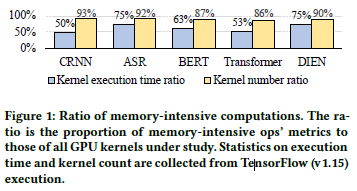

另一方面，新硬件的算力提升速度高于访存带宽提升速让算力有了急剧的提升。

因此访存密集型算子越来越影响Model的性能瓶颈

>   说明了优化这些访存密集型计算需要解决的问题

计算图以计算密集型算子为界，形成了大量的子图。子图由访存密集型算子构成。

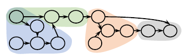

访存密集型算子带来的性能开销主要在于

1.   密集的片外访存
2.   CPU-GPU上下文切换
3.   高额的框架调度开销（大量的kernel需要被launche和execute）

>   优化这些访存密集型计算过程中，也遇见了新的挑战，呼应Abstract中的内容

complex two-level dependencies combined with just-in-time demand $\rightarrow$ fusion难

irregular tensor shapes $\rightarrow$ poor parallelism

 $\rightarrow$ AStitc提供了JIT-based joint optimization of dependency characteristics, memory hierarchy (locality) and parallelism

具体来说

1.  hierarchical data reuse technique：用来处理two-level dependencies，增大fusion的范围，避免要么保留冗余计算要么不fusion的困境
2.  adaptive thread mapping technique：用来处理不同的tensor shape，提高并行性和硬件利用率
3.  several key design obervations：利用它们设计了一个自动化编译器

然后作者解释了"stitching"的含义，stitching代表了作者提出的这种更高级的fusion技术，可以理解为 算子通过层次化的存储媒介“缝合”在一起，直观上看比以往的fusion有更大的fusion范围。

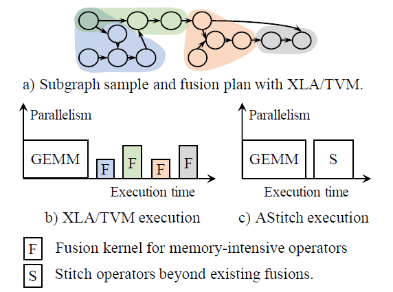

上图中可以看到，XLA和TVM的fusion粒度较小，按照前面划分的子图fusion；而Astitch使用share memory支持算子之间的数据传输，加大了fusion粒度。

总的来说，该文章完成了以下工作

1.   揭示了访存密集型算子在非CV模型中也对性能有较大的影响
2.   处理了低效的fusion和不规则tensor形状输入的问题
3.   第一份全面研究如何从dependency characteristics, memory hierarchy和parallelism方面，联合优化访存密集型计算的工作
4.   AStitch的技术是通用的，可以适用于其它ML框架或编译器，并且和任意版本的TensorFlow兼容

## 2 Background and Current Challenges

这一章花很大篇幅介绍了访存密集型运算的背景和优化挑战。

### 2.1 Essential Memory-Intensive Ops in Current Models

作者提出，在大多数ML模型中，计算密集型算子是相互隔离的，以它们为界可以将整个图分成很多子图，子图里都是访存密集型的算子。

在访存密集型的算子里，有两种算子占了主体：element-wise和reduce。

上图中的broadcast也算element-wise算子。reduce op（用来减小输入tensor的维度）包括两类，row-reduce和column-reduce。

由于reduce和broadcast在计算图中的高频应用，算子间的tensor形状已经变得越来越多样化。

### 2.2 Memory-Intensive Op Fusion

（这里简单介绍了其他框架应对访存密集型操作的fusion策略）

>   One of the most fundamental factors of fusion is code generation ability. ML compilers often make fusion decisions (e.g., pattern matching process in some studies) according to whether they can generate efficient code.

TVM和XLA能如何fuse，取决于提前设定的pattern（这些框架的fusion决策就是pattern matching过程：在计算图中尝试匹配特定的子图结构，找到目标子图结构后，等价替换进行fusion）

作者也提到，简单地修改TVM和XLA的fusion decision logic并不能解决访存密集型算子的优化问题。

(要改变优化方法!)

### 2.3 Major Limitations of the State-Of-The-Arts

这节中详细地讲述了 伴随jit需求的复杂两层依赖关系 和 不规则张量形状 带来的挑战：

#### Challenge I

**Challenge I: Complex Two-Level Dependencies Combined With Just-In-Time Demand Exacerbates Training/Inference Inefficiency.** 

两层依赖关系就是element level和operator level。

element level依赖关系消费者处理的每个element和生产者生产的每个element之间的依赖关系，比如Broadcast算子会生成一对多的数据依赖关系。

operator level依赖关系就是子图的网络拓扑结构，描述了子图中算子间的依赖关系。例如下图中的B和C 需要 A的输出 作为输入。

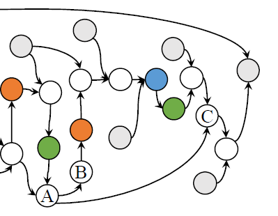

然后作者从这两个层面开始分析为什么为访存密集型算子fusion困难

从element level来分析，reduce和 broadcast的频繁导使用导致有很多一对多的依赖关系，而且当前模型类型丰富，变种繁多，相较手工kernel fusion只能静态地优化固定计算，jit才是更好的选择。因此，作者认为很难在满足 "Two-Level Dependencies Combined With Just-In-Time Demand" 的前提下，优化kernel fusion（这也是XLA和TVM目前只做保守fusion优化的一个重要原因）。

接下里作者刨析背后的原因，提出了第一个 Key Inefficiency: large number of kernels generated by the ineffective fusion strategies for memory-intensive subgraphs. 

主要是两种pattern不好fuse，(1) reduce ops with its consumers costly (2)element-wise ops followed by broadcast ops   （reduce和它的consumer，element-wise后接broadcast）

作者发现，当前的ML compiler框架遇见上面两个pattern大多采取以下两种策略

1.   Fuse? Heavy redundant computation. 

如果对这两种pattern中的op进行fuse，XLA和TVM都是使用寄存器传递中间结果，并不会在线程之间使用shared memory进行通信，只能通过不断的冗余计算来保证后续计算的进行。

下图以TVM对power<2> - broadcast<2,128> - add<2,128>进行fuse为例说明，add需要输入128维的元素，这些元素都是由power的一维度元素产生，由于线程之间没有通信，会重复计算128次相同的元素。

对于手工优化而言，引入shared memory即可，不仅可以减少框架调度和kernel调用开销，而且减少片外存储的访问，进一步优化访存密集型计算的性能。但是**手工优化的想法要在编译器上自动实现过于困难，因为编译器在生成代码时难以决定内存层级的配置**。

2.   Skipping fusion? More kernels are generated for execution. 

对于这两种pattern，很多情况下TVM和XLA都放弃fusion。例如对Transformer模型，XLA分配给访存密集型运算的kernel数是分配给计算密集型的3倍。理想情况下，经过fusion后，计算密集型kernel数目和存储密集型kernel的数目应该接近。

从operator level来分析，一对多的依赖关系可以解释为一个op是多个op的producer，这样会产生冗余计算。在下图中，fusion后，B和C会被分到不同的kernel，而A会inline到这两个kernel中，这样就重复计算了A的输出值。

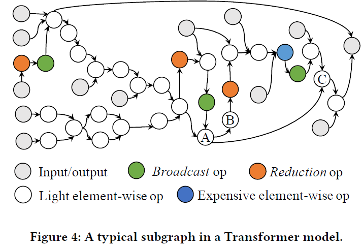

#### Challenge II

**Challenge II: Irregular Tensor Shapes in Real-World Production Workloads.** 

>   这里讨论的是静态shape的多样性，而非动态shape问题。
>
>   区分 FreeTensor中的Irregular Tensor ：主要讨论irregular tensor programs, which have features of partial operations on a complete tensor or complex control dependence
>
>   Astra中对于dynamic graphs的处理想法也值得借鉴，借用桶排序的思想，设定5个桶，每个桶包含代表连续的shape范围，获得5中最优的schedule state space，最后根据真实shape选择

当前模型类型丰富，变种繁多，相较手工kernel fusion只能静态地优化固定计算，jit才是更好的选择。但jit需要提前知道tensor shape，但当前ML compiler缺乏adaptive design，应对不规则张量形状的能力较差，而固定地并行划分策略注定是难以适用于复杂场景的，导致较差的并行表现。

作者顺势提出了第二个 Key Inefficiency: irregular tensor shapes lead to either too many small partitions or too few large partitions on GPU. （对于GPU而言，block分得太小或者太大，分的太多或者太少都不好）

下图中，图a是线程块较小时，每个EU未满载，图b是线程块较少，大量EU未使用，这都会导致严重的硬件利用率不足。

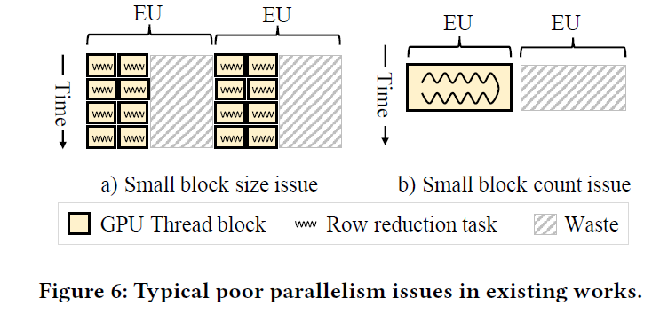

因此我们需要更好的compiler，应对不同的tensor shape来自动生成thread mapping策略。

## 3 KEY DESIGN METHODOLOGY

>   讲完了问题，我们来讲破局之法——AStitch

本章介绍了AStitch是一个怎样的框架，呼应Abstract中提到的：

1.   系统抽象化了四种operator-stitching策略，同时考虑了多个维度的优化目标
2.   处理层次化data reuse的复杂计算图
3.   通过adaptive thread mapping应对不同的tensor shape

重点在于解释hierarchical data reuse和adaptive thread mapping技术，分别对应了两个Challenge。

complex two-level dependencies(with JIT) $\rightarrow$ fusion难 $\rightarrow$ hierarchical data reuse

irregular tensor shapes $\rightarrow$ poor parallelism $\rightarrow$ adaptive thread mapping 

### 3.1 Operator-Stitching Scheme Abstraction

同时考虑硬件存储层次和并行度，作者将stitch策略抽象为四种：无依赖（Independent）、本地的（Local）、区域的（Regional）和全局的（Global）。

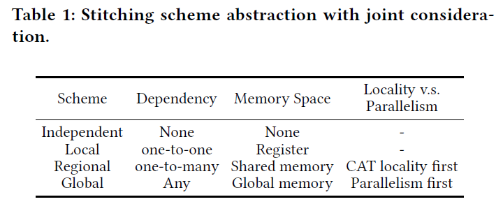

TVM、XLA所支持的是Local策略，只支持通过寄存器传递数据，算子的并行策略被分开来考虑。一些Fusion工作可以支持Independent依赖，主要包括Kernel Packing等。

AStitch拓展了fusion的优化空间，Regional策略将数据存储在shared memory中，支持GPU thread block locality，Global策略将数据存储在global memory中，支持全局的locality。

由于ML Model中一对多的依赖关系较多，所以Regional策略应用场景更多，但有时为了locality会伤害parallelism，Global也是必要的。第四章中将会说明，AStitch通过算子的一些特征来平衡locality和parallelism（或者说选择Regional或者Global）。

### 3.2 Hierarchical Data Reuse Illustration

这一节说明了Challenge I的应对之法。从三点进行说明：

有了多种的operator-stitching策略，我们也需要保障层次化的date reuse，这样才能避免冗余计算。

-   层次化的date reuses如何重用？（两级重用对应两级依赖）

Element-level data reuse：对于one-to-many element-level dependencies，对于每个数据，producer只生成一次，然后将结果放在shared/global memory buffer供consumers使用。

Operator-level data reuse：对于one-to-many operator-level dependencies，ASitich只会执行producer op一次，并将其结果缓存，供consumers使用。

-   fusion生成怎样的kernel？

下图对比了XLA和AStitch进行fusion后生成的kernel。

选用的stitching策略：reduce.1 用Regional ，power.1 和 reduce.2 用Global，multiply.1 用Independent，以及op用Local。

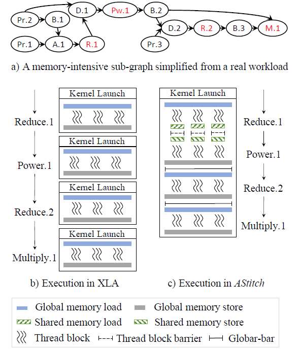

XLA生成了4个kernel。而AStitch通过fine-grained data management和multi-level thread barriers消除了 3 次内核launch，从而减少了 CPU-GPU 上下文切换和框架调度开销，只生成了1一个kernel（kernel内有额外的lightweight thread barriers）。

>   从层次化date reuses角度来说明的话：reduce.1 的输出不需要buffer到off-chip，它在on-chip上buffer以供其consumers读取（即element-level data reuse）。 parameter.2 和 broadcast.2 的值只需要从off-chip中加载一次并buffer在registers中（即operator-level data reuse），而 XLA 在不同内核中从全局内存中加载它们两次。
>
>   对于这种情况，TVM 将形成 3 个内核，其中 power.1 和 reduce.2 合并为一个内核。但这导致 power.1 的冗余计算。
>
>   Astitch避免这样的冗余计算的技术是automatic thread mapping ，将在4.3节中说明。

-   Global 策略的条件（Global Barrier）

Global策略的实现需要设定一个Global Barrier：GPU thread block总数量 不大于 每wave可以在GPU上同时执行的最大数量，不然就导致活动线程块和非活动线程块产生dead-lock。而且Global策略需要GPU kernel所有线程全局同步，会将kernel调用之间的implicit global thread barriers内联(inline)到单个kernel中（可以理解为：将kernel之间的隐式同步给inline到kernel内部）。

>   补充dead-lock说明：GPU发射thread block的时候，一次wave实际发射数目可以小于kernel launch的数目，然后分多个wave完成所有发射，并且一个block被发射后要一直执行到结束才可以。如果要使用global barrier合并producer-consumer，就意味着一个block里后续的计算要求包括自己在内的所有其它block都完成了先前的计算，倘若这时候某些block没在当前wave里发射，那当前wave里的block就会等没发射的block上来完成先前计算，而没发射的block又在等已经发射的block完成计算让出位置，这样两边陷入死锁。（出自：https://zhuanlan.zhihu.com/p/477984880）

### 3.3 Adaptive Thread Mapping

这一节说明了Challenge II的应对之法。

shape-aware的并行代码生成：基于SIMT架构，合并小的（Task Packing）thread block，拆分大的（Task Splitting）thread block，以得到合适的CUDA thread block大小和数量。

>   Packing有两种，H-packing是增加block自身的大小，也就是增加线程数，V-packing是不增加线程数，增加一个thread处理的数据量。

    
    

相较前面较差的并行效果，这里我们在a图中增加了每个块的处理线程数（合并小的）来加大线程块，在b中将大的线程块拆分成两个（拆分大的）来增加线程块数量，实现了更好的并行。

## 4 COMPILER DESIGN AND OPTIMIZATIONS

这一节将重点讲AStitch代码生成的设计

穷举每个算子的stitching策略和并行策略是不现实的。作者提出一个关键obersavation：AStitch only needs to determine the stitching scheme and the corresponding thread mapping for several key operators, and these will propagate to all the other operators in the subgraph. 

>   先**分组**解决局部代码生成，再聚合生成全局代码的方法。
>
>   一个重要的insight是：light element-wise ops和expensive element-wise ops that are not followed by broadcast只需要跟随其consumer的代码生成schedule即可，最终通过Local策略进行数据传输；reduce ops和expensive element-wise ops followed by broadcast则需要优先考虑并行度的优化，再去考虑与其consumer的stitch策略。

### 4.1 Stitching Scope Identification

这节说明AStitch如何辨认可以stitching到一起的算子

用BFS算法找到访存密集型操作构成的子图，用stitch op代替表示。然后把没有data dependency的stitch op进一步合并构成更大的op，需要保证不形成cyclic dependence。最后每个stitch op被编译为一个CUDA kernel。

>   当两个或多个抽象相互之间存在直接或间接依赖时，就会形成cyclic dependence

### 4.2 Key Design Observations

作者根据stitching策略抽象做出以下两个observations

Observation-A: 如果一个操作采用Local策略，它的thread mapping 可以follow 它的consumer的thread mapping。同样的，当一个操作和它的consumer都采用Local策略，它的thread mapping 可以传递给 它的consumer的thread mapping

Observation-B: reduce ops和expensive element-wise ops followed by broadcast都需要用Local或者Global策略。

>   Local策略指示element-level一对一依赖关系。 给定consumer的调度方式，其producer的调度方式可以直接通过element-wise index直接从consumer那里导出。
>
>   而两种难优化的pattern都会导致复杂的element-level一对多依赖关系，需要使用

### 4.3 Automatic Compiler Optimization Design

基于4.2节中的两个observation，团队设计出的jit compiler能够自动为每个op决定stitching策略和thread mapping。下图说明了编译器自动化的三步。

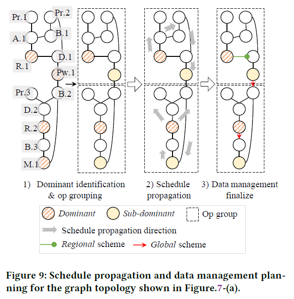

1.  Step 1: dominant identification and op grouping. 这里的dominant op指的就是那些决定了别的op thread mapping的op。reduce ops和expensive element-wise ops followed by broadcast作为每一个组的dominant op候选者（AStitch总是选一个dominant，而且偏向选reduce op，其他候选者作为sub-dominat），每个dominant的直接的或间接的producer被分到其对应的组中。
2.  Step 2: adaptive thread mapping and schedule propagation. 利用adaptive thread mapping技术决定dominant op的thread mapping。**组内的数据传播都是通过Local策略进行**，dominant生成自己的并行策略schedule后，传播给组内的其他算子。
3.  Step 3: Finalization. 检查组间的数据局部性，为两组的dominant op和sub-dominat op选择可达到的locality最优的stitch策略（Region或Global）。Regional只能用在前后（生产和消费）数据量一致情况，否则就要用Global。

>    第三步的block-locality checking有两种：
>
>   Passive block-locality checking：dominant op为reduce op时使用。通过衡量ops生产多少连续的元素和ops的消费者消耗多少连续的元素，来确定stitching使用Region或Global策略，并不会调整第二步生成的thread mapping
>
>   Proactive block-locality checking：dominant op为element-wise op时使用。通过主动调整第二步生成的thread mapping，来满足它的producer group的block locality需求

### 4.4 Memory Usage Optimization

这一节介绍了重用memory和检查开销是否超过物理限制。

规范使用GPU的share/global memory十分重要，例如过多的使用share memory会损害kernel parallelism。

因此，AStitch在作用过程中会考虑内存资源限制和内存策略带来的影响。例如：AStitch会尽量重用先前分配好的内存空间。以避免不必要的内存分配请求；Astitch使用dominance tree算法来分析内存数据流，以确保最大化算子的内存重用。

### 4.5 Resource-Aware Launch Configuration

global barrier（见3.2节 第三点Global Barrier）需要精确控制block的数目的。因此AStitch需要知道$C_{blocks-per-wave}$来决定thread mapping，但是这个信息需要在编译后才会得知。

作者提出以了一种估计方式，以在优化前获得$C_{blocks-per-wave}$。预设先预设一个很小的寄存器开销和很大的block size，结合4.4节的计划share memory使用，算出来一个最大可并行block数目的下限（即$C_{blocks-per-wave}$），且保证CUDA相关的限制，得到最终的结果。（但这样得到的$C_{blocks-per-wave}$较为保守）

## 5 IMPLEMENTATION

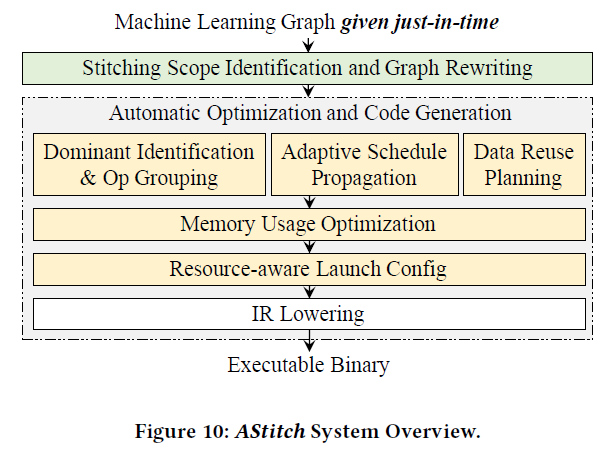

AStitch内部版本是基于XLA开发的，它保留了 XLA 的所有优化，除了融合策略和代码生成过程。它利用TensorFlow的custom graph pass API 重写计算图并为stitching操作生成GPU代码。其中的功能正在逐步porting到BladeDISC中。

## 6 EVALUATION

实验环境是一块V100-16GB，CUDA 10.0，CuDNN 7.6。

下图的端到端编译的加速比

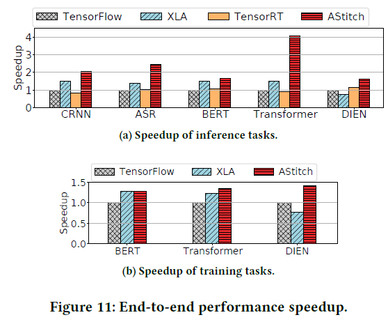

（其他没细看）

## 总结

AStitch的雏形是阿里团队早期的工作FusionStitching，**FusionStitching最早将shared memory引入了访存密集算子的编译优化自动fusion，并采用cost model来做fusion和代码生成的一系列决策**。随着深入优化，团队发现可以将kernel之间的隐式同步给inline到kernel内部，并通过global memory做stitch，避免CPU和GPU之间的无谓的切换，进一步的，结合Adaptive Thread Mapping方法解决并行策略问题，可以形成强大的代码生成能力。至此，已经不需要cost model来指导fusion决策和代码生成，可以stitch一切，代码生成也具有自适应能力。