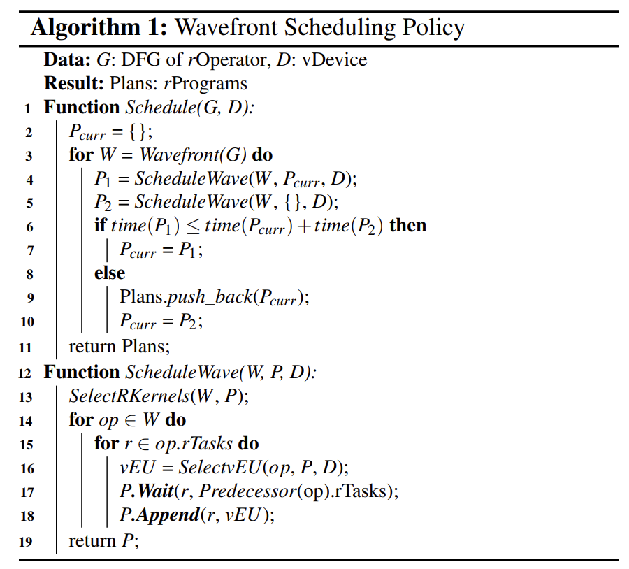

# Astra、Rammer、Roller

## Astra

DNN任务的特点：重复性（数据重复、指令重复）和可预测性（一般不会有复杂的控制流）

Astra利用运行时对优化结果进行评估，其优化对象为整个模型程序（需要优化的就是全局程序的运行情况，并不单独优化某些参数或者特征）

在运行时运行多个版本编译的程序，通过运行时间筛选运行最快的编译版本

三个用于管理优化空间的技术：

- 配置粗粒度的静态信息（*在某些维度上使用先验知识约束枚举器的可选项，排除无效选项*）
- 在细粒度层面，并行的评估多个版本的编译。Astra框架同时对多个独立的参数进行评估。
- 以初始的测验结果作为信号来智能的修剪动态状态空间。

可以进行的优化空间：

- 内核内参数优化，如线程块大小、tiling数据大小和共享内存大小等参数。
- 将多个内核函数融合，并指出内核融合需要测验，举例融合可能会带来性能下降。
- 使用多个流
- 其他的优化：
    - 全图优化，如内存规划
    - 分布式或GPU训练

优化器 = 枚举器 + custom-wirer(捕获器)

编译器用来枚举相关优化的状态空间，并使用静态信息对状态空间进行修剪

运行时对被可捕获的优化选项进行排序，从而选出最优的优化集合

自适应变量被组成一颗更新树，更新树有几种被探索的模式：

- 并行模式：所有子节点都相互独立时
- 详尽模式：所有子树需要被暴力的遍历，时间成本是指数级的
- 前缀模式：需要按顺序分层级遍历子代。当上一个子代遍历完其最佳结果确定，开始下一子代的遍历

修剪探索状态空间的方式：

- 并行探索：选择维度独立，并行每个组进行探索
- 层次探索：探索空间引入一个内存分配策略，在探索完分配之后，再为每个分配构建最佳配置。
- 屏障探索：不同流中调度内核的性能受到之前内核调度历史的影响。Astra引入屏障探索的概念，设立超时期，在超时期的边界对所有流进行强制屏障同步，并行的同时对多个超时期进行探索。可以分摊跨流屏障同步的成本。
- 前缀探索：为了在超时期进一步控制状态空间，将超时期基于依赖关系进一步划分成不同的时期。时期中的操作可以进行跨流的调度。
- 等价探索

## **Rammer**

通过算子**之间和内部**的协同，为DNN生成有效的**静态时空调度**

算子间并行 && 算子内并行：通过降低算子内部并行，从而提高算子间的并行

单个算子派发将贪婪的使用硬件资源，阻止了其他可并发的算子并行使用硬件资源

一个算子（rOperator）=多个rTask（调度的最小单元，加速器单个执行单元的运行对象）

以rOperator构成的数据流图依然保持着数据间的依赖关系，但是**以rTask为粒度的调度**将算子内部的并行信息暴露给编译器

每个rOperator有多个版本的rKernel的具体实现，每个rKernel有不同的tiling策略

虚拟化的并行设备（vDevice） 包含多个虚拟化的执行单元（vEU）

rTask被分派到vEU上进行执行，每个vEU可以独立的执行rTask

为了保证具有依赖的算子的顺序执行，定义了屏障rTask

Rammer在vDevice上将DFG组成成rProgram，rProgram被表示成一个prog[EU_id][order]的二维数组

EU_id表示执行任务的单元，order表示EU设备上执行的顺序

Rammer将调度决策从运行时迁移到编译期间（AOT）

编译过程中，Rammer会提供信息：rTask在vEU上独立执行时间、rTask的资源占用情况，如本地内存或寄存器、rProgram的总体执行时间

调度策略如下：

算子间调度的开销：内核启动、上下文初始化、主机和设备之间的通信

使用operator fusion技术减少算子间调度开销

Rammer将输入格式统一转换成由rOperator表达的DFG图，在DFG图上做一些常见的图优化转换：常量折叠、公共子表达式消除、基于模式的算子融合

对于每个优化后的rOpertaor，Rammer在不同渠道加载一个或多个版本的rKernel实现：其他框架的转换器、手调内核函数、核函数代码生成器

后续，DFG划分成多个子图，并为每个子图编译出对应的rProgram，每个rProgram进一步转换为加速器上运行的设备代码

在NVIDIA GPU中，rTask会被分配到SM上，将其作为一个线程块实现。为了绕过CUDA内置的硬件调度器，Rammer采用持久线程块（PTB）来在硬件中实现vEU的映射

- 抽象rTask，暴露算子内部的并行性
- 抽线vEU，暴露硬件内部的调度能力
- 利用DNN计算的可预测性，将运行时调度问题转换为编译器rTask执行优化

## Roller

高效生成内核，基于构造的方法

rTile是Roller的核心，其**封装了与硬件加速器关键特性对齐的张量形状**

对tile进行抽象，从而通过对形状选择进行限制，以此实现高效的探索

Roller基于rTile生成最终的rProgram

rProgram的性能可以通过微性能模型进行评估

Roller使用一种*scale-up-then-scale-out* 的方法：先执行放大过程，采用基于递归的rTile构造算法，逐步增大rTile的大小，构造硬件加速器的单个执行单元的饱和运行

Roller系统结构

从张量表达式中提取张量的形状，并利用硬件的相关规范来构造rTiles

在rTiles的基础上使用*scale-upthen-scale-out*的递归构造算法生成rProgram

构造算法通过评估rProgram的性能来识别rTile合适的配置

rTile必须和给定张量表达式中的张量形状和底层硬件特性对齐

给定一个数据处理管道，其rProgram的优化目标是最大化管道的吞吐量，该目标可以转换为：

- 计算和数据移动需要充分利用硬件特性
- 吞吐量需要达到性能瓶颈
- 需要足够的并行以充分利用并行执行单元

Roller首先使用scale up以满足前两点，之后利用scale out利用多核并行性

- scale up：Roller从内存结构由顶至下构建不同层次的rTile尺寸，Roller首先进行rTile的初始化，之后迭代扩大rTile的大小，最大程度提升数据重用得分。
- scale out：Roller在最底层的内存尺寸上构造单一单元执行的rProgram，并通过将每层的rTile平均分配来将rProgram复制到其他单元。一般会在reduce的轴上分配单元

Roller尝试沿着具有最小数据重用得分的轴上收缩rTiles以实现足够的并行度