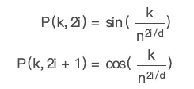

# Attention


# Transformer

```cpp
输入序列的 token 化（文本、图像、声音）
token 的 embeding
encoder 实现
decoder 实现
output实现-文字序列输出的实现
flash attention 的优化
```

1.文本序列的token化和embeding

（1）文本序列通过BPE编码（或其他编码方式）转为token

```cpp
BPE（Byte Pair Encoding）编码是一种基于数据压缩的文本编码技术，最初用于无损数据压缩。在NLP中主要用于词汇表的构建和分词。BPE算法通过识别并合并文本中的连续字节对（byte pairs），以逐步构建一个词汇表。

具体而言，BPE编码的步骤如下：

1. 初始化词汇表：将所有的字符或字符组合视为初始词汇表的元素。
2. 统计频率：统计文本中所有字符组合的出现频率。
3. 合并频率最高的字符组合：将出现频率最高的字符组合（byte pair）合并成一个新的符号，并更新文本中的所有实例。
4. 重复步骤2和步骤3，直到达到预定义的词汇表大小或达到停止条件。
```

（2）token通过查表获得Embedding矩阵

这个表也是训练得到的

（3）token通过自身在输入序列中的position计算positional encoding



（4）将embedding和positional encoding相加后得到transformer的输入

额外：图像的token化只需要将输入图像切分（一般是16*16），再按顺序排好，加个位置编码即可输入transformer encoder


2. encoder

主要就是attention


3. decoder

想比encoder要多一个mask！！


4.output实现

将结果最后经过一个linear以及softmax，最后再反查BPE编码表，获得最终的结果


# Attention

attention机制的特点：从观察全局到观察局部，并且能够在长文本中找到终点

attention解决了RNN不能并行的缺点（transformer在训练阶段解决了并行训练的问题），每一步计算和CNN一样，不依赖上一步的结果

RNN→死记硬背，attention→总结

## 原理

attention也可以脱离encoder-decoder


图书馆(source)有很多书(value)，为了方便查找就给这些书取了编号(key)，当我们想要了解某件事情(query)的时候，就可以简要地了解。为了查询效率，每本书根据和事情的相关性，会计算得到一个权重

attention流程（计算分为三个阶段）

（1）query和key之间计算相似度，得到权重

（2）将权重进行归一化，方便使用（消除序列长度d对结果的影响）

（3）将权重和value加权


假设q_t就是时刻t下的query向量，K是key矩阵，k_s是其中一个key向量，V是value矩阵，我们先对q_t和每个key进行相似度计算得到一个非归一化的score分数：$s(q_t, k_s) = \frac{<q_t, k_s>}{\sqrt{d_k}}$

（这里计算相关性使用的是点乘）

然后使用softmax进行归一化 
$$
a(q_t, k_s) = \frac{exp(s(q_t, k_s))}{\sum_1^N{exp(s(q_t, k_s)}}
$$
最后对结果进行加权求和 $\text{Attenion}(q_t, K, V)=\sum_{1}^m a(q_t, k_s)v_s$

## 类型

多种变种Soft Attention、Hard Attention、静态Attention、动态Attention、Self Attention 等等


下面从计算区域、所用信息、结构层次和模型等方面对Attention的形式进行归类。

**1. 计算区域**

根据Attention的计算区域，可以分成以下几种：

1）**Soft** Attention，这是比较常见的Attention方式，对所有key求权重概率，每个key都有一个对应的权重，是一种全局的计算方式（也可以叫Global Attention）。这种方式比较理性，参考了所有key的内容，再进行加权。但是计算量较大

2）**Hard** Attention，这种方式是直接精准定位到某个key，其余key就都不管了，相当于这个key的概率是1，其余key的概率全部是0。因此这种对齐方式要求很高，要求一步到位，如果没有正确对齐，会带来很大的影响。另一方面，因为不可导，一般需要用强化学习的方法进行训练。（或者使用gumbel softmax之类的）

3）**Local** Attention，这种方式其实是以上两种方式的一个折中，对一个窗口（window）区域进行计算。先用Hard方式定位到某个地方，**以这个点为中心可以得到一个窗口区域**，在这个小区域内用Soft方式来算Attention

2. 所用信息

若要对一段原文计算attention，那么原文中的内容属于内在信息，外在信息是除原文以外的额外信息

1）**General** Attention：使用外部信息，常用于需要构建两端文本之间关系的任务，根据外部query对原文进行补齐。

例如阅读理解任务，“题目”是原文，而“文章”是外部信息。在每一步，使用“文章”在该步的词向量对问题来建模

2）**Local** Attention：只使用内部信息，key、value和query只和输入原文有关。在self-attention中，query=key=value。想当于句子中每个词和句子中所有词作attention，找输入原文内部的关系

3. 结构层次

根据划分层次可以分为：单层attention、多层attention、多头attention

1）单层attention：用一个query对原文进行一次attention计算

2）多层attention：一般用于文本具有层次化的模型。以两层attention为例，将文章分为多个句子，第一层，对每个句子使用attention计算出一个句向量；第二层，对每个句向量使用attention计算一个文档向量，然后用这个文档向量去计算任务。（首先抽取出句子的重点信息（词汇），再从文章中抽取出重要句）

3）多头attention：**用多个query对一段原文进行了多次attention，每个query都关注到原文的不同部分$\text{head}_i = \text{Attention}(q_i, K, V)$**，相当于重复做多次单层attention。最后再将结果拼接起来$\text{MultiHeadAttention}(Q,K,V) =\sum{W_i {head}_i }$

4.从相似度计算角度

回顾attention的计算：

假设q_t就是时刻t下的query向量，K是key矩阵，k_s是其中一个key向量，V是value矩阵，我们先对q_t和每个key进行相似度计算得到一个非归一化的score分数：$s(q_t, k_s) = \frac{<q_t, k_s>}{\sqrt{d_k}}$

（这里计算相关性使用的是点乘）

然后使用softmax进行归一化 $a(q_t, k_s) = \frac{exp(s(q_t, k_s))}{\sum_1^N{exp(s(q_t, k_s)}}$

最后对结果进行加权求和 $\text{Attenion}(q_t, K, V)=\sum_{1}^m a(q_t, k_s)v_s$

其中相似度的计算公式可以有多种：点乘、矩阵相乘、cosine相似度等

## 多种attention的计算模式

K的个数等于V的个数，与Q的个数不一定相等

Q的维度等于K的维度，与V的维度不一定相等

### Scaled Dot-Product Attention

最普通的一种，又叫单头注意力，计算score时使用**缩放点积，即需要除以${\sqrt{d_k}}$（**解释：对于较大的值，点积的大小变大，反向传播会将softmax函数推到具有极小梯度的区域，为了抵消这个影响，将点积进行缩放）


1）matmul：假设q_t就是时刻t下的query向量，K是key矩阵，k_s是其中一个key向量，V是value矩阵，$U=QK^T$

2）scalar：$U = U / \sqrt{d_k}$

3）mask：$U = U.\text{masked\_fill}(mask, -\infty)$ ，$-\infty$在softmax时会表示为0

4）softmax：$A = softmax(U)$

5）求output：$output=A \cdot V$

再选择output中置信度最高的一维，其值就是


### multi-head attention


对于同样的Q、K、V计算多次attention，再把这些output连接起来得到最终的output

不同head的output是从不同层面考虑关联性而得到的输出

1）V、K、Q经过Linear变换

2）当成单头attention计算

3）再拼接起来后经过得到最终输出

本质：在参数总量不变的情况下，将Q、K、V映射到原来高维空间的不同子空间，分别在子空间计算attention并合并成输出

- 从d_q_到d_q，一般每个子空间的特征维度会下降，防止过拟合
- 由于Attention在不同子空间中有不同的分布，Multi-head Attention实际上是寻找了序列之间不同角度的关联关系

缺点：

- Multi-head Attention 需要对QKV进行线性变换，会带来明显的计算和显存开销
- 低秩瓶颈：QKV经过线性变换后一般是投影到低秩（n_head），可能导致**表达能力受到限制**，从而影响模型性能。为了缓解这个问题，可以增大头大小或者采用其他方法，如局部敏感哈希

改进：

- multi-query attention

MHA 是利用**多个Q，**从输入信息中选取多个信息来**并行地计算**。**每个注意力关注输入信息的不同部分**，然后再进行拼接。多头注意力的机制进一步细化了注意力层，通过扩展模型专注于不同位置的能力以及提供了多个“表示子空间”来提高注意力层的性能。

MQA 让所有的head之间 **共享** 同一份 Key 和 Value 矩阵，每个head只单独保留了一份 Query 参数（之前每个head需要保留QKV），从而大大减少 Key 和 Value 矩阵的参数量。在 MQA 中，除了 query 向量还保存着多个头，key 和 value 向量都只剩 1 个「公共头」了。

- group-query attention

一组group共用一组KV


### self-attention

当注意力的query和key、value全部来自于同一堆东西时，就称为自注意力。如下图所示，query和key、value全都来源于X

```python
n_x = 80, d_x = 80, w_q = (d_x, d_q), w_k = (d_x, d_k)
def forward(self, x, mask = None):
        q = torch.matmul(x, self.wq) # (batch, (4, 80) * (80, 128))
        k = torch.matmul(x, self.wk) # (batch, (4, 80) * (80, 128))
        v = torch.matmul(x, self.wv) # (batch, (4, 80) * (80, 64))
```


例如厨房里有苹果、青菜、西红柿、玛瑙筷子、朱砂碗，每件东西都有一个query_i，每件东西都和自己以及其他物品做一次attention计算。“苹果”的query与苹果、青菜、西红柿、玛瑙筷子、朱砂碗的key和value做注意力，得到最终输出。其他物品的query也如此操作。相当于将这5个物品换了一种表示形式，新的表示形式考虑了所有KV物品的信息。

# LLM推理

以GPT为例，GPT的推理过程其实是对输入进行续写。推理包含多轮，每轮只生成**一个token**，input_(i+1) = concat(input_i, output_i)

并不是第一轮就对完整的输入进行计算，而是将输入也分为单字计算

原始输入“我是谁”

| 轮次 | input      | output | 阶段    |
| --- | --- | --- | --- |
| 1    | 我         | 爱     | prefill |
| 2    | 我是       | 人     | prefill |
| 3    | 我是谁     | 的     | decode  |
| 4    | 我是谁的   | 人     | decode  |
| 5    | 我是谁的人 | ？     | decode  |
| 6    | …          | …      | … |


decoder attention中的mask：在对初始输入一个个计算时，虽然已经可见所有序列（输入为“我是谁”，在模型读“我”时，已经知道“是谁”代表的矩阵数值）。所以使用mask来舍去这部分以及未来输出长度的数据。

$Output = Attention \cdot V =  softmax(\frac{(QK^T)}{\sqrt{d_k}} \cdot \text{masked\_fill}(mask, -\infty)) \cdot V$

$QK^T$就是当前的Attention 


# memory-effective attention

self-attention会使用线性变换（利用权重矩阵W_Q, W_K, W_V）将输入x变成QKV

权重矩阵W_Q, W_K, W_V都是可训练的

$$
Q_i = \text{matmul}(x, W_{Q_{i}}) \\
K_i = \text{matmul}(x, W_{K_{i}}) \\
V_i = \text{matmul}(x, W_{V_{i}}) 
$$

每次输入都有多轮推理构成，第i+1轮推理是将前i轮的输出token和所有输入token拼接，然后获得输出。每一轮的计算都是GEMM

## KV Cache

（kvcache只适用于decoder self-attention结构，因为decoder结构有casual_mask，self-attention的KV需要按步更新）

分析attention的计算


可见，第i+1步的计算结果相比第i步，只需要额外计算Q_{i+1}作为输入的Att_{i+1}

$$
Output_{i+1} = Att(Q, K, V) = \left( \begin{bmatrix} Att_1 \\ Att_2 \\ ... \\ Att_i \\ Att_{i+1}\end{bmatrix} \right)
$$

Att_i 只跟 Q_i 有关，且用到了每一步的K和V。可以利用Cache机制，缓存每一轮的K_i和V_i，下一轮直接读取Cache中该layer对应的(k, v)，与K_{i+1}和V_{i+1} concat起来，再与Q_{i+1}相乘（而不是以拼接后的Q相乘）

为什么不存Q？第i+1步比第i步的计算结果只多一个Att_i ，Att_i只跟Q_i有关，所以是KV Cache


第i轮token的计算结束后，KV Cache中存储了某个layer的KV分别为[K_1, K_2, …, K_i] 和[V_1, V_2, …, V_i] 

KV Cache所占显存 ： 2 * batch_size * seq_len * per_head_hidden_dim * n_layers * (ElmBitWidth / 8 )


需要注意,当**sequence特别长的时候，KV Cache其实还是个Memory刺客**。

比如batch_size=32, dim_size=4096, seq_length=2048, head=32, layer=32, float32类型，则需要占用的显存为 2 * 32 * 4096 * 2048 * 32 * 4 / 1024/1024/1024 /1024 = 64G。

[summary] KV Cache 配置开启后，推理过程可以分为2个阶段：

1. 预填充阶段：（输入序列token的计算）发生在计算第一个输出token过程中，这时Cache是空的，计算时需要为每个 transformer layer 计算并保存key cache和value cache，在输出token时Cache完成填充；FLOPs同KV Cache关闭一致，存在大量gemm操作，推理速度慢。
2. 使用KV Cache阶段：发生在计算第二个输出token至最后一个token过程中，这时Cache是有值的，每轮推理只需读取Cache，同时将当前轮计算出的新的Key、Value追加写入至Cache；gemm变为gemv操作（从矩阵-矩阵乘法 降为 矩阵-向量乘法），推理速度相对第一阶段变快，这时属于Memory-bound类型计算。
没有kv-cache：推理得到的token直接拼接，拼接结果Q_new作为下一轮的输入 → GEMM
有kv-cache：直接将该轮token作为下轮的输入Q_i，不再拼接 → GEMV


## windows Attention

为了节省KV-Cache可能占用的memory，就是一个 token **只考虑周围一个窗口内的其他 token**

**也算一种Strided Attention**


更新kv_cache时，可以把(t - windows - 1)step的kv_cache删除，保留seq = windows_size长度的seq_kv就可以

计算增量Attn_i时，原本需要用Q_i与之前所有的K、V计算，而window attention要求只与window内的KV做attn计算

$$
Att_{i+1} = softmaxed(Q_{i+2-\text{win\_len}}K_{i+2-\text{win\_len}}^T)V_{i+2-\text{win\_len}} + ... + softmaxed(Q_{i}K_{i}^T)V_{i} + ... + softmaxed(Q_{i+1}K_{i+1}^T)V_{i+1} 
$$

但是当上下文window移动时，cache必须重新计算（需要对KV Cache进行裁减，再拼接新的K_{i+1}，V_{i+1}）


但是只用window内的KV来计算会导致精度下降吗？其实也有cross-layer之间的信息传递


slide window attention：保留老上下文和新上下文中重叠部分的kv-cache


# FlashAttention

[https://courses.cs.washington.edu/courses/cse599m/23sp/notes/flashattn.pdf](https://courses.cs.washington.edu/courses/cse599m/23sp/notes/flashattn.pdf)

[https://zhuanlan.zhihu.com/p/668888063](https://zhuanlan.zhihu.com/p/668888063)

flash attention通过减少访问HBM(high bandwidth memory)和on-chip SRAM内存读写时间，提高计算速度的方法。

1. 通过**分块计算**：增大每次计算矩阵的最小单元，从而降低对HBM的读写次数，使得整体得到加速（HBM读写非常耗时）
2. 通过**重计算**：降低内存，被丢弃的变量在反传的过程中会再次使用到，需要重新计算得到，类似于梯度检查。

[https://github.com/Dao-AILab/flash-attention](https://github.com/Dao-AILab/flash-attention)

[https://arxiv.org/abs/2205.14135](https://arxiv.org/abs/2205.14135)

# PageAttention

[https://zhuanlan.zhihu.com/p/668736097](https://zhuanlan.zhihu.com/p/668736097)

# 参考

[https://zhuanlan.zhihu.com/p/624740065](https://zhuanlan.zhihu.com/p/624740065)

[https://zhuanlan.zhihu.com/p/662498827](https://zhuanlan.zhihu.com/p/662498827)

[https://zhuanlan.zhihu.com/p/630832593](https://zhuanlan.zhihu.com/p/630832593)

[https://zhuanlan.zhihu.com/p/646577898](https://zhuanlan.zhihu.com/p/646577898)