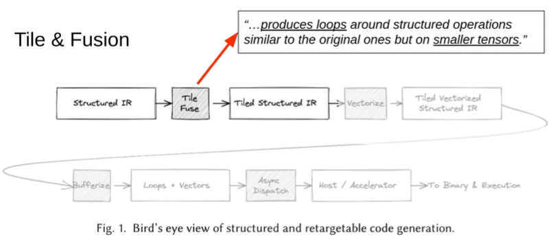
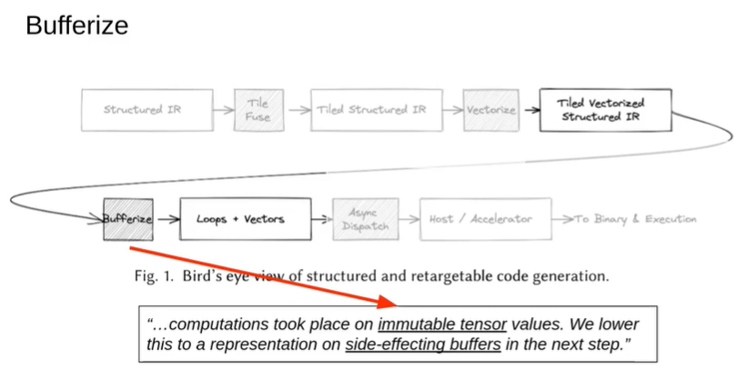
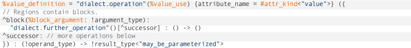
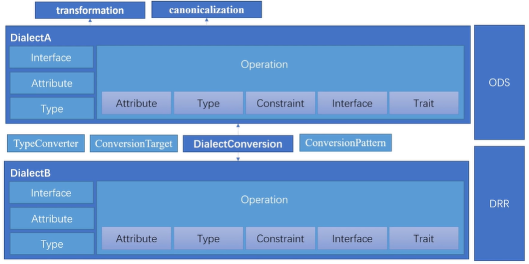
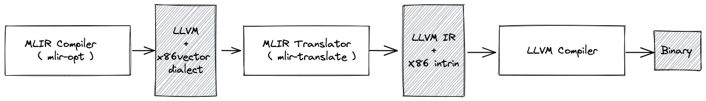

#  Composable and Modular Code Generation in MLIR

> Composable and Modular Code Generation in MLIR : 
>
> A Structured and Retargetable Approach to Tensor Compiler Construction
>
> 论文：https://deepai.org/publication/composable-and-modular-code-generation-in-mlir-a-structured-and-retargetable-approach-to-tensor-compiler-construction
>
> 视频：https://www.youtube.com/watch?v=ZjfXCJ27s_A

尽管对软件基础设施进行了大量投资，ML systems, runtimes and compilers依然不能很好的组合在一体。本文提出了一种全新的设计，这种design有前所未有的模块化、可组合、通用性（modularity, composability and genericity）。本文给出了一种结构化的方法来帮助tensor compiler进行Codegen，这种方法利用了张量代数的自然结构。

## 1. Introduce

尽管对软件基础设施进行了大量投资，但ML systems仍然停滞不前。问题所在：

在硬件上实现idea需要大量的步骤且很复杂。所用到的软件栈包含各种技术，像ML frameworks、programmer language、communication and compute libraries、domain-specific compiler。但这些软件栈在建立时都各自孤立：

- 纵向来看，以框架为中心，自上而下考虑：不断增长的用户需求让程序员一直造轮子
- 横向来看，以技术驱动为中心，自下而上考虑：硬件平台上缺乏一组独立于硬件之外的可移植的操作和接口

$\rightarrow$ 工程成本高、用户只能使有限的表达接口（不能自定义需求）（而且自动化代码的生成效果较差）

$\rightarrow$ 探索更好的方法（结合自上而下、自下而上——由多个循环组成）：

- **自上而下：让programmer可使用一些promitives，且这些primitives逐渐分解成更小的building block**
- **自下而上：创建适合硬件的primitives building block，逐渐将它们组成更大的building block**


当前主流的ML compiler都是lower到LLVM IR，再借助LLVM进行编译。而上层的编译器一般用XLA、TVM、Halide、TACO、polyhedral compilers，这些compiler各有所长。

分析来说：

- 问题一：缺乏特定的infrastructure来支持这些domain-specific compilers
- 问题二：面向用户的抽象表示和进行transformation的IR跨越太大，不能一蹴而就(所以本文就是 丰富中间IR，并设计一个流程？)
    - 会丢失高层级IR信息
    - 从低层级IR重建高层级语义信息加剧了phase-ordering问题

$\rightarrow$ 损害了模块化设计

在建造domain-specific IRs时，MLIR大幅减少了引入新抽象层级的开销。即使有了 MLIR，第二个问题仍然存在：**缺少中间抽象 和 用于编译张量计算的渐进细化策略。**

> phase-ordering问题：编译器的编译过程分成不同的Phase（阶段），而阶段执行的顺序不一样的话最终出来的执行效率是不一样的。（论文：[AutoPhase: Juggling HLS Phase Orderings in Random Forests with Deep Reinforcement Learning](https://link.zhihu.com/?target=https%3A//mlsys.org/Conferences/2020/ScheduleMultitrack%3Fevent%3D1421)）


本文旨在为 MLIR 中的高性能代码生成 构建 可组合的抽象(composable abstractions)：

> 可组合抽象或许可以理解为MLIR设计的通用中间抽象，再用这些抽象构建？

- 可组合转化(Composable transformations)：**通用计算(generic computations)利用它们的代数特性和结构 被分层分解为更小的块**，这些块可以fusion并逐渐lower到(retargetable [vector](https://deepai.org/machine-learning-glossary-and-terms/vector) primitives上的)loops，也可以在tensor values (immutable) 和in-memory buffers (side-effecting)上进行实例化计算。(这些loops最后可以组合起来使用？)这种抽象存在于多种存储变体中，例如密集、稀疏格式或量化表示。

> ```cpp
> def TransposeOp : Toy_Op<"transpose", [NoSideEffect]> {
>   // MLIR 在优化代码时较为保守，可能会保留一些无效操作
>   // 设置[NoSideEffect] 可解决这一问题
> ```

- 可编程的操作(Programmable operations)：在前端，基于 python 的声明式DSL允许定义操作及其属性。

> 可组合：多种中间抽象的组合？
>
> 可编程：用python写声明式DSL？

本文提出的abstraction和transformation有以下好处

- 更好地利用高层级信息
    - abstraction角度：保留ops的结构 $\rightarrow$ 在对IR进行转换时 可以避免数值库的性能悬崖
    - transformation角度：transformation可以
        - 将op lower到（可以实现粗粒度vector指令的）硬件指令实现
        - 将op lower到numercial libraries(e.g. Eigen)

> [Eigen](https://eigen.tuxfamily.org/index.php?title=Main_Page) is a C++ template library for linear algebra: matrices, vectors, numerical solvers, and related algorithms.

- 更好地利用memory：(tiled)分块操作利用tensor ops的自然结构，增强了可组合性（transformation可以运用在单个或一组操作）
- IR可以在任何中间转换和lower步骤中保持executable，这极大地简化了调试、测试和性能评估。


本文中所描述的技术和抽象已经在XLA和IREE中使用。

## 2. Overview of the Code Generation Flow

使用了MLIR编译器基础设施：

- SSA形式表示和数据结构
- 通过operation traits和interfaces等通用编程概念统一跨语义域的编译器分析和转换
- 定义嵌套区域操作的声明式系统
- 大量的服务接口：documentation, parsing/printing logic, location tracking, multithreaded compilation, pass management

> MLIR在编译流程的任何节点提供并鼓励 在单个编译单元中混合不同的方言。例如，同一函数中，high-level tensor product operation可能与low-level hardware instructions on vector elements共存。这提供了高水平的模块化、组合和可选择性(modularity, composition and optionality)。 $\rightarrow$ 可以使用多种抽象的组合(而不是固定抽象)来解决某一问题。

### 2.1. Bird’s Eye View and Motivation of Structured and Retargetable Code Generation

数值计算相关的代码生成一般是优化loop nests的表现

- 关注 标量元素
- 考虑 memory dependences 和 aliasing(别名)

$\rightarrow$ 常见于常见的高级语言(C 或 Fortran ) 

但在某些特定领域就不怎么适用了

ML领域会在比loop更高的抽象级别定义程序，故需要重新考虑loop优化(fusion, tiling or vectorization)，无需复杂的分析和启发式方法

$\rightarrow$ 优点：降低复杂性、减少维护成本、较容易实现扩展


结构化代码生成：（编译器主要利用源代码中现成的结构信息）

- 通过静态分析 避免从较低层次的表示中提取信息
- 尽可能高的抽象级别上执行优化

下图表示的是结构化代码生成流程：

<div style="text-align: center;"></div>

起点是structured IR，其由张量代数运算构成

<div style="text-align: center;"></div>

$\rightarrow$ 进入tiled structured level，它将tiled引入loop。tiling produces loops around structured operations。并且这个level执行tensor fusion，以保障能够高效映射到硬件上。

<div style="text-align: center;"></div>

$\rightarrow$ 将生成结果是small tensor的计算映射到（可重定向的）向量抽象，此阶段还可以应用padding以实现高效的cache访问

> 使得结构化代码具有高度可组合性和可重用性的原因：tiling和fusion转换在各个数据结构阶段都是完全通用的。这些转换会是应用于 一个通用的、单调的（从集合包含的角度）、与计算和复合数据相关的结构分解模式。

<div style="text-align: center;"></div>

$\rightarrow$ 继续lower成side-effecting buffers的表示，得到一个representation with nested loops on vectors and side-effects，更多关于循环和内存访问的优化发生在这一层

$\rightarrow$ 最后将representation直接转换为MLIR的llvm dialect（以便生成在CPU上执行的代码）

上述的流程中应用了（MLIR中实现的）affine analyses和loop optimizations。流程中的packing和loop peeling(剥离)转换有助于推广 MLIR affine机制。

> affine dialect是 MLIR 对多面体编译([polyhedral compilation](https://link.zhihu.com/?target=https%3A//en.wikipedia.org/wiki/Polytope_model))的一种尝试。它封装了相关编程模型的限制(restrictions)，并定义了相应的操作，即控制流结构，例如仿射循环和条件以及内存操作的仿射对应项。主要是为了实现多面体编译，如自动并行化、用于局部改进的循环融合和平铺，以及 MLIR 中的循环向量化。

上述的流程只是整体流程中的第一个部分，但它已经展示了如何实现模块化和可组合的系统。渐进式lower的原则：每个步骤都在IR中具体化，并且从用户那里抽象出很少的承载逻辑(load-bearing logic)。**模块化设计讲到底就是 *并不是所有的问题都需要在同一个抽象中解决，而是我们应该为每个不同类别的问题使用最好的抽象*。**

### 2.2. Short Introduction to MLIR

<div style="text-align: center;"></div>

MLIR 基础设施建立在 LLVM IR 的成功之上，同时提供前所未有的可扩展性。MLIR 有一组开放的、易于扩展的指令，称为operations ，通常代表程序的动态语义。操作可以表示任何东西，从硬件指令，甚至硬件本身，到机器学习模型的构建块，例如层或块。它们定义和使用值，这些值代表 SSA 形式的不可变数据单元。compile-time knowledge about values 在**types**中捕获，the knowledge about operations在**attributes**中捕获。属性和类型系统同样是开放和可扩展的。IR 对象可以逻辑地组合在库中，称为dialect

<div style="text-align: center;"></div>

除了编译器传递基础结构等通用组件外，MLIR 还提供了管理其可扩展性的工具。

### 2.3. Dialects Relevant to Code Generation

[Vector Dialect](https://mlir.llvm.org/docs/Dialects/Vector/#positioning-in-the-codegen-infrastructure) （注：vector类型属于内置dialect，可以在其他dialect中使用）是 SIMD 或 SIMT 执行模型的中级抽象。它利用了 MLIR 的多维向量类型，通过专用的 lower-level dialects 来实现兼容不同的后端。当前有一项工作研究了 通过线程的显式表示将向量抽象用于目标GPU设备(SIMT)。

[Gpu Dialect](https://mlir.llvm.org/docs/Dialects/GPU/) 具有 SIMT 平台通用的抽象，例如主机/设备代码分离、工作项/组（线程/块）执行模型、通信和同步原语等。这种方言可以从向量方言产生，并且本身可以降级为特定于平台的方言，例如nvvm、rocdl或spirv。

[Memref Dialect](https://mlir.llvm.org/docs/Dialects/MemRef/) 引入了memref数据类型，它是MLIR中n-D memory buffers的主要表示形式，也是基于side-effecting memory-based operations的入口点，以及管理缓冲区allocating、aliasing（memref视图）和访问的操作。

[Tensor Dialect](https://mlir.llvm.org/docs/Dialects/TensorOps/)操作n-D tensor类型的抽象。在编译期间，由于缓冲过程，**static sizes足够小的tensor可以直接放入（vector）寄存器中，而较大的或动态大小的tensor则放入内存存储中。** ==tensor value是不可变的==，并且受到自定义的SSA语义约束，operations on tensors通常没有side-effects。这允许经典的编译器转换，如peephole optimizations(窥孔优化), constant subexpression and dead code elimination(常量子表达式和多余代码消除), or loop-invariant code motion，可以直接应用于张量操作。

 [SCF Dialect](https://mlir.llvm.org/docs/Dialects/SCFDialect/)（Structured Control Flow Dialect）包含了通用控制流概念，这些概念是比控制流图（CFG）中的分支 更高级别的表达，例如，(并行)“for”和“while”循环以及条件语句。SCF Dialect 用于表示（有时转换）计算的结构，且不会影响有效载荷。它也是 Affine Dialect 和 Linalg Dialect 的常见 lowering 目标，也可以用作从较低级别表示（如 C语言）**接入 MLIR CodeGen 基础设施的入口点**。从 SCF Dialect 中可以获得各种编程模型，例如GPU/SIMT、Async、OpenMP和OpenACC。每个模型都由相应的 dialect 表示，dialect中的操作一般不会受到 进一步优化转换(further optimizing transformations)的影响 。然而，这些表示是实现特定于编程模型的转换的机会，目前正在探索对 Async Dialect 的转换。

 [Linalg Dialect](https://mlir.llvm.org/docs/Dialects/Linalg/) 中，基于结构化数据对结构化计算使用了通用的表示形式(a versatile representation of structured computation on structured data)。这种dialect是为了transformations而专门设计出来的，只需要很少量的分析就可以完成转换；并且它**同时支持 tensor 和 buffer 作为操作数**（在tensor和memref容器上运行的更高级别的计算原语），bufferization 过程（实现tensor到buffer的转换）也可以在不改变操作本身完成。此外， Linalg Dialect 提供了具有特定负载的 [“named” operations ](https://mlir.llvm.org/docs/Dialects/Linalg/#named-payload-carrying-opsa-namenamed_opsa)（如：矩阵乘法和卷积），也提供了用于定义 structure 的 [“generic” operations](https://mlir.llvm.org/docs/Dialects/Linalg/#payload-carrying-opsa-namepayload_opsa)。这两种形式之间可以互相转换。Linalg Dialect 的迭代结构允许它们转换为向量(vector)操作，以及基于向量或标量操作的(仿射，Affine Dialect)循环。

[spare_tensor Dialect](https://mlir.llvm.org/docs/Dialects/SparseTensorOps/)可以使用稀疏张量(sparse tensor)类型。在稀疏张量上运行的高级linalg与在实际稀疏存储方案上进行的低级操作连接起来，从而节省内存并避免执行冗余工作。

### 2.4. Lower-level Dialects: Producing LLVM IR and Binaries

<div style="text-align: center;"></div>

<div style="text-align: center;"></div>

在转换过程结束时，MLIR 生成多个编译路径通用的低级dialect。LLVM Dialect与LLVM IR非常相似。上图是使用MLIR模块生成LLVM IR和二进制文件。这样的流程依赖于依赖 LLVM 编译器来执行常见的中端和后端优化，但一些性能关键场景需要对发出的特定硬件指令提供更强有力的保证。因此 MLIR 提供了一些低级平台特定的方言：nvvm、rocdl、x86vector、arm_neon、arm_sve、amx等。

## 3. Transformations

第三节介绍的Transformations都较为classical，目的是将tensor转变为hardware-friendly sizes和表示形式

我们一步步跟踪IR在transformation过程中的变化，下图是linalg.conv_1d_nwc_wcf 运算lower到`tiled, padded and vectorized`形式。

这种等级的抽象级别对不可变的SSA值进行操作：新的tensor value是从现有tensor value创建的。memory loc作为函数边界处的注释出现，以指定这些tensor如何在随后的lower步骤中具体化到memory中。linalg.conv_1d_nwc_wcf的index是使用$O[n,w,f]=I[n,w+kw,c].K[kw,c,f]$计算得到。

### 3.1. Tiling

tiling操作引入了scf.for loops以及sub-set操作(tensor.extract_slice和tensor.insert_slice)来访问tiled data Figure。**tiling操作的本身是linalg.conv_1d_nwc_wcf对tiled subsets进行操作**。

<div style="text-align: center;"></div>

密集子集的derivation是通过 对每个tensor的索引函数 计算迭代域的图像来获得的(computing the image of the iteration domain by the indexing function for each tensor)。非密集迭代域和子集需要 IR 扩展和检查器-执行器 (extensions and inspector-executor)。

虽然这些尺寸是静态的，但有些分区不是完整的，boundary tiles要按full/partial tile分类。**本文的编译流程支持完全动态，但本文说明部分只关注静态输入。**

### 3.2. Padding Values and Packing

**Tiling会使得内容更加动态，以解决边界效应。这阻碍了需要static tensor size的vectorization**。下面有多个缓解这一问题的方法：

(1) tiling触发multi-level loop peeling(or versioning)，以此来隔离 主循环中问题的静态已知常量部分，然后再进行边界的cleanup loops。cleanup loops表现出来的是动态行为，但他们总能按1进行tiling，并进一步减少到大小为1的维度。可以以更细粒度的形式进行vectorization。

(2) **将dynamic tile进行padding，到更大的已知静态大小。**用于padding的值对于consuming operation必须是中立的。这在边界处引入了额外的copy，并且需要更多的计算，但是所有tiles都变满了。

下图是对tiled operation进行padding以获得一个固定大小的tensor

<div style="text-align: center;"></div>

(3) 转向显式屏蔽(explicit masking)的表示，但这种方法不会在本文中进一步讨论。


当计算不需要考虑足够的temporal locality(时间局部性)时，**peeling**几乎总是更好的选择。一旦某些temporal locality被需要，那么padding所需要的copy就可以摊销。在padding buffer中，一旦发生bufferization，padding也会用于align memory accesses(对齐内存访问)。这对避免cache line splitting特别重要，i.e. 部分破坏cache lines并通过cache hierarchy引入无关的数据传输，换句话说，值填充也意味着地址填充。

> padding是通过tensor.pad实现的，static tile size减去dynamic tile size可以得到padding的size。padded region中的所有元素被被设置为常量 %cst，使得tiled convolution的操作数都是静态形状。
>
> **当tile shape是静态已知的，vectorization就不需要value padding了。**因此，linalg.pad就会被fold。当然，当 地址对齐 对 cache line分割很重要时(where address alignment is essential to avoid cache line split)，我们也提供了unflod属性。

展示temporal reuse(时间重用)的操作会受益于 (hoisting the padding operation out of the tile loops) **将填充操作提升到分块循环之外** 并 (storing the padded tiles in a higher-dimensional packed tensor)**将padded tiles存储在更高维的 packed tensor中**。这既可以分摊复制成本，也可以在中间缓冲区中物理上连续布置图块。这导致在短时间内重复使用的块之间在内存距离更小(空间局部性)，并减少了 TLB 未命中。

> 每个tensor多hoisting数量是可配置的，需要平衡好内存消耗、复制成本和计算原语之间的关系。
>
> 上图的示例中，输入tensor padding通过3个loop进行hoisted(提升)，这引入了一个额外的tile loop nest来预先计算padded tiles，并将它们插入 包含所有padded tiles且类型为tensor<?x?x1x8x8xf32>的packed tensor，在原始的tile loop nest中，padding被替换为 对packed tensor的一次访问 %12= tensor.extract_slice %PI....

与tiling的例子相似，packed tensor的size通过 (computing the image of the iteration domain by a function of the enclosing loop variables and the tensor’s indexing function.)封闭循环变量的函数 和 张量的索引函数 计算迭代域的图像而获得的。

### 3.3. Vectorization

**在tiling和padding之后，卷积的操作数变成静态整型了，利于vectorization的进行**，如下图(对固定大小的张量操作可以直接向量化)。在当前的IR中，只有两种操作需要vectorized：`tensor.pad`和`linalg.conv1d_nwc_wcf。`

<div style="text-align: center;"></div>

- tensor.pad

**tensor.pad的vectorization使用one-off模式实现，该模式会将其reduce到一对vector.transfer_read, vector.transfer_write操作。**vector.transfer 操作用于弥合memory和vectors之间的差距。并且vector.transfer 操作携带了足够的信息，可以用于编码各种多维向量内存读取和写入模式(e.g., broadcasted, permuted, masked, padded accesses)。它们可以很容易地重新定位到当前和未来内存子系统和vector ISA 的细节。这样的操作使得tensor.pad的vectorization十分容易且可以渐进式lower。vector dialect还为高强度的操作提供**first-class**的表示，这些操作是高性能代码生成的关键构建块，详见上图中的vector.contract。

- linalg.conv1d_nwc_wcf

linalg操作的vectorization会**为每个操作数引入vector.transfer_read，以此来执行向量形式的计算，并通过vector.transfer_write将结果提交回适当的tensor或buffer**。vector.transfer使用linalg操作的表达式进行索引，这对于linalg操作的数据移动部分都适用。

计算部分的vectorization会发生变化。**每一个linalg操作都有一个表示计算的标量形式的主体区域**(body region that expresses the scalar form of the computation)。主体部分可以显式地打印出来（当以 linalg.generic形式表示时），也可以省略(当以“named”形式表达时) (such as linalg.conv_xxx)。**vectorization的主体取决于父linalg.generic的索引类型**：

(1)在最简单的逐点运算（索引都是恒等式）中，主体中的每个运算都简单地写为逐点vector variant。

(2)低维tensor操作数可以是vector。在需要的地方 broadcast到更高维的tensor 再减少到以前维度的情况。

(3)索引表达式中的排列由vector.transpose操作来处理。

(4)减少维度到first-class vector.contract或者vector.multi_reduction取决于对主体的进一步分析。

> vector dialect还为高强度的操作提供**first-class**的表示

(5)sliding window模式(例如卷积操作中)是通过沿着特定维度展开并提取切片(unrolling along certain dimensions and extracting slices)来处理。最终reduce到vector.contract或vector.fma。这种简单的策略在捕获strided和dilated convolutions的同时提供了高性能。

### 3.4. Buffer

Bufferization是将tensor value具体化到memory ( memref ) 中的过程。需要使用 驻留在内存中的数据源 使张量程序具体可执行。在我们当前的compilation pipeline中，它是最后的步骤之一。

MLIR中的tensor是不可变的。产生新的tensor value的操作可以认为是一个全新的tensor。与memref不同的是，没有in-place updating/writing的概念，要获得更好的性能必须：

- allocate尽可能少的内存
- copy尽可能少的内存

buffers要尽可能地in-place reuse和update。当程序转化导致意外allocate和copy时，性能可能会降低。

> in-place：
>
> <div style="text-align: center;"></div>

<div style="text-align: center;"></div>

(左侧：输出张量参数，以destination-passing方式 与操作结果相关联。右侧：先读后写冲突示例。)

#### Read-after-Write Conflicts

为每次memory write分配一个新缓冲区始终是安全的，但会浪费内存并引入不必要的copy。如果稍后一定会读取overwritten memory位置的原始数据，则reuse a buffer and write to it可能会导致invalid bufferization。执行转换时，必须小心保留program semantics exposed by dependencies。上图的右侧 表现了潜在的先写后读 (RAW) 冲突，该冲突会阻止in-place bufferization。有效bufferization的问题与register coalescing(合并)有关，寄存器分配子任务与消除register-to-register moves有关。

#### Destination-Passing Style

我们为bufferization提供启发式的方法——Destination-Passing Style操作，在此类操作中，tensor的一个参数和生成张量进行绑定(类似于 C++中的非常量引用传递)以完成in-place bufferization。这样的张量参数称为output tensor，见上图的左侧 。在bufferization期间，只会对output tensor 寻找缓冲区以将操作结果写入其中。

基本原理源自first principles when composing structured operations with scf.for。scf.for会产生一个值，因此**其嵌套区域必须产生fully defined的张量**而不是任意subset。由于嵌套操作通常应用于tensor subset——通常由linalg tiling transformation产生——通常会注入一对匹配的extract_slice / insert_slice操作。这些操作都会耗它们的tensor参数（意味着这些tensor参数不能有任何后续使用），这使它们成为 ideal **candidates** for in-place bufferization。见下图示例：(Bufferization将tensor value分配给buffer)

<div style="text-align: center;"></div>

启发式的缓冲设计：**选择缓冲区时不考虑其他操作数。对于张量结果没有潜在别名 OpOperand 的操作总是分配一个新缓冲区，将其简化为对 use-def 链的分析。**这也需要upstream compilation passes负责以destination-passing style重写 IR。

这种启发式设计适用于我们 在linalg dialect上操作时 处理的那种 IR：

- **tiling**会产生在tiled subsets上迭代的外部循环。管理这些子集的操作（例如extract_slice、insert_slice）自然采用Destination-Passing Style
- **Padding, packing, vectorization和其他transformations**也会在full tensors or subsets上产生具有Destination-Passing Style语义的操作。
- **linalg.generic**本身被设计为Destination-Passing Style的操作：包括linalg .matmul和reduces to linalg.generic

> Tensor SSA Use-Def 链分析:
> bufferization期间，每个具有tensor语义的操作被替换为具有memref语义的操作。在更改任何IR前，需要确定tensor OpOperand %t 是 buffer(%t*)* (*in-place bufferization*)还是其副本(*out-of-place bufferization*)。本次分析会模拟OpOperand可能的in-place bufferization情况，并检查是否会发生RAW冲突。如果没冲突就会贪婪地提交这个就地缓冲决定。(对RAW冲突搜索：查找SSA value (and its aliases) that bufferize to a memory read)

bufferization是可定制的，主要通过两个主要的扩展机制适应不同的用例。


- 首先分析一组特定的操作，引导分析bufferizing these operations in-place，并尝试通过bufferizing other operations out-of-place来避免 RAW 冲突

原因：分析操作的顺序是启发式的 $\rightarrow$ 影响检测到RAW冲突的顺序  $\rightarrow$ 多个out-of-place bufferization候选可以解决这些冲突，但冲突不可避免时就会bufferize an OpOperand out-of-place $\rightarrow$ 最初的一些分析不太可能缓冲到位

- 操作可以指定特定的条件来改进分析

例如，tensor.insert_slice操作仅影响整个缓冲区的一个subset。此信息可用于around matching tensor.extract_slice/tensor.insert_slice pairs做出更好的缓冲决策。

### 3.5. Progressive Lowering of Multidimensional Vector Operations Towards LLVM

<div style="text-align: center;"></div>

(*vector* dialect被逐步lower到更简单的一维vector上。低级vector操作需要常量索引，并通过展开外部维度来生成。)

> 简单的🌰： multi-dimensional vector.transfer operations lower to multiple 1-D vector.load and vector.store operations

LLVM Dialect IR包含loops around buffers containing multi-dimensional vectors and operations on those。这时候已经接近LLVM的 C + vector 范式，除了我们对多维向量进行操作，而 LLVM 只有一维向量。

<div style="text-align: center;"></div>

上图中表示矩阵乘积的*vector* dialect操作 逐步lower：

(a) 目标形状为2 × 8 × 2的vector unrolling引入了vector slice操作

(b) transfer permutation被具体化为transpose操作

(c) 1-D 传输成为具有形状适应性的普通负载

(d) contractions 重写为外积（其他选项也是可能的

(e) fused multiply-add instructions

### 3.6. Discussion

在IR级别设计的转化是合法的，它们的合法性和适用性源自操作的属性和结构。这种理念被称为Transformation-Oriented IR Design。

#### 3.6.1. Transformation-Oriented IR Design

用于数值计算的传统编译器分析和转换 围绕与以下相关的权衡和问题展开：

- Legality，**即在不改变观察到的程序语义的情况下可以应用哪些转换？**合法性条件通常通过静态分析来检查。
- Applicability，即用于查找应用转换位置的 IR 匹配过程有多复杂？应用转换后 IR 变得多复杂？
- Profitability，即哪些转换被认为对给定指标有益？例如，polyhedral compilers通常专注于寻找目标函数以最小化，而auto-tuners依赖于学习的性能模型来加速搜索。

IR的粒度越细，表示越普遍和规范，但分析和转换也越难处理。结合上面三个重要指标，可知 由静态单一分配 (SSA) 形式的控制流图 (CFG) 组成的某种 LLVM IR 的规范化 是具有巨大的价值。

**但是过快地lower抽象和domain knowledge 会减少 the amount of structure available to derive transformations from。**丢失的重要信息(e.g. parallel and reduction multi-loop semantics, loop-level data flow and memory footprint, substitution of a full loop nest with an external implementation)可能会引发non-trivial phase ordering。==**本文完成的工作旨在通过设计更有利于转换的更高级别的 IR 组件来缓解这个问题。**==

> 呼吁introduce中提出的第二个问题：面向用户的抽象表示和进行transformation的IR跨越太大，不能一蹴而就 $\rightarrow$ 从低层级IR重建高层级语义信息加剧了phase-ordering问题

#### 3.6.2. Top-down: Orchestrating Transformations

**转换的声明规范：大多数转换只针对IR中的单个操作，而不是大型的多操作结构**（如循环），从而使指定转换目标变得容易。值得注意的是，tiling、fusion和unrolling适用于较高级操作而不是循环。某些转换（例如explicit distribution或software pipelining）自然地依附于循环。

IR 重写的基本单元包含比循环更多的 IR 多样性，以及数据类型的通用属性(values or side-effects, dense or sparse, etc.)提供额外的通用性和可扩展性优势，以及高层级的适用性(e.g. linalg.generic, vector.contract) 和低层级(numerous canonicalizations on scalar and vector operations, folding to yield values across loops, etc.)。

此外，在meta-programming dialect中，可以完全**以声明方式将转换表达为另一种 MLIR 方言。**被优化的transformations进一步存储、分析和转换，并与主编译器分开发送。该方法 指定转换及其操作和生成的IR单元，可以在任何地方进行local pattern rewrites。

**这种声明式方法还可以选择特定的重写规则来自定义passes。这就意味着可以在单个转换中混合**transformations、canonicalizations、constant folding和other enabling rewrites。从某个角度上来看，这算是一种pass fusion，可以较好地解决phase-ordering问题。但本文使用的 结构化和可重定向代码生成方法 是从==more flexible and controlled application of rewrite rules==的角度上解决这一问题。

> 这些transformations类似于TASO （Jia等人，[2019 年](https://doi.org/10.1145/3341301.3359630)），同时还包括平铺、融合、交换、填充、打包、向量化以及将操作分解为更小操作的能力。

将transformations指定为IR中表达的pattern也可以使用**搜索**：分析transformations所应用的declaratively specified patterns，从相互排斥的选择中构建搜索空间。**pattens也可以以参数形式定义**(e.g., tile sizes are not hardcoded in the pattern)并在转换时实例化。**不同的搜索参数最后会获得不同的编译策略。**

#### 3.6.3. Bottom-Up Discussion: A Thick Blanket of High-Performance Patterns

3.5节中讨论的示例只是我们一直在开发的各种重写模式的一小部分。**应用多组正交低级模式重写(orthogonal low-level pattern rewrites)会产生理想的更大规模行为。**这些模式的应用通常是==自下而上==的，类似于将低级building blocks组装成更大的building blocks。我们专注于canonicalization、folding和other enabling patterns，以及从高维vector形式到hardware specific vector形式的vector lowering patterns。单个pattern的应用较易预测。

目前，我们已经开始探索索技术在构建参数化和可组合pattern sets方面的应用。搜索最优组合：`(*patterns*,*parameters*,*op-dag matching constraints*,*problem sizes*)`。

## 4. SINGLE THREAD CPU EXPERIMENTS

实验在 Intel Xeon Gold 6154 CPU @ 3.00 G Hz上运行。

本节评估了 提出的基础架构中开发的策略 在一系列内核上的有效性，这些内核支配着机器学习工作负载的执行时间。所有内核都执行单个张量代数运算。我们的结果突出了原生的opeator性能，独立于多个操作的fusion和layout optimization机会。

下表中是当前可以使用的一些transformation

<div style="text-align: center;"></div>

区分内存绑定和计算绑定内核。受内存限制的内核会移动和重新排序数据，以匹配计算强度更高的操作的访问模式。

- 内存绑定内核基准测试：复制性能、转置、reduce操作

- 计算绑定内核(有显著的重用性)基准测试：矩阵乘法、卷积

针对上面两种基准测试，我们手动导出5个编译器策略，在每种情况下都手动设计一些寄存块大小，L1 驻留内核的性能很高。然后我们固定图块大小并在5个编译器策略选择性能最优的。

然后本文分别测试了L1、L2、L3 cache中 带宽受限内核在合适的情况下表现出的内存带宽。<div style="text-align: center;"></div>

<div style="text-align: center;"></div>

<div style="text-align: center;"></div>

矩阵乘法：不同存储布局和问题大小的矩阵乘法计算吞吐量

<div style="text-align: center;"></div>

一维卷积

<div style="text-align: center;"></div>

二维卷积

<div style="text-align: center;"></div>

## 5. RELATED WORK

### 5.1. Lessons from ONNX

> ONNX ([https://onnx.ai](https://onnx.ai/)) 是微软和Facebook提出用来表示深度学习模型的**开放**格式。所谓开放就是ONNX定义了一组和环境，平台均无关的标准格式，来增强各种AI模型的可交互性。换句话说，无论你使用何种训练框架训练模型（比如TensorFlow/Pytorch/OneFlow/Paddle），在训练完毕后你都可以将这些框架的模型统一转换为ONNX这种统一的格式进行存储。注意ONNX文件不仅仅存储了神经网络模型的权重，同时也存储了模型的结构信息以及网络中每一层的输入输出和一些其它的辅助信息。

与ONNX类似，我们定义了符合流行ML模型需求的“semantically charged”和“named” 操作，且将这些操作的transformation作为设计的关键部分。并且我们定义了IR抽象，关注于对模型的transformations而不是表达模型。我们缩小了“named”的作用范围，使其成为一小组通用操作的declarative configurations，这样大大减小了维护难度。我们提供了多层次的可组合抽象，包括对张量、向量、内存引用及其转换的操作，不局限于框架互操作性接口。

### 5.2. Lessons from XLA

> XLA的全称是Accelerated Linear Algebra，即加速线性代数。作为一种深度学习编译器，长期以来被作为Tensorflow框架的一个试验特性被开发，历时至今已经超过两三年了，随着Tensorflow 2.X的发布，XLA也终于从试验特性变成了默认打开的特性。此外， Pytorch社区也在大力推动XLA在Pytorch下的开发，现在已经有推出PyTorch/XLA TPU版本，暂只支持谷歌平台TPU上使用。

XLA系统已知的一组操作称为HLO。XLA代码生成包括组合称为emitters的 C++函数。这种方法有两个主要好处： (1) transformations are correct by construction (2) strong performance on specialized hardware such as TPUs。但是由于其方法依赖于 C++函数组合，**扩展 XLA可能涉及大量代码重复。**

XLA启发了操作如何“know their semantics”和“how to transform and lower themselves”。然而，此信息的编码及其在转换中的使用有所不同：

(1) 重复造轮子：各个 HLO 具有参数化但具有特殊用途的语义，在单一抽象级别(tensor)上运行，而较低级别的数据表示具有它们自己的一组操作。

(2) 代码复杂度过高：XLA需要对操作完全了解(需要完全了解转换前后的语义)，但transformations并不是简单的local rewrite patterns。

(3) 缺少可序列化的IR：整体设计会影响便携性，TPU和GPU 编译器不共享太多代码。

### 5.3. Lessons from Halide, TVM and related languages

> Halide是嵌入在C++中对DSL，提供了一种在HalideIR中对算法规范进行元编程的方法，以声明方式应用转换。
>
> TVM可以看作是Halide基于HalideIR向ML和DNN领域的演变。
>
> Halide的schedule/compute解耦思想

Fireiron (Hagedorn et al., [2020a](https://deepai.org/publication/fireiron-a-scheduling-language-for-high-performance-linear-algebra-on-gpus)),是Halide家族的最新工作，类似于本文工作，重点是将一个操作（最初仅限于矩阵乘法）分解为更小的内核。它还可以用 手动编写的微内核实现 或 任意粒度的硬件指令 替换此类生成的内核。此外Fireiron还提供了一种自下而上的性能建模方法。

### 5.4. Lessons from LIFT and Combinator Languages with Rewriting Rules

> LIFT (Steuwer et al., [2017](https://deepai.org/publication/composable-and-modular-code-generation-in-mlir-a-structured-and-retargetable-approach-to-tensor-compiler-construction#S5.SS4.p1))是一个基于函数抽象 编写和优化计算内核的系统。transformation通过对IR进行local rewrites来表示，包括插入map、reduce、zip等combinators，以及使用distribution、parallelization、vectorization和storage mapping information来修饰。

与LIFT类似，我们通过MLIR PatternRewrite基础设施大量使用local rewrites规则。但是有一些重要的区别：

(1) 本文的transformation是 在结构分解方法 中与 IR共同设计的，而 LIFT重写了generic nested combinators。

(2) transformation和tuning的操作单元是n-D操作，与LIFT相比，统一的格式使得优化空间对于搜索算法而言更加结构化和易于处理，

(3) 本文的工作使操作对张量值的表示具有通用性。(包含vector-level primitives和side-effecting operations)

(4) 在vectors和memrefs上lower到nested loops，相比decorating combinators on tensor values更加通用。同时通过结构分解方法的设计确保转换正确性。

LIFT处理处理稀疏和位置相关的阵列的思想值得学习。

### 5.5. Lessons from Tensor Comprehensions

> Tensor Comprehensions 使用泛化Einstein notation的语法来表达张量计算。并与 能够lower为高效 GPU 代码的端到端编译流程 相结合。支持Caffe和PyTorch框架。
>
> 其编译流程将Halide与派生自isl的多面体编译器相结合，并同时使用HalideIR和isl schedule-tree IR。编译器提供了一组多面体编译算法来执行fusion而且支持multi-level parallelism，利用到memory hierarchy中的更深层次

Tensor Comprehensions缺乏IR来推理较低级别的rewrites，以及vectorization、register reuse、unrolling。特别是，它缺乏**将更高级别的抽象与向量和寄存器级抽象相结合的 SSA 表示**。并且它依赖于参数化仿射调度策略，依赖于整数线性规划，难以获得峰值性能。

但这些问题在本文的MLIR code generation flow都得到了良好的解决。

### 5.6. Lessons from Polyhedral compilers

polyhedral model曾经一直是循环嵌套优化的前沿，但从未被完全采用到主流optimization flow中，因为：

(1) 当表示多层次的tiling and parallelism, data transfers, unrolling时，IR变得比仿射调度更复杂，并且需要复杂的抽象

(2) 一般仿射表示的调度和代码生成依赖于指数算法

(3) 仿射表示不能与SSA形式组合，而当今大多数优化编译器都是基于 SSA 形式构建的

(4) 尽管在interprocedural analysis, dynamic control flow, irregular indexing方面表现不错，但多面体编译器的表现力存在一定程度的限制。

MLIR中的affine dialect解决了这些问题。它通过attributes和regions将多面体表示嵌入到SSA形式中，促进多面体和基于SSA的转换的结合。然而，上述一些问题仍然存在。

### 5.7. Comparison With Low-Level Code Generators

后端可以是LLVM，也可以直接是特定的硬件(不可移植的汇编代码)。本文真正感兴趣的是在较低的抽象层次上利用program synthesis和superoptimization，而不是过分依赖于手动调整的生成器。

## 6. CONCLUSION AND FUTURE WORK

本文介绍了**支持 MLIR中张量代码生成的 可组合多级中间表示和变换**(the composable multi-level intermediate representation and transformations)。这项工作在很大程度上利用MLIR 的渐进式设计原则，它**通过设计和实施多个渐进式降低实例**来帮助塑造该原则。

该方法的特点是**transformation-oriented IR**：取消对低级IR的合法性分析和适用性检查，系统地使用精心设计的抽象的渐进分解。最终的设计是模块化的，并且在构建时考虑了可选性；抽象跨越数据结构和控制流，具有功能（SSA 形式）和命令（side-effecting）语义；它们充当可重定向张量编译器的通用构建块。transformations被系统地应用为声明模式的组合。这允许实现高级形式的pass fusion，可以缓解phase-ordering问题。

正在积极追求这项工作的多种扩展和推广：

- 不可变tensor上parallel semantics的功能启发式抽象将把我们的结果扩展到多线程 CPU 及更高版本。
- 由于我们的retargetable vector abstractions，将方法推广到其他硬件目标。
- 更强大的vector abstractions，包括masking和warp-level GPU programming。
- 比密集或稀疏更高级的数据结构和迭代器，以实现与其他领域（如数据库）的交叉。
- 使用autotuning基础架构 找到transformations组合和参数。
- 用于选择和组合transformation patterns的可控框架，使编译器可以轻松地扩展。

## 7. 额外补充：👻IREE

### 7.1. IREE 简介

> 官方网站：https://iree-org.github.io/iree/

[IREE](https://github.com/google/iree#iree-intermediate-representation-execution-environment) (Intermediate Representation Execution Environment)是一种基于MLIR的端到端编译器，可以将ML模型lower到统一的IR。具有它自己的高级表示以及一组 dialects，从代码生成的目的来说，这些 dialects 正在向 Linalg-on-tensors 的方向发展。IREE-specific dialects 主要用于组织计算有效载荷，目前可以表示为MHLO、TOSA、Linalg-on-tensors等。

> MHLO: Meta HLO，由于像隐式广播移除等特性，更适合编译，并支持动态形状，其中 HLO 是高级优化器表示，源自XLA
>
> LMHLO: Late MHLO，与 MHLO 相同，但在 buffers 而不是 tensors 上

主要特征：

- 提前编译调度和执行逻辑
- 支持dynamic shapes, flow control, streaming和其他高级模型功能
- 针对许多 CPU 和 GPU 架构进行了优化
- 低开销、流水线执行以实现高效的功率和资源使用
- 嵌入式系统上的二进制文件大小低至 30KB
- 调试和分析支持

### 7.2. IREE 结构

IREE对ML模型编译采用整体方法(holistic approach)：生成的IR既包含==调度逻辑==，又包括==执行逻辑==。

> 调度逻辑：需要将数据依赖性传达给低级并行流水线硬件/API (low-level parallel pipelined hardware/API)（如 [Vulkan](https://www.khronos.org/vulkan/)）。
>
> 执行逻辑：将硬件上的密集计算编码为特定于硬件/API 的二进制文件，如[SPIR-V](https://www.khronos.org/spir/)。


a) **导入您的模型**

[使用受支持的框架](https://iree-org.github.io/iree/getting-started/#supported-frameworks)之一开发程序，然后使用 IREE 的导入工具之一运行模型。

b) **选择您的[硬件部署配置](https://iree-org.github.io/iree/deployment-configurations/)**

确定目标平台、加速器和其他限制。

c) **编译你的模型**

通过 IREE 编译，根据您的部署配置选择编译目标。

d) **运行你的模型**

使用 IREE 的运行时组件来执行编译后的模型。

### 7.3. IREE Compiler

- **IREE Compiler (LLVM Target)**


大多数转换都发生在 Linalg Dialect 中，在 tensor 或者 buffer 级别，以及 bufferization 过程(tensor向buffer转换)。执行文件的首选路径是**lower到 Vector Dialect**，在这里可以进行额外的转换。当从 Linalg Dialect 往下 lowering 时，SCF 可用于围绕向量操作的控制流(control flow around vector operations)，但对这些操作不执行任何转换。去生成 SCF Dialect 本质上意味着不再进行进一步的结构优化。Vector Dialect 可以逐步 lower 到复杂度较低的抽象，直到最终生成 LLVM Dialect。

- **IREE Compiler (SPIR-V Target)**


[SPIR-V](https://mlir.llvm.org/docs/Dialects/SPIR-V/)(Standard Portable Intermediate Representation, [Khronos group](https://www.khronos.org/spir/) standard.)是IREE编译器的主要目标。顶层流程类似于生成 LLVM IR 的流程，**大多数转换都发生在 Linalg-on-tensor 和 Vector 级别上**。从这里开始，lowering 倾向于直接转到 SPIR-V ，SPIR-V 具有一组跨越多个抽象级别的丰富操作集，操作集中包含：高级操作、结构化控制流和类指令的原语(high-level operations, structured control flow and instruction-like primitives)。该流程通过 GPU Dialect 进行 device-only operations，如工作项标识符提取，并依赖 IREE 的 runtime 来管理 GPU 内核。

> SPIR-V 最初发布于 2015 年。SPIR-V 是多个 Khronos API 共用的中间语言，包括 Vulkan, OpenGL, 以及 OpenCL。
>
> Khronos Group 的标语是“连接软件与硬件”，简明扼要地总结了它的任务。这种连接是通过标准规范 (standard) 和编程接口。**Khronos Group 定义标准规范以及编程接口；硬件厂商提供它们的硬件实现，软件厂商则可以让软件在所有支持的平台与设备上运行。**Khronos Group 定义维护了很多标准规范，比较著名的有 Vulkan, OpenGL, 以及 OpenCL。
>
> SPIR-V 支持通过多种机制来扩展其功能，包括添加新的枚举值，引入新的扩展 (extension)，或者通过某个命名空间引入一整套指令 (extended instruction set)。其扩展也分为不同等级——厂商自有扩展 (vendor specific)、多厂商联合支持的扩展 (EXT)、 以及 Khronos 级别的扩展 (KHR)。

最近的一些工作实现了 允许 IREE 从 Vector Dialect 转换到 GPU Dialect，将 GPU 线程暴露为向量通道(在warp或block级别)。类似地，有些工作中实现了 绕过中间阶段，直接从 Linalg 和 Vector 转换到 SPIR-V，但可能会被渐近式的 lowering 方法取代。

### 7.4. IREE 发展路线

待翻译：

https://github.com/iree-org/iree/edit/main/docs/developers/design_roadmap.md

