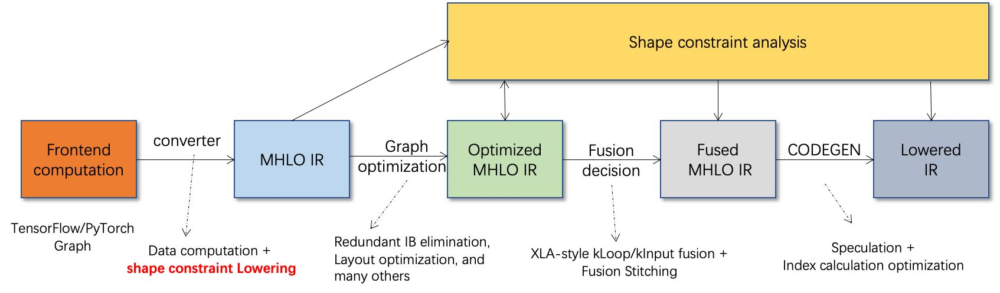

# DISC

> DISC：A Dynamic Shape Compiler for Machine Learning Workloads
> 
> 
> 看hlo相关内容
> 

端到端的动态形状编译器项目BladeDISC

## 1、背景

- 动态shape特性

输入tensor shape变化（批次）、运行过程中（某些算子导致）shape变化

- 当前框架缺乏对动态shape的支持

静态shape在编译时完全已知shape信息，方便优化

动态shape需要为每个shape编译，从而会增加编译开销、内存使用、优化和部署的复杂性

但 某些任务需要根据结果进行动态调度 或者 某任务的输入过大导致编排时间过长

- 当前对动态shape的优化

区分动态shape和静态shape的算子后，仅对静态shape算子进行优化

通过padding、slicing的方式对动态shape张量处理至固定已知shape

## 2、问题与解决

- 问题一：现有IR缺少对动态shape计算的完整表示

DISC基于MLIR，对XLA编译器中的HLO的IR进行复用扩充为DHLO，以支持动态shape表示

- 问题二：在运行时利用VM解释生成运行时流，带来解释开销且损失主机-设备协同优化机会

DISC在编译时生成运行时流的代码，将主机端逻辑和设备计算一起编译

- 问题三：由于动态shape而无法进行内核融合等优化

DISC在基于算子间的shape传播特性和编译时捕获的shape约束信息，进行内核融合优化

- 问题四：深度学习编译器的灵活性

DISC支持TensorFlow和PyTorch，且同时支持动态shape和静态shape混合情况

## 3、架构


- **Computation Graph Bridging**：AI框架的计算图Lower到DLHO、收集shape约束信息
- **DHLO（IR Supplementation）**：DLHO支持动态shape的表示
- **Shape Calculation & Placer**：编译同时生成shape计算逻辑、主机-设备的计算逻辑放置
- **Buffer Management & Optimization**：缓冲区管理与优化
- **Host-side Control Flow**：外部库Lower、内核启动管理、设备管理以及与框架交互
- **Fusion Decision**：根据算子调度兼容性分析执行融合决策
- **Codegen**：主机-设备端代码生成

整个流程：在未知完整shape的情况的情况下进行编译，编译时同时生成**关于shape计算逻辑**以及kernel计算的代码，期间也会收集**shape约束信息**，并使用约束分析指导编译优化过程。

<div style="text-align: center;"></div>

> BladeDISC架构图，出自：https://zhuanlan.zhihu.com/p/552484413
> 

## 4、DHLO

`Dynamic HLO`: 在XLA的HLO IR基础上，扩展了一套具有完备动态shape表达能力的IR。

静态场景下，HLO IR中的shape表达会被静态化，所有的shape计算会被固化为编译时常量保留在编译结果中；而在动态shape场景下，IR本身需要有足够的能力表达shape计算和动态shape信息的传递。

将原有中间表示HLO中的start_indices、limit_indices、strides等属性值使用张量的形式进行保存，使得可以在运行时将计算得到的shape值传入。

<div style="text-align: center;"></div>

## HLO相关补充

### **层次划分**

HLO IR可以分成三个层次，HloModule, HloComputation和HloInstruction。

<div style="text-align: center;"></div>

- HloModule

一个编译单元，相当于一个完整的**可执行程序**，所以有入口函数，也就是 entry_computation, 有且仅有一个。输入可以是多个参数，但输出只有一个（root instruction的值），**如果要返回多个值，需要把多个值构造成一个元组（tuple）返回**。一个module可以包含多个computation，除了entry_computation，其他的都是"nested"，也就是被调用。

ENTRY ----------------> 程序入口，ROOT--------------> 程序输出

一个HloModule可以包含很多个HloComputation

- HloComputation

是HLO IR中间层的表示，相当于程序中的一个**函数**。一个HloModule只能有一个entry_conputation，其他的computation是被entry_computation调用的。我们可以把entry_computation类比作main函数。每个HloComputation可以包含多个HloInstruction，但只能有一个root_instruction，root_instruction的output就是该computation的output。

- HloInstruction

HLO IR最底层的表示，相当于程序中的一条指令，一个HloInstruction可包含多个算子。computation的input用parameter表示。HloInstruction也可以调用HloComputation。一个HloInstruction只有一个输出，如果需要多个output，就打包成一个Tuple。

data dependency：如果一个instruction的output是另一个instruction的input，我们就说两个instruction之间存在data dependency。HLO中使用operand和uses两个fields来表示data dependency。

```cpp
 class HloInstruction {
   ...
   InstructionVector operands_;
   std::vector<HloInstruction*> users_;
   absl::flat_hash_map<const HloInstruction*, int64> user_map_;
   ...
 };
```

<div style="text-align: center;"></div>

control dependency：有些instruction之间并没有数据依赖，但是我们仍然可能对这些instruction的执行顺序有额外的要求。在HloInstruction中有control_successors_和control_predecessors_两个fields来表示control dependency。

### **多种HLO**

[https://github.com/tensorflow/mlir-hlo](https://github.com/tensorflow/mlir-hlo)

- `DHLO`：Dynamic HLO

在XLA的HLO IR基础上，扩展了一套具有完备动态shape表达能力的IR。静态场景下，HLO IR中的shape表达会被静态化，所有的shape计算会被固化为编译时常量保留在编译结果中；而在动态shape场景下，IR本身需要有足够的能力表达shape计算和动态shape信息的传递。

- `CHLO`："Client" HLO

最初设计用于映射XLA的client APi，更接近前端。其中的ops可以来自XlaBuilder或者XLA helper functions，支持隐式广播、支持动态型型状。设计初衷是为了贴近client级别，方便渐进细化下降。

> 隐式广播指的是那些没有具体指定发送给哪个应用程序的广播
> 

| CHLO |  |
| --- | --- |
| 入口 | 通过XlaBuilder API，TF2XLA kernels、JAX、PyTorch bridge直接使用这些API；
legalization from TensorFlow ops in the TF Graph Compiler |
| 出口 | MHLO；
调用XlaBuilder API导出到 xla::HloInstructionProto |
- `MHLO`: "Meta"-HLO

[https://tensorflow.google.cn/mlir/hlo_ops](https://tensorflow.google.cn/mlir/hlo_ops)

和xla_hlo相近，没有隐式广播，但支持动态形状

隐式捕获控制流ops，便于优化；输出结果多个，不用组合成一个元组；拥有不能加在client dialect或server dialect的ops；verification发生在boundary；更彻底地支持动态形状，无需更新所有users/backends

大量得映射在 linalg named ops

| MHLO |  |
| --- | --- |
| 入口 | Legalization from CHLO dialect or conversion from XLA HLO；
直接从TF Graph Compiler获得 |
| 出口 | LMHLO；
Linalg IREE |
- `LMHLO`: "Late"-"Meta"-HLO

与 MHLO 相同，但在 buffers (e.g., memref)  而不是 tensors 上，在缓冲区分配后作用

**LMHLO是为了帮助迁移 XLA 后端而临时引入的**，在这个级别上建模的大部分内容已经可以表示出来了`linalg`。在 LHLO 上执行转换的通道应该理想地遵守 Linalg 上存在的严格接口并且足够通用。

> tensor values (immutable) 和in-memory buffers (side-effecting)
> 

| LMHLO |  |
| --- | --- |
| 入口 | 缓冲区分配后从XLA转入 |
| 出口 | Codegen（LLVM IR） |

> HLO to LHLO conversion and fusion #41424
> 

