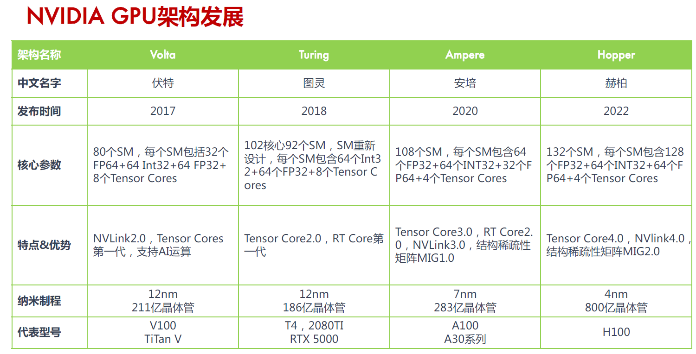

# Graphene

An IR for Optimized Tensor Computations on GPUs

[ASPLOS ’23 - Graphene An IR for Optimized Tensor Computations.pdf](./img_Graphene/ASPLOS_23_-_Graphene_An_IR_for_Optimized_Tensor_Computations.pdf)

## Abstract

Existing tensor IRs are not expressive enough to represent the complex **data-to-thread mappings** required by the GPU tensor instructions.

Graphene is a **low-level target language** for tensor compilers and performance experts while being closer to the domain of tensor computations than languages offering the same level of control such as CUDA C++ and PTX.

> 后续可以转换成 CUDA C++ / PTX
> 

In Graphene, multi-dimensional data and threads are represented as **first-class tensors**. 

> Graphene中tensor十分重要
> 

**Graphene’s tensors are hierarchically decomposable into tiles allowing to represent optimized tensor computations as mappings between data and thread tiles.**

> **hierarchically decomposable : 内存级别的划分
Graphene中的tensor都能分解为一系列的tile。tensor计算可以用来表示data和thread tile之间的映射**
> 

Evaluation : GEMM, Multi-Layer Perceptron (MLP), Layernorm, LSTM, and Fused Multi-Head Attention (FMHA)  —> capable of expressing all optimizations required to achieve the same practical peak performance as existing library implementations. （能够表达和现有最优库一样强悍的性能） 

## 1 Introduce

研究背景：

Volta introduced Tensor Cores to compute small matrix multiplications in hardware

Ampere exposed instructions to move multi-dimensional tensors through the GPU memory hierarchy

—> the GPU hardware became more tensor-oriented，but the software to expose this functionality to programmers and compilers has not changed fundamentally (硬件层面越来越为tenser服务，但软件层面没怎么变化)

CUDA C++ has **no standard abstraction for tensors to represent multi-dimensional data or threads**.  —> expressing optimized tensor computations extremely challenging even for experts

> 更底层的CUDA C++不能很好地抽象表示**multi-dimensional data or threads**
> 

研究现状：

SOTA tensor IRs like OpenAI Triton, or TensorIR, and deep learning compilers like XLA or TVM 

approaches for representing optimized tensor computations :

- **rely on vendor library kernels** and leave the challenge of representing optimized tensor programs to the library developers who again use CUDA C++ and PTX
  
    > 手写 CUDA
    > 
- expose the fast PTX instructions as higher-level built-ins operating on tensors (TVM’s tensorize primitive, or MLIR’s gpu dialect), but lack abstractions for some of the most important instructions
  
    > 将 fast PTX instructions 封装到更高阶段的调用，但是由于**缺乏复杂 data-to-thread mappings  and layout**，所以缺失了一些重要的指令
    > 
- expose a high-level surface language to programmers, complex built-in transformation passes (Triton)
  
    > 性能受pass的组合影响很大，需要较强的经验知识
    > 

TensorIR :

本文完成的工作 : Graphene 

expressive enough to explicitly represent highly optimized GPU code targeting tensor instructions

- **a novel representation for tensor shapes, layouts and tiles**, tensors are decomposable into tiles represented as smaller nested tensors
  
    > 以较小的嵌套tensor表示的tiles
    > 
- **logical thread groups** for representing the GPU compute hierarchy as a tensor of processing elements
  
    > 使用tensor来表示thread，不同的tensor表现形式对应不同的内存层级 share memory\registers
    > 
- **decomposable specifications (specs)** as an abstraction for collective computations and data movements, optimized GPU kernels are expressed by hierarchically decomposing kernel-level specs into atomic specs
  
    > 这些Specs能将data映射到thread tensors，并能表示出optimized GPU kernels，再分解成atomic specs就能知道Codegen
    > 

 

## 2 OPTIMIZED GPU DATA MOVEMENTS

the ldmatrix instruction : 

- **uses a warp (32 threads) to move up to four 8 × 8 matrices from shared memory into the registers** of the warp’s threads
- prescribes a strict data-to-thread mapping : Each 8-thread group is assigned to a unique 8 × 8 tile in shared memory. Each thread then accesses one row per 8 × 8 tile in shared memory (a) and receives two adjacent values per 8 × 8 tile, eight values in total, in return (b).
  
    > 32 个 threads 移动 4 个 8 × 8 矩阵 —> 每 8 个 threads 分配给一个  8 × 8 tile —> 每个 thread 访问对应 tile 的一行 —> 每个 thread 在每个 tile 中都会接收到 2 个相邻的值(4个 tile, 一共八个值)
    > 
    
    
    

像上图 (a)(b) 中表达的多维映射关系很难在 CUDA 代码中表示出来

CUDA C++/PTX : 

代码从上到下：

reshape the warp into 2 × 2 8-thread groups (**a set of scalar thread index**)

—> further cast the access of the shared memory buffer into a valid shared memory pointer (由于CUDA和PTX处理地址的方式)

 —> then call ldmatrix

浪费了很多空间（存储临时变量）和时间（提升为指针）—> **缺乏表示复杂 date-to-thread mapping 的能力**

Graphene : 

代码从上到下：

declaration : the required data tensors and the available GPU processing elements

data movement :  每个线程将 share memory 上的数据移动到 2 x 4 个 registers 上

（后文会具体解释每个语句的含义）

下面的代码就是对 warp 和 输入数据 进行分解：1个warp被分为4个 logical thread group，每个group 有 8 个 thread，4 个 group 又被 reshape 成 2 x 2 的形状；输入数据被分成 4 个 8 x 8 的矩阵，每个 group 负责一个矩阵，每个 8 x 8 的矩阵又被分为 8 行，每行由一个 thread 负责

## 3 THE SHAPE OF TENSORS TO COME

Existing tensor IRs that typically use integer lists for specifying the shapes and strides of tensors cannot express such layouts. (整数索引很难表示复杂的数据排布关系)

### 3.1 Expressing Tensors in Graphene

global memory (off-chip), shared memory (on-chip, shared by threads within a thread-block) and registers (thread-local)

A:[16,16].fp16.SH is actually represented as a row-major tensor A:[(16,16):(16,1)].fp16.SH

> 16行，每行首元素间距是16；16列，每列首元素间距是1
> 

> where the outer (i.e., left) shape represents the arrangement of tiles and the inner shape represents the arrangement of elements within a tile
其中，外(即,左)形状表示tile排列，内(即,左)形状表示tile内部元素排列
> 

### 3.2 Memory Layouts

一般而言，optimized kernels要想达到更好的峰值性能往往需要更复杂的layout，以此来适应硬件架构 (shared memory on the GPU is organized in banks which can only ever serve one thread at a time)

—> 而索引很难表示出来

a: 4行，每行首元素间距是1；8列，每列首元素间距是4
b: 4行，每行首元素间距是8；8列，每列首元素间距是1
c: 4行，每行首元素间距是2；8列，两个首元素间距为1的列划分为1组，共4组，每组首元素间距为4
d: 4行，两个首元素间距为2的行划分为1组，共2组，每组首元素间距为8；8列，两个首元素间距为2的列划分为1组，共4组，每组首元素间距为8

### 3.3 Tiling Tensors

表达 optimized tensor computations 的关键是 ： 将 multi-dimensional tensors 映射到 the multi-layered compute 和 memory hierarchy

Graphene’s key abstraction for representing such mappings are **tiles**

给出一种生成不同 layout 的方法 .tile

b: 第一个维度( [ 2：1 ] )中两个逻辑相邻的元素 和 第二个维度( [ 4：1 ] )中四个逻辑相邻的元素 组成一个tile

c: 第一个维度( [ 2：2 ] )中两个逻辑间距为2的元素 和 第二个维度( [ 4：1 ] )中四个逻辑相邻的元素 组成一个tile

d: 第一个维度( [ 2：2 ] )中两个逻辑间距为2的元素 第二个维度( [ (2, 2) : (1, 4) ] )中两个相邻元素以及两个逻辑间距为4的元素 组成一个tile

正如ldmatrix一样，一些高度优化的GPU tensor computions会使用这样的非连续layout

### 3.4 Parametric Shapes and Partial Tiles

Graphene is capable of representing tensor with parametric (i.e. symbolic) shapes such as [M,N].fp32  (Graphene 也能表示动态shape)

For representing implementations that involve partial tiles, Graphene applies the CuTe approach of over approximating the involved shapes (对于使用partial tiles，即只是用tensor的一部分进行计算，Graphene 使用了类似于 CuTe 中的方法)

## 4 LOGICAL THREAD GROUPS

Efficient tensor computations require different arrangements of threads at different points in the kernel （内核线程安排）

ldmatrix : eight contiguous threads per warp

Tensor Core mma.m8n8k4 : eight specific non-contiguous threads per warp called quad-pairs

Logical thread groups explicitly represent the arrangement of threads as a **multi-dimensional tiled** tensor instead of using several scalar thread-index computations （以多维tiled tensor来表示逻辑线程组安排）

use % as a prefix for data tensor names and # as a prefix for thread tensor names

ldmatrix : A warp is tiled into four groups arranged, as 2 × 2, of eight contiguous threads

Tensor Core mma.m8n8k4 : non-contiguous quad-pairs

## 5 SPECIFICATIONS AND DECOMPOSITIONS

how Graphene represents optimized tensor computations using data and thread tensors

### 5.1 Specifications for Expressing Computations

specs 

- encapsulate a self-contained block of computation (封装了一个独立的计算块)
- captures its input and output tensors as well as an execution configuration that describes the available threads for executing this computation (input, output, execution configuration)

specs (describing the kernel-level computation) —> fine-grained specs (working on tiles of data and thread tensors) —> atomic specs (know how to generate code)

> 首先用 specs 来描述 kernel-level computation，然后分解到更细粒度的 specs(working on tiles of data and thread tensors)，然后到可以指导codegen的atomic specs
> 

第5行声明了一个 warp-level data 从 share memory 移动到 registers 的行为

经过中间代码的对 data 进行 layout 重排布，以及对将 warp 划分为合适的线程组

这样逐步分解为可以表示为 ldmatrix 指令的移动行为

### 5.2 Built-in Specifications

### 5.3 Representing Fused Kernels

Graphene 中给出了一些预先设定好的 specs，来表示操作

这些 specs 根据 (input, output, execution configuration) 的不同，也会对应的映射不同的 PTX 指令

### 5.4 Example: A Simple GEMM Kernel

generate Graphene IR using a Python API

lines 1-5 : describe the input and output tensors and the available blocks and threads for executing this computation

line 6 : represents the CUDA C++ kernel

lines 9-11 : simple triple-nested for-loop for iterating over the scalar output elements computed per thread

lines 12-18 : tile for threadblocks

lines 20-26 : tile again for threads

line 34 : specify the sequential scalar computation per thread (the spec match the pre-defined atomic hfma spec)         (指定每个线程的顺序标量计算)

### 5.5 Code Generation

For decomposed specs, we emit their implementation recursively and for tensor manipulations we build ASTs and compile those into thread index and buffer access expressions

> 对于 spec 的分解：递归地实现
对于 tensor 操作，构建AST并将其编译为 thread index 和 buffer access expressions
> 

## 6 EVALUATION

通用性 : 针对不同的GPU架构 (Volta 和 Ampere)

性能 : 与最优秀的库进行对比 (cuBLAS)

**Hypothesis A: Graphene can represent kernels that compete with high-performance library implementations.**（Graphene生成的内核匹配了两种架构上高度调优的库实现的性能）

- GEMM : match the performance of cuBLAS on both architectures

- GEMM kernels with fused pointwise operations : match the performance of the highly tuned library(cuBLASLt) implementations

**Hypothesis B: Graphene generates competitive fused kernels for important deep learning tensor computations. (对于DL任务，Graphene能生成高性能的fused kernel)**

- LSTM-cell : fuses all nodes into a single kernel, results in significant speedups

Fuse所有节点到一个kernel是为了 避免因为计算中间结果而往返于全局内存

- Fused Multi-Head Attention (FMHA) :

将Graphene生成的Ampere FMHA内核注入Huggedface Transformer网络，与常规的PyTorch推理性能相比，取得了高达59 %的加速比。加速比与每个网络中FMHA出现的比例相关

