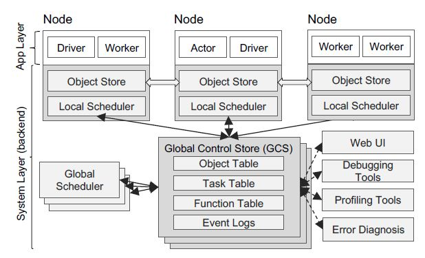
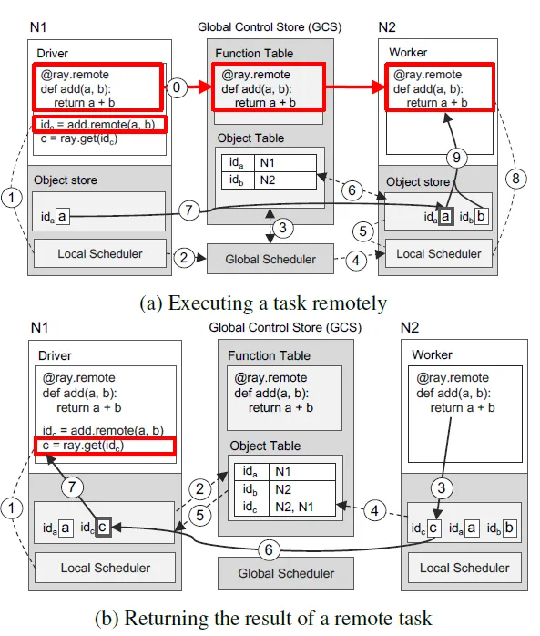

# Ray

> Ray: A Distributed Framework for Emerging AI Applications
> 

## 1、背景介绍

分布式开发框架，核心要把调度做好（跑得快、资源利用率高）

一般可以分为两个方面：任务的编排和优化 + 任务的调度执行

- **任务的编排优化**
    - 静态：任务执行前，通过编译和优化技术进行全局的编排，可以给予rule（静态图）或代价模型
    - 动态：任务边执行边编排（动态图）

静态利于优化，但 某些任务需要根据结果进行动态调度 或者 某任务的输入过大导致编排时间过长

- **任务的调度执行**：中心化调度（集中调度）、去中心化调度、变种(中心化和去中心化调度结合)
- 中心化调度（例如Spark、DP接口）：编排好的任务由中心节点决定在哪个节点上执行，中心节点的调度可以依据 计算资源、局部性
- 去中心化调度（例如MPI、DDP接口）：没有中心节点统一调度，各个节点单独进行任务调度执行，互相之间通过通信进行交

中心化调度能最大化利用系统资源，并提供一定的动态性和容错性，即如果发现有节点down了，可以进行任务重分配，但是缺点是调度开销大

## 2、ray

Spark：静态的编排和优化+中心化的调度，利于执行优化和资源利用。
Ray：动态编排（表面上是分布式RPC框架，但是多个RPC调用其实是形成了一张动态图）+树状的递归调度（去中心化和中心化结合的调度），利于灵活的编程以及低时延的调度。

GCS 作为集中的服务端，是 Worker 之间传递消息的纽带。每个 Server 都有一个共用的 Object Store，也就是用 Apache Arrow/Plasma 构建的内存数据。 Local Scheduler 是 Server 内部的调度，同时通过 GCS 来和其他 Server 上的 Worker 通信。Object Store 时间也有通信，作用是传递 Worker 之间的数据。

一个典型的远程调用流程：

可以看到，GCS 储存了代码、输入参数、返回值。Worker 通过 Local Scheduler 来和 GCS 通信。Local Scheduler 就是 Raylet， 是单机上的基础调度服务

> 更多见：[https://zhuanlan.zhihu.com/p/111340572](https://zhuanlan.zhihu.com/p/111340572)